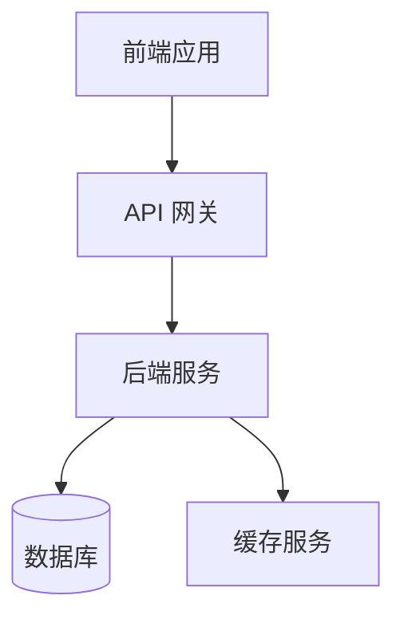
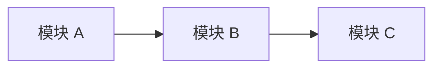
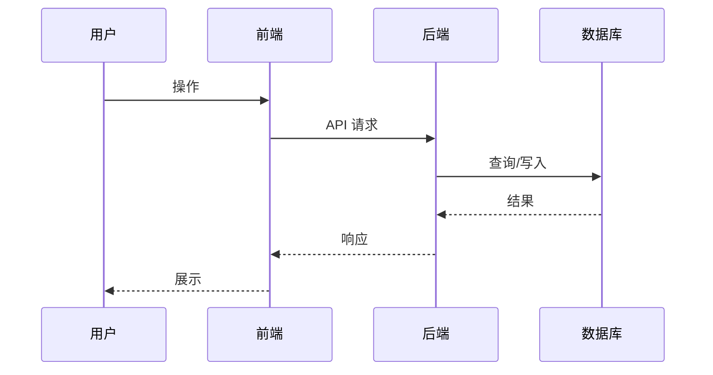

# <需求名称> - 技术提案

**功能名称**: [功能名称]
**关联 PRD**: [PRD 文件名]
**技术提案版本**: v1.0
**创建日期**: [YYYY-MM-DD]
**作者**: [作者名称]
**feat-branch**: `feat/<slug>` 参考[[../git.md]]

## 1. 概述

### 1.1 背景

[描述此技术提案的来源，与 PRD 的关系]

### 1.2 目标

[技术层面要达成的目标]

### 1.3 范围

[此提案涉及的技术范围，哪些做哪些不做]

## 2. 技术架构

### 2.1 系统架构图



### 2.2 技术栈

| 层级 | 技术选型 | 说明 |
|------|---------|------|
| 前端 | | |
| 后端 | | |
| 数据库 | | |
| 缓存 | | |
| 其他 | | |

### 2.3 模块划分



| 模块 | 职责 | 关键技术点 |
|------|------|-----------|

## 3. API 设计

### 3.1 API 契约

[描述对外暴露的 API 接口]

#### 接口 1: [接口名称]

- **请求**
  - Method: GET/POST/PUT/DELETE
  - Path: /api/v1/...
  - Body: 
    ```json
    {
    }
    ```

- **响应**
  - Status: 200/400/404/500
  - Body:
    ```json
    {
    }
    ```

### 3.2 内部接口

[模块间调用的内部接口]

## 4. 数据模型

### 4.1 数据库设计

#### 表/集合: [名称]

| 字段 | 类型 | 说明 |
|------|------|------|
| | | |

### 4.2 缓存设计

[缓存策略，key 命名规范，TTL]

## 5. 技术实现方案

### 5.1 核心流程



### 5.2 关键实现点

#### 实现点 1: [名称]

- **描述**: [详细描述]
- **技术细节**: 
- **风险点**: [如有]

## 6. 技术决策

### 6.1 决策列表

| 决策 | 选项 A | 选项 B | 最终选择 | 原因 |
|------|--------|--------|---------|------|

### 6.2 依赖与约束

| 类型 | 内容 | 说明 |
|------|------|------|
| 依赖 | | |
| 约束 | | |

## 7. 项目结构

```
[根据技术栈展示项目目录结构]
```

## 8. 测试策略

### 8.1 测试覆盖要求

- 单元测试覆盖率: >= [X]%
- API 测试覆盖的端点: [列表]

### 8.2 测试类型

| 类型 | 工具 | 覆盖范围 |
|------|------|---------|

## 9. 部署方案

### 9.1 环境规划

| 环境 | 用途 | 部署方式 |
|------|------|---------|

### 9.2 配置管理

[配置项说明]

## 10. 验收标准

- [ ] 技术方案评审通过
- [ ] Contract 评审通过
- [ ] 代码实现完成
- [ ] 单元测试覆盖达标
- [ ] API 测试通过
- [ ] E2E 测试通过

## 11. 相关文档

- [关联 PRD]
- [关联 Contract]
- [开发规范]
- [其他参考资料]
