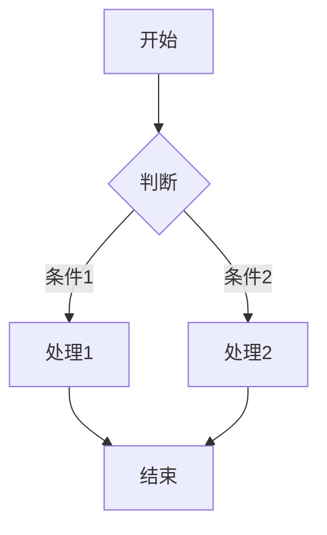

# 文档规范

每个文档子目录为一个完整独立的日志范围，每个文件夹各自使用 Zettelkasten 方法管理所有知识。

所有文档顶部应包含 YAML front matter，例如：
```
---
description: 文档描述，简短说明此文档的用途
type: Fleeting | Literature | Permanent
---
```

## 文件命名规范

- 使用唯一标识符（ID）作为文件名开头，如 `01-`、`20240101-`
- ID 仅用于排序和去重，不代表优先级或时间顺序
- 标题紧跟 ID 之后，使用连字符分隔，如 `01-AIMP-PRD.md`

### 原子化原则

- 每个文件是独立的知识原子，包含一个核心观点或概念
- 避免在一个文件中混合多个主题
- 如果内容过多，应拆分为多个文件并建立链接

### 链接规范

- 使用 Markdown 链接语法：`[[文件名]]` 链接同目录文件
- 链接目标文件应包含足够的上下文，避免孤立引用
- 避免过度链接，每个文件建议不超过 7 个双向链接

### 笔记类型

| 类型 | 说明 |
|------|------|
| Fleeting | 临时想法，待整理 |
| Literature | 读书笔记/参考资料摘要 |
| Permanent | 独立知识原子，可被长期引用 |

### 上下文要求

- 每个文件顶部应包含背景说明，解释此文档的用途
- 必要时在文件末尾添加「相关文档」小节，列出关联文件

## 图形绘制规范

所有文档中的流程图、架构图、时序图等图形必须使用 Mermaid 语法绘制，禁止使用外部图片文件。

### Mermaid 使用要求

- 使用 ` ```mermaid ` 代码块包裹 Mermaid 语法
- 保持图形简洁清晰，避免过于复杂的图形
- 图形应具有描述性标题

**示例**：



### 支持的图形类型

| 类型 | 用途 |
|------|------|
| flowchart | 流程图、决策树 |
| sequenceDiagram | 时序图、交互图 |
| classDiagram | 类图、架构图 |
| stateDiagram | 状态图 |
| entityRelationshipDiagram | ER 图 |
| gantt | 项目进度图 |
| pie | 饼图 |
