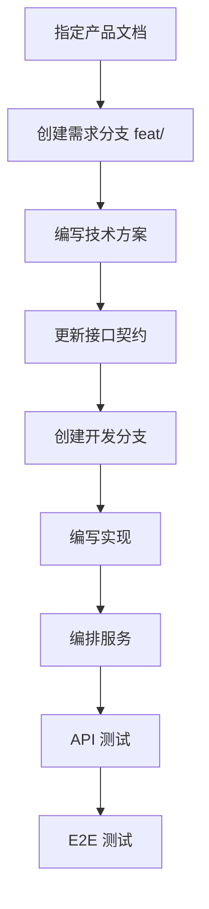

# 通用开发规范

本文档定义《宏山档案馆》的开发流程、分支管理与代码协作基本规则。

## 开发流程

项目采用契约式开发，关键流程如下：



### 1. 指定产品文档

开发前需明确对应的产品文档。默认从 `docs/product/released/` 中选择日期最新的相关文档，由用户确认或指定。

### 2. 创建需求分支

从主分支切出需求分支，命名格式：

```
feat/<slug>
```

其中 `<slug>` 为产品文档内容的简短提炼，例如 `feat/operator-skill-slider`。

### 3. 编写技术方案

技术方案存放于 `docs/engineering/proposal/`，使用统一的方案模板结构：

- 背景与目标
- 范围（做与不做）
- 技术方案
- 数据与接口
- 实现计划
- 测试策略
- 验收标准

### 4. 更新接口契约

如改动涉及前后端契约，更新 `contract/` 目录下的 `openapi-spec` 或 `graphql-schema`。

### 5. 编写实现

- 优先使用 subagent 并行处理独立子任务。
- 每次编码前加载目标目录的 `AGENTS.md` 与本文件。
- 保持最小改动，不修改无关逻辑。

### 6. 编排服务

默认使用项目已有脚本（`npm run dev`、`npm run preview` 等）进行本地编排。

### 7. 测试覆盖

- 单元测试：适配函数、工具函数、缓存逻辑。
- 组件测试：核心页面与交互组件。
- E2E 测试：关键用户路径（入口页、列表、详情、导航）。

## 代码风格

- TypeScript 严格模式，避免 `any`。
- 优先使用显式类型，函数参数与返回值需标注类型。
- 组件文件使用默认导出或命名导出保持一致。
- 常量、工具函数优先放入 `src/lib/` 或 `src/data/`。
- 不保留调试日志与注释代码。

## 项目约定

- 生产代码中不写注释。
- 除非用户要求，否则不使用 emoji。
- `ASSET_BASE` 从 `src/lib/adapter.ts` 导出，由 `src/hooks/useData.ts` 导入。
- 稀有度颜色映射：`['black', 'black', 'gray', '#26bbfd', '#9452fa', '#ffbb03', '#ef5a00']`。
- 列表页筛选与排序使用本地状态（`useState` + `useMemo`）。
- 卡片布局：左侧头像 + 右侧名称/稀有度，下方元素/职业/属性，最下方标签（每行一个）。
- 构建命令：`npm run build`（tsc + vite）。

## 提交规范

- 提交信息使用中文或英文，描述改动意图。
- 单一提交聚焦一个改动点。
- 技术方案与代码实现分开展开，便于回滚。

## 相关文档

- [[AGENTS|工程协作说明]]
- [[frontend-spec|前端开发规范]]
- [[engineering-spec|工程架构规范]]
