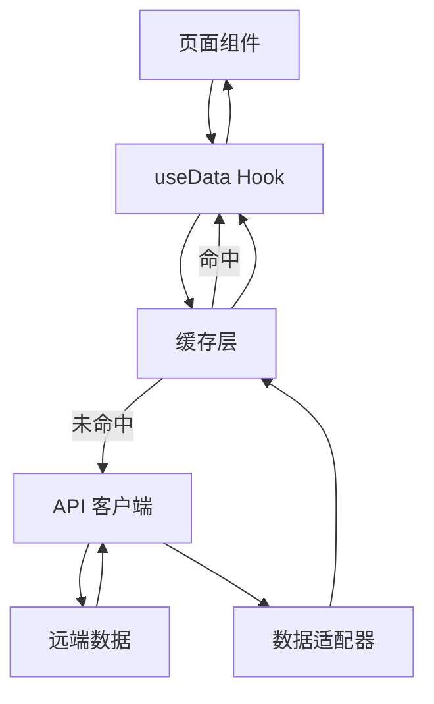

# 工程架构规范

本文档定义《宏山档案馆》的数据源、API、缓存、适配、Diff 系统与项目结构。详细映射表与陷阱参见 `references/` 目录。

## 项目结构

```
src/
  App.tsx              路由入口
  main.tsx             应用挂载
  index.css            全局样式与 Tailwind 引入
  routes/              顶层路由页面（Landing、ArchiveHome）
  pages/               按领域组织的页面组件
  components/          通用与领域组件
  hooks/               数据获取 Hooks（useData.ts 等）
  lib/                 API 客户端、数据适配器、缓存、类型、工具、多语言
  data/                静态常量（constants.ts）
tests/
  e2e/                 Playwright E2E 测试
scripts/               构建与数据处理脚本
```

## 数据来源

数据来自远端游戏数据服务，站点本身为静态 SPA，无自建后端。请求通过 `src/lib/api.ts` 统一封装。

### 核心接口

| 用途 | 方法/路径 |
|------|-----------|
| 获取表全部数据 | `GET /table/{table}/all` |
| 获取单条记录 | `GET /table/{table}/{key}` |
| 获取表 i18n 字典 | `GET /i18n/dict/{locale}/table/{table}/all` |
| 获取可用语言 | `GET /i18n` |
| 搜索 i18n 文本 | `GET /i18n/search/all/{regex}` |
| 获取单条 i18n 文本 | `GET /i18n/{locale}/{id}` |
| 获取版本 | `GET /version` |

封装函数：`fetchTableAll`、`fetchTableEntry`、`fetchTableDictAll`、`fetchI18nLocales`、`fetchI18nSearch`、`fetchI18nText`。

### 64 位整数处理

游戏数据中存在超过 `Number.MAX_SAFE_INTEGER` 的 ID。`api.ts` 中的 `safeParse` 在 `JSON.parse` 前对 17 位及以上数字加引号，使其以字符串形式存在。查找 i18n 字典时必须使用 `String(field.id)`。

## 数据流



以干员为例：

```
OperatorList
  └─ useOperators()
       └─ useData(async () => {
            CharacterTable + i18n
            CharProfessionTable + i18n
            CharTypeTable + i18n
            CharBattleTagTable + i18n
            AttributeMetaTable + AttributeShowConfigTable + i18n
          }) → Operator[]
```

## 缓存策略

采用二级缓存：内存 LRU + IndexedDB 持久化。

| 层级 | 实现 | 容量 |
|------|------|------|
| 内存 | `Map<string, CacheEntry>` | 100 条 LRU |
| 持久化 | IndexedDB | 不限 |

### 版本锚定

应用启动时请求 `/version` 获取当前数据版本，作为缓存键前缀。版本变更时清空旧缓存。

### 缓存键

格式：`${version}:${tableName}:${key}`，例如 `initial_8190425-29_main_8190425-29:CharacterTable:chr_0005_chen`。

## 数据适配

适配逻辑集中在 `src/lib/adapter.ts`。

### I18n 解析

`resolveI18n(field, i18nMap)`：

```
i18nMap[String(field.id)] ?? field.text ?? ''
```

### 适配模式

每个 `adapt*` 函数遵循统一模式：解构原始字段、解析 i18n、组合查找表、返回类型化对象。

### 图标路径

```
`${ASSET_BASE}/assets/beyond/dynamicassets/gameplay/ui/sprites/{category}/${field}.png`
```

`ASSET_BASE` 从 `adapter.ts` 导出，`useData.ts` 导入使用。

## 数据表映射

详见 [数据表映射参考](./references/data-mapping-tables.md)。主要覆盖：

- 干员相关：`CharacterTable`、`CharProfessionTable`、`CharTypeTable`、`CharBattleTagTable`、`AttributeMetaTable`、`AttributeShowConfigTable`、`CharGrowthTable`、`SkillPatchTable`、`SpaceshipCharSkillTable`、`SpaceshipSkillTable`、标签表。
- 武器与物品：`WeaponBasicTable`、`ItemTable`、`TextTable` 等。
- 敌人相关：`EnemyTemplateDisplayInfoTable`、`EnemyTable`、`EnemyAttributeTemplateTable`、`WikiEntryDataTable`、`WikiGroupTable`、`DistributionInfoTable` 等。
- 富文本相关：`HyperlinkTextTable`、`RichTextStyleTable`。

### Per-table I18n

每个表有独立的 i18n 字典。Hook 在获取表数据时并行获取对应字典，再传入 `adapt*`。禁止混用不同表的字典。

## Diff 系统

Diff 系统用于展示游戏数据在两个版本间的变化。详见 [Diff 系统参考](./references/diff-system.md)。

### 构建时

`scripts/diff-tables.ts` 读取 `endfield-data/` 下两个版本目录，按字段递归对比，输出到 `endfield-data/__diffs__/{v1}__{v2}/`。

### 运行时

- `useTableDiff(versionName, tableFileName)` 获取 Diff JSON，使用二级缓存。
- `src/components/DiffViewer/` 通过注册表路由到专用差异组件。
- `RichTextDiff` 使用字符级最长公共前后缀隔离变化部分。

### 多语言域

- `diff.locale`：生成 Diff 时使用的语言，仅用于 `I18nTextTable`。
- `globalLocale`（`useLocale()`）：用户当前 UI 语言，用于所有 lookup 表 API 获取。

禁止交叉使用。

## 脚本工具

`scripts/` 目录包含：

- `acquire-api.ts` — 从远端 API 获取数据。
- `acquire-local.ts` — 从本地来源获取数据。
- `diff-tables.ts` — 计算并输出版本间差异。
- `generate-i18n-dicts.ts` — 从 `/i18n` API 生成前端 UI 多语言字典。

## 构建与脚本

| 脚本 | 用途 |
|------|------|
| `npm run dev` | 启动开发服务器 |
| `npm run build` | TypeScript 检查 + Vite 生产构建 |
| `npm run preview` | 预览生产构建 |
| `npm run lint` | oxlint 静态检查 |
| `npm run test` | 运行 Vitest 单元/组件测试 |
| `npm run test:watch` | 监听模式运行测试 |

## 多语言

UI 多语言通过 `LocaleProvider` + `I18nProvider` 提供，数据层按表按语言独立获取 i18n 字典。组件直接访问原始表数据时（如 `ItemPanel`、`ItemTooltip`）也必须同时获取该表字典。

详细规范（key 命名、字典生成、回退链、测试包裹）参见 [国际化规范](./references/i18n-spec.md)。

## 数据层常见陷阱

详见 [数据层常见陷阱](./references/data-pitfalls.md)。关键项包括：

- 64 位整数 ID 必须使用 `String(field.id)`。
- 天赋节点不同 `nodeType` 对应不同名称/图标来源。
- 武器数据需同时拉取 `WeaponBasicTable` 与 `ItemTable`。
- 敌人数据以 `EnemyTemplateDisplayInfoTable` 为主，`EnemyDisplayInfoTable` 为辅。
- `EnemyAttributeTemplateTable` 的 `levelDependentAttributes` 等级由数组索引 + 1 推导。

## 相关文档

- [[AGENTS|工程协作说明]]
- [[common-rules|通用开发规范]]
- [[frontend-spec|前端开发规范]]
- [数据表映射参考](./references/data-mapping-tables.md)
- [数据层常见陷阱](./references/data-pitfalls.md)
- [国际化规范](./references/i18n-spec.md)
- [Diff 系统参考](./references/diff-system.md)
