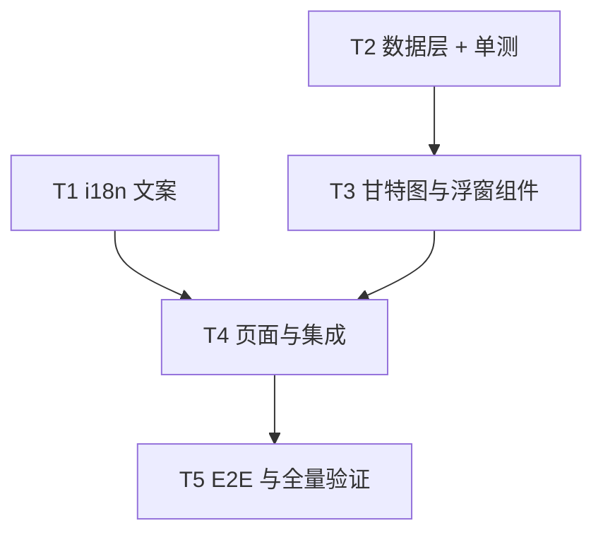

# 活动档案实现计划

实现 [[20260726-activity-archive|活动档案技术方案]]（proposal）与 [[20260726-activity-archive|活动档案]]（产品文档，shipping）。本计划拆解为可并行/串行执行的任务，每个任务有明确的产出物与完成判据。

## 已确认决策

| 决策点 | 结论 |
|--------|------|
| 类型筛选组织 | 归并 7 个大类（签到/挑战/试用/福利/回流/引导/其他），新 type 兜底「其他」 |
| 默认视图 | 默认勾选进行中/常驻/未开始，时间轴初始定位今日附近 |
| 导航位置 | 侧边栏 chronicle 分组 |

## 分支策略

```
main
 └── feat/activity-archive          (需求分支：产品文档 + 技术方案 + 本计划)
      └── feat/activity-archive-impl (开发分支：全部实现代码)
```

实现完成后 `feat/activity-archive-impl` → `feat/activity-archive` 提 PR review，再合入 main。

## 任务拆解

### T1. i18n 文案准备

- **依赖**：无
- **产出**：`scripts/i18n-custom.json` 新增 `nav.activities` 与 `activity.*` keys（title、groupCheckin/groupChallenge/groupTrial/groupWelfare/groupReflow/groupGuide/groupOther、statusOngoing/statusPermanent/statusUpcoming/statusExpired、filterType、filterStatus、permanent、detailTime、detailTags、empty、unknownTime），14 语言齐全；运行 `node scripts/generate-i18n-dicts.ts` 生成字典
- **完成判据**：`npm run lint` 前置的 verify:i18n 通过

### T2. 数据层

- **依赖**：无（与 T1 并行）
- **产出**：
  - `src/lib/types.ts`：`ActivityGroup` / `ActivityStatus` / `ActivityTimeRange` / `Activity`
  - `src/data/constants.ts`：`ACTIVITY_TYPE_GROUPS`、group 颜色映射
  - `src/lib/adapter.ts`：`parseActivityTime`、`getActivityGroup`、`getActivityStatus`、`adaptActivity`（纯函数，时段去重排序）
  - `src/hooks/useData.ts`：`useActivities()`（5 源并行获取，TimeRange/Tag 容错降级）
- **完成判据**：`src/lib/__tests__/activity.test.ts` 单测通过，覆盖时间解析（补零/空串/UTC+8）、时段去重、status 五分支、group 兜底

### T3. 甘特图与浮窗组件

- **依赖**：T2（类型与 hook 签名）；可用 mock 数据先行开发
- **产出**：
  - `src/components/Activities/ActivityGantt.tsx`：固定名称列 + 横向滚动时间轴、月刻度、今日线、多时段 bar、常驻开放末端、expired 降透明度、初始滚动定位今日
  - `src/components/Activities/ActivityFilters.tsx`：类型/状态 chip 多选，默认勾选 ongoing/permanent/upcoming
  - `src/components/Activities/ActivityTooltip.tsx`：复用 ItemTooltip 弹层模式的纯展示组件（主视觉、名称、group/status Badge、时段列表、RichText 描述、标签）
- **完成判据**：组件测试通过（渲染行数、筛选联动、点击开浮窗）

### T4. 页面与集成

- **依赖**：T1、T2、T3
- **产出**：
  - `src/pages/activities/ActivityArchive.tsx`（骨架模式：loading/error/empty）
  - `src/App.tsx` 路由、`Sidebar.tsx` chronicle 分组入口、`archiveMeta.ts` 的 `MODULE_CODES.activity`
- **完成判据**：`npm run build` 通过，`/archive/activities` 可访问，侧边栏入口可见

### T5. E2E 与全量验证

- **依赖**：T4
- **产出**：`tests/e2e/activities.spec.ts`（进入页面 → 甘特图可见 → 切换状态筛选 → 点击活动 → 浮窗开合）
- **完成判据**：以下全部通过 + `npm run dev` 视觉验证（默认视图、筛选组合、常驻/多时段、今日线、移动端横向滑动）
  1. `node scripts/generate-i18n-dicts.ts`
  2. `npm run lint`
  3. `npm run test`
  4. `npm run build`

## 依赖关系与并行策略



- T1 与 T2 可由两个 subagent 并行。
- T3 在 T2 的类型/hook 签名确定后启动，视觉部分用 mock 数据开发。
- T4、T5 串行收尾。

## 风险与对策

| 风险 | 对策 |
|------|------|
| 新 type 上线导致分类缺失 | group 归并配置化 + 「其他」兜底，单测覆盖 |
| 时间字符串格式变体（补零不一致） | 正则只提取数字，单测覆盖多种变体 |
| 常驻活动 closeTime 为空导致轴范围无限 | 轴范围计算时 `closeTime ?? now` 兜底 |
| 甘特图活动行数过多（84+）纵向过长 | 行高紧凑（36px）+ 页面纵向滚动，默认筛选已收敛行数 |

## 相关文档

- [[20260726-activity-archive|活动档案技术方案]]（proposal 目录同名文档）
- [[common-rules|通用开发规范]]
- [[frontend-spec|前端开发规范]]
- [[engineering-spec|工程架构规范]]
