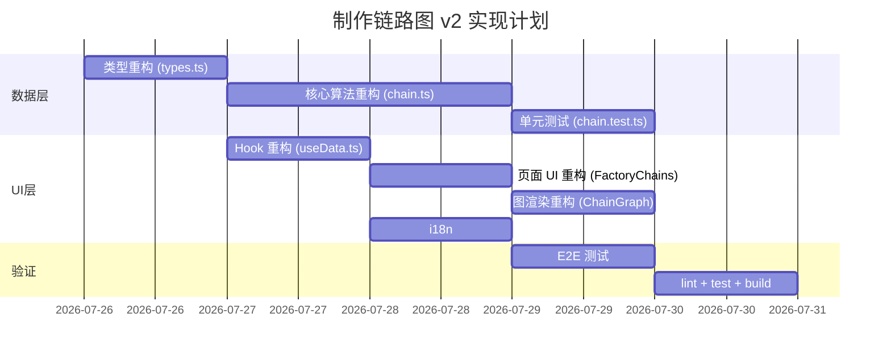

# 制作链路图 v2 - 实现方案

**对应产品文档**: [[20260726-factory-chain-v2|制作链路图 v2]]
**对应技术方案**: [[20260726-factory-chain-v2|制作链路图 v2 技术提案]]
**实现方案版本**: v1.0
**创建日期**: 2026-07-26
**作者**: 前端工程
**开发分支**: `feat/factory-archive-impl`

## 1. 概述

### 1.1 目标

将技术方案转化为可执行的实现清单，分阶段落地：类型重构 → 核心算法重构 → UI 重构 → 测试验证。

### 1.2 范围

- **做**:
  - `src/lib/factory/types.ts` 类型重构（ChainTarget / ChainEdge / ChainNode）。
  - `src/lib/factory/chain.ts` 算法重构（expand、循环检测、供应瓶颈、物流计算）。
  - `src/pages/factory/FactoryChains.tsx` UI 重构（多目标选择器 + 产速输入）。
  - `src/components/Factory/ChainGraph.tsx` 渲染重构（机器节点 + 物流边 + 循环样式）。
  - `src/hooks/useData.ts` hook 签名变更 + 物流表加载。
  - 单元测试与 E2E 测试。
- **不做**:
  - 配方切换交互。
  - 蓝图保存/导出。

## 2. 代码变更总览

### 2.1 修改文件

| 文件路径 | 变更内容 |
|----------|----------|
| `src/lib/factory/types.ts` | `ChainTarget` 新增；`ChainEdge` 重构（beltCount/isPipe/cycleType）；`ChainNode` 重构（machineName/machineIcon/machineCount/recipe/actualPm/theoryPm） |
| `src/lib/factory/chain.ts` | 重构 `buildChainGraph`（多目标+产速）、`expand`（供应瓶颈）；新增 `calcCycleOutput`/`calcMachineCount`/`calcTransportCount`/`calcThroughput` |
| `src/lib/factory/chain.test.ts` | 新增循环规则、供应瓶颈、机器数量、传送带数量、多目标等测试用例 |
| `src/hooks/useData.ts` | `useCraftingChain` 签名变更（`ChainTarget[]`）；新增加载 `FactoryGridBeltTable`/`FactoryLiquidPipeTable` |
| `src/pages/factory/FactoryChains.tsx` | 移除左侧列表+分页；新增顶部多目标选择器+产速输入框+URL同步 |
| `src/components/Factory/ChainGraph.tsx` | 重构 layoutGraph（机器节点）；新增 MachineNode（名称/台数/配方摘要/传送带）；边渲染区分循环类型+液体管道 |
| `src/i18n/dicts/*.json` | 新增 i18n key |
| `tests/e2e/src/factory.spec.ts` | 更新 E2E 测试适配新 UI |

## 3. 详细实现

### 3.1 阶段一：类型重构

**目标**: 定义新的类型结构，为算法重构做准备。

**文件**: `src/lib/factory/types.ts`

1. 新增 `ChainTarget` 接口
2. 重构 `ChainEdge`：新增 `itemIds`/`beltCount`/`isPipe`/`cycleType`/`cycleOutput`/`cycleInput`；移除 `label`
3. 重构 `ChainNode`：新增 `machineName`/`machineIcon`/`machineCount`/`recipe`（含 inputs/outputs）/`actualPm`/`theoryPm`/`isClosedLoop`；移除 `label`/ `isTarget`
4. 更新 `ChainGraph` 类型（无结构变更）

**验证**: `npm run typecheck` 通过（预期编译错误，因 chain.ts / ChainGraph.tsx 尚未适配新类型）。

### 3.2 阶段二：核心算法重构

**目标**: 重构 `buildChainGraph` 和 `expand`，实现 R0-R10 全部规则。

**文件**: `src/lib/factory/chain.ts`

#### 3.2.1 新增辅助函数

```typescript
// 吞吐量计算（R9/R10）
export function calcThroughput(msPerRound: number, volume: number = 1): number

// 物流设施数量计算（R9/R10）
export function calcTransportCount(
  rate: number,
  transportTable: Record<string, any>,
  isPipe: boolean,
): number

// 机器数量计算（R8）
export function calcMachineCount(actualPm: number, theoryPm: number): number

// 循环净产出计算（R1）
export function calcCycleOutput(
  cycleItems: string[],
  recipeById: Map<string, FactoryRecipe>,
): { netOutput: number; outputQty: number; inputQty: number }
```

#### 3.2.2 重构 `buildChainGraph`

签名变更：
```typescript
function buildChainGraph(
  targets: ChainTarget[],           // 改为 ChainTarget[]（含 rate）
  recipes: FactoryRecipe[],
  index: FactoryItemIndex,
  sources: FactorySource[],
  defaultCrafts: Record<string, string>,
  recipeOverride?: Record<string, string>,
  machines?: Record<string, { name: string; iconId: string }>,
  beltTable?: Record<string, any>,  // 新增
  pipeTable?: Record<string, any>,  // 新增
): ChainGraph
```

实现要点：
1. 构建 `recipeById` Map 和 `asOutcome` 反查
2. 对每个 target 调用 `expand(itemId, target.rate, new Set(), nodeKey)`
3. 合并多目标的 nodes/edges（按 key 去重，machineCount 取 max）
4. 处理循环边的视觉属性（cycleType / cycleOutput / cycleInput）

#### 3.2.3 重构 `expand`

```typescript
function expand(
  itemId: string,
  availableRate: number,      // 新增：上游实际可用速率
  path: Set<string>,          // DFS 路径（环检测）
  targetKey: string,
  nodes: Map<string, ChainNode>,
  edges: Map<string, ChainEdge>,
): void
```

实现要点：
1. 查找配方（优先级：override > default > first）
2. 计算理论产出 `theoryPm = perMinute(outcomeCount, recipe.totalProgress)`
3. 计算实际产出 `actualPm = min(theoryPm, availableRate)` — R7 供应瓶颈
4. 计算机器台数 `machineCount = ceil(actualPm / theoryPm)` — R8
5. 生成/合并机器节点
6. 遍历材料，计算需求速率，递归 `expand(mat.itemId, matConsumedPm, newPath, ...)`
7. 循环检测：若 `path.has(itemId)`，计算净产出（R1），决定有效循环/封闭回路
8. 外部供应打断（R4）：若 `sources` 中有该物品，打断循环
9. 物流边生成：计算传输速率，确定 isPipe，计算 beltCount — R9/R10

### 3.3 阶段三：单元测试

**目标**: 覆盖 R0-R10 全部规则。

**文件**: `src/lib/factory/chain.test.ts`

按功能模块分组，使用构造的测试数据（无需真实 API）：

| 测试组 | 用例数（估） | 关键验证 |
|--------|-------------|----------|
| 循环规则 R0-R6 | 6-8 | 封闭回路/有效循环/副产物/外部供应/深度限制 |
| 供应瓶颈 R7 | 3-4 | 满产/减产/过剩/级联 |
| 机器数量 R8 | 3-4 | 单台/多台/取整 |
| 传送带/管道数量 R9 | 3-4 | 固体/液体/取整 |
| 液体管道区分 R10 | 2-3 | ID 前缀检测 |
| 多目标 | 3-4 | 共享/独立/产速影响 |
| 非整数产速 | 2-3 | 小数/零值 |
| 吞吐量计算 | 2-3 | 传送带/管道/零值 |

**验证**: `npm run test` 全绿。

### 3.4 阶段四：Hook 重构

**目标**: 适配新类型签名，加载物流数据。

**文件**: `src/hooks/useData.ts`

1. `useCraftingChain` 签名改为 `ChainTarget[]`
2. 新增加载 `FactoryGridBeltTable` 和 `FactoryLiquidPipeTable`（`fetchTableAll`）
3. 传递 `machines`、`beltTable`、`pipeTable` 到 `buildChainGraph`
4. 物流表 `.catch(() => ({}))` 容错

### 3.5 阶段五：页面 UI 重构

**目标**: FactoryChains 页面改为多目标选择器 + 产速输入。

**文件**: `src/pages/factory/FactoryChains.tsx`

实现要点：
1. 移除左侧物品列表 + `LIST_PAGE_SIZE` + `listPage` + `mobileOpen` 等状态
2. 新增 `ChainTarget[]` state（从 URL `?targets=xxx:rate` 解析）
3. 新增顶部目标选择器 UI：
   - 每行：下拉选择器（搜索 + rarity 排序） + 产速输入框（number） + 删除按钮（×）
   - 底部："+ 添加目标产物" 按钮
4. 产速变化时自动更新 URL 并触发 `useMemo` 重算
5. URL 同步：`targets={itemId}:{rate},{itemId}:{rate},...`
6. i18n：新增 `factory.addTarget` / `factory.targetRate` 等 key

### 3.6 阶段六：图渲染重构

**目标**: ChainGraph 组件适配新数据结构。

**文件**: `src/components/Factory/ChainGraph.tsx`

实现要点：

#### layoutGraph 变更
- 移除物品节点的 dagre 节点
- 机器节点：label 使用 machineName，尺寸增大以容纳更多信息
- 源节点：label 使用 machineName + "采集" 标识

#### MachineNode 自定义节点
```tsx
// 节点内容：
// [图标] 机器名 ×N
// 输入物品 → 输出物品 ×数量
// 总产出: XX/min
// 传送带: XX/min (输入) / XX/min (输出)
```

#### 边渲染
- 根据 `edge.isPipe` 选择颜色和线型
- 根据 `edge.cycleType` 选择循环样式
- 标签显示传送带/管道数量和吞吐量

### 3.7 阶段七：i18n

新增 key（在 `scripts/i18n-custom.json` 中）：

| key | CN 文案 |
|-----|---------|
| `factory.addTarget` | 添加目标产物 |
| `factory.targetRate` | 产速 |
| `factory.unitPerMin` | 个/min |
| `factory.beltCount` | 传送带 |
| `factory.pipeCount` | 管道 |
| `factory.closedLoop` | ↻ 封闭 |
| `factory.productiveLoop` | 有效循环 |
| `factory.machineCount` | 台 |
| `factory.totalOutput` | 总产出 |
| `factory.inputRate` | 输入 |
| `factory.outputRate` | 输出 |

### 3.8 阶段八：E2E 测试

**文件**: `tests/e2e/src/factory.spec.ts`

更新用例：
1. 多目标添加/删除后链路图更新
2. 产速修改后机器数量变化
3. URL 参数同步与刷新还原
4. 封闭回路视觉标记验证

## 4. 实现顺序



### 依赖关系

- 阶段一（类型）→ 阶段二（算法）→ 阶段三（单测）
- 阶段一（类型）→ 阶段四（Hook）
- 阶段二（算法）+ 阶段四（Hook）→ 阶段五（页面 UI）
- 阶段二（算法）→ 阶段六（图渲染）
- 阶段四（Hook）→ 阶段七（i18n）
- 阶段五 + 阶段六 → 阶段八（E2E）

## 5. 测试计划

### 5.1 单元测试

- `chain.ts`：全部 R0-R10 规则 + 多目标 + 非整数产速 + 吞吐量计算
- 预计新增 30-40 个测试用例

### 5.2 E2E 测试

- 多目标交互流程
- URL 同步
- 循环视觉标记

### 5.3 手动验证

- 链路图在常规规模下缩放/平移流畅
- 移动端触摸操作正常
- 切换语言后 i18n 文案正确

## 6. 验收标准

- [ ] 类型定义完整，编译通过
- [ ] `buildChainGraph` 支持多目标 + 产速输入
- [ ] 供应瓶颈计算正确（满产/减产/级联）
- [ ] 机器数量 = ceil(实际产出/理论产出)
- [ ] 传送带/管道数量从 API 动态计算
- [ ] 封闭回路/有效循环视觉区分
- [ ] 机器节点显示完整信息
- [ ] 单元测试覆盖 R0-R10
- [ ] `npm run lint && npm run test && npm run build` 通过

## 7. 风险与回滚

| 风险 | 影响 | 缓解措施 |
|------|------|----------|
| 液体 ID 前缀判断不准 | 边样式错误 | 先验证 LiquidTable，必要时使用白名单 |
| 多目标共享中间品机器数量合并逻辑 | 数量不准 | 取 max 而非 sum，单测覆盖 |
| 超大链路图性能 | 渲染卡顿 | xyflow 视窗渲染 + fitView |
| 新类型导致编译错误扩散 | 开发阻塞 | 阶段一完成后统一修复编译错误 |

回滚策略：全部为文件内重构，可通过 git revert 回退到一期状态。

## 8. 相关文档

- [[20260726-factory-chain-v2|制作链路图 v2 PRD]]
- [[20260726-factory-chain-v2|制作链路图 v2 技术提案]]
- [[20260725-factory-system|工厂系统技术提案（一期）]]
- [[20260725-factory-system-plan|工厂系统实现方案（一期）]]
- [工程架构规范](../engineering-spec.md)
- [前端开发规范](../frontend-spec.md)
