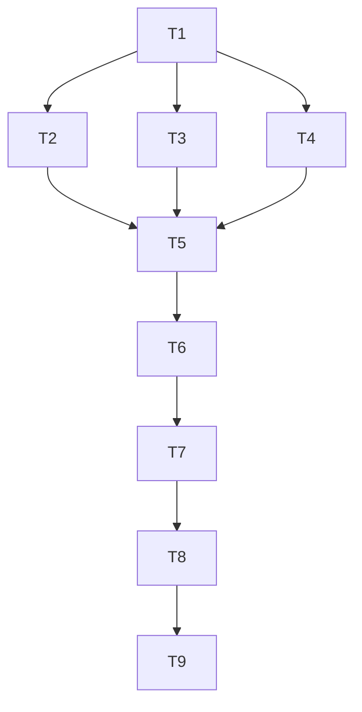

# 剧情纪事 - 实现计划

**功能名称**: 剧情纪事（Story Chronicle）
**关联 PRD**: [[20260730-story-chronicle|剧情纪事]]
**关联技术提案**: [[20260730-story-chronicle|剧情纪事技术提案 v1.2]]
**创建日期**: 2026-07-31
**feat-branch**: `feat/story-chronicle`

## 1. 实现概览

### 1.1 任务分解

```
T1: 数据层基础设施（types + adapter + hooks）
T2: 纪事长卷页面（StoryRecap）
T3: PRTS 文库页面（StoryLibrary + StoryDocumentDetail）
T4: Baker 模块（BakerTerminal + baker.ts）
T5: 总览页重构（StoryOverview）
T6: 路由与导航（App.tsx + Sidebar + Breadcrumb + ArchiveHome）
T7: i18n 扩充（14 语言）
T8: 测试覆盖（UT + E2E）
T9: 文档更新（data-mapping-tables.md）
```

### 1.2 依赖关系



### 1.3 并行策略

| 阶段 | 并行任务 | 说明 |
|------|---------|------|
| Phase 1 | T1 | 数据层基础，串行完成 |
| Phase 2 | T2 + T3 + T4 | 三个页面模块可并行开发 |
| Phase 3 | T5 + T6 | 总览页与路由导航 |
| Phase 4 | T7 + T8 | i18n 与测试 |
| Phase 5 | T9 | 文档收尾 |

## 2. 详细任务说明

### T1: 数据层基础设施

**目标**: 完成 types、adapter、hooks 三层数据基础设施

**子任务**:
1. `src/lib/types.ts` 新增类型定义
   - StoryRecapScene, StoryRecapChapter（剧情梗概）
   - PrtsCategory, PrtsVolume, PrtsItem, PrtsItemDetail（PRTS 文库）
   - BakerChat, BakerMessage, BakerOption, BakerBeat（Baker）

2. `src/lib/adapter.ts` 新增适配函数
   - `adaptRecapScene`, `adaptRecapChapter`（剧情梗概）
   - `adaptPrtsCategory`, `adaptPrtsVolume`, `adaptPrtsItem`, `adaptPrtsItemDetail`（PRTS 文库）
   - `adaptBakerChat`, `adaptBakerMessage`（Baker）

3. `src/lib/baker.ts` 新建分支求值模块
   - `resolveDialog` 纯函数（消息图遍历 + 分支求值）

4. `src/hooks/useData.ts` 新增 hooks
   - `useStoryRecap`（剧情梗概数据）
   - `usePrtsLibrary`（PRTS 文库数据）
   - `usePrtsItemDetail`（文献详情数据）
   - `useBakerChats`（Baker 会话列表）
   - `useBakerDialog`（Baker 聊天内容）

**验收标准**:
- [ ] 所有类型定义完整，无 TypeScript 错误
- [ ] adapter 函数覆盖正常数据与边界条件
- [ ] resolveDialog 通过单元测试（线性遍历、分支切换、环保护、表情回应）
- [ ] hooks 正确调用 getCachedData + i18n dict

**预估工时**: 2d

---

### T2: 纪事长卷页面（StoryRecap）

**目标**: 实现剧情梗概连续阅读页面

**子任务**:
1. 页面布局
   - 桌面端 `grid-cols-[240px_1fr]`，左侧篇章导航 sticky
   - 移动端折叠导航

2. 篇章导航组件
   - 篇章→任务两级结构
   - 点击 `scrollIntoView` 锚点定位

3. 梗概流组件
   - 左侧金色细线串联
   - 卡片含 `font-mono` 编号 + 梗概正文
   - 任务分界处展示任务号小标题

4. 类型筛选
   - 顶部 select 组件
   - 同步 `?type=` query param

5. 性能优化
   - `content-visibility: auto`
   - 空篇章隐藏

**验收标准**:
- [ ] 全部 1078 个对话组按篇章、任务、场次顺序呈现
- [ ] 篇章导航点击定位正确
- [ ] 类型筛选功能正常
- [ ] 剧透提示展示

**预估工时**: 2d

---

### T3: PRTS 文库页面（StoryLibrary + StoryDocumentDetail）

**目标**: 实现 PRTS 六类文献浏览与详情页

**子任务**:

#### T3.1 StoryLibrary
1. 分类页签组件
   - 六类页签带计数
   - 同步 `?cat=` query param

2. 卷网格组件
   - `grid-cols-2 sm:3 md:4 lg:5`
   - 卷卡片 = 图标 + 卷名 + 副题 + 条目数

3. 卷内条目列表
   - 页内 accordion 展开
   - 条目按 `order` 排序

#### T3.2 StoryDocumentDetail
1. 卷宗页模板
   - 标题 + 所属卷/分类 Badge
   - 档案编号 `formatArchiveCode('story', index)`
   - desc + 正文

2. 正文渲染
   - `contents` 每篇渲染标题 + 各段 `<RichText>`
   - 插图 `loading="lazy"`

3. multi_media 剧本
   - speaker 加粗金色 + line
   - 标注「音像转写」

4. 返回导航
   - 返回所属卷链接（`?cat=` 回跳）

**验收标准**:
- [ ] 六个分类页签与游戏内一致
- [ ] 卷卡片展示图标、卷名、副题、条目数
- [ ] 文献详情正文富文本正确渲染
- [ ] 多媒体条目以剧本形式呈现
- [ ] 无图标/无正文时使用占位图形

**预估工时**: 3d

---

### T4: Baker 模块（BakerTerminal + baker.ts）

**目标**: 实现 Baker 聊天终端页面

**子任务**:

#### T4.1 BakerTerminal 页面
1. 双栏布局
   - 桌面端 `grid-cols-[300px_1fr]`
   - 移动端单栏切换

2. 联系人列表
   - 四 Tab：全部/干员/联系人/群聊
   - 条目 = 头像 + 名称，选中态金色描边
   - 当前会话同步 `?chat=` query param

3. 聊天面板
   - 按会话（dialog）顺序渲染
   - 会话间分隔条
   - 消息气泡：他人靠左（群聊附头像+昵称），endmin 靠右暗金描边
   - 系统提示居中灰字

4. 分支选项
   - 选项组卡片（金线框）
   - 选中项带印章式勾选
   - 点击切换分支

5. 特殊消息类型
   - 图片消息（可放大预览）
   - 表情包 inline 展示
   - 表情回应角标
   - PRTS 分享卡（跳文献详情）
   - 任务链接卡

#### T4.2 Baker 分支求值
1. `resolveDialog` 集成到页面
2. 分支切换状态管理
3. 切换后丢弃旧选择

**验收标准**:
- [ ] 联系人列表四 Tab 筛选正确
- [ ] 聊天界面消息流正确展示
- [ ] 分支选项切换功能正常
- [ ] 「我」（chr_0003_endminf）消息靠右展示
- [ ] topic 有标题显示标题，无标题显示最后消息预览
- [ ] 图片/表情包/表情回应正确加载
- [ ] PRTS 分享卡点击跳文献详情

**预估工时**: 4d

---

### T5: 总览页重构（StoryOverview）

**目标**: 重构剧情纪事总览页

**子任务**:
1. 题名区
   - `font-display` + `Badge` HSA-STY
   - 定位文案

2. 双入口卡
   - 「剧情梗概」卡片（图标 + 计数 + 说明）
   - 「PRTS 文库」卡片（图标 + 计数 + 说明）

3. 计数展示
   - 从 useStoryRecap / usePrtsLibrary 获取元信息

**验收标准**:
- [ ] 页面展示模块名「剧情纪事」
- [ ] 两个入口卡片计数正确
- [ ] 点击跳转正确

**预估工时**: 1d

---

### T6: 路由与导航

**目标**: 完成路由配置与全站导航更新

**子任务**:
1. `src/App.tsx` 新增路由
   - `/archive/story/recap` → StoryRecap
   - `/archive/story/library` → StoryLibrary
   - `/archive/story/library/:itemId` → StoryDocumentDetail
   - `/archive/baker` → BakerTerminal

2. `src/components/Layout/Sidebar.tsx`
   - story 文案更新
   - 新增 baker 入口

3. `src/components/Layout/Breadcrumb.tsx`
   - 补充 recap / library / baker 映射

4. `src/routes/ArchiveHome.tsx`
   - baker 入口卡片

5. `src/data/archiveMeta.ts`
   - MODULE_CODES 新增 baker: HSA-BKR

**验收标准**:
- [ ] 所有路由可正常访问
- [ ] 侧边导航显示「剧情纪事」与「Baker」
- [ ] 面包屑导航正确

**预估工时**: 1d

---

### T7: i18n 扩充

**目标**: 完成 14 语言 i18n 支持

**子任务**:
1. `scripts/i18n-custom.json` 新增/修改 key
   - story.recap / story.recapDesc / story.library / story.libraryDesc
   - story.spoilerHint / story.scene / story.typeAll
   - story.chapterType.{e,sm,c,f,gm,a,db,m,other}
   - story.emptyContent / story.audioTranscript / story.backToVolume
   - baker.title / baker.tab.{all,operator,contact,group}
   - baker.selectChat / baker.emptyChat / baker.selfName
   - nav.story / nav.storyDesc / nav.baker / nav.bakerDesc

2. 运行 `node scripts/generate-i18n-dicts.ts`

3. 校验 14 语言无占位、无缺失

**验收标准**:
- [ ] 所有 UI 文案通过 i18n key
- [ ] 14 语言翻译完整
- [ ] 无直接硬编码文案

**预估工时**: 2d

---

### T8: 测试覆盖

**目标**: 完成 UT + E2E 测试

**子任务**:

#### T8.1 单元测试
1. `tests/unit/adapter.test.ts`
   - dlg key 解析与排序
   - Prts 适配函数
   - Baker 适配函数

2. `tests/unit/baker.test.ts`
   - resolveDialog 各场景

#### T8.2 E2E 测试
1. `tests/e2e/story-chronicle.spec.ts`
   - 总览页加载与跳转
   - 剧情梗概筛选与导航
   - PRTS 文库页签与详情
   - Baker 会话与分支切换

**验收标准**:
- [ ] UT 覆盖率 adapter + baker.ts ≥ 90%
- [ ] E2E 覆盖 PRD 功能点 1-5
- [ ] `npm run test` 全部通过

**预估工时**: 2d

---

### T9: 文档更新

**目标**: 完成工程文档更新

**子任务**:
1. `docs/engineering/references/data-mapping-tables.md`
   - 补充 DialogSummary / Prts* / RichContent / Radio / SNS* 映射

2. PRD 移入 `docs/product/reviewed/`

**验收标准**:
- [ ] data-mapping-tables.md 包含新表映射
- [ ] PRD 状态更新

**预估工时**: 0.5d

---

## 3. 工时汇总

| 任务 | 预估工时 | 并行阶段 |
|------|---------|---------|
| T1: 数据层基础设施 | 2d | Phase 1 |
| T2: 纪事长卷 | 2d | Phase 2 |
| T3: PRTS 文库 | 3d | Phase 2 |
| T4: Baker 模块 | 4d | Phase 2 |
| T5: 总览页重构 | 1d | Phase 3 |
| T6: 路由与导航 | 1d | Phase 3 |
| T7: i18n 扩充 | 2d | Phase 4 |
| T8: 测试覆盖 | 2d | Phase 4 |
| T9: 文档更新 | 0.5d | Phase 5 |
| **合计** | **17.5d** | - |

**并行优化后预估**: ~10d（Phase 2 三任务并行）

## 4. 风险与缓解

| 风险 | 影响 | 缓解措施 |
|------|------|---------|
| 篇章类型前缀命名不确定 | 实现阶段需校准 | 走 i18n key，可随时调整 |
| Baker 分支图复杂度 | 遍历逻辑调试困难 | 单元测试覆盖全场景 |
| RichContentTable 体积大 | 详情页加载慢 | 版本缓存 + 骨架屏 |
| 14 语言翻译量大 | i18n 工作量 | 使用脚本批量生成 |

## 5. 验收标准

- [ ] PRD 功能点 1-5 全部实现
- [ ] UT 覆盖率 adapter + baker.ts ≥ 90%
- [ ] E2E 测试通过
- [ ] 14 语言 i18n 无占位
- [ ] `npm run lint` / `npm run test` / `npm run build` 通过
- [ ] data-mapping-tables.md 更新完成

## 6. 相关文档

- [[20260730-story-chronicle|剧情纪事 PRD]]
- [[20260730-story-chronicle|剧情纪事技术提案 v1.2]]
- [工程架构规范](../engineering-spec.md)
- [前端开发规范](../frontend-spec.md)
- [数据表映射参考](../references/data-mapping-tables.md)
