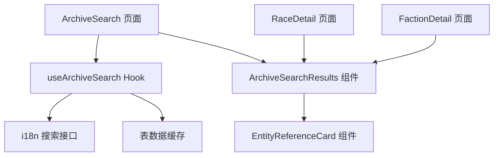
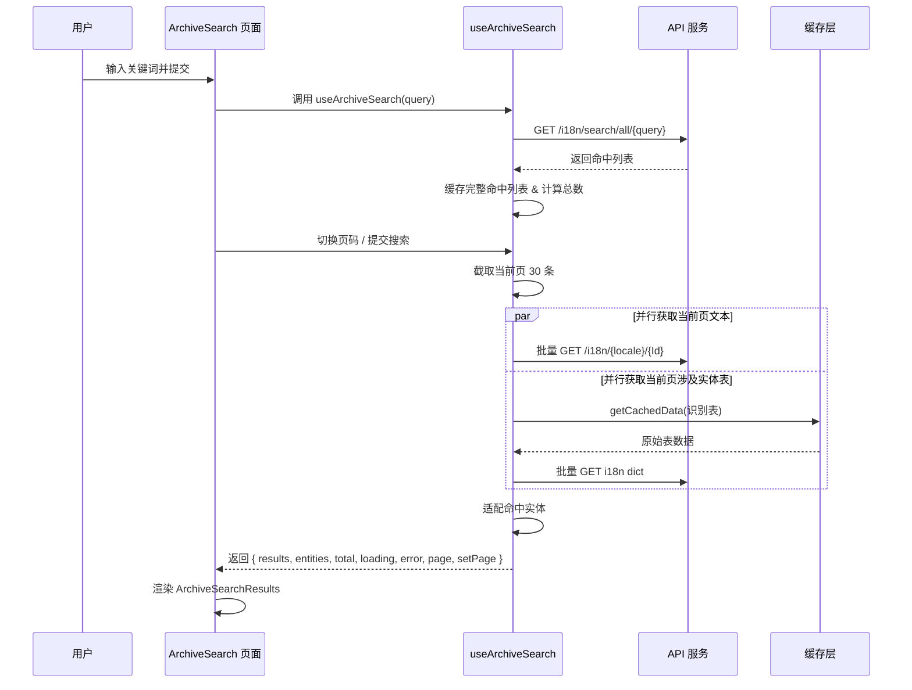

# 档案搜索完善 - 技术提案

**功能名称**: 档案搜索
**关联 PRD**: [[20260719-archive-search|档案搜索完善]]
**技术提案版本**: v1.0
**创建日期**: 2026-07-19
**作者**: 前端工程
**feat-branch**: `feat/archive-search`

## 1. 概述

### 1.1 背景

当前「干员种族」「干员阵营」卷宗的「相关记载」为各页面内联实现，仅能展示纯文本命中片段。产品需要在档案局内新增独立的跨模块关键词搜索能力，并在命中结果中识别出武器、干员、物品、敌人等实体，以可点击的参考 Card 形式展示。

### 1.2 目标

- 新增 `/archive/search` 路由与页面。
- 复用现有 i18n 搜索接口实现跨表文本检索。
- 抽离可复用的搜索结果展示组件，替换种族/阵营详情页的内联实现。
- 通过表名 + Path 解析实体 ID，对识别表展示迷你参考 Card。

### 1.3 范围

**做**:
- 新增档案搜索页面、路由、导航入口。
- 新增 `useArchiveSearch` Hook 与实体解析逻辑。
- 新增可复用的搜索结果组件与四种实体参考 Card。
- 替换 RaceDetail / FactionDetail 的「相关记载」实现。
- 补充必要的 UI 多语言 key。

**不做**:
- 不新增后端接口或数据服务。
- 不修改现有数据模型、适配器签名、缓存策略。
- 不改动现有详情页内部逻辑；物品 Card 通过现有 `ItemPanel` 弹出提示浮层，不新建物品详情页。
- 不实现高级搜索（正则、筛选、排序）。

## 2. 技术架构

### 2.1 模块划分



| 模块 | 职责 | 关键技术点 |
|------|------|-----------|
| `pages/search/ArchiveSearch.tsx` | 搜索页面容器 | 搜索框状态、调用 Hook、展示结果 |
| `hooks/useData.ts` | 数据获取与实体适配 | `useArchiveSearch`、批量文本解析、按表按需拉取 |
| `lib/search.ts` | 搜索工具函数 | Path 解析、正则转义、表注册表 |
| `components/Search/ArchiveSearchResults.tsx` | 可复用结果列表 | 来源标签、高亮文本、Card 插槽 |
| `components/Search/EntityCards.tsx` | 四种实体参考 Card | 复用现有图标/头像路径、稀有度展示与 `ItemPanel` |

## 3. API 与数据

### 3.1 接口契约

复用现有接口，无新增契约。

| 用途 | 接口 | 说明 |
|------|------|------|
| 跨表搜索 | `GET /i18n/search/all/{regex}` | 返回 `{ Table, Path, Id }[]`；前端本地分页 |
| 获取单条文本 | `GET /i18n/{locale}/{id}` | 通过 `Id` 获取命中原文；按当前页 30 条并行获取 |
| 获取表数据 | `GET /table/{table}/all` | 用于构建实体 Card |
| 获取表字典 | `GET /i18n/dict/{locale}/table/{table}/all` | 解析实体名称与描述 |

### 3.2 Path 解析

i18n 搜索返回的 `Path` 格式为 `$.{entityKey}.{field}[...]`。实体 ID 为 Path 中第二个段：

| 表名 | key 字段 | 示例 Path | 提取 ID |
|------|---------|-----------|---------|
| `WeaponBasicTable` | `weaponId` | `$.wpn_sword_0003.weaponDesc` | `wpn_sword_0003` |
| `CharacterTable` | `charId` | `$.chr_0005_chen.name` | `chr_0005_chen` |
| `ItemTable` | `itemId` | `$.item_wood_001.desc` | `item_wood_001` |
| `EnemyTemplateDisplayInfoTable` | `templateId` | `$.ene_titan_001.name` | `ene_titan_001` |


## 4. 技术实现方案

### 4.1 核心流程



### 4.2 关键实现点

#### 4.2.1 表注册与实体适配

在 `src/lib/search.ts` 中维护识别表注册表，集中管理表名、key 字段、跳转路由与适配方式：

```ts
export const SEARCH_ENTITY_TABLES: Record<string, {
  keyField: string
  route: string
  adapt: (raw: any, deps: any, locale: string) => SearchEntity | null
}> = {
  WeaponBasicTable: { keyField: 'weaponId', route: '/archive/weapons', adapt: adaptSearchWeapon },
  CharacterTable: { keyField: 'charId', route: '/archive/operators', adapt: adaptSearchOperator },
  ItemTable: { keyField: 'itemId', route: '/archive/items', adapt: adaptSearchItem },
  EnemyTemplateDisplayInfoTable: { keyField: 'templateId', route: '/archive/enemies', adapt: adaptSearchEnemy },
}
```

适配函数仅抽取展示所需的最小字段，不依赖完整详情数据：

- **武器**: 名称（来自 `ItemTable` 或 `WeaponBasicTable`）、类型（`TextTable`）、稀有度、图标 ID；跳转武器详情页。
- **干员**: 名称、头像、职业、元素、稀有度；跳转干员详情页。
- **物品**: 名称、稀有度、图标 ID；点击弹出 `ItemPanel` Tooltip，不复用现有 `ItemPanel` 的按钮样式，仅借其数据与提示浮层。
- **敌人**: 名称、图标（`templateId`）、显示类型/星级、标签；跳转 `/archive/enemies/{templateId}`。

#### 4.2.2 搜索关键词处理

为避免用户输入的正则特殊字符导致接口异常，对非空关键词先进行 `escapeRegex` 转义，默认按字面量匹配：

```ts
function escapeRegex(text: string): string {
  return text.replace(/[.*+?^${}()|[\]\\]/g, '\\$&')
}
```

高亮同样使用转义后的关键词。

#### 4.2.3 分页与并发

- 搜索接口返回完整命中列表后，前端按每页 30 条本地分页；总条数由接口返回数组长度决定。
- 仅对当前页的 30 条结果发起单条文本请求，使用 `Promise.all` 并行。
- 实体表按需拉取，仅当当前页结果中存在该表时才请求；数据进入现有缓存，翻页时复用。

#### 4.2.4 搜索触发与组件复用

- **触发方式**：搜索输入框仅通过回车（`onKeyDown Enter`）触发，输入过程中不做自动搜索或 debounce。
- **分页状态**：`ArchiveSearch` 页面维护当前页码；`useArchiveSearch` 暴露 `total`、`page`、`setPage`、`pageSize`。

`ArchiveSearchResults` 接收以下 props：

```ts
interface ArchiveSearchResultsProps {
  query: string
  results: SearchResult[]
  entities: Record<string, Record<string, SearchEntity>>
  total: number
  page: number
  pageSize: number
  loading: boolean
  error: string | null
  emptyMessage?: string
  onPageChange: (page: number) => void
}
```

`useArchiveSearch` 支持可选配置：

- `excludeTables?: string[]` —— 用于过滤不希望出现的来源表（如种族详情页排除 `TagDataTable`）。
- `pageSize?: number` —— 默认 30。

`RaceDetail` 与 `FactionDetail` 将其关键词固定为种族/阵营名，通过同一组件渲染「相关记载」，不再内联实现高亮与列表。

### 4.3 路由与导航

- 新增路由：`/archive/search`。
- 在 `src/data/archiveMeta.ts` 的 `MODULE_CODES` 中补充 `search: 'HSA-SRC'`。
- 在 `src/routes/ArchiveHome.tsx` 与 `src/components/Layout/Sidebar.tsx` 的「大事记」分组下新增入口。
- 在 `src/components/Layout/Breadcrumb.tsx` 的 `useListLabel` 中补充 `search` 标签。

### 4.4 i18n Key 补充

在 `src/i18n/dicts/*.json` 中新增：

```json
{
  "nav": {
    "search": "档案搜索",
    "searchDesc": "跨表关键词检索"
  },
  "search": {
    "title": "档案搜索",
    "placeholder": "搜索档案关键词…",
    "searchButton": "搜索",
    "noResults": "未找到相关记载",
    "resultCount": "找到 {{count}} 条相关记载",
    "source": "来源",
    "relatedRecords": "相关记载",
    "prev": "上一页",
    "next": "下一页"
  }
}
```

## 5. 数据模型

### 5.1 新增类型

在 `src/lib/types.ts` 中补充：

```ts
export interface SearchResult {
  table: string
  path: string
  id: string
  text: string
  entityKey: string | null
}

export interface SearchEntity {
  type: 'weapon' | 'operator' | 'item' | 'enemy'
  id: string
  name: string
  route: string
  icon?: string
  portrait?: string
  rarity?: number
  subInfo?: string
  tags?: string[]
}

export interface UseArchiveSearchResult {
  results: SearchResult[]
  entities: Record<string, Record<string, SearchEntity>>
  total: number
  page: number
  pageSize: number
  loading: boolean
  error: string | null
  setPage: (page: number) => void
  refetch: () => void
}
```

## 6. 项目结构

```
src/
  pages/
    search/
      ArchiveSearch.tsx
  components/
    Search/
      ArchiveSearchResults.tsx
      EntityCards.tsx
  lib/
    search.ts
  hooks/
    useData.ts          # 新增 useArchiveSearch
  App.tsx               # 新增 /archive/search 路由
  routes/
    ArchiveHome.tsx     # 新增入口
  components/Layout/
    Sidebar.tsx         # 新增导航
    Breadcrumb.tsx      # 新增面包屑标签
```

## 7. 测试策略

### 7.1 单元测试

- `src/lib/search.ts` 中 `extractEntityKey` 对四种表的 Path 解析。
- `escapeRegex` 对特殊字符的处理。
- 高亮函数对关键词的包裹正确性。

### 7.2 组件测试

- `ArchiveSearchResults` 在 loading、空态、有结果、有实体 Card、翻页时的渲染。
- 各实体参考 Card 点击后跳转正确（模拟路由）。
- 物品 Card 点击后调用 `ItemPanel` 提示浮层。

### 7.3 E2E 测试

- 从首页/侧边导航进入档案搜索页。
- 输入关键词后结果列表出现。
- 识别到实体时 Card 可点击并跳转到对应详情页；物品 Card 弹出 `ItemPanel`。
- 种族/阵营详情页「相关记载」支持翻页。
- 种族/阵营详情页的「相关记载」仍正常展示且样式一致。

## 8. 验收标准

- [ ] 技术方案评审通过
- [ ] `/archive/search` 页面可访问，关键词搜索返回结果
- [ ] 武器、干员、物品、敌人命中结果展示可点击 Card
- [ ] 种族/阵营详情页「相关记载」使用复用组件，样式一致
- [ ] `npm run lint` 通过
- [ ] `npm run test` 通过
- [ ] `npm run build` 通过

## 9. 风险与回滚

| 风险 | 影响 | 缓解措施 |
|------|------|----------|
| i18n 搜索返回结果过多导致请求拥塞 | 页面卡顿 | 本地分页（每页 30 条）、仅请求当前页文本、按表聚合拉取、复用缓存 |
| Path 格式变更导致实体 ID 解析失败 | Card 缺失 | 解析失败时降级为纯文本结果，不阻塞整体列表 |
| 新 Hook 依赖的 lookup 表增加首次加载时间 | 搜索页首屏变慢 | 仅按需拉取结果中出现的表；缓存后续复用 |

回滚策略：本次改动为纯前端新增功能，若出现严重问题，可直接回滚到上一 commit，不影响已有模块数据。

## 10. 相关文档

- [[20260719-archive-search|档案搜索完善]]
- [工程架构规范](../engineering-spec.md)
- [前端开发规范](../frontend-spec.md)
- [数据表映射参考](../references/data-mapping-tables.md)
- [数据层常见陷阱](../references/data-pitfalls.md)
