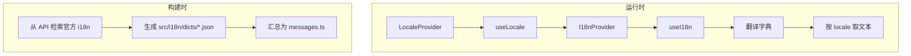
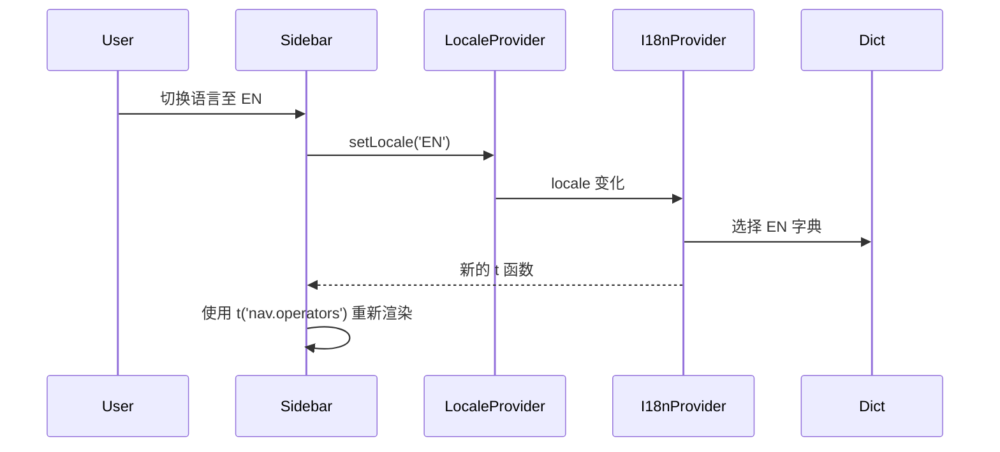

# 宏山档案局界面国际化完善技术方案

**对应产品文档**: [[20260719-globalization-i18n|宏山档案局界面国际化完善方案]]
**技术方案版本**: v1.0
**创建日期**: 2026-07-19
**作者**: 前端工程

## 背景与目标

### 1.1 背景

当前站点通过 `LocaleProvider` 与 `useI18nLocales` 维护当前语言，游戏数据的多语言内容由远端数据服务按 `locale` 动态返回。但站点自创的静态界面文案（导航、筛选器、按钮、提示等）仍以中文硬编码形式分散在 `src/pages/*`、`src/components/*` 与 `src/routes/*` 中。切换语言时这些文案不会变化，形成语言断层。

### 1.2 目标

- 建立一套轻量级前端 I18n 方案，将所有硬编码界面文案抽离为 key。
- 翻译字典存储在前端静态资源中，优先使用从游戏官方 i18n API 检索到的术语。
- 语言切换后，界面文案即时刷新，无需重新请求游戏数据。
- 可用语言列表继续由 API `/i18n` 动态获得，与现有逻辑保持一致。
- 翻译缺失时按 `当前语言 → 简中 → key 本身` 回退，避免空白。

## 范围

### 2.1 做

- 新建 `src/i18n/` 目录，存放翻译字典与 I18n 工具。
- 实现 `useI18n()` hook，提供 `t(key, vars?)` 函数。
- 实现 `I18nProvider`，与现有 `LocaleProvider` 集成。
- 从游戏官方 i18n API 检索关键术语，构建前端静态字典。
- 替换 `Sidebar`、`ArchiveHome`、`Landing` 等处的硬编码导航文案。
- 替换各列表页的标题、搜索占位符、筛选器默认项、排序/分组选项、分页按钮。
- 替换详情页标签、返回链接、统计标签。
- 替换空态、错误、加载提示文案。
- 新增翻译缺失扫描脚本（可选但推荐）。

### 2.2 不做

- 不修改游戏数据解析、适配器、缓存、Diff 系统。
- 不修改 API 接口封装或可用语言列表获取逻辑。
- 不引入 `react-i18next`、`intl` 等第三方国际化库。
- 不改变现有路由与页面结构。
- 不处理富文本内容中的占位符（继续使用现有 `formatText`）。

## 现状分析

### 3.1 当前问题

- `Sidebar.tsx` 中 `NAV_GROUPS` 与 `LOCALE_LABELS` 为硬编码中文。
- `ArchiveHome.tsx` 中卷宗分组与描述为硬编码中文。
- `Landing.tsx` 中主标题、副标题、按钮为硬编码中文。
- 各列表页（`OperatorList`、`WeaponList`、`EnemyList`、`ItemList` 等）的筛选器、排序、分组、分页文案为硬编码中文。
- 详情页标签（如「物品描述」「基本信息」「相关记载」）为硬编码中文。
- 空态与错误提示（如「暂无记录」「加载失败」）为硬编码中文。

### 3.2 可复用基础

- `LocaleProvider` 与 `useLocale` 已提供 `locale` 与 `setLocale`。
- `useI18nLocales` 已从 API `/i18n` 获取可用语言列表。
- 现有组件普遍使用 `useLocale()` 监听语言变化并重新请求数据，可复用该模式触发 I18n 刷新。

## 技术方案

### 4.1 整体架构



### 4.2 字典结构

翻译字典按语言与命名空间分层：

```
src/i18n/
  index.ts          # I18nProvider、useI18n
  types.ts          # 类型定义
  dicts/
    CN.json         # 简中
    TC.json         # 繁中
    EN.json         # 英语
    JP.json         # 日语
    KR.json         # 韩语
    RU.json         # 俄语
```

JSON 结构示例：

```json
{
  "site": {
    "name": "宏山档案局",
    "subtitle": "塔卫二官方档案管理与调阅系统",
    "enter": "进入档案局"
  },
  "nav": {
    "personnel": "人事档案",
    "threat": "威胁档案",
    "material": "物资档案",
    "geography": "地理档案",
    "chronicle": "大事记",
    "operators": "干员档案",
    "races": "干员种族",
    "factions": "干员阵营",
    "enemies": "敌人图鉴",
    "items": "道具材料",
    "weapons": "武器档案",
    "equipment": "装备系统",
    "factory": "工厂系统",
    "areas": "地区地理",
    "story": "剧情记录",
    "updates": "更新日志"
  },
  "common": {
    "all": "全部",
    "search": "搜索",
    "sort": "排序",
    "filter": "筛选",
    "group": "分组",
    "asc": "正序",
    "desc": "倒序",
    "prev": "上一页",
    "next": "下一页",
    "back": "返回",
    "loading": "加载中",
    "loadFailed": "加载失败",
    "empty": "暂无记录",
    "noResult": "未找到匹配结果"
  },
  "operator": {
    "title": "干员档案",
    "allElements": "全部元素",
    "allProfessions": "全部职业",
    "allRarities": "全部稀有度",
    "allTags": "全部Tags",
    "allRaces": "全部种族",
    "allFactions": "全部阵营",
    "allMainAttrs": "全部主属性",
    "allSubAttrs": "全部副属性"
  }
}
```

### 4.3 核心 API 设计

#### 4.3.1 `useI18n`

```ts
interface I18nContextValue {
  locale: string
  t: (key: string, vars?: Record<string, string | number>) => string
}

export function useI18n(): I18nContextValue
```

使用示例：

```tsx
import { useI18n } from '../../i18n'

function OperatorList() {
  const { t } = useI18n()
  return (
    <h2>{t('operator.title')}</h2>
    <input placeholder={t('common.search')} />
    <option value="">{t('operator.allProfessions')}</option>
    <button>{t('common.prev')}</button>
  )
}
```

#### 4.3.2 key 命名规范

- 使用点分路径：`namespace.subKey`。
- `site.*`：站点品牌与首页文案。
- `nav.*`：侧边导航与卷宗入口。
- `common.*`：跨页面通用控件与状态提示。
- `{domain}.*`：各业务域专用文案，如 `operator`、`weapon`、`enemy`、`item`、`update`。
- 复数 key 表示列表/分类，单数 key 表示单个实例标签。

### 4.4 回退机制

`useI18n().t(key, vars?)` 按以下顺序解析：

1. 当前语言字典中的 `key`。
2. 简中（CN）字典中的 `key`。
3. 返回 `key` 本身，并在开发环境打印警告。

该机制保证任何新增语言在未完整翻译时仍可用，避免空白。

### 4.5 与现有 `LocaleProvider` 集成

`LocaleProvider` 继续负责 `locale` 状态与持久化。新增 `I18nProvider` 包裹 `LocaleProvider` 内部或并列层级，订阅 `locale` 变化后重新提供 `t` 函数。`t` 函数实例在 `locale` 变化时更新，依赖 `t` 的组件自然刷新。



### 4.6 翻译来源与构建方式

#### 4.6.1 官方 i18n 检索

通过远端 `/i18n/{locale}/{id}` 获取游戏官方翻译，将高频术语整理进前端字典。已检索到的部分关键 ID 如下：

| key | 官方 i18n ID | CN | EN |
|-----|-------------|----|----|
| `nav.operators` / `site.operator` | `ui_friend_card_operator` (4587871773125153579) | 干员 | Operators |
| `nav.weapons` | `ui_wiki_common_wpn` (-5172571920525154197) | 武器图鉴 | Weapon Files |
| `nav.items` | `ui_wiki_common_mat` (-6832531754290229270) | 物品图鉴 | Item Files |
| `nav.equipment` | `ui_wiki_common_equip` (-2258509209715706807) | 装备图鉴 | Gear Files |
| `nav.enemies` | `ui_wiki_common_eny` (8742258141975205570) | 威胁图鉴 |  |
| `nav.story` | `ui_wiki_common_tut` (-2992892562572048332) | 教学记录 | Tutorials |
| `common.sort` | `LUA_COMMON_SORT_TITLE` (-5741249201421562043) | 排序 | Sort |
| `common.filter` | `LUA_COMMON_FILTER_TITLE` (-1121143716786680081) | 筛选 | Filter |
| `common.back` | `LUA_CHAR_FORMATION_BACK` (4109135557850577026) | 返回 | Return |
| `common.cancel` | `LUA_CANCEL` (-7995171946680413439) | 取消 | Cancel |
| `common.loading` | `ui_achv_list_search_loading` (-8683146888103394046) | 加载中 | Loading |
| `common.loadFailed` | `CS_FATAL_ERROR_LOAD_IMPORTANT_DATA_FAILED` (-708947455973234252) | 数据加载失败 | Failed to load data |
| `common.all` | `ui_achv_edit_filter_all` (-6709500628147796913) | 全部显示 | Show All |
| `common.search` | `ui_wiki_common_search` (1813795696135907930) | 查询 | Search |
| `common.noResult` | `LUA_FILTER_NO_RESULT` (-547783542302619085) | 无符合条件的筛选结果 | Nothing matches |
| `operator.race` | `ui_fac_settlement_char_race` (-4169092580478466908) | 种族 | Race |
| `operator.skill` | `LUA_CHAR_INFO_BASIC_SKILL_TITLE` (-1627707113686409986) | 技能 | Skill |
| `weapon.rarity` | `LUA_EQUIP_FILTER_GROUP_TITLE_RARITY` (-863081527829739477) | 品质 | Quality |

#### 4.6.2 站点自定义翻译

对于档案局自创概念（如「人事档案」「物资档案」「大事记」「档案局总览」），无法从游戏官方 i18n 中直接匹配，需在产品设计阶段给出各语言译文并写入字典。建议遵循以下原则：

- 优先使用官方已覆盖的基础词（如 Operators、Weapons、Materials、Enemies）。
- 组合词参考官方风格，如「人事档案」→ EN: Personnel Files，JP: 人事記録。
- 保留中文作为最终回退。

### 4.7 字典加载策略

为保持构建产物可控，不采用运行时动态 `import()`。所有语言字典在构建时静态导入并合并为一个对象：

```ts
import CN from './dicts/CN.json'
import EN from './dicts/EN.json'
// ...

const messages: Record<string, Record<string, string>> = {
  CN: flatten(CN),
  EN: flatten(EN),
  // ...
}
```

`flatten` 将嵌套 JSON 展开为点分 key，便于 `t('operator.title')` 直接取值。

### 4.8 硬编码替换策略

按以下顺序逐步替换：

1. **全局布局**：`Sidebar.tsx`、`ArchiveHome.tsx`、`Landing.tsx`、`Breadcrumb.tsx`、`Footer.tsx`。
2. **列表页**：`OperatorList.tsx`、`WeaponList.tsx`、`EnemyList.tsx`、`ItemList.tsx`。
3. **详情页**：`OperatorDetail.tsx`、`WeaponDetail.tsx`、`EnemyDetail.tsx`、`RaceDetail.tsx`、`FactionDetail.tsx`。
4. **通用组件**：`ItemPanel`、`RewardPanel`、`WeaponSkillPanel` 等标签文字。
5. **更新日志**：`UpdateHome.tsx`、`UpdateSummary.tsx`、`UpdateTableDiff.tsx`。
6. **占位页**：`EquipmentOverview.tsx`、`FactoryOverview.tsx`、`GeographyList.tsx`。

## 数据与接口

- 可用语言列表：继续使用 `fetchI18nLocales()` → `GET /i18n`。
- 官方 i18n 检索：仅在构建字典时使用 `GET /i18n/{locale}/{id}`，不进入运行时。
- 运行时无新增 API 调用。

## 实现计划

### 第一阶段：基础设施

1. 创建 `src/i18n/` 目录。
2. 实现 `flatten` 工具与类型定义。
3. 创建 `CN.json` 作为基准字典，覆盖所有已识别的硬编码文案。
4. 实现 `I18nProvider` 与 `useI18n`。
5. 在 `App.tsx` 中集成 `I18nProvider`。

### 第二阶段：核心页面替换

1. 替换 `Sidebar`、`ArchiveHome`、`Landing` 硬编码文案。
2. 替换 `OperatorList` 标题、筛选器、排序、分组、分页文案。
3. 替换 `WeaponList`、`EnemyList`、`ItemList` 相同类型文案。
4. 替换 `RaceList`、`FactionList` 标题与空态文案。

### 第三阶段：详情页与组件替换

1. 替换 `OperatorDetail`、`WeaponDetail`、`EnemyDetail` 标签与返回文案。
2. 替换 `RaceDetail`、`FactionDetail` 的「相关记载」「所属干员」文案。
3. 替换 `ItemPanel`、`RewardPanel`、`WeaponSkillPanel` 等通用组件标签。

### 第四阶段：更新日志与占位页

1. 替换 `UpdateHome`、`UpdateSummary`、`UpdateTableDiff` 文案。
2. 替换 `EquipmentOverview`、`FactoryOverview`、`GeographyList` 占位文案。

### 第五阶段：验证

1. 运行 `npm run lint`。
2. 运行 `npm run test`。
3. 运行 `npm run build`。
4. 切换各语言进行人工走查，确认无中文硬编码残留。
5. 验证翻译缺失回退机制。

## 测试策略

### 7.1 单元测试

- 测试 `flatten` 将嵌套 JSON 正确展开为点分 key。
- 测试 `t(key)` 在当前语言存在时返回对应文本。
- 测试 `t(key)` 在当前语言缺失时回退至 CN。
- 测试 `t(key, { count: 3 })` 正确替换占位符。

### 7.2 组件测试

- 测试 `Sidebar` 在不同语言下渲染对应导航文案。
- 测试 `OperatorList` 筛选器选项随语言变化。
- 测试切换语言后 `ArchiveHome` 卷宗描述更新。

### 7.3 E2E 测试

- 从侧边栏切换语言，验证导航文案变化。
- 进入干员列表，验证筛选器占位符与选项语言正确。
- 进入武器详情，验证标签语言正确。
- 验证翻译缺失页面不报错。

### 7.4 静态检查

- 添加脚本扫描 `src/` 中是否仍有中文硬编码（排除测试文件与注释），作为 CI 检查项。

## 验收标准

- [ ] `npm run build` 通过，无 TypeScript 错误。
- [ ] `npm run lint` 通过，无新增 lint 错误。
- [ ] `npm run test` 通过。
- [ ] 切换 `CN / TC / EN / JP / KR / RU` 时，导航、筛选器、按钮、提示即时刷新。
- [ ] 任意 key 在目标语言缺失时，回退至 CN 显示。
- [ ] 新增硬编码中文扫描脚本并纳入 CI（可选）。
- [ ] 产品文档与技术方案均通过 Review。

## 风险与回滚

| 风险 | 影响 | 缓解措施 |
|------|------|----------|
| 翻译字典遗漏导致部分文案仍显示中文 | 体验不一致 | 实现前全面梳理硬编码清单，实现后全语言走查 |
| 官方 i18n 某些语言缺失 | 回退至 CN | `t` 函数内置 CN 回退 |
| key 命名冲突 | 显示错误文案 | 命名空间隔离，按模块分组 |
| 体积增长 | 首屏加载变慢 | 仅支持当前项目已列出的 6 种语言，后续按需扩展 |
| 占位符替换误伤 | 显示异常 | 单元测试覆盖 vars 替换逻辑 |

回滚策略：本改动为纯前端文案层，若出现严重问题，可直接回滚 `feat/i18n-globalization` 分支，不影响数据与接口。

## 相关文档

- [[20260719-globalization-i18n|宏山档案局界面国际化完善方案]]
- [[common-rules|通用开发规范]]
- [[frontend-spec|前端开发规范]]
- [[engineering-spec|工程架构规范]]
