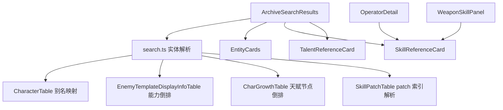

# 搜索结果优化三期 - 技术提案

**功能名称**: 搜索结果优化三期  
**关联 PRD**: [[20260719-search-optimization-phase3|搜索结果优化三期]]  
**技术提案版本**: v1.0  
**创建日期**: 2026-07-19  
**作者**: 前端工程  
**feat-branch**: `feat/search-optimization-phase3`

## 1. 概述

### 1.1 背景

搜索优化二期完成后，剩余的体验缺口与一处映射缺陷需要在本期补齐：

1. 技能/天赋文本中的增益数值 `+{expr:format}` 需要蓝色高亮。
2. `EnemyAbilityDescTable` 命中后缺少到威胁图鉴的实体关联。
3. 搜索结果中武器 Card 被容器拉伸。
4. `PotentialTalentEffectTable` 需要展示天赋面板而非仅归属 Card。
5. 武器技能默认等级应为 9，干员技能默认等级应为 13。
6. `CharGrowthTable` 的别名映射存在查找表名不一致的缺陷。
7. `SkillPatchTable` 子效果命中需要展示完整技能面板并定位到对应 patch 等级。

### 1.2 目标

- 在富文本/数值格式化层实现 `+{expr:format}` 的蓝色渲染。
- 为敌人能力、天赋效果构建倒排索引，支持实体关联与面板展示。
- 修复 `CharGrowthTable` 实体查找，统一别名表与间接表的归属实体附加方式。
- 调整技能默认等级策略，支持按归属类型区分。
- 限制武器 Card 宽度，保持视觉一致性。

### 1.3 范围

**做**:

- 修改 `src/lib/formatText.ts` 的 `formatBlackboard`。
- 扩展 `src/lib/search.ts`：新增敌人能力倒排索引、天赋节点倒排索引、统一归属实体解析。
- 新增 `src/components/talents/TalentReferenceCard.tsx`。
- 修改 `src/components/Search/EntityCards.tsx` 武器 Card 宽度。
- 修改 `src/components/Search/ArchiveSearchResults.tsx`：按表渲染天赋/技能、按归属类型传默认等级。
- 修改 `src/pages/operators/OperatorDetail.tsx` 技能滑动条上限与默认值 13。
- 补充/更新单元测试与组件测试。

**不做**:

- 不新增后端接口或数据服务。
- 不修改现有数据模型、适配器签名、缓存策略。
- 不改动详情页内部核心逻辑（除必要等级调整）。
- 不实现高级搜索、筛选、排序。

## 2. 技术架构

### 2.1 模块划分



| 模块 | 职责 | 关键技术点 |
|------|------|-----------|
| `src/lib/formatText.ts` | 增益数值蓝色渲染 | `formatBlackboard` 识别 `+{expr:format}` |
| `src/lib/search.ts` | 倒排索引与归属实体解析 | 敌人能力、天赋节点、别名表统一 ownerEntity |
| `src/components/talents/TalentReferenceCard.tsx` | 天赋面板展示 | CharGrowthTable i18n + PotentialTalentEffectTable blackboard |
| `src/components/Search/EntityCards.tsx` | 武器 Card 宽度限制 | `w-24 items-start` |
| `src/components/Search/ArchiveSearchResults.tsx` | 结果渲染分发 | 按 table 渲染 Skill/Talent/Owner Card |
| `src/pages/operators/OperatorDetail.tsx` | 干员技能等级 | slider max/default = 13 |

## 3. API 与数据

### 3.1 接口契约

复用现有接口，无新增契约。

| 用途 | 接口 | 说明 |
|------|------|------|
| 跨表搜索 | `GET /i18n/search/all/{regex}` | 返回 `{ Table, Path, Id }[]` |
| 获取单条文本 | `GET /i18n/{locale}/{id}` | 当前页 30 条并行获取 |
| 获取表数据 | `GET /table/{table}/all` | 构建倒排索引与面板 |
| 获取表字典 | `GET /i18n/dict/{locale}/table/{table}/all` | 解析实体名称与描述 |

### 3.2 路径模式

| 表名 | 示例 Path | 提取 key | 归属解析 |
|------|-----------|----------|----------|
| `EnemyAbilityDescTable` | `$.eny_0007_mimicw_ability_1.description` | `eny_0007_mimicw_ability_1` | 能力 → `templateId` |
| `PotentialTalentEffectTable` | `$.chr_0002_endminm_talent_1_1.desc` | `chr_0002_endminm_talent_1_1` | 天赋效果 → 干员 + 天赋节点 |
| `SkillPatchTable` | `$.skillId.SkillPatchDataBundle[2].subDescDataList[5].desc` | `skillId` | skillId → 干员/武器 + patch 索引 |
| `CharGrowthTable` | `$.chr_0005_chen.skillGroupMap...` | `chr_0005_chen` | 别名到 `CharacterTable` |

## 4. 技术实现方案

### 4.1 富文本增益数值蓝色渲染

在 `formatBlackboard` 中，占位符正则扩展为 `/([+-]?)\{(.*?)(:.*?)?\}/g`，但仅对 `+` 前缀做特殊处理：

```ts
const pattern = /([+-]?)\{(.*?)(:.*?)?\}/g
// ...
const prefix = match[1] // '+' or ''
result += format.slice(lastIndex, match.index)
if (prefix === '+') {
  result += `<color=#26bbfd>+{${argIndex}${fmt}}</color>`
} else {
  result += `{${argIndex}${fmt}}`
}
```

最终替换阶段将 `{0:0.0%}` 替换为 `12.0%`，因此带 `+` 的场景得到 `<color=#26bbfd>+12.0%</color>`，再走 `RichText` 渲染为蓝色。

> 注意：`-{expr:format}` 在游戏文本中极少出现；若出现，二期已支持负号表达式计算，颜色保持默认。

### 4.2 敌人能力倒排索引

新增 `buildAbilityOwnerIndex`：

```ts
async function buildAbilityOwnerIndex(locale: string): Promise<Record<string, string>> {
  const raw = await getCachedData<Record<string, any>>('EnemyTemplateDisplayInfoTable', () => fetchTableAll('EnemyTemplateDisplayInfoTable'))
  const index: Record<string, string> = {}
  for (const [, v] of Object.entries<any>(raw)) {
    const templateId = v.templateId ?? v.$key ?? ''
    for (const abilityId of v.abilityDescIds ?? []) {
      if (!index[abilityId]) index[abilityId] = templateId
    }
  }
  return index
}
```

`EnemyAbilityDescTable` 注册为间接表：命中后通过索引得到 `templateId`，复用 `buildEnemyEntityMap` 生成敌人实体并附加到 `ownerEntity`。

### 4.3 天赋节点倒排索引与 TalentReferenceCard

#### 4.3.1 索引构建

```ts
interface TalentNodeRef {
  charId: string
  nodeId: string
  nameRef: any
  iconId: string
  level: number
  breakStage: number
}

async function buildTalentNodeIndex(locale: string): Promise<Record<string, TalentNodeRef>> {
  const growthRaw = await getCachedData<Record<string, any>>('CharGrowthTable', () => fetchTableAll('CharGrowthTable'))
  const index: Record<string, TalentNodeRef> = {}
  for (const [, v] of Object.entries<any>(growthRaw)) {
    const charId = v.charId ?? v.$key ?? ''
    for (const [nodeId, node] of Object.entries<any>(v.talentNodeMap ?? {})) {
      if (node.nodeType !== 4) continue
      const psi = node.passiveSkillNodeInfo ?? {}
      if (!psi.talentEffectId) continue
      index[psi.talentEffectId] = {
        charId,
        nodeId,
        nameRef: psi.name,
        iconId: psi.iconId ?? '',
        level: psi.level ?? 0,
        breakStage: psi.breakStage ?? 0,
      }
    }
  }
  return index
}
```

> 注：该索引同时提供 `charId`，因此 `PotentialTalentEffectTable` 的归属解析可合并到此处，不再单独维护 `buildTalentEffectOwnerIndex`。

#### 4.3.2 TalentReferenceCard

参考 `SkillReferenceCard` 提取公共天赋面板组件：

```tsx
interface TalentReferenceCardProps {
  talentEffectId: string
  className?: string
}
```

数据加载：

1. 通过 `buildTalentNodeIndex` 获取节点信息（名称 i18n、图标、等级、breakStage）。
2. 通过 `PotentialTalentEffectTable` 与字典获取 `desc`。
3. 合并 `dataList[].attachSkill.blackboard` 与 `attachBuff.blackboard`，使用 `formatBlackboard` 渲染描述。

UI 结构：图标 + 名称 + `Lv.{level}` + 描述，样式与技能面板一致。

### 4.4 武器 Card 宽度限制

修改 `WeaponReferenceCard`：

```tsx
<ItemPanel
  itemId={entity.id}
  name={entity.name}
  rarity={entity.rarity ?? 1}
  showTips={false}
  showName
  href={entity.route}
  className="w-24 items-start"
  iconClassName="w-12 h-12"
/>
```

`w-24`（6rem）与 `ItemPanel` 默认图标 + 名称比例一致，避免被 flex 父容器拉伸。

### 4.5 技能默认等级区分

#### 4.5.1 搜索结果

在 `ArchiveSearchResults.tsx` 中：

```tsx
const defaultSkillLevel = r.table === 'SkillPatchTable'
  ? (r.ownerEntity?.type === 'weapon' ? 9 : 13)
  : undefined
```

将 `defaultSkillLevel` 传入 `SkillReferenceCard`。

#### 4.5.2 干员详情页

修改 `OperatorDetail.tsx` 的 `SkillGroupCard`：

```tsx
const [level, setLevel] = useState(13)
// ...
<input type="range" min={1} max={13} value={level} ... />
```

若某干员技能实际最高等级不足 13，`getPatchesAtLevel` 会返回空数组，SkillGroupCard 现有逻辑会在无 patch 时展示 group.desc（静态描述），不会崩溃。

#### 4.5.3 武器详情页

`WeaponSkillPanel` 保持不传 `defaultLevel`，由 `SkillReferenceCard` 回退到数据实际最高等级（武器技能数据上限为 9）。如需显式，可传 `defaultLevel={9}`。

### 4.6 修复 CharGrowthTable 映射缺陷

#### 4.6.1 问题定位

`enrichResults` 当前流程：

1. 对别名表（`CharGrowthTable`），`targetTable = SEARCH_ENTITY_ALIAS_TABLES[r.table]` 得到 `CharacterTable`。
2. 构建 `entities['CharacterTable'] = buildOperatorEntityMap(locale)`。
3. 渲染时 `ArchiveSearchResults` 使用 `entities[r.table]?.[r.entityKey]`，即 `entities['CharGrowthTable']`，未命中。

因此 `CharGrowthTable` 命中项的 `entity` 始终为 `undefined`，干员 Card 缺失。

#### 4.6.2 修复方案

在 `enrichResults` 中为每条结果统一计算 `targetTable` 与 `ownerEntity`：

```ts
const targetTable = SEARCH_ENTITY_ALIAS_TABLES[r.table] ?? r.table

// 直接表：entity 已存在 entities[r.table]
// 别名表：entity 存在于 entities[targetTable]
// 间接表：通过索引解析 ownerEntity

for (const r of enriched) {
  const target = SEARCH_ENTITY_ALIAS_TABLES[r.table] ?? r.table
  if (r.table !== target && r.entityKey && entities[target]) {
    r.ownerEntity = entities[target][r.entityKey]
  }
  // 间接表 ownerEntity 保持原有逻辑
}
```

渲染层统一使用 `ownerEntity ?? entity`。

> 该修复同时适用于 `CharacterTagDesTable` 等其它别名表。

### 4.7 SkillPatchTable 子效果命中展示完整技能

`SkillReferenceCard` 已支持按 `skillId` 展示完整技能。本期新增 `defaultLevel` 从路径解析：

```ts
function resolveDefaultSkillLevel(path: string, skillId: string, ownerType?: string): number {
  const patchMatch = path.match(/SkillPatchDataBundle\[(\d+)\]/)
  if (patchMatch) {
    // 后续在 SkillReferenceCard 内部根据 patch 索引取 level
    return Number(patchMatch[1])
  }
  return ownerType === 'weapon' ? 9 : 13
}
```

更合理的做法是将 patch 索引传入 `SkillReferenceCard`，由组件在加载 `SkillPatchTable` 后取 `bundle[patchIndex].level` 作为默认 level。因此扩展 `SkillReferenceCardProps`：

```ts
interface SkillReferenceCardProps {
  skillId: string
  showLevelSlider?: boolean
  defaultLevel?: number
  defaultPatchIndex?: number
  className?: string
}
```

在组件内：

```ts
const targetLevel = defaultLevel ?? (defaultPatchIndex !== undefined ? bundle[defaultPatchIndex]?.level : undefined) ?? sorted[sorted.length - 1].level
```

`ArchiveSearchResults` 从 path 提取 `defaultPatchIndex` 传入。

## 5. 数据模型

### 5.1 类型扩展

在 `src/lib/types.ts` 中新增天赋节点引用类型（如需要）：

```ts
export interface TalentNodeRef {
  charId: string
  nodeId: string
  nameRef: { id?: number | string; text?: string }
  iconId: string
  level: number
  breakStage: number
}
```

`SearchResult.ownerEntity` 已存在，可直接复用。

### 5.2 间接表配置

在 `src/lib/search.ts` 中引入 `SEARCH_ENTITY_INDIRECT_TABLES`，集中管理间接表解析：

```ts
const SEARCH_ENTITY_INDIRECT_TABLES: Record<string, {
  resolveOwner: (locale: string, entityKey: string) => Promise<SearchEntity | undefined>
}> = {
  EnemyAbilityDescTable: { resolveOwner: resolveAbilityOwner },
  PotentialTalentEffectTable: { resolveOwner: resolveTalentEffectOwner },
  SkillPatchTable: { resolveOwner: resolveSkillOwner },
}
```

## 6. 项目结构

```
src/
  components/
    Search/
      EntityCards.tsx           # 武器宽度限制
      ArchiveSearchResults.tsx  # 按表分发 + 默认等级
    talents/
      TalentReferenceCard.tsx   # 新增天赋面板
  lib/
    formatText.ts               # +{expr:format} 蓝色渲染
    search.ts                   # 倒排索引 + 统一归属解析
    types.ts                    # TalentNodeRef 等类型扩展
  pages/
    operators/
      OperatorDetail.tsx        # 技能 slider 13
```

## 7. 测试策略

### 7.1 单元测试

- `src/lib/__tests__/formatText.test.ts`：
  - `+{atk_up:0%}` 被替换为 `<color=#26bbfd>+...</color>`。
  - `{atk_up:0%}` 不添加颜色标签。
- `src/lib/__tests__/search.test.ts`：
  - `buildAbilityOwnerIndex`：已知 abilityId 返回正确 templateId。
  - `buildTalentNodeIndex`：已知 talentEffectId 返回正确节点信息。
  - `enrichResults` 为 `CharGrowthTable` 命中项附加 `ownerEntity`。
  - `enrichResults` 为 `EnemyAbilityDescTable` 命中项附加 `ownerEntity`。

### 7.2 组件测试

- `TalentReferenceCard.test.tsx`：渲染图标、名称、等级、描述。
- `ArchiveSearchResults.test.tsx`：
  - 武器 Card 宽度类名包含 `w-24`。
  - `PotentialTalentEffectTable` 结果展示 `TalentReferenceCard` 与干员 Card。
  - `SkillPatchTable` 结果按归属传入 `defaultLevel={9|13}` 或 `defaultPatchIndex`。

### 7.3 E2E 测试

- 搜索敌人能力关键词，结果出现威胁 Card 并可跳转。
- 搜索天赋效果关键词，结果出现天赋面板。
- 干员详情页技能滑动条可拖到 13。

## 8. 验收标准

- [ ] 技术方案评审通过
- [ ] `+{expr:format}` 渲染为蓝色
- [ ] `EnemyAbilityDescTable` 命中展示威胁 Card 并可跳转
- [ ] 武器 Card 宽度受限
- [ ] `PotentialTalentEffectTable` 命中展示天赋面板 + 干员 Card
- [ ] 武器技能默认 Lv.9，干员技能默认 Lv.13
- [ ] `CharGrowthTable` 命中正确展示干员 Card
- [ ] `SkillPatchTable` 子效果命中展示完整技能面板
- [ ] `npm run lint` 通过
- [ ] `npm run test` 通过
- [ ] `npm run build` 通过

## 9. 风险与回滚

| 风险 | 影响 | 缓解措施 |
|------|------|----------|
| 蓝色颜色 `#26bbfd` 与 `@ba.heal` 等样式色重复 | 视觉无影响 | 使用设计系统 `archive-heal` 色值，与现有 heal 样式一致 |
| 敌人能力/天赋倒排索引构建增加首次搜索耗时 | 搜索页首屏变慢 | 按需构建，复用现有表缓存 |
| `CharGrowthTable` 修复影响别名表行为 | Card 缺失或重复 | 统一使用 ownerEntity 路径，回归覆盖别名表测试 |
| 干员技能默认 13 但数据最高 12 | 默认回退到 12 | `SkillReferenceCard` 内部找不到目标等级时回退到最高等级 |

回滚策略：本次改动为纯前端增量优化，若出现严重问题，可直接回滚到上一稳定 commit。

## 10. 相关文档

- [[20260719-search-optimization-phase3|搜索结果优化三期]]
- [[20260719-search-results-optimization|搜索结果优化二期]]
- [工程架构规范](../engineering-spec.md)
- [前端开发规范](../frontend-spec.md)
- [数据表映射参考](../references/data-mapping-tables.md)
- [数据层常见陷阱](../references/data-pitfalls.md)
- [富文本规范参考](../references/rich-text-spec.md)
