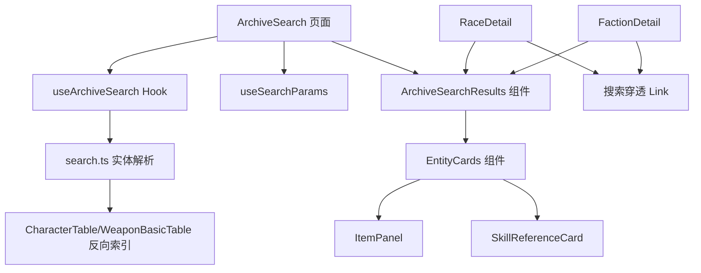
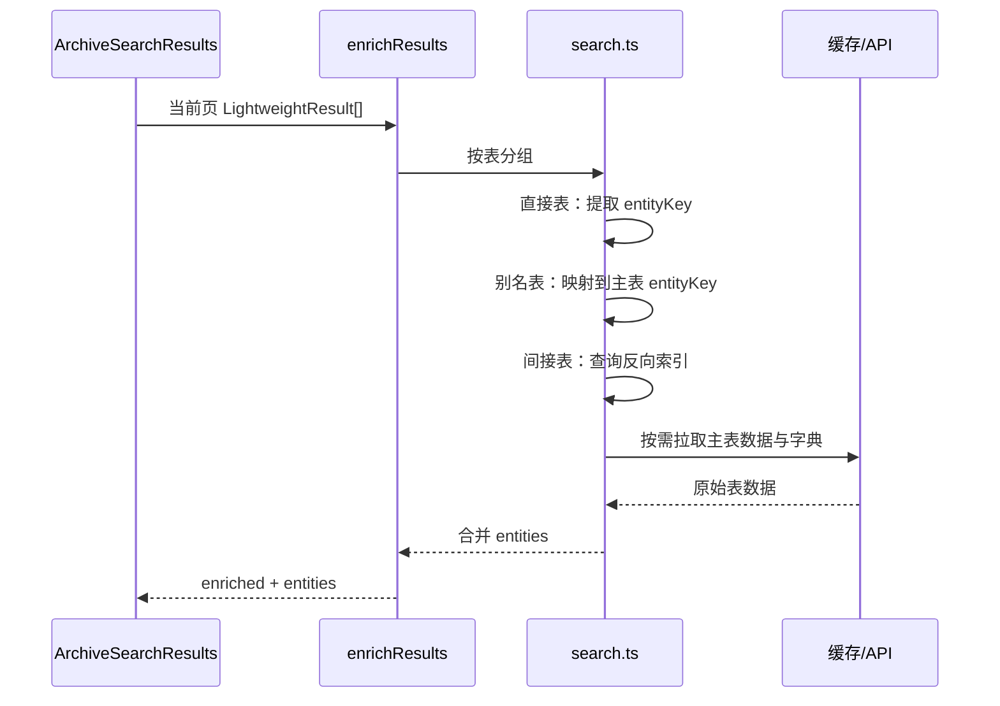

# 搜索结果优化 - 技术提案

**功能名称**: 搜索结果优化  
**关联 PRD**: [[20260719-search-results-optimization|搜索结果优化]]  
**技术提案版本**: v1.0  
**创建日期**: 2026-07-19  
**作者**: 前端工程  
**feat-branch**: `feat/search-results-optimization`

## 1. 概述

### 1.1 背景

当前档案搜索已具备跨表检索与基础实体识别能力，但存在武器 Card 未复用 `ItemPanel`、干员子表无法关联主实体、技能命中无归属展示、高亮可读性不足、翻页后未回顶、URL 不可分享、种族/阵营缺少搜索穿透等问题。本次优化在现有架构上做最小改动，提升结果可读性与导航效率。

### 1.2 目标

- 武器结果复用 `ItemPanel` 并支持跳转详情。
- `PotentialTalentEffectTable`、`CharacterTagDesTable`、`CharGrowthTable` 命中结果关联到 `CharacterTable` 并展示干员 Card。
- `SkillPatchTable` 命中结果展示公共技能组件，并关联所属干员或武器。
- 关键词高亮强制覆盖文字颜色为深色。
- 翻页后结果列表回到顶部。
- 搜索页与 URL query `keyword` 双向联动。
- 种族/阵营详情页「相关记载」行尾增加穿透链接。

### 1.3 范围

**做**:
- 扩展 `src/lib/search.ts` 实体表注册与反向索引构建。
- 改造 `src/components/Search/EntityCards.tsx`，新增技能组件，武器结果复用 `ItemPanel`。
- 修改 `src/lib/richText.tsx` 的 `<mark>` 渲染，覆盖文字颜色。
- 修改 `src/components/Search/ArchiveSearchResults.tsx`，翻页时滚动到顶部。
- 修改 `src/pages/search/ArchiveSearch.tsx`，接入 `useSearchParams` 与 keyword query。
- 修改 `src/pages/races/RaceDetail.tsx` 与 `src/pages/factions/FactionDetail.tsx`，增加穿透链接。
- 补充/更新单元测试与 E2E 测试。
- 补充 UI 多语言 key。

**不做**:
- 不新增后端接口或数据服务。
- 不修改现有数据模型、适配器签名、缓存策略。
- 不改动详情页内部逻辑。
- 不实现高级搜索（正则、筛选、排序）。

## 2. 技术架构

### 2.1 模块划分



| 模块 | 职责 | 关键技术点 |
|------|------|-----------|
| `src/lib/search.ts` | 表注册、实体解析、反向索引 | `SEARCH_ENTITY_TABLES` 扩展、技能/天赋反向索引 |
| `src/components/Search/EntityCards.tsx` | 实体参考 Card 与技能组件 | `ItemPanel` 复用、`SkillReferenceCard` |
| `src/components/Search/ArchiveSearchResults.tsx` | 结果列表、翻页、滚动 | `useEffect` 监听 `page` 滚动 |
| `src/lib/richText.tsx` | 富文本与高亮渲染 | `<mark>` 颜色覆盖 |
| `src/pages/search/ArchiveSearch.tsx` | 搜索页容器 | `useSearchParams` 双向同步 |
| `src/pages/races/RaceDetail.tsx` | 种族详情页 | 行尾穿透 Link |
| `src/pages/factions/FactionDetail.tsx` | 阵营详情页 | 行尾穿透 Link |

## 3. API 与数据

### 3.1 接口契约

复用现有接口，无新增契约。

| 用途 | 接口 | 说明 |
|------|------|------|
| 跨表搜索 | `GET /i18n/search/all/{regex}` | 返回 `{ Table, Path, Id }[]` |
| 获取单条文本 | `GET /i18n/{locale}/{id}` | 当前页 30 条并行获取 |
| 获取表数据 | `GET /table/{table}/all` | 构建实体 Card 与反向索引 |
| 获取表字典 | `GET /i18n/dict/{locale}/table/{table}/all` | 解析实体名称 |

### 3.2 Path 解析与实体关联

#### 直接关联表

| 表名 | key 字段 | 示例 Path | 提取 ID | 关联实体 |
|------|---------|-----------|---------|----------|
| `CharacterTable` | `charId` | `$.chr_0005_chen.name` | `chr_0005_chen` | 干员 |
| `WeaponBasicTable` | `weaponId` | `$.wpn_sword_0003.weaponDesc` | `wpn_sword_0003` | 武器 |
| `ItemTable` | `itemId` | `$.item_wood_001.desc` | `item_wood_001` | 物品 |
| `EnemyTemplateDisplayInfoTable` | `templateId` | `$.ene_titan_001.name` | `ene_titan_001` | 敌人 |
| `CharGrowthTable` | `charId` | `$.chr_0005_chen.skillGroupMap...` | `chr_0005_chen` | 干员 |
| `CharacterTagDesTable` | `charId` | `$.chr_0005_chen.tagDesc...` | `chr_0005_chen` | 干员 |

#### 间接关联表

| 表名 | key 字段 | 反向索引来源 | 关联实体 |
|------|---------|--------------|----------|
| `PotentialTalentEffectTable` | `talentEffectId` | `CharGrowthTable.talentNodeMap` 中 `nodeType === 4` 的 `talentEffectId` → `charId` | 干员 |
| `SkillPatchTable` | `skillId` | `CharGrowthTable.skillGroupMap.skillIdList` → `charId`；`WeaponBasicTable.weaponSkillList` → `weaponId` | 干员/武器 |

## 4. 技术实现方案

### 4.1 实体表注册扩展（`src/lib/search.ts`）

新增两类映射：

1. `SEARCH_ENTITY_TABLES` 保持不变，管理可直接解析 entityKey 的表。
2. 新增 `SEARCH_ENTITY_ALIAS_TABLES: Record<string, string>`，将 `CharGrowthTable`、`CharacterTagDesTable` 映射到 `CharacterTable`，使这些表的命中结果复用 `CharacterTable` 的实体 map。

新增反向索引构建函数：

```ts
async function buildSkillOwnerIndex(): Promise<Record<string, { type: 'operator' | 'weapon'; id: string }>>
async function buildTalentEffectOwnerIndex(): Promise<Record<string, string>>
```

这两个函数按需调用（仅当当前页结果包含 `SkillPatchTable` 或 `PotentialTalentEffectTable` 时），从 `CharGrowthTable` 与 `WeaponBasicTable` 构建 `skillId/talentEffectId → owner` 映射。

### 4.2 实体解析流程



### 4.3 武器结果复用 ItemPanel

改造 `ItemPanel`，支持可选的 `href?: string`：

- 当传入 `href` 时，渲染为 `<Link to={href}>` 或 `<a>`，不再触发 Tooltip；点击直接跳转武器详情页。
- 未传入 `href` 时保持原有按钮 + Tooltip 行为，确保现有调用方不受影响。

在 `EntityCards.tsx` 的 `WeaponReferenceCard` 中：

```tsx
<ItemPanel
  itemId={entity.id}
  name={entity.name}
  rarity={entity.rarity}
  showTips={false}
  showName
  href={entity.route}
/>
```

### 4.4 技能展示组件

新增 `SkillReferenceCard`：

- 接收 `skillId: string`。
- 拉取 `SkillPatchTable` 与该表 i18n 字典。
- 展示技能图标、名称、等级 1 描述（或命中等级）。
- 组件本身不处理归属；归属 Card 由 `EntityReferenceCard` 根据反向索引额外渲染。

在 `ArchiveSearchResults.tsx` 中，当 `result.table === 'SkillPatchTable'` 时：

```tsx
<div className="flex flex-col gap-2">
  <SkillReferenceCard skillId={result.entityKey} />
  {entity && <EntityReferenceCard entity={entity} />}
</div>
```

### 4.5 高亮颜色覆盖（`src/lib/richText.tsx`）

修改 `wrapTag` 中 `mark` 分支：

```tsx
case 'mark':
  return (
    <span style={{ backgroundColor: attrs.mark, color: '#0A0A0D' }}>
      {children}
    </span>
  )
```

通过强制深色文字覆盖 `<color>`、`<@style>` 等内部颜色，确保可读性。

### 4.6 翻页滚动（`src/components/Search/ArchiveSearchResults.tsx`）

使用 `useEffect` 监听 `page` 变化，首次渲染不触发：

```tsx
const initialPageRef = useRef(true)
useEffect(() => {
  if (initialPageRef.current) {
    initialPageRef.current = false
    return
  }
  window.scrollTo({ top: 0, behavior: 'smooth' })
}, [page])
```

### 4.7 URL keyword query 联动（`src/pages/search/ArchiveSearch.tsx`）

使用 `useSearchParams`：

```tsx
const [searchParams, setSearchParams] = useSearchParams()
const keywordParam = searchParams.get('keyword') ?? ''
const [input, setInput] = useState(keywordParam)
const [query, setQuery] = useState(keywordParam)

useEffect(() => {
  const kw = searchParams.get('keyword') ?? ''
  setInput(kw)
  setQuery(kw)
}, [searchParams])

const handleKeyDown = (e: React.KeyboardEvent) => {
  if (e.key === 'Enter') {
    const trimmed = input.trim()
    if (trimmed) {
      setSearchParams({ keyword: trimmed })
    } else {
      setSearchParams({})
    }
    setQuery(trimmed)
  }
}
```

### 4.8 种族/阵营搜索穿透

在 `RaceDetail.tsx` 与 `FactionDetail.tsx` 的「相关记载」标题行增加 Link：

```tsx
<div className="flex items-center justify-between mb-2">
  <h3 className="text-sm font-medium text-archive-dust">{t('race.relatedRecords')}</h3>
  <Link
    to={`/archive/search?keyword=${encodeURIComponent(data.name)}`}
    className="text-xs text-archive-gold hover:text-archive-ivory transition-colors"
  >
    {t('search.searchMore')}
  </Link>
</div>
```

新增 i18n key：`search.searchMore`（文案「搜索更多」），在种族/阵营详情页复用。

## 5. 数据模型

### 5.1 类型扩展（`src/lib/types.ts`）

```ts
export interface SearchEntity {
  type: 'weapon' | 'operator' | 'item' | 'enemy' | 'skill'
  id: string
  name: string
  route: string
  icon?: string
  portrait?: string
  rarity?: number
  displayType?: number
  subInfo?: string
  tags?: string[]
  skillId?: string
}

export interface SearchResult {
  table: string
  path: string
  id: string
  text: string
  entityKey: string | null
  ownerEntity?: SearchEntity
}
```

> 注：`ownerEntity` 用于间接关联表（如 `SkillPatchTable`）在命中时直接携带归属实体，避免组件层再次查表。

### 5.2 ItemPanel 扩展

```ts
interface ItemPanelProps {
  itemId: string
  amount?: number
  showAmount?: boolean
  showTips?: boolean
  showName?: boolean
  className?: string
  iconClassName?: string
  name?: string
  rarity?: number
  href?: string
}
```

## 6. 项目结构

```
src/
  components/
    Search/
      ArchiveSearchResults.tsx      # 翻页滚动
      EntityCards.tsx               # 武器复用 ItemPanel、技能组件
      SkillReferenceCard.tsx        # 新增公共技能组件
    Items/
      ItemPanel.tsx                 # 支持 href
  lib/
    search.ts                       # 反向索引、别名表
    richText.tsx                    # mark 颜色覆盖
    types.ts                        # SearchEntity / SearchResult 扩展
  pages/
    search/
      ArchiveSearch.tsx             # URL keyword 联动
    races/
      RaceDetail.tsx                # 穿透链接
    factions/
      FactionDetail.tsx             # 穿透链接
  i18n/
    dicts/*.json                    # 新增 searchMore key
```

## 7. 测试策略

### 7.1 单元测试

- `src/lib/__tests__/search.test.ts`：
  - 别名表 `extractEntityKey` 解析（`CharGrowthTable`、`CharacterTagDesTable`）。
  - 反向索引构建函数对已知 skillId/talentEffectId 的归属解析。
- `src/lib/__tests__/richText.test.tsx`：
  - `<mark>` 高亮覆盖内部 `<color>` 颜色。
- `src/components/Search/ArchiveSearchResults.test.tsx`：
  - 翻页时调用 `window.scrollTo`。
  - `SkillPatchTable` 结果展示技能组件与归属 Card。

### 7.2 E2E 测试

- `tests/e2e/src/archive-search.spec.ts`：
  - 通过 `/archive/search?keyword=xxx` 直接进入并加载结果。
  - 搜索后 URL 出现 `?keyword=xxx`。
  - 翻页后页面滚动到顶部（通过 `window.scrollY` 断言）。
- 新增种族/阵营穿透测试：
  - 访问种族/阵营详情，点击「相关记载」行尾链接，跳转 `/archive/search?keyword=xxx`。

## 8. 验收标准

- [ ] 技术方案评审通过
- [ ] 武器命中结果使用 `ItemPanel` 并可跳转详情
- [ ] 干员关联表命中结果展示干员 Card
- [ ] `SkillPatchTable` 命中结果展示技能组件与归属 Card
- [ ] 高亮后浅色原文可读
- [ ] 翻页后回到顶部
- [ ] URL `keyword` query 与搜索框双向联动
- [ ] 种族/阵营详情页「相关记载」行尾存在穿透链接
- [ ] `npm run lint` 通过
- [ ] `npm run test` 通过
- [ ] `npm run build` 通过

## 9. 风险与回滚

| 风险 | 影响 | 缓解措施 |
|------|------|----------|
| 反向索引构建增加首次搜索耗时 | 搜索页首屏变慢 | 仅按需构建；复用现有表缓存 |
| `ItemPanel` 增加 `href` 后影响现有调用方 | 物品提示失效 | 默认行为不变，`href` 为可选 |
| 高亮颜色覆盖导致期望保留的原文颜色丢失 | 视觉不一致 | 仅在高亮区域内强制深色，未高亮文本不受影响 |
| URL query 同步与浏览器回退冲突 | 状态不一致 | 使用 `useSearchParams` 官方机制 |

回滚策略：本次改动为纯前端增量优化，若出现严重问题，可直接回滚到上一 commit。

## 10. 相关文档

- [[20260719-search-results-optimization|搜索结果优化]]
- [工程架构规范](../engineering-spec.md)
- [前端开发规范](../frontend-spec.md)
- [数据表映射参考](../references/data-mapping-tables.md)
- [数据层常见陷阱](../references/data-pitfalls.md)
- [富文本规范参考](../references/rich-text-spec.md)
