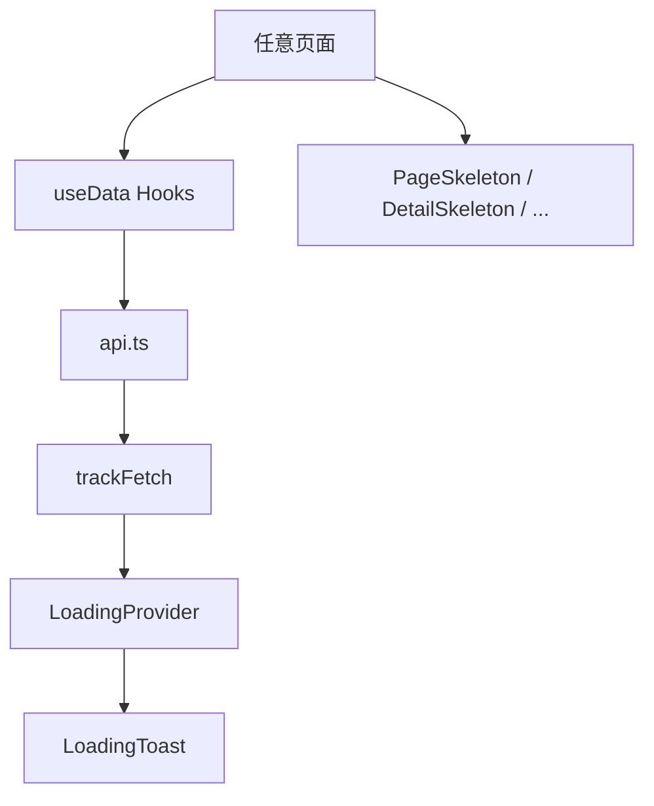

# 加载提示框与骨架屏 - 技术提案

**功能名称**: 加载提示框与骨架屏
**关联 PRD**: [[20260720-loading-indicator|加载提示框产品方案]]
**技术提案版本**: v1.0
**创建日期**: 2026-07-20
**作者**: 前端工程
**feat-branch**: `feat/loading-indicator`

## 1. 概述

### 1.1 背景

当前站点数据全部来自远端 API，但加载体验不统一：部分页面仅在失败时显示错误，部分页面使用单个 `Skeleton` 占位，详情页甚至只有一小块骨架。产品要求建立全局加载提示与全页面骨架屏，使用户在任意网络环境下都能明确感知系统状态。

### 1.2 目标

- 新增全局加载状态管理，覆盖所有 API 请求。
- 新增全局右上角加载/错误提示浮层。
- 为所有依赖 API 的页面补充与真实页面结构对应的骨架屏。
- 补充必要的 i18n key。

### 1.3 范围

**做**:
- 新增 `LoadingProvider`、`LoadingToast`、`useLoading`、`tracker`。
- 在 `api.ts` 中接入请求生命周期追踪。
- 新增/完善 `PageSkeleton`、`DetailSkeleton`、`ListSkeleton`、`SearchSkeleton` 等骨架组件。
- 为所有加载态不完整的页面替换或补充骨架屏。
- 补充 i18n 加载/错误/重试相关 key。

**不做**:
- 不修改现有 API 接口契约。
- 不修改现有缓存策略与数据模型。
- 不修改现有业务逻辑与适配器。
- 不实现非 API 加载（如图片懒加载）的全局提示。

## 2. 技术架构

### 2.1 模块划分



| 模块 | 职责 | 关键技术点 |
|------|------|-----------|
| `src/components/Loading/LoadingProvider.tsx` | 维护全局请求队列、错误队列、计数 | React Context，避免不必要的重渲染 |
| `src/components/Loading/LoadingToast.tsx` | 渲染右上角浮层 | 固定定位，加载/慢加载/错误三态 |
| `src/components/Loading/tracker.ts` | 供 API 层调用 | 单例，自动 push/pop/error |
| `src/components/Loading/useLoading.ts` | 消费 Context | 供 React 组件订阅加载状态 |
| `src/components/Loading/types.ts` | 类型定义 | `LoadingItem`、`LoadingError` |
| `src/lib/api.ts` | 所有 fetch 入口 | 通过 `trackFetch` 包装，保留原错误抛出 |
| `src/components/ui/Skeleton.tsx` | 基础骨架块 | 已有组件，复用 |
| `src/components/ui/PageSkeleton.tsx` | 通用页面骨架 | 扩展为多种变体 |
| `src/components/ui/DetailSkeleton.tsx` | 详情页骨架 | 新增 |
| `src/components/ui/ListSkeleton.tsx` | 列表页骨架 | 新增 |
| `src/components/ui/SearchSkeleton.tsx` | 搜索页骨架 | 新增 |

## 3. API 与数据

### 3.1 接口契约

复用现有接口，无新增契约。

### 3.2 请求追踪

在 `api.ts` 内部对所有 `fetch*` 函数做统一包装：

```ts
async function trackFetch<T>(
  description: string,
  fn: () => Promise<T>
): Promise<T> {
  const key = `${Date.now()}-${Math.random().toString(36).slice(2, 9)}`
  tracker.start(key, description)
  try {
    const result = await fn()
    tracker.complete(key)
    return result
  } catch (error) {
    tracker.fail(key, error instanceof Error ? error.message : String(error))
    throw error
  }
}
```

每个请求分配唯一 key，避免并发冲突。重试时通过 `retryLoading(key)` 重新执行对应请求函数。

## 4. 技术实现方案

### 4.1 全局加载状态管理

#### 4.1.1 LoadingProvider

使用 React Context 维护以下状态：

```ts
interface LoadingItem {
  key: string
  description: string
  startedAt: number
}

interface LoadingError {
  key: string
  description: string
  message: string
  timestamp: number
}

interface LoadingContextValue {
  loadingItems: LoadingItem[]
  errors: LoadingError[]
  start: (key: string, description: string) => void
  complete: (key: string) => void
  fail: (key: string, message: string) => void
  retry: (key: string) => void
}
```

为了减少重渲染，状态更新通过 `useReducer` 管理；组件消费时按需订阅（`useLoading` 仅返回必要字段）。

#### 4.1.2 慢加载检测

在 `LoadingToast` 内部使用 `useEffect` + `setInterval` 每秒检查 `loadingItems` 中最早开始的时间：

```ts
const isSlow = loadingItems.length > 0 && Date.now() - Math.min(...loadingItems.map(i => i.startedAt)) > 3000
```

慢加载提示仅在 `isSlow` 为 true 时显示，不单独修改 Context 状态。

#### 4.1.3 错误重试

`LoadingProvider` 内部维护一个 `retryHandlers` Map，key 对应请求的 key，value 为重试回调。`api.ts` 在包装请求时注册重试回调，用户点击“重试”时调用对应回调重新发起请求。

### 4.2 加载提示浮层

#### 4.2.1 位置与层级

- 固定定位：`fixed top-4 right-4 z-50`
- 最大宽度 `w-80`，最小宽度 `w-60`
- 背景使用 `bg-archive-ink/95 backdrop-blur-sm`，边框 `border-archive-border`

#### 4.2.2 三态渲染

1. **加载态**: 旋转 spinner + “正在调阅 N 份档案” + 最近请求描述。
2. **慢加载态**: 在加载态基础上追加“档案数据较大，请稍候…”。
3. **错误态**: 印章红图标 + 失败描述 + “重试”按钮。

#### 4.2.3 最小展示时间

为避免请求过快完成导致浮层一闪而过，设置最小展示时间 400ms：请求完成后延迟 400ms 移除浮层（若期间无新请求）。

### 4.3 API 层改造

在 `src/lib/api.ts` 中：

1. 引入 `src/components/Loading/tracker.ts` 中的 tracker 单例（API 层不直接使用 hook，使用暴露的 tracker 对象）。
2. 为每个 `fetch*` 函数增加 `description` 参数或根据 table/locale 生成描述。
3. 使用 `trackFetch` 包装实际请求。

示例：

```ts
export async function fetchTableAll(table: string): Promise<Record<string, any>> {
  return trackFetch(`table:${table}:all`, `正在调阅 ${table}`, () =>
    fetchJson(`${API_BASE}/table/${table}/all`)
  )
}
```

### 4.4 骨架屏体系

#### 4.4.1 基础组件扩展

- `Skeleton`：已有，复用。
- `PageSkeleton`：扩展为支持 `variant` prop，默认保留标题 + 文本行 + 卡片网格。

#### 4.4.2 新增骨架组件

- `DetailSkeleton`：
  - 顶部：头像占位（80×80 圆角）+ 标题占位（24px 宽 1/2）+ 若干行元信息占位。
  - 中部：2–3 个分栏面板占位。
- `ListSkeleton`：
  - 顶部：页面标题 + 筛选区 2–3 行占位。
  - 内容：4×N 卡片网格占位。
- `SearchSkeleton`：
  - 搜索输入框占位。
  - 结果统计行占位。
  - 6 条结果项占位（每条包含左侧图标 + 两行文本）。

#### 4.4.3 页面接入

| 页面 | 当前加载态 | 改造后 |
|------|-----------|--------|
| `OperatorList` | `PageSkeleton` | 使用 `ListSkeleton` |
| `OperatorDetail` | 单个 `Skeleton` | 使用 `DetailSkeleton` |
| `WeaponList` | `PageSkeleton` | 使用 `ListSkeleton` |
| `WeaponDetail` | 单个 `Skeleton` | 使用 `DetailSkeleton` |
| `EnemyList` | `PageSkeleton` | 使用 `ListSkeleton` |
| `EnemyDetail` | 无（依赖 `useEnemies` 但无加载态） | 使用 `DetailSkeleton` |
| `ItemList` | `PageSkeleton` | 使用 `ListSkeleton` |
| `EquipmentOverview` | 检查并补充 | 使用 `PageSkeleton` 或自定义 |
| `ProfessionOverview` | 检查并补充 | 使用 `PageSkeleton` |
| `GeographyList` | 检查并补充 | 使用 `PageSkeleton` |
| `FactoryOverview` | 检查并补充 | 使用 `PageSkeleton` |
| `StoryOverview` | 检查并补充 | 使用 `PageSkeleton` |
| `ArchiveSearch` | 无 | 使用 `SearchSkeleton` |
| `UpdateHome` | `PageSkeleton` | 保持并检查 |
| `UpdateSummary` | 检查并补充 | 使用 `PageSkeleton` |
| `UpdateTableDiff` | 检查并补充 | 使用 `PageSkeleton` |
| `RaceDetail` | 检查并补充 | 使用 `DetailSkeleton` |
| `FactionDetail` | 检查并补充 | 使用 `DetailSkeleton` |

### 4.5 i18n Key 补充

在 `src/i18n/dicts/*.json` 的 `common` 命名空间下新增：

```json
{
  "common": {
    "loading": "加载中",
    "loadingArchive": "正在调阅档案",
    "loadingSlow": "档案数据较大，请稍候…",
    "loadingRetry": "重试",
    "loadingFailed": "调阅失败",
    "loadingRequestCount": "正在调阅 {{count}} 份档案"
  }
}
```

CN 字典为源语言，其他字典同步增加英文/原文 fallback，后续运行 `generate-i18n-dicts.ts` 重新生成时可覆盖。

## 5. 数据模型

### 5.1 新增类型

在 `src/components/Loading/types.ts` 中定义：

```ts
export interface LoadingItem {
  key: string
  description: string
  startedAt: number
}

export interface LoadingError {
  key: string
  description: string
  message: string
  timestamp: number
  retry?: () => void
}
```

## 6. 项目结构

```
src/
  components/
    Loading/
      LoadingProvider.tsx
      LoadingToast.tsx
      useLoading.ts
      types.ts
    ui/
      Skeleton.tsx          # 已有
      PageSkeleton.tsx      # 扩展
      DetailSkeleton.tsx    # 新增
      ListSkeleton.tsx      # 新增
      SearchSkeleton.tsx    # 新增
  lib/
    api.ts                  # 接入 trackFetch
  i18n/
    dicts/*.json            # 补充 key
  App.tsx                   # 引入 LoadingProvider 与 LoadingToast
  pages/
    */*.tsx                 # 补充/替换骨架屏
```

## 7. 测试策略

### 7.1 单元测试

- `LoadingProvider` 的 `start/complete/fail/retry` 状态流转。
- `trackFetch` 在成功、失败、重试时的行为。
- 慢加载检测逻辑。

### 7.2 组件测试

- `LoadingToast` 在加载态、慢加载态、错误态下的渲染。
- 各骨架组件渲染后包含预期的 `data-testid="skeleton"`。

### 7.3 E2E 测试

- 进入任意列表页，确认右上角出现加载提示且页面展示骨架屏。
- 模拟网络失败，确认提示框切换为错误态，点击重试后恢复。
- 切换语言后确认多请求并发时提示显示请求数。

## 8. 验收标准

- [ ] 技术方案评审通过。
- [ ] 任意 API 请求触发后右上角 200ms 内出现加载提示。
- [ ] 多请求并发时提示显示请求数与当前描述。
- [ ] 请求失败时提示框切换为错误态并提供重试。
- [ ] 所有依赖 API 的页面加载时展示骨架屏。
- [ ] `npm run lint` 通过。
- [ ] `npm run test` 通过。
- [ ] `npm run build` 通过。

## 9. 风险与回滚

| 风险 | 影响 | 缓解措施 |
|------|------|---------|
| 全局 Context 重渲染影响性能 | 浮层/页面卡顿 | 使用 `useReducer` 与细分订阅，API 层只更新计数 |
| 骨架屏与真实页面结构不一致 | 视觉跳变 | 骨架屏按真实页面 DOM 结构绘制 |
| i18n key 遗漏导致文案显示 key | 体验下降 | CN/EN 双语言优先补充，fallback 到 key |
| 重试逻辑与缓存冲突 | 重复请求 | 重试不绕过缓存，由 `getCachedData` 决定 |

回滚策略：本次改动为纯前端体验增强，若出现严重问题，可直接回滚到上一 commit，不影响已有模块数据。

## 10. 相关文档

- [[20260720-loading-indicator|加载提示框产品方案]]
- [工程架构规范](../engineering-spec.md)
- [前端开发规范](../frontend-spec.md)
- [国际化规范](../references/i18n-spec.md)
- [UI 常见陷阱参考](../references/ui-pitfalls.md)
