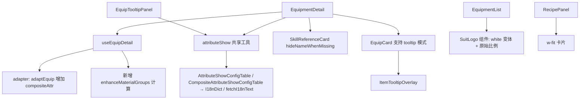

# 装备图鉴验收修复 - 技术提案

**功能名称**: 装备图鉴验收修复
**关联 PRD**: [[20260721-equipment-archive|装备图鉴产品方案]]（v1.1 修订记录）
**技术提案版本**: v1.0
**创建日期**: 2026-07-21
**作者**: 前端工程
**feat-branch**: `feat/equipment-archive-acceptance`（base: `feat/equipment-archive`，含 PR #18 实现代码）

## 1. 概述

### 1.1 背景

装备图鉴实现（PR #18）合入后，产品首轮验收提出 7 项问题。本方案逐项给出经**实测验证**的根因与修复设计。验收基线代码：`feat/equipment-archive`（merge commit `9353f5a`）。

### 1.2 验收问题清单与根因结论

| # | 验收问题 | 根因（已实测验证） |
|---|---------|-------------------|
| 1 | 附加属性出现「属性0」占位 | 该词条为**组合属性**：`displayAttrModifiers[2]` 的 `attrType=0`、`compositeAttr="AllSkillDamageIncrease"`。当前 `useAttrMap`（`EquipmentDetail.tsx:45-75`）仅按数字 `attrType` 查 `AttributeShowConfigTable`，key `"0"` 返回 `null`，落入硬编码兜底 `属性${k}` |
| 2 | 套装效果名显示为 `passive_equipsuit_atk_02` | 经全量核实：**全部 23 个套装技能**在 `SkillPatchTable` 中 `skillName.id = 0`，即游戏内未命名。`SkillReferenceCard.tsx:137` 的兜底链 `skillName \|\| skillGroupName \|\| skillId` 将 skillId 直接渲染 |
| 3 | 卷宗页点击其他装备跳详情页 | 套组装备与精锻材料均使用 `EquipCard`（`EquipCard.tsx:26` 的 `<Link>` 跳转） |
| 4 | 精锻材料未按属性词条分组 | 当前过滤逻辑（`useData.ts:639-642`）仅按「同部位 + 金色品质」平铺，未按目标装备可精锻词条与材料词条匹配分组 |
| 5 | 精锻材料未展示词条数值、未按数值排序 | 同上，材料卡片为纯 `EquipCard`，无数值信息；排序为稀有度/穿戴等级 |
| 6 | 配方卡片横向撑满 | `RecipePanel.tsx:16-18` 容器为块级 `space-y-3`，卡片无宽度限制，默认 `w-full` |
| 7 | 分组徽记为 256×148 透明图、设计不合理 | 套组徽记原图即 256×148 宽幅透明字标（如「宏山 HONGSHAN SWORDMANCERS」），被压入 `w-5 h-5`（列表）/`w-6 h-6`（详情）方形框后不可辨识；且当前使用的 `equipmentlogobig` 为**黑色**变体，在深色主题（`#0F0F12`）上几乎不可见 |

### 1.3 范围

**做**：上表 7 项修复 + 属性显示链路抽取为共享工具（装备模块内去重）。
**不做**：干员/敌人/Diff 模块中同款属性解析链路的迁移（见 4.1.4，列为后续跟进）；不做游戏内精锻模拟等增强。

## 2. 数据调研结论（已实测）

### 2.1 属性显示链路：AttributeShowConfig → I18n

以 `item_equip_t4_suit_atk02_edc_05` 为例，`displayAttrModifiers`：

```json
[
  { "attrIndex": 1, "attrType": 41, "attrValue": 32,    "compositeAttr": "",                      "modifierType": 5, "enhancedAttrValues": [35, 38, 41] },
  { "attrIndex": 2, "attrType": 39, "attrValue": 21,    "compositeAttr": "",                      "modifierType": 5, "enhancedAttrValues": [23, 25, 27] },
  { "attrIndex": 3, "attrType": 0,  "attrValue": 0.276, "compositeAttr": "AllSkillDamageIncrease", "modifierType": 5, "enhancedAttrValues": [0.3036, 0.3312, 0.3588] }
]
```

名称解析分两类，均为 **API:ShowConfig → API:I18n** 两段链路：

| 词条类型 | 配置表 | 查找键 | 实测结果 |
|---------|--------|--------|---------|
| 普通属性（`compositeAttr` 为空） | `AttributeShowConfigTable` | `attrType`（数字） | `41 → 智识`、`39 → 力量` |
| 组合属性（`compositeAttr` 非空） | `CompositeAttributeShowConfigTable` | `compositeAttr`（字符串） | `AllSkillDamageIncrease → 所有技能伤害加成`，`showPercent=true`、`valueFormat="{value:0.0%}"` |

补充规则：

- 每个配置项的 `list[]` 含多个条目，需按 `attributeModifier === 装备词条 modifierType` 选取（装备词条均为 `modifierType=5`），取不到时回退 `list[0]`。
- `list[].name.id` → i18n 字典（`fetchTableDictAll('AttributeShowConfigTable' | 'CompositeAttributeShowConfigTable', locale)`），字典缺失时回退 `fetchI18nText(locale, id)`（与 `SkillReferenceCard` 现有回退一致）。
- `CompositeAttributeTable` 定义组合属性的构成（如 `AllSkillDamageIncrease` 由 attrType 32/28/33 复合而成，见该装备 `equipAttrModifiers`），**展示层不需要**，仅备查。
- `AttributeFilterTable.equipExtraAttr` 为游戏内装备词条筛选列表（含 `Main`/`Sub` 分类与全部组合属性），可作为词条排序的参考，不强制对齐。

**禁止项**：移除 `AttributeMetaTable.iconName` 去前缀的英文回退与硬编码 `属性${k}` 兜底；所有属性名必须来自 ShowConfig → I18n，均解析失败时展示通用兜底文案（i18n key，见 4.6），不得出现「属性0」。

### 2.2 套装技能名称

全量遍历 `EquipSuitTable` 23 个 `skillID`（`passive_equipsuit_*`），`SkillPatchDataBundle[*].skillName.id` **全部为 0**——游戏内套装效果即未命名。产品决策：隐藏名称，不回退展示 skillId。「N件套」标签（`equipment.suitPieces`）已提供上下文。

### 2.3 精锻材料与词条匹配

- 目标装备可精锻词条 = `displayAttrModifiers` 中 `enhancedAttrValues` 非空的条目（实测该装备 3 条均可精锻：智识、力量、所有技能伤害加成，与验收示例一致）。
- 词条匹配键：`attrKey = compositeAttr || String(attrType)`。实测同部位金装词条组合各不相同（如 `atk02_edc_01` 为 {39, 42, 50}、`atb01_edc_01` 为 {39, 40, 33}），验证按词条分组有实际区分度。
- 注意：`atb01_edc_01` 的普通词条 `attrType=33` 与目标装备组合属性 `AllSkillDamageIncrease` 的构成子属性 33 **不是同一展示词条**——匹配必须按展示层 `attrKey`（compositeAttr 优先），禁止按构成子属性匹配。
- 材料卡片数值 = 材料装备自身 `displayAttrModifiers` 中同 `attrKey` 词条的 `attrValue`，按 ShowConfig 的 `valueFormat`/`showPercent` 格式化；组内按数值降序。

### 2.4 套组徽记资源

实测下载比对（`icon_pack_wuling_suit_atk02`）：

| 资源目录 | 尺寸 | 内容 | 深色主题可用性 |
|---------|------|------|---------------|
| `equipmentlogobig/{logo}.png` | 256×148 | 黑色字标徽记，透明底 | 差（黑标在深底上不可见） |
| `equipmentlogobigwhite/{logo}.png` | 256×148 | **白色**变体，透明底 | 好（深色主题专用） |
| `equipmentlogo/` | — | 仅 11 个通用图标，无按套组资源 | 不可用 |

设计决策：列表分组标题与卷宗套装区统一改用 `equipmentlogobigwhite` 变体，按原始宽高比展示（`h-7 w-auto` 级别），不再压入方形框。

## 3. 技术架构



## 4. 技术实现方案

### 4.1 问题 1：属性名称链路修复 + 共享工具抽取

#### 4.1.1 类型与 adapter

`src/lib/types.ts` 的 `EquipAttr` 增加 `compositeAttr: string`；`adaptEquip`（`adapter.ts:115-149`）在 `baseAttr`/`attrs` 映射时透传 `a.compositeAttr ?? ''`。

#### 4.1.2 共享工具 `getAttributeShowMap`

新增 `src/lib/attributeShow.ts`（纯数据层，与 `useData.ts` 中的缓存惯例一致）：

```ts
export interface AttrShowInfo {
  name: string
  valueFormat: string
  showPercent: boolean
}

// key: attrKey（compositeAttr 或 String(attrType)）
export async function getAttributeShowMap(locale: string): Promise<Record<string, AttrShowInfo>>
```

实现要点：

1. 并行加载 `AttributeShowConfigTable`、`CompositeAttributeShowConfigTable` 及两张表的 `I18nDict_{locale}_*`（`getCachedData` + `fetchTableAll`/`fetchTableDictAll`，缓存键沿用现有惯例）。
2. 普通表以数字 key、组合表以字符串 key 合并为一个 map；同 key 时组合表优先（`attrKey` 生成侧已保证不冲突）。
3. 每个 entry 存 `list[]`（保留 `attributeModifier`），解析时按 `modifierType` 匹配条目，取不到回退 `list[0]`；`name.id` → dict，缺失回退 `fetchI18nText(locale, id)`；再失败回退 `t('common.unknownAttr')`（新增 i18n key）。
4. 对外接口：`resolveAttrShow(map, attr: EquipAttr): AttrShowInfo`（内部完成 `attrKey` 生成与 modifierType 匹配）。

#### 4.1.3 消费方改造

- `EquipmentDetail.tsx`：删除本地 `useAttrMap`（L45-75）与 `属性${k}` 兜底；`AttrRow` 改按 `resolveAttrShow` 解析。百分比词条（如所有技能伤害加成 0.276）经 `valueFormat="{value:0.0%}"` 正确展示为 `27.6%`。
- `EquipTooltipPanel.tsx`：删除内联的同款实现（L70-90），改用共享工具。

#### 4.1.4 已知债（不在本次范围）

`useData.ts` 的 `getAttributeMap`（干员）、`getEnemyAttrNameMap`（敌人）与 DiffViewer 三处存在同链路复制，且同样缺组合属性支持。本次仅交付共享工具并迁移装备模块；其余模块迁移列入 `docs/engineering/references/data-pitfalls.md` 跟进项，避免扩大改动面。

### 4.2 问题 2：套装技能名称隐藏

`SkillReferenceCard.tsx` 新增可选 prop `hideNameWhenMissing?: boolean`（默认 `false`，不影响武器等现有调用方）：

- L137 名称渲染处：`hideNameWhenMissing && !current.skillName` 时不渲染名称 `<span>`（含 skillId 兜底）；iconId 为空本就不渲染图标，此时头部仅剩右侧等级徽标，布局自然成立。
- `EquipmentDetail.tsx` 套装技能处（L197-200）传入 `hideNameWhenMissing`。

### 4.3 问题 3：卷宗内装备点击弹 ItemTooltip

`EquipCard.tsx` 改造为双模式（保持列表页跳转行为不变）：

```ts
interface EquipCardProps {
  equip: Equip
  interactive?: 'link' | 'tooltip'   // 默认 'link'
}
```

- `tooltip` 模式：渲染 `<button>` + 本地 `useState` 控制 `<ItemTooltipOverlay itemId={equip.id} onClose={...} />`（模式照搬 `ItemPanel.tsx:94-114`）。
- `EquipmentDetail.tsx` 套组装备（L205-207）与精锻材料（L224-228）均传 `interactive="tooltip"`；`EquipmentList.tsx` 保持默认 `link`。
- 弹层内「查看卷宗」入口由 `EquipTooltipPanel` 现有 `<Link>` 提供（`onNavigate` 关闭弹层），闭环不变。

### 4.4 问题 4+5：精锻材料按词条分组与数值排序

#### 4.4.1 数据层（`useData.ts` `useEquipDetail`）

新增类型（`src/lib/types.ts`）：

```ts
export interface EnhanceMaterialItem {
  equip: Equip
  attrValue: number      // 材料同词条的 attrValue（排序与展示用）
}

export interface EnhanceMaterialGroup {
  attrKey: string        // compositeAttr || String(attrType)
  modifierType: number   // 供 resolveAttrShow 匹配 list 条目
  materials: EnhanceMaterialItem[]  // 按 attrValue 降序
}
```

`EquipDetail.enhanceMaterials: Equip[]` 替换为 `enhanceMaterialGroups: EnhanceMaterialGroup[]`（无其他消费方，直接替换）：

1. 目标可精锻词条 = `equip.attrs.filter(a => a.enhancedValues.length > 0)`，保持原顺序分组。
2. 候选池 = 同 `partType`、`rarity >= EquipConst.enhanceEquipRarity`、排除自身（沿用现有过滤）。
3. 每组材料 = 候选池中 `attrs` 含同 `attrKey` 者，`attrValue` 取该词条值，按降序排序；同值按稀有度/穿戴等级降序 tie-break。

#### 4.4.2 展示层（`EquipmentDetail.tsx`）

- 每组：组标题 = `resolveAttrShow` 解析的词条名（+ 词条格式化数值风格与属性区一致）；组内 `EquipCard interactive="tooltip"` 网格，卡片下方追加一行该材料词条数值（经 `formatAttributeShow` 格式化）。
- 空组：展示 `equipment.noEnhanceMaterialForAttr`（新增 key）；全部组为空时展示现有 `equipment.noEnhanceMaterial`。
- `enhanceCost` 通用消耗展示保持不变。

### 4.5 问题 6：RecipePanel 卡片 fit-content

`RecipePanel.tsx`：容器 `space-y-3` 改为 `flex flex-wrap items-start gap-3`；卡片（L18）加 `w-fit max-w-full`。多链路配方横向排列、窄内容不再撑满整行；`max-w-full` 保证移动端不溢出。组件测试同步补充宽度 class 断言。

### 4.6 问题 7：套组徽记重新设计

新增 `src/components/Equipment/SuitLogo.tsx`：

```tsx

```

- 统一替换 `EquipmentList.tsx:168-175`（原 `w-5 h-5`）与 `EquipmentDetail.tsx:184-191`（原 `w-6 h-6`）。
- 白色变体适配深色主题；`h-7 w-auto` 保持 256×148 原始宽高比；`onError` 回退隐藏（沿用现有习惯），徽记缺失时仅展示套组名。

### 4.7 i18n

新增 key（`scripts/i18n-custom.json`，14 语言全量，流程同既有规范）：

| key | CN 文案 |
|-----|---------|
| `common.unknownAttr` | 未知属性 |
| `equipment.noEnhanceMaterialForAttr` | 暂无适配该词条的精锻材料 |

> 实现 plan 阶段需补齐全部 14 语言——优先经游戏数据 API 检索官方文案，无结果才自译，并运行 `node scripts/verify-i18n.ts` 校验。

## 5. 项目结构

```
src/
  lib/
    attributeShow.ts            # 新增：属性显示共享工具
    types.ts                    # EquipAttr.compositeAttr、EnhanceMaterialGroup
    adapter.ts                  # adaptEquip 透传 compositeAttr
  hooks/useData.ts              # useEquipDetail: enhanceMaterialGroups
  components/
    Equipment/
      EquipCard.tsx             # interactive 双模式
      SuitLogo.tsx              # 新增：白色变体徽记
      EquipTooltipPanel.tsx     # 改用共享工具
    skills/SkillReferenceCard.tsx  # hideNameWhenMissing
    Craft/RecipePanel.tsx       # fit-content 布局
  pages/equipment/
    EquipmentDetail.tsx         # 属性链路/技能名/词条分组/tooltip 点击
    EquipmentList.tsx           # SuitLogo 替换
scripts/i18n-custom.json        # +2 key（14 语言）
```

## 6. 实现计划

1. 数据层：`EquipAttr.compositeAttr` + `attributeShow.ts` + `useEquipDetail` 词条分组。
2. 属性链路修复（详情页 + Tooltip 迁共享工具）。
3. `SkillReferenceCard` 名称隐藏 + `EquipCard` tooltip 模式接入详情页。
4. `RecipePanel` fit-content + `SuitLogo` 替换。
5. i18n 14 语言 + 字典生成。
6. 单测/E2E 更新 + `lint / test / build` 全量验证。

## 7. 测试策略

### 7.1 单元测试

- `attributeShow`：普通属性（attrType 41 → 智识）、组合属性（AllSkillDamageIncrease → 所有技能伤害加成 + `{value:0.0%}` 格式化 0.276 → 27.6%）、modifierType 条目匹配与回退、i18n 缺失兜底。
- `adaptEquip`：`compositeAttr` 透传。
- 精锻分组：分组键正确（compositeAttr 优先）、不匹配子属性（atb01_edc_01 的 33 不归入 AllSkillDamageIncrease 组）、数值降序、空组。

### 7.2 组件测试

- `SkillReferenceCard`：`hideNameWhenMissing` 且 skillName 缺失时不渲染名称与 skillId。
- `EquipCard`：tooltip 模式点击弹出 `ItemTooltipOverlay`。
- `RecipePanel`：卡片 `w-fit` class 断言。

### 7.3 E2E（tests/e2e/src/equipment.spec.ts 增补）

- `item_equip_t4_suit_atk02_edc_05` 卷宗：断言出现「所有技能伤害加成」且不出现「属性0」；套装区不出现 `passive_equipsuit_` 文本。
- 精锻材料区：出现「智识」「力量」「所有技能伤害加成」三个分组标题；组内首个材料数值 ≥ 后续材料。
- 点击套组内装备弹出 Tooltip（含「查看卷宗」），URL 不变化。
- 列表分组徽记 `src` 含 `equipmentlogobigwhite`。

## 8. 验收标准

- [ ] 任意装备卷宗属性区无「属性N」占位，组合属性名称与百分比格式正确。
- [ ] 套装效果无名称时不展示名称与 skillId。
- [ ] 卷宗内点击装备（套组/精锻材料）弹出 ItemTooltip，不直接跳转。
- [ ] 精锻材料按可精锻词条分组，展示材料词条数值且降序。
- [ ] 配方卡片 fit-content。
- [ ] 分组徽记使用白色变体、原始宽高比，深色背景下清晰可辨。
- [ ] 新增 i18n key 14 语言全量，无占位语言。
- [ ] `npm run lint`、`npm run test`、`npm run build` 通过。

## 9. 风险与回滚

| 风险 | 影响 | 缓解措施 |
|------|------|---------|
| `CompositeAttributeShowConfigTable` i18n 字典覆盖不全 | 组合属性名缺失 | `fetchI18nText` 全局回退 + 通用兜底文案；E2E 断言关键词条 |
| 个别装备词条 `modifierType ≠ 5` | 选错 list 条目 | 按 modifierType 匹配、回退 `list[0]`；单测覆盖 |
| `EquipDetail.enhanceMaterials` 签名变更 | 编译期即可发现 | 仅 `EquipmentDetail` 一个消费方，TypeScript 全量检查兜底 |
| 白色徽记个别缺失 | 分组标题缺图 | `onError` 隐藏回退，仅展示套组名 |

回滚策略：全部为增量修改，可整体回滚至 `feat/equipment-archive` 当前 HEAD，不影响其他模块。

## 10. 相关文档

- [[20260721-equipment-archive|装备图鉴产品方案（docs/product/draft，v1.1）]]
- [装备图鉴技术方案 v1.0](./20260721-equipment-archive.md)
- [数据表映射参考](../references/data-mapping-tables.md)
- [数据层常见陷阱](../references/data-pitfalls.md)
- [国际化规范](../references/i18n-spec.md)
