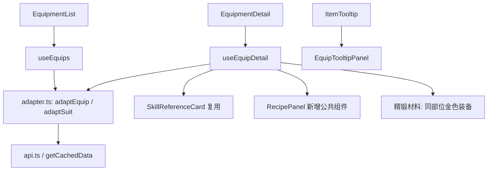
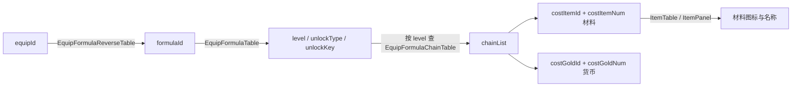

# 装备图鉴 - 技术提案

**功能名称**: 装备图鉴
**关联 PRD**: [[20260721-equipment-archive|装备图鉴产品方案]]
**技术提案版本**: v1.0
**创建日期**: 2026-07-21
**作者**: 前端工程
**feat-branch**: `feat/equipment-archive`

## 1. 概述

### 1.1 背景

`/archive/equipment` 当前为占位页（`src/pages/equipment/EquipmentOverview.tsx`，module code `HSA-EQP`）。数据层已有半成品：`useEquips()`/`useSuits()`/`useGems()`（`src/hooks/useData.ts`）与 `Equip`/`Suit`/`Gem` 类型（`src/lib/types.ts`），但 `adaptEquip` 未做 i18n 解析且字段缺失，`adaptSuit` 的字段假设（`twoPieceEffect`/`fourPieceEffect`）与真实表结构不符，均无任何页面使用。本次需求实现装备列表页与卷宗页，并扩展 `ItemTooltip` 支持装备类物品。

### 1.2 目标

- 装备列表页：默认按套组分组，支持搜索、部位/稀有度筛选、排序、分组独立分页。
- 装备卷宗页：基础信息、属性（含精锻强化值）、套装技能（复用 `SkillReferenceCard`）、精锻材料（同部位金色装备）、制作配方。
- 配方展示抽取为公共组件。
- `ItemTooltip` 新增 `ITEM_TYPE.Equip (= 6)` 分支。

### 1.3 范围

**做**:
- 新增 `EquipmentList` / `EquipmentDetail` 页面与 `equipment/:id` 路由，替换占位页。
- 重写 `adaptEquip` / `adaptSuit`，新增 `adaptEquipFormula`；改造 `useEquips` 并新增 `useEquip`、`useEquipDetail`。
- 新增公共组件 `RecipePanel`（配方材料清单）。
- `ItemTooltip` 新增装备分支（`EquipTooltipPanel`）。
- 新增 `equipment.*` i18n namespace（14 语言）。
- 更新 `Breadcrumb`、adapter 单测、E2E。

**不做**:
- 不做宝石（GemTable）镶嵌相关展示（后续独立需求）。
- 不做装备对比、配装模拟器等增强功能。
- 不修改缓存策略与 API 层契约。
- 不做工厂（Factory）配方的通用接入，仅交付 `RecipePanel` 公共组件。

## 2. 技术架构

### 2.1 模块划分



| 模块 | 职责 | 说明 |
|------|------|------|
| `src/pages/equipment/EquipmentList.tsx` | 列表页 | 状态机模式照搬 `WeaponList`（`useState` + `useMemo` 链：filtered → sorted → groups） |
| `src/pages/equipment/EquipmentDetail.tsx` | 卷宗页 | 布局照搬 `WeaponDetail` 分节模式 |
| `src/components/Equipment/EquipCard.tsx` | 列表卡片 | `<Link>` + 图标 + 稀有度色条 + 名称 + 部位 |
| `src/components/Equipment/EquipTooltipPanel.tsx` | Tooltip 装备摘要 | 供 `ItemTooltip` 装备分支渲染 |
| `src/components/Craft/RecipePanel.tsx` | 配方公共组件 | props: `recipes: RecipeEntry[]`，材料用 `ItemPanel` 横排（先例：OperatorDetail 材料列表） |
| `src/hooks/useData.ts` | 数据 hooks | 改造 `useEquips`、新增 `useEquipDetail` |
| `src/lib/adapter.ts` | 适配器 | 重写 `adaptEquip`/`adaptSuit`，新增 `adaptEquipFormula` |
| `src/components/Items/ItemTooltip.tsx` | 物品弹层 | 新增 `type === ITEM_TYPE.Equip` 分支 |

## 3. 数据与接口

### 3.1 数据表映射（已实测确认）

数据均来自 `https://endfield-assets.fffdan.com`，复用现有 `fetchTableAll` / `fetchTableDictAll` / `getCachedData`，无新增接口契约。

| 表 | 用途 | 关键字段 |
|----|------|---------|
| `EquipTable` | 装备本体（243 件） | `itemId`、`partType`（0=护甲/1=护手/2=配件，已按 key 中 `body/hand/edc` 验证）、`suitID`（200 件有套组，43 件散件为空）、`minWearLv`、`displayBaseAttrModifier`、`displayAttrModifiers[]`、`domainId` |
| `ItemTable` | 装备的名称/描述/图标/稀有度 | 装备 `type = 6`（`ITEM_TYPE.Equip`）；`name`、`desc`、`decoDesc`、`iconId`、`rarity`、`obtainWayIds` |
| `EquipSuitTable` | 套组（23 个） | `equipList[]`（套组内全部装备 id）、`list[]`：`equipCnt`（激活件数，如 3）、`skillID`（如 `passive_equipsuit_combosuit_01`）、`skillLv`、`suitLogoName`、`suitName`（i18n ref） |
| `SkillPatchTable` | 套装技能 | `skillID` 已确认存在，`SkillPatchDataBundle[]` 含 `blackboard`、`description`、`level` —— 与 `SkillReferenceCard` 数据契约完全一致 |
| `EquipFormulaReverseTable` | 装备 id → 配方 id | value 为 `formulaId` 字符串（如 `item_formu_t4_suit_atb01_edc_01`） |
| `EquipFormulaTable` | 配方 | `formulaId`、`level`（链路档位，如 `T4.3`）、`outcomeEquipId`、`packId`、`unlockType`/`unlockKey`/`unlockValue` |
| `EquipFormulaChainTable` | 配方材料链 | key 为 `level`（T0/T1/.../T4.3 等 11 档）；`chainList[]`：`chainId`、`costItemId[]` + `costItemNum[]`（材料）、`costGoldId` + `costGoldNum`（货币）、`isDefault`、`cnDiscount` |
| `EquipCostMaterialTable` | 配方材料（工艺书）补充信息 | `scriptName`（i18n ref）、`availableScript`、`unlockScriptMission` |
| `EquipConst` | 精锻常量 | `enhanceEquipRarity = 5`（仅金色品质可作材料）、`maxAttrEnhanceLevel = 3`、`maxEnhanceIngredientCount = 25` |
| `EquipEnhanceCostTable` | 精锻通用消耗 | 按 `domainId`：`consumeItemId` + `consumeItemCnt` |
| `EquipEnhanceGuaranteeTimesRuleTable` | 精锻保底规则 | `displayAttrModifiers[].enhanceGuaranteeTimesRuleId` 引用（`DoubleAttrPity` 等） |

### 3.2 属性结构（EquipTable.displayAttrModifiers）

```json
{
  "attrIndex": 1,
  "attrType": 39,
  "attrValue": 32,
  "enhanceGuaranteeTimesRuleId": "DoubleAttrPity",
  "enhancedAttrValues": [35, 38, 41],
  "modifierType": 5
}
```

- `attrType` → 属性名：通过 `AttributeMetaTable` 解析（与现有属性展示一致，实现时验证 `formatAttributeShow` 是否可复用）。
- `attrValue` 为基础值，`enhancedAttrValues` 为精锻 1~3 阶强化值（空数组表示不可强化）。
- 主属性在 `displayBaseAttrModifier`。

### 3.3 配方数据链路



- 一个 `level` 可能有多条 `chainList`（如 T4 有 4 条，分别消耗不同工艺书），卷宗页全部列出，`isDefault` 的链路排在首位。
- `unlockType` 非 0 时展示解锁条件（`unlockKey` 为奖励/任务 id，实现时确认 i18n 文案来源；无法解析时展示通用「有解锁条件」提示）。

### 3.4 图标资源

| 资源 | URL 规则 | 验证状态 |
|------|---------|---------|
| 装备图标 | `{ASSET_BASE}/.../itemicon/{iconId}.png`（`ItemIcon` 现有逻辑直接适用） | 已确认存在 |
| 套组徽记 | `equipmentlogobig/{suitLogoName}.png` | 已确认存在（另有 `equipmentlogobigwhite` 变体） |
| 套装技能图标 | `SkillPatchTable.iconId`，空时按 `SkillReferenceCard` 现有回退 | 已确认 |

### 3.5 i18n 数据

- 装备名称/描述：`getTableI18nDict('ItemTable', locale)`（现有缓存惯例 `I18nDict_${locale}_${table}`）。
- 套组名称：`getTableI18nDict('EquipSuitTable', locale)`，已验证 dict 中含 `suitName` id 映射。
- 套装技能文本：`SkillReferenceCard` 内部已处理（dict + `fetchI18nText` 全局回退）。

## 4. 技术实现方案

### 4.1 路由与导航

`src/App.tsx` 替换占位并新增详情路由：

```tsx
<Route path="equipment" element={<EquipmentList />} />
<Route path="equipment/:id" element={<EquipmentDetail />} />
```

- 侧边栏导航已存在（`Sidebar.tsx` `nav.material` 分组），无需改动。
- 按 UI 陷阱规范更新 `Breadcrumb.tsx` 的装备路由映射。

### 4.2 数据层

#### 4.2.1 类型（`src/lib/types.ts`）

```ts
export interface EquipAttr {
  attrType: number
  value: number
  enhancedValues: number[]
  modifierType: number
}

export interface Equip {
  id: string
  name: string
  description: string
  decoDesc: string
  iconId: string
  rarity: number
  partType: number        // 0=护甲 1=护手 2=配件
  suitId: string
  minWearLv: number
  baseAttr: EquipAttr
  attrs: EquipAttr[]
  obtainWayIds: string[]
}

export interface Suit {
  id: string
  name: string
  logoName: string
  equipIds: string[]
  effects: { equipCnt: number; skillId: string; skillLv: number }[]
}

export interface RecipeMaterial { itemId: string; count: number }

export interface EquipFormula {
  formulaId: string
  level: string
  isDefault: boolean
  materials: RecipeMaterial[]
  goldId: string
  goldCount: number
  unlockType: number
  unlockKey: string
}
```

原 `Suit.twoPieceEffect/fourPieceEffect` 与真实表结构不符，直接替换（无页面引用，无兼容负担）。未被引用的 `Recipe` 死代码接口随本次清理。

#### 4.2.2 Hooks（`src/hooks/useData.ts`）

```ts
useEquips(): UseDataResult<{ equips: Equip[]; suits: Suit[] }>
useEquipDetail(id): UseDataResult<{
  equip: Equip
  suit?: Suit
  suitEquips: Equip[]
  enhanceMaterials: Equip[]   // 同 partType 且 rarity >= 5，排除自身
  formulas: EquipFormula[]
}>
```

- `useEquips` 并行拉取 `EquipTable` + `EquipSuitTable` + 两张表的 i18n dict（`Promise.all`，照搬 `useWeapons` 模式），按 locale 依赖重取。
- 精锻材料过滤在 hook 内完成：`partType` 相同、`rarity >= EquipConst.enhanceEquipRarity`（读取 `EquipConst` 表并缓存）、排除自身，按稀有度/穿戴等级排序。
- 配方：`EquipFormulaReverseTable[equipId]` → `EquipFormulaTable[formulaId]` → `EquipFormulaChainTable[formula.level].chainList`，展开为 `EquipFormula[]`（每 chain 一条，`isDefault` 优先排序）。三张小表均走 `getCachedData` 整表缓存。
- 现有半成品 `useEquips()`/`useSuits()`/`useGems()` 无页面引用，`useEquips` 被本方案替换签名；`useGems` 保留不动。

### 4.3 列表页（EquipmentList）

照搬 `WeaponList` 状态机：`search / partFilter / rarityFilter / sortField / sortDesc / pageSize / page / groupPageMap`；`useMemo` 链 `filtered → sorted → groups`。

- 默认按套组分组：`suitId → Suit`，组头展示套组徽记 + 名称 + `t('common.countPiece', { count })`；无套组装备归入「散件」组（`equipment.looseGroup`），排最后。
- 卡片 `EquipCard`：图标（`itemicon`）+ 稀有度色条 + 名称 + 部位标签；网格 `grid-cols-2 sm:grid-cols-4 gap-2`。
- 加载态 `ListSkeleton`，错误态 `t('common.loadFailed')`。

### 4.4 卷宗页（EquipmentDetail）

分节结构（参照 `WeaponDetail` + `OperatorDetail`）：

1. 返回链接 + 头部：图标、名称、`Badge`（`HSA-EQP`）、部位、稀有度、`minWearLv`。
2. 描述区：`desc` / `decoDesc` 富文本。
3. 属性区：主属性 + 副属性列表；每条副属性展示基础值与 `enhancedValues` 各阶强化值。
4. 套装区（有套组时）：徽记 + 名称 + `effects` 逐条渲染 `<SkillReferenceCard skillId={effect.skillId} defaultLevel={effect.skillLv} />`（不加等级滑块）；套组内 `suitEquips` 以 `EquipCard` 横排，可跳转。
5. 精锻材料区：`enhanceMaterials` 卡片横排 + 消耗说明（`EquipEnhanceCostTable` 的通用消耗项，用 `ItemPanel` 展示）；空态 `equipment.noEnhanceMaterial`。
6. 配方区：`<RecipePanel recipes={formulas} />`。

### 4.5 配方公共组件（RecipePanel）

```
src/components/Craft/RecipePanel.tsx
props: { recipes: EquipFormula[]; className?: string }
```

- 每条 recipe 一个面板：材料 `ItemPanel itemId amount showName={false} iconClassName="w-8 h-8"` 横排 + 货币行 + 解锁条件文案。
- 多链路时以 `isDefault` 链路置顶，其余追加展示。
- 放 `components/Craft/` 新目录，后续工厂模块复用。

### 4.6 ItemTooltip 装备分支

`src/components/Items/ItemTooltip.tsx` 仿照 Weapon 分支（`Number(itemData.type) === ITEM_TYPE.Weapon` → `WeaponSkillPanel`）新增：

```tsx
{Number(itemData.type) === ITEM_TYPE.Equip && <EquipTooltipPanel itemId={itemId} />}
```

- `EquipTooltipPanel`：部位、稀有度、主/副属性摘要、套组名、「查看卷宗」`<Link to={/archive/equipment/${itemId}}>`。
- `ItemPanel` 本体无需修改（通用字段均来自 `ItemTable`）。

### 4.7 i18n

新增 `equipment.*` namespace（`scripts/i18n-custom.json`，14 语言全量）：

| key | CN 文案 |
|-----|---------|
| `equipment.title` | 装备 |
| `equipment.looseGroup` | 散件 |
| `equipment.partBody` | 护甲（游戏内文案：`LUA_WIKI_FILTER_NAME_EQUIP_PART_BODY`，id `3271101874505039058`，CN 护甲 / EN Armor / JP 胴） |
| `equipment.partHand` | 护手（游戏内文案：`LUA_WIKI_FILTER_NAME_EQUIP_PART_HAND`，id `-2876534819549155162`，CN 护手 / EN Gloves） |
| `equipment.partEdc` | 配件（游戏内文案：`LUA_WIKI_FILTER_NAME_EQUIP_PART_EDC`，id `4837227339768148713`，CN 配件 / EN Kit / JP アクセサリー） |
| `equipment.wearLevel` | 穿戴等级 |
| `equipment.baseAttr` / `equipment.subAttrs` | 主属性 / 副属性 |
| `equipment.enhancedValue` | 精锻强化 |
| `equipment.suitSection` | 套装 |
| `equipment.suitPieces` | 集齐 {{count}} 件激活 |
| `equipment.enhanceMaterials` | 精锻材料 |
| `equipment.enhanceMaterialsHint` | 消耗同部位金色品质装备进行精锻 |
| `equipment.noEnhanceMaterial` | 暂无可用的精锻材料 |
| `equipment.recipes` | 制作配方 |
| `equipment.recipeDefault` | 默认链路 |
| `equipment.recipeUnlock` | 解锁条件 |
| `equipment.viewDetail` | 查看卷宗 |

流程：改 `i18n-custom.json` → `node scripts/generate-i18n-dicts.ts` → `npm run lint && npm run test && npm run build`。

> **注意**：上表仅列出 CN 文案（部位名称为游戏内原文，已附可查证的 i18n id）。产出实现 plan 时，必须为每个 key 补齐全部 14 种语言（CN/TC/EN/JP/KR/RU/MX/BR/DE/FR/VN/TH/ID/IT）的本土翻译——不允许使用任何语言占位、不允许留空、不允许直接复制中文，并运行 `node scripts/verify-i18n.ts` 校验。详见 [国际化规范](../references/i18n-spec.md)。

## 5. 项目结构

```
src/
  pages/equipment/
    EquipmentList.tsx        # 新增（替换 EquipmentOverview 占位）
    EquipmentDetail.tsx      # 新增
  components/
    Equipment/
      EquipCard.tsx          # 新增
      EquipTooltipPanel.tsx  # 新增
    Craft/
      RecipePanel.tsx        # 新增公共组件
    Items/ItemTooltip.tsx    # 新增 Equip 分支
  hooks/useData.ts           # useEquips 改造 + useEquipDetail
  lib/
    types.ts                 # Equip/Suit 重写 + EquipFormula
    adapter.ts               # adaptEquip/adaptSuit 重写 + adaptEquipFormula
    adapter.test.ts          # 新增适配器单测
  App.tsx                    # 路由
  components/Layout/Breadcrumb.tsx  # 装备路由映射
scripts/i18n-custom.json     # equipment.* namespace
tests/e2e/src/equipment.spec.ts     # 新增 E2E
```

## 6. 实现计划

1. 数据层：类型 + adapter + hooks（含精锻材料与配方链路）。
2. 列表页 + 路由 + 面包屑。
3. 卷宗页（属性 / 套装技能 / 精锻材料 / 配方）。
4. `RecipePanel` 公共组件 + `ItemTooltip` 装备分支。
5. i18n 14 语言 + 字典生成。
6. 单测 + E2E + `lint / test / build` 全量验证。

## 7. 测试策略

### 7.1 单元测试

- `adaptEquip`：i18n 解析、散件（空 `suitID`）、强化值数组缺省。
- `adaptSuit`：`list[]` 多档效果、`suitName` 解析。
- `adaptEquipFormula`：多 chain 展开、`isDefault` 排序。
- 精锻材料过滤逻辑：同部位、金色品质、排除自身。

### 7.2 组件测试

- `RecipePanel`：材料数量、货币行、解锁条件渲染。

### 7.3 E2E 测试（tests/e2e/src/equipment.spec.ts，参照 weapons.spec.ts）

- 列表页渲染、套组分组标题与计数、散件分组。
- 搜索、部位筛选、稀有度排序校验。
- 卷宗页：属性区、套装技能富文本（断言无 `{placeholder}` 原始占位符）、精锻材料区、配方区。
- `ItemTooltip` 装备分支：点击装备图标弹出摘要并可跳转卷宗。

## 8. 验收标准

- [ ] 产品方案评审通过。
- [ ] 列表页默认按套组分组，散件独立分组；搜索/筛选/排序/分页可用。
- [ ] 卷宗页五个区域（属性/套装技能/精锻材料/配方/描述）按数据有无正确显隐。
- [ ] 套装技能复用 `SkillReferenceCard`，数值占位符正确替换。
- [ ] 精锻材料为同部位金色品质装备（排除自身）。
- [ ] `ItemTooltip` 对装备类物品展示装备摘要与卷宗跳转。
- [ ] `equipment.*` 14 语言全量，无占位语言。
- [ ] `npm run lint`、`npm run test`、`npm run build` 通过。

## 9. 风险与回滚

| 风险 | 影响 | 缓解措施 |
|------|------|---------|
| `attrType` → 属性名映射表未确认（`AttributeMetaTable`） | 属性区无法展示名称 | 实现第 1 步先验证映射；不可用时降级展示 `attrType` 原始值并记录 |
| 配方 `unlockKey` 文案来源未确认 | 解锁条件展示不全 | 降级为通用「有解锁条件」提示 |
| 套装技能 `skillName` id 为 0（空） | 技能名缺失 | `SkillReferenceCard` 已有 `fetchI18nText` 回退；仍缺失时展示技能 id |
| `EquipConst` 常量变动 | 精锻材料过滤错误 | 运行时读取该表而非硬编码 |
| 三套小配方表整表加载体积 | 首次加载耗时 | 均走 `getCachedData` 两级缓存；实测体积均 < 100KB |

回滚策略：本次为纯新增页面 + `ItemTooltip` 分支扩展，问题可直接回滚到上一 commit，不影响已有模块。

## 10. 相关文档

- [[20260721-equipment-archive|装备图鉴产品方案（docs/product/draft）]]
- [工程架构规范](../engineering-spec.md)
- [前端开发规范](../frontend-spec.md)
- [数据表映射参考](../references/data-mapping-tables.md)
- [UI 常见陷阱参考](../references/ui-pitfalls.md)
- [国际化规范](../references/i18n-spec.md)
