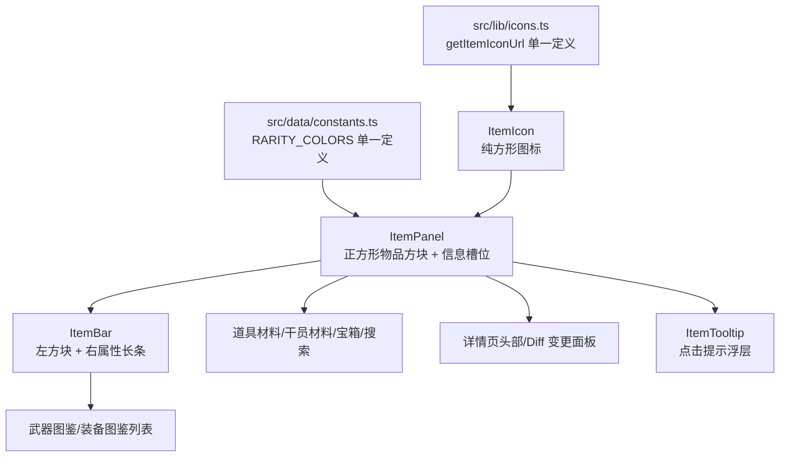

# 物品组件规范化（ItemPanel） - 技术提案

**功能名称**: 物品组件规范化
**关联 PRD**: [[20260722-item-panel|物品组件规范化（ItemPanel）]]
**技术提案版本**: v1.0
**创建日期**: 2026-07-22
**作者**: 前端工程
**feat-branch**: `feat/item-panel`

## 1. 概述

### 1.1 背景

物品展示遍布全站，但实现各自为政，主要问题：

- **常量重复**：`getItemIconUrl` 重复定义 7 处（ItemIcon、EquipCard、EquipmentDetail、WeaponList、WeaponDetail、ItemChangePanel、WeaponChangePanel）；`RARITY_COLORS` 重复定义 12 处，且存在两套不一致的色值（物品侧 2 星 `#dcdc00` vs `Rarity.tsx` 2 星 `#8B8982`；6 星 `#fe5a00` vs `#ef5a00`）。
- **符号混用**：稀有度星级 `★`（WeaponDetail、EquipmentDetail）与 `✦`（DiffViewer 变更面板）并存。
- **未接入组件体系**：武器列表卡片、武器详情头部、装备卡片（EquipCard）、装备详情头部、Diff 变更面板均手写 `` + 稀有度色条，未复用 `components/Items/` 下的 ItemPanel / ItemIcon。
- **设计语言缺失**：现有 ItemPanel 不是正方形（图标 + 下方名称纵向堆叠、宽度由场景自由传入 `className`/`iconClassName`），不支持标准化的外挂信息位置，场景各自用 `className` 硬调尺寸。

### 1.2 目标

- 建立统一的物品组件体系：正方形 `ItemPanel`（基础单元）+ `ItemBar`（左方块右属性长条）。
- 外挂信息槽位化：数量角标、名称、类型标签、星级按场景挂载。
- 收敛常量：`getItemIconUrl` 与 `RARITY_COLORS` 全站单一定义。
- 全场景改造：武器、装备、干员材料、搜索、宝箱、Diff 变更面板统一接入。

### 1.3 范围

**做**:

- 重设计 `ItemPanel` 为正方形物品方块，提供尺寸档位与信息槽位。
- 新增 `ItemBar` 长条组件，改造武器图鉴与装备图鉴列表条目。
- 收敛 `getItemIconUrl`、`RARITY_COLORS` 到公共模块，统一星级符号为 `★`。
- 改造武器列表/详情头部、装备卡片/详情头部、Diff 物品与武器变更面板等手写 `` 场景。
- 迁移现有 ItemPanel 调用方（干员材料、搜索卡片、RewardPanel、强化材料费用）到新 API。

**不做**:

- 不改动数据模型、适配器与接口契约。
- 不改动 `ItemIcon` 的图标解析逻辑（ItemTable 异步解析、液体叠加层）。
- 不实现物品独立卷宗页，物品详情继续由 ItemTooltip 浮层承载。
- 不改造工厂系统（占位模块）。
- 不改动非物品图标（干员头像、敌人、技能/天赋图标等）。

## 2. 技术架构

### 2.1 模块划分



| 模块 | 职责 | 关键技术点 |
|------|------|-----------|
| `src/data/constants.ts` | 新增 `RARITY_COLORS` 单一定义 | 按 common-rules 色值：`['black','black','gray','#26bbfd','#9452fa','#ffbb03','#ef5a00']`，按稀有度索引 |
| `src/lib/icons.ts` | 新增 `getItemIconUrl(iconId)` 单一定义 | 复用 `ASSET_BASE`，itemicon 目录拼接 |
| `src/components/Items/ItemIcon.tsx` | 纯方形图标（现状保留） | 删除本地 `getItemIconUrl`，改从 `lib/icons` 导入 |
| `src/components/Items/ItemPanel.tsx` | 正方形物品方块 | 重设计：尺寸档位 + 槽位 props |
| `src/components/Items/ItemBar.tsx` | 长条组件（新增） | 左 ItemPanel + 右属性区（children） |
| `src/components/Rarity.tsx` | 星级展示 | 改用统一 `RARITY_COLORS`，消除第二套色值 |

### 2.2 技术栈

| 层级 | 技术选型 | 说明 |
|------|---------|------|
| 前端 | React 19 + TypeScript + Tailwind CSS 4 | 现状延续，无新增依赖 |

## 3. API 与数据

### 3.1 接口契约

无新增或变更接口。物品名称/稀有度/iconId 继续由 `ItemTable` + `I18nDict_{locale}_ItemTable` 提供，沿用 `getCachedData` 缓存。

### 3.2 常量收敛

**`src/data/constants.ts`** 新增：

```ts
export const RARITY_COLORS: readonly string[] = ['black', 'black', 'gray', '#26bbfd', '#9452fa', '#ffbb03', '#ef5a00']

export function rarityColor(rarity: number): string {
  return RARITY_COLORS[Math.min(Math.max(rarity, 1), 6)]
}
```

- 色值遵循 `docs/engineering/common-rules.md` 的稀有度颜色约定；1–2 星灰色系渲染为 `archive-lead`/`archive-dust`。
- 全站 12 处 `RARITY_COLORS` 本地定义与 `Rarity.tsx` 全部改为引用此定义，6 星统一 `#ef5a00`，星级符号统一 `★`（DiffViewer 的 `✦` 一并替换）。

**`src/lib/icons.ts`** 新增：

```ts
import { ASSET_BASE } from './adapter'

export function getItemIconUrl(iconId: string): string {
  return `${ASSET_BASE}/assets/beyond/dynamicassets/gameplay/ui/sprites/itemicon/${iconId}.png`
}
```

- 7 处本地 `getItemIconUrl` 全部删除并改为导入。

## 4. 技术实现方案

### 4.1 ItemPanel 重设计（正方形 + 槽位）

对外为正方形方块：图标区固定 `aspect-square w-full`，稀有度色条与名称作为方块的标准组成部分与可选槽位。

```ts
export type ItemPanelSize = 'sm' | 'md' | 'lg' | 'xl'
// sm: w-12 (48px)  干员材料等密集网格
// md: w-16 (64px)  默认档位，道具材料/宝箱/搜索
// lg: w-20 (80px)  详情页头部、推荐武器
// xl: w-24 (96px)  ItemBar 左侧方块

interface ItemPanelProps {
  itemId: string
  size?: ItemPanelSize          // 默认 md，取代场景自定义 iconClassName
  name?: string                 // 允许调用方覆盖（现状保留）
  rarity?: number               // 允许调用方覆盖（现状保留）
  amount?: number               // 数量角标（右上角叠加 ×N，>10000 缩写 k）
  showName?: boolean            // 名称槽位，默认 true
  tag?: string                  // 类型标签槽位（名称下方弱提示小字）
  showStars?: boolean           // 稀有度星级槽位（替代色条，用于详情头部）
  showTips?: boolean            // 点击弹 ItemTooltip，默认 true
  href?: string                 // 配置后渲染为 Link，点击跳转
  className?: string
}
```

关键实现点：

- **正方形约束**：组件根宽度由 `size` 档位唯一决定（`w-12/16/20/24`），图标 `aspect-square`；名称槽位开启时名称位于方块下方、不撑开宽度（`w-full line-clamp-2`）。调用方不再传入 `iconClassName` 调尺寸。
- **数量角标**：由现在名称上方的独立文本改为 `absolute top-0.5 right-0.5` 叠加在图标右上角的深色底徽章（`bg-archive-ink/80 rounded px-0.5`），不占文档流。
- **名称槽位**：`showName=false` 时不渲染，无占位。
- **类型标签槽位**：`tag` 传入时渲染 `text-[9px] text-archive-lead`，用于武器类型、装备部位、物品分类。
- **星级槽位**：`showStars=true` 时用 `★` × rarity（统一色值着色）替代色条，服务详情页头部场景。
- **交互**：`href` → `<Link>`；否则 `<button>` 点击切换 `ItemTooltipOverlay`（保留 `DISABLED_TIP_ITEMS` 黑名单）。禁止 Link 嵌套（见 frontend-spec 交互规范）。

### 4.2 ItemBar（新增长条组件）

```ts
interface ItemBarProps {
  itemId: string
  href: string                  // 长条整体跳转目标（武器/装备卷宗）
  name?: string
  rarity?: number
  size?: ItemPanelSize          // 左侧方块尺寸，默认 lg
  children: ReactNode           // 右侧属性区，由场景组装
}
```

- 布局：`flex items-center gap-3 p-2 rounded border border-archive-border bg-archive-file hover:border-archive-gold/40`，与全站卡片语言一致。
- 左侧为 `ItemPanel size="lg" showName={false}`；右侧属性区 `flex-1 min-w-0`，内容（名称、稀有度星、类型/部位、技能名、属性摘要）由调用方以现有文本样式组装。
- 响应式：窄屏（< sm）左侧方块降为 `md`，属性区允许换行截断。
- ItemBar 只提供外壳与方块，不感知武器/装备数据类型，保证通用性（工厂系统后续可复用）。

### 4.3 场景改造清单

| 场景 | 文件 | 现状 | 改造 |
|------|------|------|------|
| 道具材料列表 | `pages/items/ItemList.tsx` | ItemPanel 旧 API | 迁移到新 API（`size`），行为不变 |
| 干员卷宗材料 | `pages/operators/OperatorDetail.tsx` | ItemPanel + `iconClassName` 硬调 | 改用 `size="sm"` + `amount` 角标 |
| 干员卷宗推荐武器 | `pages/operators/OperatorDetail.tsx` | ItemPanel `showName={false}` | 改用 `size="lg"`，`href` 跳武器卷宗 |
| 武器图鉴列表 | `pages/weapons/WeaponList.tsx` | 手写 `` 纵向卡片 | 改为 `ItemBar`，右侧：名称 + 稀有度星 + 类型 + 技能名 |
| 武器卷宗头部 | `pages/weapons/WeaponDetail.tsx` | 手写 `` + `★` + 色条 | 改用 `ItemPanel size="lg" showStars` |
| 装备图鉴列表 | `pages/equipment/EquipmentList.tsx` + `components/Equipment/EquipCard.tsx` | 手写 `` 纵向卡片 | 改为 `ItemBar`，右侧：名称 + 稀有度星 + 部位 + 套装 + 核心属性摘要 |
| 装备卷宗头部 | `pages/equipment/EquipmentDetail.tsx` | 手写 `` + `★` + 色条 | 改用 `ItemPanel size="lg" showStars` |
| 装备强化材料费用 | `pages/equipment/EquipmentDetail.tsx` | ItemPanel 旧 API | 迁移到新 API |
| 搜索结果条目 | `components/Search/EntityCards.tsx` | ItemPanel 旧 API | 迁移到新 API（`size`），行为不变 |
| 宝箱内容物 | `components/Items/RewardPanel.tsx` | ItemPanel 旧 API | 迁移到新 API（`amount` 角标） |
| 版本对比变更面板 | `components/DiffViewer/ItemChangePanel.tsx`、`WeaponChangePanel.tsx` | 手写 `` + `✦` | 改用 `ItemPanel size="sm" showTips={false}` + 统一 `★`；变更计数等面板自有信息保留 |
| 装备提示面板 | `components/Equipment/EquipTooltipPanel.tsx` | 本地 RARITY_COLORS | 仅收敛常量，结构不动 |

### 4.4 i18n

无新增 UI 文案：名称、类型、部位等文本均来自数据表或既有 i18n key（`equipment.*`、武器类型等）。数量缩写格式（`1.2k`）为数字格式，不引入文案。

### 4.5 兼容与迁移

- ItemPanel 旧 props（`iconClassName`、`showAmount`）在新 API 中移除，全部调用方在同一 PR 内迁移，不留双轨。
- `EquipCard` 在装备详情的「同套装」网格与装备列表中复用：列表场景替换为 ItemBar；同套装网格保留小方块形态，但内部改为基于 ItemPanel 实现，消除手写 ``。

## 5. 项目结构

```
src/
  data/
    constants.ts              # 新增 RARITY_COLORS / rarityColor
  lib/
    icons.ts                  # 新增 getItemIconUrl
  components/
    Rarity.tsx                # 改用统一色值
    Items/
      ItemIcon.tsx            # 导入统一 getItemIconUrl
      ItemPanel.tsx           # 重设计：正方形 + 尺寸档位 + 槽位
      ItemBar.tsx             # 新增：左方块 + 右属性长条
      ItemTooltip.tsx         # 仅收敛 RARITY_COLORS 引用
      RewardPanel.tsx         # 迁移新 API
      __tests__/
        ItemPanel.test.tsx    # 新增
        ItemBar.test.tsx      # 新增
    Equipment/
      EquipCard.tsx           # 基于 ItemPanel 重写
      EquipTooltipPanel.tsx   # 收敛常量
    Search/EntityCards.tsx    # 迁移新 API
    DiffViewer/               # ItemChangePanel/WeaponChangePanel 接入 ItemPanel
  pages/
    weapons/WeaponList.tsx    # ItemBar 长条
    weapons/WeaponDetail.tsx  # ItemPanel 头部
    equipment/EquipmentList.tsx    # ItemBar 长条
    equipment/EquipmentDetail.tsx  # ItemPanel 头部
    operators/OperatorDetail.tsx   # 迁移新 API
    items/ItemList.tsx        # 迁移新 API
```

## 6. 技术决策

| 决策 | 选项 A | 选项 B | 最终选择 | 原因 |
|------|--------|--------|---------|------|
| 正方形实现 | `aspect-square` 固定档位 | 调用方自由传宽高 | A | 档位收敛杜绝场景各自硬调，保证「对外正方形」 |
| 数量展示 | 角标叠加在图标上 | 图标下方独立文本 | A | 不占文档流，方块保持正方形 |
| ItemBar 属性区 | 组件内置武器/装备属性逻辑 | children 由场景组装 | B | 组件不耦合数据类型，工厂等后续场景可复用 |
| 稀有度色值 | 沿用物品侧 Record 两套并存 | 收敛 common-rules 单一数组 | B | common-rules 已有约定，消除 `#fe5a00`/`#ef5a00` 分歧 |
| Diff 变更面板 | 保持手写 | 接入 ItemPanel | B | PRD 要求全场景统一，变更标识以槽位/外挂形式保留 |

## 7. 测试策略

### 7.1 单元/组件测试

- `ItemPanel`：各尺寸档位渲染正方形；`amount` 角标显示与 k 缩写；`showName`/`tag`/`showStars` 槽位开关；`href` 渲染 Link、无 `href` 渲染 button 且点击弹出 tooltip。
- `ItemBar`：渲染左侧方块与右侧 children；跳转 href 正确。
- `rarityColor`：边界稀有度（0、1、6、7）取值正确。
- `toCountString` 缩写逻辑（迁移自现有实现）。

### 7.2 E2E 测试

- 武器图鉴列表：条目为长条结构，点击进入武器卷宗。
- 装备图鉴列表：条目为长条结构，点击进入装备卷宗。
- 干员卷宗：材料方块展示数量角标，点击弹出物品提示。
- 道具材料列表：点击物品弹出提示。

### 7.3 回归校验

- `npm run lint`、`npm run test`、`npm run build` 全部通过。
- 全站 grep 确认无残留本地 `RARITY_COLORS` / `getItemIconUrl` 定义。

## 8. 验收标准

- [ ] 技术方案评审通过。
- [ ] `RARITY_COLORS`、`getItemIconUrl` 全站单一定义，无重复。
- [ ] ItemPanel 对外正方形，数量/名称/类型标签/星级槽位可按场景开关。
- [ ] 武器图鉴与装备图鉴列表条目为「左方块 + 右属性」长条，可点击跳转。
- [ ] 4.3 改造清单中所有场景接入统一组件，无手写物品 ``。
- [ ] 星级符号全站统一为 `★`。
- [ ] `npm run lint`、`npm run test`、`npm run build` 通过。

## 9. 风险与回滚

| 风险 | 影响 | 缓解措施 |
|------|------|---------|
| ItemPanel API 变更遗漏调用方 | 构建报错或样式回退 | TypeScript 编译期即可发现；grep 全量核对 |
| 稀有度色值变更引起视觉差异 | 2 星/6 星颜色变化 | 遵循 common-rules 约定，属预期内统一 |
| 长条改造影响列表筛选/分页逻辑 | 功能回退 | 仅替换条目渲染，不触碰 useMemo 筛选排序逻辑；E2E 覆盖 |
| 角标叠加遮挡小尺寸图标 | 视觉拥挤 | sm 档位角标缩小字号，视觉走查 |

回滚策略：纯展示层重构，无数据与契约变更，可直接回滚分支。

## 10. 相关文档

- [[20260722-item-panel|物品组件规范化（ItemPanel）PRD]]
- [通用开发规范](../common-rules.md)
- [前端开发规范](../frontend-spec.md)
- [UI 常见陷阱参考](../references/ui-pitfalls.md)
