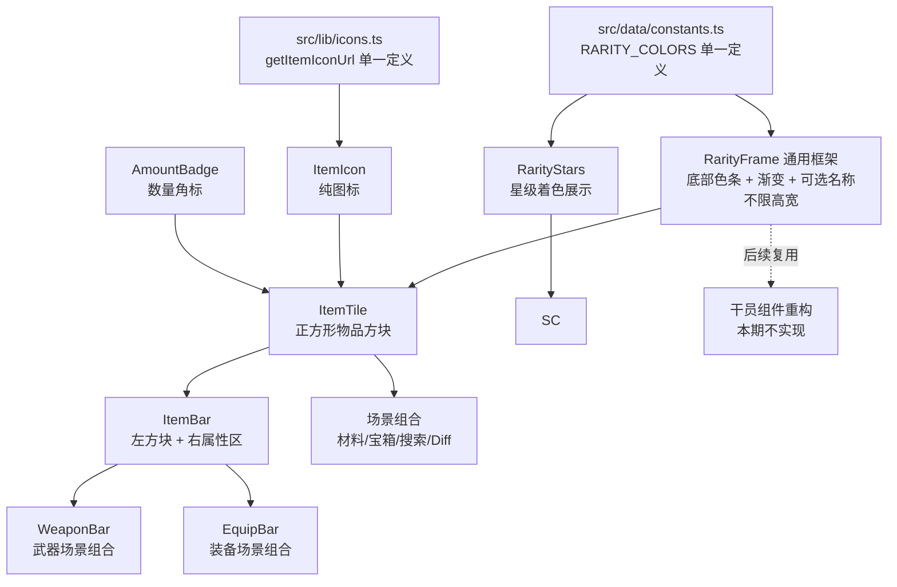

# 物品组件规范化（ItemPanel） - 技术提案

**功能名称**: 物品组件规范化
**关联 PRD**: [[20260722-item-panel|物品组件规范化（ItemPanel）]]
**技术提案版本**: v1.3
**创建日期**: 2026-07-22
**作者**: 前端工程
**feat-branch**: `feat/item-panel`

## 1. 概述

### 1.1 背景

物品展示遍布全站，但实现各自为政，主要问题：

- **常量重复**：`getItemIconUrl` 重复定义 7 处（ItemIcon、EquipCard、EquipmentDetail、WeaponList、WeaponDetail、ItemChangePanel、WeaponChangePanel）；`RARITY_COLORS` 重复定义 12 处，且存在两套不一致的色值（物品侧 2 星 `#dcdc00` vs `Rarity.tsx` 2 星 `#8B8982`；6 星 `#fe5a00` vs `#ef5a00`）。
- **符号混用**：稀有度星级 `★`（WeaponDetail、EquipmentDetail）与 `✦`（DiffViewer 变更面板）并存；稀有度筛选下拉使用纯数字。
- **未接入组件体系**：武器列表卡片、武器详情头部、装备卡片（EquipCard）、装备详情头部、Diff 变更面板均手写 `` + 稀有度色条，未复用 `components/Items/` 下的 ItemPanel / ItemIcon。
- **设计语言缺失**：现有 ItemPanel 不是正方形，稀有度色条、数量、名称纵向堆叠，场景靠 `className`/`iconClassName` 硬调尺寸，没有统一的信息呈现规则。

### 1.2 目标

- 抽出与物品无关的**通用渐变框架组件**：底部稀有度色条 + 色条向名称的渐变托底 + 底部居中名称，不限制高宽，供物品组件与后续干员组件重构共用。
- 以**组合方式**建立物品组件体系：基础件（图标、角标、星级）+ 通用框架，按场景组合封装场景组件，而不是一个组件靠大量 props 适配所有场景。
- 物品组件对外为正方形。
- 收敛常量：`getItemIconUrl` 与 `RARITY_COLORS` 全站单一定义，星级符号统一 `★`。
- 稀有度筛选下拉使用星级展示，选项按稀有度颜色着色。
- 武器图鉴与装备图鉴列表条目为「左物品组件 + 右属性」长条。

### 1.3 范围

**做**:

- 新增通用组件 `RarityFrame`（底部色条 + 渐变托底 + 可选名称，不限高宽）。
- 新增物品基础件与场景组合组件（`AmountBadge`、`ItemTile`、`ItemBar`、`WeaponBar`、`EquipBar` 等）。
- 收敛 `getItemIconUrl`、`RARITY_COLORS` 到公共模块，统一星级符号为 `★`。
- 稀有度筛选下拉星级化（道具材料、武器图鉴、装备图鉴）。
- 全场景改造：武器、装备、干员材料、搜索、宝箱、Diff 变更面板统一接入。

**不做**:

- 不改动数据模型、适配器与接口契约。
- 不改动 `ItemIcon` 的图标解析逻辑（ItemTable 异步解析、液体叠加层）。
- 不实现物品独立卷宗页，物品详情继续由 ItemTooltip 浮层承载。
- 不改造工厂系统（占位模块）。
- 干员组件重构不在本期，仅提供其后续可复用的 `RarityFrame`。
- 不改动非物品图标（干员头像、敌人、技能/天赋图标等）。

## 2. 技术架构

### 2.1 组合式组件体系



设计原则：**组合优于配置**。基础件只提供单一能力，场景组件通过组合基础件封装，场景特有信息（武器技能、装备属性、变更标识）留在场景组件内，不下沉到基础件。

| 模块 | 职责 | 关键技术点 |
|------|------|-----------|
| `src/data/constants.ts` | 新增 `RARITY_COLORS` 单一定义 | 按 common-rules 色值：`['black','black','gray','#26bbfd','#9452fa','#ffbb03','#ef5a00']`，按稀有度索引 |
| `src/lib/icons.ts` | 新增 `getItemIconUrl(iconId)` 单一定义 | 复用 `ASSET_BASE`，itemicon 目录拼接 |
| `src/components/RarityFrame.tsx` | 通用渐变框架（新增） | 不限高宽；色条满宽置底；名称可选，有名称才有渐变 |
| `src/components/RarityStars.tsx` | 星级着色展示 | 由 `Rarity.tsx` 迁移/重命名，色值引用统一定义；符号统一 `★` |
| `src/components/RarityFilterSelect.tsx` | 稀有度筛选下拉（新增） | 选项展示着色星级 |
| `src/components/Items/ItemIcon.tsx` | 纯图标（现状保留） | 删除本地 `getItemIconUrl`，改从 `lib/icons` 导入 |
| `src/components/Items/AmountBadge.tsx` | 数量角标（新增） | 绝对定位徽章，k 缩写 |
| `src/components/Items/ItemTile.tsx` | 正方形物品方块（新增，取代 ItemPanel） | RarityFrame + ItemIcon + 可选 AmountBadge；tooltip/href 交互 |
| `src/components/Items/ItemBar.tsx` | 长条外壳（新增） | 左 ItemTile + 右属性区（children） |
| `src/components/Weapons/WeaponBar.tsx` | 武器场景组合（新增） | ItemBar + 星级/类型/满级攻击力/技能名（名称由 ItemTile 展示） |
| `src/components/Equipment/EquipBar.tsx` | 装备场景组合（新增） | ItemBar + 部位角标（badge 槽位）+ 基础/附加属性（名称由 ItemTile 展示） |

### 2.2 技术栈

| 层级 | 技术选型 | 说明 |
|------|---------|------|
| 前端 | React 19 + TypeScript + Tailwind CSS 4 | 现状延续，无新增依赖 |

## 3. API 与数据

### 3.1 接口契约

无新增或变更接口。物品名称/稀有度/iconId 继续由 `ItemTable` + `I18nDict_{locale}_ItemTable` 提供，沿用 `getCachedData` 缓存。

新增数据表消费（只读、既有接口）：

| 数据表 | 用途 | 说明 |
|--------|------|------|
| `WeaponUpgradeTemplateTable` | 武器长条展示满级基础攻击力 | 全表仅 21 条升级曲线，按 `levelTemplateId` 取 `list` 末级 `baseAtk` |
| `SkillPatchTable` | 武器长条技能名称 | 复用列表页现有解析逻辑 |
| `AttributeShowConfigTable` / `CompositeAttributeShowConfigTable` | 装备长条属性名称与格式化 | 复用既有 `getAttributeShowMap` / `resolveAttrShow` / `formatAttributeShow` |

### 3.2 常量收敛

**`src/data/constants.ts`** 新增：

```ts
export const RARITY_COLORS: readonly string[] = ['black', 'black', 'gray', '#26bbfd', '#9452fa', '#ffbb03', '#ef5a00']

export function rarityColor(rarity: number): string {
  return RARITY_COLORS[Math.min(Math.max(rarity, 1), 6)]
}
```

- 色值遵循 `docs/engineering/common-rules.md` 的稀有度颜色约定；1–2 星灰色系渲染为 `archive-lead`/`archive-dust`。
- 全站 12 处 `RARITY_COLORS` 本地定义与 `Rarity.tsx` 全部改为引用此定义，6 星统一 `#ef5a00`，星级符号统一 `★`（DiffViewer 的 `✦` 一并替换）。

**`src/lib/icons.ts`** 新增：

```ts
import { ASSET_BASE } from './adapter'

export function getItemIconUrl(iconId: string): string {
  return `${ASSET_BASE}/assets/beyond/dynamicassets/gameplay/ui/sprites/itemicon/${iconId}.png`
}
```

- 7 处本地 `getItemIconUrl` 全部删除并改为导入。

## 4. 技术实现方案

### 4.1 RarityFrame（通用渐变框架）

与物品无关的通用展示框架，scope 严格限定为：

- 稀有度色条位于**最底部**，**占满容器宽度**。
- 传入名称时：从色条向上做「稀有度颜色 → 透明」的渐变托底，名称**底部居中**叠加在内容之上。
- 不传名称时：不显示渐变，仅保留底部色条。
- **不限制高宽**：容器尺寸完全由调用方通过 `className` 决定，框架只负责叠加层。

```tsx
interface RarityFrameProps {
  rarity: number
  name?: string
  children: ReactNode   // 图标、头像等内容
  className?: string    // 高宽由调用方决定
}
```

结构：

```tsx
<div className={`relative overflow-hidden ${className ?? ''}`}>
  {children}
  {name && (
    <>
      <div
        className="absolute inset-x-0 bottom-0 h-2/3 pointer-events-none"
        style={{ background: `linear-gradient(to top, ${rarityColor(rarity)}59, transparent)` }}
      />
      <span className="absolute inset-x-0 bottom-0.5 text-center text-[10px] leading-tight text-archive-ivory line-clamp-2 px-0.5">
        {name}
      </span>
    </>
  )}
  <div
    className="absolute inset-x-0 bottom-0 h-0.5"
    style={{ backgroundColor: rarityColor(rarity) }}
  />
</div>
```

- 渐变透明度（示例 `59` 即 35%）在实现时按视觉走查微调，确保名称可读且不过度遮挡图标。
- 后续干员组件重构直接复用：`RarityFrame` 包裹干员头像即可，无需改动本组件。

### 4.2 物品基础件

**`AmountBadge`** — 数量角标：

```tsx
<span className="absolute top-0.5 right-0.5 rounded bg-archive-ink/80 px-0.5 text-[9px] font-mono text-archive-ivory">
  ×{toCountString(amount)}
</span>
```

- `toCountString`（>10000 缩写为 `x.xk`）迁移自现有 ItemPanel，放入 `src/lib/formatText.ts` 或组件内私有。

**`ItemTile`** — 正方形物品方块（取代现有 ItemPanel）：

```tsx
interface ItemTileProps {
  itemId: string
  size?: ItemTileSize    // sm: w-12 / md: w-16 / lg: w-20 / xl: w-24，默认 md
  name?: string          // 覆盖名称解析（沿用现有 ItemTable 解析逻辑）
  rarity?: number        // 覆盖稀有度解析
  amount?: number        // 传入时组合 AmountBadge（右上角）
  badge?: ReactNode      // 外挂角标槽位（左上角），供场景组合使用，如装备部位
  showName?: boolean     // 默认 true；false 时 RarityFrame 不传 name（无渐变）
  showTips?: boolean     // 点击弹 ItemTooltip，默认 true
  href?: string          // 配置后渲染为 Link
  className?: string
}
```

- 实现为 `RarityFrame`（`aspect-square` + size 档位宽度）包裹 `ItemIcon`，按需叠加 `AmountBadge`（右上角）与 `badge`（左上角）。
- `badge` 为组合式外挂槽位：ItemTile 不感知其内容，由场景组件传入（如装备部位的 `PartBadge`），不传则不渲染。
- 交互：`href` → `<Link>`；否则 `<button>` 点击切换 `ItemTooltipOverlay`（保留 `DISABLED_TIP_ITEMS` 黑名单）。禁止 Link 嵌套（frontend-spec 交互规范）。
- 现有 ItemPanel 的名称/稀有度异步解析逻辑（ItemTable + 词典缓存）迁移到 ItemTile。

**`ItemBar`** — 长条外壳：

```tsx
interface ItemBarProps {
  itemId: string
  href: string            // 长条整体跳转目标
  size?: ItemTileSize     // 左侧方块尺寸，默认 lg；窄屏降 md
  children: ReactNode     // 右侧属性区，由场景组件组装
}
```

- 布局：`flex items-center gap-3 p-2 rounded border border-archive-border bg-archive-file hover:border-archive-gold/40`，内部 `<ItemTile>`（默认展示名称，名字位于方块内底部居中）+ `flex-1 min-w-0` 属性区。
- 名称由 ItemTile 自身展示，**右侧属性区不重复展示名称**，只承载属性信息。
- 只提供外壳与方块，不感知任何领域数据。

### 4.3 场景组合组件

场景特有信息不进入基础件，由各场景组件组合封装。数据获取在页面/Hook 层完成，场景组件保持纯展示。

**`WeaponBar`**（`src/components/Weapons/WeaponBar.tsx`）

左侧 `ItemTile` 展示图标与名称，右侧三行属性（不重复名称）：

```
┌──────────┐  ★★★★ · 双手剑
│          │  基础攻击力 341（满级）
│  icon    │  刚力
│          │  攻击强化
│  名称     │  专属技能名
└──────────┘
```

```tsx
interface WeaponBarProps {
  weapon: Weapon
  maxBaseAtk: number | null    // 页面层预解析
  skillNames: string[]         // 页面层预解析，最多 3 条
}
```

- **行 1**：`RarityStars` + 武器类型（既有 `weapon.type` i18n）。
- **行 2**：满级基础攻击力。数据源：`WeaponBasicTable.levelTemplateId` → `WeaponUpgradeTemplateTable[levelTemplateId].list` 末级 `baseAtk`。该表全表仅 21 条升级曲线，列表页一次性拉取并按 `levelTemplateId` 建立 `maxBaseAtk` 映射（`getCachedData` 缓存）；数据缺失时该行不渲染。
- **行 3–5**：3 个技能名称，**一行一个**（`weaponSkillList` 顺序），复用列表页现有 `SkillPatchTable` 名称解析逻辑（`skillNameMap`）；专属技能（第 3 条）可用强调色区分；不足 3 个技能时按实际数量渲染，不留空行。

**`EquipBar`**（`src/components/Equipment/EquipBar.tsx`）

左侧 `ItemTile` 展示图标与名称，**部位通过 `badge` 槽位以角标形式叠加在方块左上角**（`PartBadge`，既有 `equipment.part*` i18n）；右侧为属性区（不重复名称）：

```
┌──────────┐  防御力 +24          <- 基础属性，字号稍大
│[部位]    │  力量 +12
│          │  敏捷 +8
│  icon    │  生命 +5%
│  名称     │
└──────────┘
```

```tsx
interface EquipBarProps {
  equip: Equip
  attrShowMap: Record<string, AttrShowMapEntry>  // 页面层一次性 getAttributeShowMap(locale)
}
```

- **部位角标**：`ItemTile badge={<PartBadge partType={equip.partType} />}`；`PartBadge` 为装备领域小组件（深色底短标签，样式与 `AmountBadge` 同族）。
- **行 1**：基础属性（`equip.baseAttr`），经 `resolveAttrShow` + `formatAttributeShow` 解析，字号稍大（`text-xs`，其余属性行 `text-[10px]`）；无基础属性时该行不渲染。
- **行 2+**：附加属性（`equip.attrs`）**每行一个**，按实际数量渲染（2–3 条），与 `EquipTooltipPanel` 口径一致；完整属性与套装效果在卷宗页查看。
- 列表页已按套装分组（组头展示套装名），长条内不再重复套装名。

**材料/宝箱/搜索/Diff 场景** 直接组合 `ItemTile`（+ `amount` / `showName` / `href` / `showTips`），无需额外封装组件；若干员材料等场景出现重复组合模式，再在对应领域目录内抽取。

**详情页头部**（武器/装备卷宗）：组合 `RarityFrame` + `ItemIcon` + `RarityStars`，头部布局（名称、类型、徽章）保留页面自有结构。

### 4.4 稀有度筛选星级化

- `RarityStars`：现有 `Rarity.tsx` 迁移重命名（保留 `Rarity` 导出别名以避免干员/敌人页面改动，或直接全量替换引用），色值引用统一 `rarityColor`，符号统一 `★`。
- `RarityFilterSelect`（`src/components/RarityFilterSelect.tsx`）：封装稀有度筛选下拉，选项渲染 `★ × n` 且文字颜色为对应稀有度色：

```tsx
interface RarityFilterSelectProps {
  value: number | null
  onChange: (value: number | null) => void
  levels: number[]        // 如 [3, 4, 5, 6]
  className?: string
}
```

- `<option style={{ color: rarityColor(n) }}>` 着色；样式与全站下拉规范一致（深色背景 + 细边框，focus 强调色）。
- 接入道具材料、武器图鉴、装备图鉴列表页，替换现有数字选项；筛选状态与逻辑不变。

### 4.5 场景改造清单

| 场景 | 文件 | 现状 | 改造 |
|------|------|------|------|
| 道具材料列表 | `pages/items/ItemList.tsx` | ItemPanel 旧 API | 改用 `ItemTile`；稀有度筛选换 `RarityFilterSelect` |
| 干员卷宗材料 | `pages/operators/OperatorDetail.tsx` | ItemPanel + `iconClassName` 硬调 | `ItemTile size="sm" amount` |
| 干员卷宗推荐武器 | `pages/operators/OperatorDetail.tsx` | ItemPanel `showName={false}` | `ItemTile size="lg" showName={false} href` |
| 武器图鉴列表 | `pages/weapons/WeaponList.tsx` | 手写 `` 纵向卡片 | 改用 `WeaponBar`；稀有度筛选换 `RarityFilterSelect` |
| 武器卷宗头部 | `pages/weapons/WeaponDetail.tsx` | 手写 `` + `★` + 色条 | 组合 `RarityFrame` + `ItemIcon` + `RarityStars` |
| 装备图鉴列表 | `pages/equipment/EquipmentList.tsx` + `components/Equipment/EquipCard.tsx` | 手写 `` 纵向卡片 | 改用 `EquipBar`；稀有度筛选换 `RarityFilterSelect` |
| 装备卷宗头部 | `pages/equipment/EquipmentDetail.tsx` | 手写 `` + `★` + 色条 | 组合 `RarityFrame` + `ItemIcon` + `RarityStars` |
| 装备强化材料费用 | `pages/equipment/EquipmentDetail.tsx` | ItemPanel 旧 API | `ItemTile amount` |
| 同套装装备网格 | `components/Equipment/EquipCard.tsx` | 手写 `` | 基于 `ItemTile` 重写（保留 link/tooltip 两种交互） |
| 搜索结果条目 | `components/Search/EntityCards.tsx` | ItemPanel 旧 API | `ItemTile`（href / showTips 两种用法保留） |
| 宝箱内容物 | `components/Items/RewardPanel.tsx` | ItemPanel 旧 API | `ItemTile amount` |
| 版本对比变更面板 | `components/DiffViewer/ItemChangePanel.tsx`、`WeaponChangePanel.tsx` | 手写 `` + `✦` | 组合 `ItemTile size="sm" showTips={false}` + `RarityStars`；变更计数等自有信息保留 |
| 装备提示面板 | `components/Equipment/EquipTooltipPanel.tsx` | 本地 RARITY_COLORS | 仅收敛常量，结构不动 |
| 物品提示浮层 | `components/Items/ItemTooltip.tsx` | 本地 RARITY_COLORS + ItemIcon | 仅收敛常量，结构不动 |

### 4.6 i18n

无新增 UI 文案：名称、类型、部位等文本均来自数据表或既有 i18n key。星级与数量缩写为符号/数字格式，不引入文案。

### 4.7 兼容与迁移

- 旧 `ItemPanel` 组件删除，全部调用方在同一 PR 内迁移到 `ItemTile` / 场景组合组件，不留双轨。
- `Rarity.tsx` 的迁移保证干员/敌人/种族/阵营页面视觉不变（色值收敛后 2 星由 `#8B8982` 变灰系、6 星 `#ef5a00` 不变，视觉差异可忽略或走查确认）。

## 5. 项目结构

```
src/
  data/
    constants.ts              # 新增 RARITY_COLORS / rarityColor
  lib/
    icons.ts                  # 新增 getItemIconUrl
  components/
    RarityFrame.tsx           # 新增：通用渐变框架（不限高宽）
    RarityStars.tsx           # Rarity.tsx 迁移重命名，统一色值
    RarityFilterSelect.tsx    # 新增：星级筛选下拉
    Items/
      ItemIcon.tsx            # 导入统一 getItemIconUrl
      AmountBadge.tsx         # 新增：数量角标
      ItemTile.tsx            # 新增：正方形物品方块（取代 ItemPanel.tsx）
      ItemBar.tsx             # 新增：左方块 + 右属性长条外壳
      ItemPanel.tsx           # 删除
      ItemTooltip.tsx         # 仅收敛常量
      RewardPanel.tsx         # 迁移 ItemTile
      __tests__/
        ItemTile.test.tsx     # 新增
        ItemBar.test.tsx      # 新增
    Weapons/
      WeaponBar.tsx           # 新增：武器场景组合
    Equipment/
      EquipBar.tsx            # 新增：装备场景组合
      PartBadge.tsx           # 新增：部位角标（ItemTile badge 槽位）
      EquipCard.tsx           # 基于 ItemTile 重写
      EquipTooltipPanel.tsx   # 收敛常量
    Search/EntityCards.tsx    # 迁移 ItemTile
    DiffViewer/               # ItemChangePanel/WeaponChangePanel 组合 ItemTile
  pages/
    weapons/WeaponList.tsx    # WeaponBar 长条 + 星级筛选
    weapons/WeaponDetail.tsx  # RarityFrame 组合头部
    equipment/EquipmentList.tsx    # EquipBar 长条 + 星级筛选
    equipment/EquipmentDetail.tsx  # RarityFrame 组合头部
    operators/OperatorDetail.tsx   # 迁移 ItemTile
    items/ItemList.tsx        # 迁移 ItemTile + 星级筛选
```

## 6. 技术决策

| 决策 | 选项 A | 选项 B | 最终选择 | 原因 |
|------|--------|--------|---------|------|
| 名称展示方式 | 方块内底部居中 + 渐变托底 | 方块下方独立文本行 | A | Review 意见；布局紧凑，且形成可复用的通用框架 |
| 通用框架粒度 | RarityFrame 只管色条/渐变/名称 | 把图标解析也塞进通用组件 | A | Review 意见限定 scope；干员组件后续可直接复用 |
| 场景适配方式 | 组合式场景组件（WeaponBar/EquipBar） | 单组件多 props 适配所有场景 | A | Review 意见；避免 props 膨胀，场景信息不下沉 |
| 数量展示 | AmountBadge 角标叠加 | 图标下方独立文本 | A | 不占文档流，方块保持正方形 |
| 稀有度色值 | 收敛 common-rules 单一数组 | 沿用物品侧 Record 两套并存 | A | common-rules 已有约定，消除 `#fe5a00`/`#ef5a00` 分歧 |
| 筛选稀有度表达 | 星级 + 选项着色 | 纯数字 | A | Review 意见；与物品方块稀有度表达一致 |

## 7. 测试策略

### 7.1 单元/组件测试

- `RarityFrame`：色条位于底部且满宽；传 `name` 时渲染渐变与底部居中名称；不传 `name` 时不渲染渐变；容器尺寸由 `className` 决定。
- `AmountBadge`：数量渲染与 k 缩写边界（10000/10001）。
- `ItemTile`：各尺寸档位渲染正方形；`amount` 组合角标；`showName` 开关；`href` 渲染 Link、无 `href` 渲染 button 且点击弹出 tooltip。
- `ItemBar`：渲染左侧方块与右侧 children；跳转 href 正确。
- `WeaponBar`：首行星级+类型、满级攻击力、3 个技能名一行一个；`maxBaseAtk` 为 null 时攻击力行不渲染。
- `EquipBar`：部位角标渲染在方块上；基础属性行字号大于附加属性行；附加属性每行一个，按实际数量（2–3 条）渲染。
- `RarityStars` / `rarityColor`：边界稀有度（0、1、6、7）取值正确；符号为 `★`。
- `RarityFilterSelect`：选项星级与颜色渲染；onChange 行为。

### 7.2 E2E 测试

- 武器图鉴列表：条目为长条结构，点击进入武器卷宗；稀有度筛选下拉显示着色星级且筛选结果正确。
- 装备图鉴列表：条目为长条结构，点击进入装备卷宗；稀有度筛选同上。
- 干员卷宗：材料方块展示数量角标，点击弹出物品提示。
- 道具材料列表：点击物品弹出提示；稀有度筛选星级化。

### 7.3 回归校验

- `npm run lint`、`npm run test`、`npm run build` 全部通过。
- 全站 grep 确认无残留本地 `RARITY_COLORS` / `getItemIconUrl` 定义、无 `✦` 残留。

## 8. 验收标准

- [ ] 技术方案评审通过。
- [ ] `RarityFrame` 通用组件符合 scope：色条置底满宽、名称可选、有名称才有渐变、不限高宽。
- [ ] `RARITY_COLORS`、`getItemIconUrl` 全站单一定义，无重复。
- [ ] 物品组件（ItemTile）对外正方形，尺寸档位化。
- [ ] 场景组件以组合方式实现（WeaponBar / EquipBar / ItemTile 组合），无单组件多场景大 props。
- [ ] 武器图鉴与装备图鉴列表条目为「左方块 + 右属性」长条，可点击跳转；名称仅由左侧方块展示，右侧不重复。
- [ ] 武器长条展示满级基础攻击力（WeaponUpgradeTemplateTable）与 3 个技能名（一行一个）。
- [ ] 装备长条部位以角标叠加在物品方块上（badge 槽位组合）；右侧第一行为字号稍大的基础属性，其后附加属性每行一个（2–3 条，attributeShow 口径）。
- [ ] 稀有度筛选下拉使用星级且选项按稀有度着色（道具材料/武器/装备）。
- [ ] 星级符号全站统一为 `★`。
- [ ] 4.5 改造清单中所有场景接入统一组件，无手写物品 ``。
- [ ] `npm run lint`、`npm run test`、`npm run build` 通过。

## 9. 风险与回滚

| 风险 | 影响 | 缓解措施 |
|------|------|---------|
| 渐变托底遮挡图标主体 | 视觉受损 | 渐变高度与透明度视觉走查微调；name 可选关闭 |
| ItemPanel 删除遗漏调用方 | 构建报错或样式回退 | TypeScript 编译期即可发现；grep 全量核对 |
| 稀有度色值变更引起视觉差异 | 2 星颜色变化 | 遵循 common-rules 约定，属预期内统一 |
| 原生 `<select>` option 着色浏览器差异 | 部分浏览器选项颜色不生效 | 着色为渐进增强，星级文本始终可读 |
| 长条改造影响列表筛选/分页逻辑 | 功能回退 | 仅替换条目渲染，不触碰 useMemo 筛选排序逻辑；E2E 覆盖 |

回滚策略：纯展示层重构，无数据与契约变更，可直接回滚分支。

## 10. 相关文档

- [[20260722-item-panel|物品组件规范化（ItemPanel）PRD]]
- [通用开发规范](../common-rules.md)
- [前端开发规范](../frontend-spec.md)
- [UI 常见陷阱参考](../references/ui-pitfalls.md)
