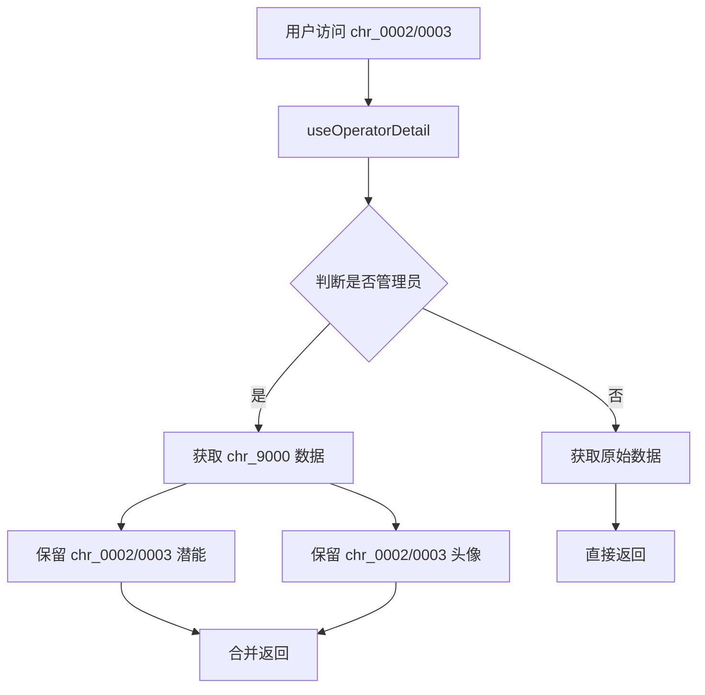

# 管理员干员数据映射特化技术方案

## 概述

对管理员干员（`chr_0002_endminm` / `chr_0003_endminf`）进行数据源特化：除「潜能」和「干员头像」外，其他数据统一从 `chr_9000_endmin` 获取。

## 背景

游戏中管理员角色的数据结构：
- `chr_0002_endminm`（男管理）/ `chr_0003_endminf`（女管理）是展示角色
- `chr_9000_endmin` 是游戏结算时实际使用的角色数据

当前档案馆直接使用 `chr_0002/0003` 的数据，与游戏实际行为不一致。

---

## 数据调研

### 需要映射的数据（使用 chr_9000_endmin）

| 数据类型 | 数据来源 | 说明 |
|---------|---------|------|
| 基础信息 | CharacterTable | 名称、职业、元素、稀有度等 |
| 技能信息 | CharGrowthTable | 技能组、技能描述、技能升级 |
| 天赋信息 | CharGrowthTable | 天赋节点和效果 |
| 突破信息 | CharGrowthTable | 精英化、属性提升 |
| 能力值 | CharacterTable | 属性数据 |
| 档案记录 | CharacterTable | 语音、档案 |
| 装备推荐 | CharWpnRecommendTable | 武器推荐 |
| 后勤技能 | SpaceshipCharSkillTable | 后勤技能 |

### 保留各自的数据

| 数据类型 | 数据来源 | 说明 |
|---------|---------|------|
| 潜能 | CharacterPotentialTable | chr_0002/0003 各自的潜能数据 |
| 干员头像 | 内置路径 | 使用各自 charId 的头像 |

---

## 实现方案

### 方案选择：Hook 层数据映射

在 `useOperatorDetail` hook 中实现数据源映射，优点：
1. 集中管理映射逻辑，易于维护
2. 不影响 adapter 层和组件层
3. 对现有代码侵入最小

### 数据流



---

## 类型定义

**文件**: `src/lib/types.ts`

无需修改现有类型，复用 `OperatorDetailData` 接口。

---

## 数据获取实现

**文件**: `src/hooks/useData.ts` — `useOperatorDetail()` 函数

### 步骤 1: 定义管理员映射常量

在文件顶部添加管理员角色映射：

```typescript
// 管理员角色数据映射：chr_0002/0003 展示时使用 chr_9000 的数据
const ADMIN_OPERATOR_MAP: Record<string, string> = {
  chr_0002_endminm: 'chr_9000_endmin',
  chr_0003_endminf: 'chr_9000_endmin',
}
```

### 步骤 2: 修改 useOperatorDetail 数据获取

在函数开头添加数据源 ID 判断：

```typescript
export function useOperatorDetail(id: string): UseDataResult<OperatorDetailData> {
  const { locale } = useLocale()
  return useData(async () => {
    // 管理员干员使用 chr_9000 的数据
    const dataId = ADMIN_OPERATOR_MAP[id] ?? id
    
    // ... 现有 Promise.all 代码 ...
    // 将所有 rawData[id] 改为 rawData[dataId]
    // 将所有 growthRaw 改为从 dataId 获取
    // ... 潜能部分保持使用 id ...
  }, [locale, id])
}
```

### 步骤 3: 修改具体数据获取

以下数据使用 `dataId`：

1. **基础信息** (CharacterTable):
   ```typescript
   const raw = rawData[dataId]  // 原 rawData[id]
   ```

2. **成长数据** (CharGrowthTable):
   ```typescript
   getCachedData<Record<string, any>>('CharGrowthTable', () => fetchTableAll('CharGrowthTable')).then(r => r[dataId])
   ```

3. **武器推荐** (CharWpnRecommendTable):
   ```typescript
   getCachedData<Record<string, any>>('CharWpnRecommendTable', () => fetchTableAll('CharWpnRecommendTable')).then(r => r[dataId])
   ```

4. **后勤技能** (SpaceshipCharSkillTable):
   ```typescript
   const charSpaceshipSkills = spaceshipCharRaw[dataId]  // 原 spaceshipCharRaw[id]
   ```

以下数据保持使用原始 `id`：

1. **潜能数据** (CharacterPotentialTable):
   ```typescript
   getCachedData<Record<string, any>>('CharacterPotentialTable', () => fetchTableAll('CharacterPotentialTable')).then(r => r[id])  // 保持 id
   ```

2. **潜能立绘 URL**:
   ```typescript
   portraitUrl = `${ASSET_BASE}/.../pic_${bundle.level}_${id}.png`  // 保持 id
   ```

### 步骤 4: 头像处理

头像 URL 在 `adaptOperator` 中生成，使用 `charId`：

```typescript
portrait: `${ASSET_BASE}/.../icon_${charId}.png`
```

由于 `charId` 从 `raw.$key` 或 `raw.charId` 获取，当使用 `dataId` 获取 `raw` 时，`charId` 会变成 `chr_9000_endmin`。

**解决方案**：在 `useOperatorDetail` 中，当是管理员干员时，手动覆盖 `op.portrait`：

```typescript
const op = adaptOperator(raw, i18nMap, profMap, elemMap, tagMap, attrMap, raceMap, blocMap)

// 管理员干员使用原始 ID 的头像
if (ADMIN_OPERATOR_MAP[id]) {
  op.id = id  // 保持原始 ID
  op.portrait = `${ASSET_BASE}/assets/beyond/dynamicassets/gameplay/ui/sprites/charicon/icon_${id}.png`
}
```

---

## 文件清单

| 操作 | 文件 | 说明 |
|------|------|------|
| **修改** | `src/hooks/useData.ts` | 添加管理员映射常量，修改 `useOperatorDetail` 数据获取逻辑 |

---

## 验证方案

1. `npm run lint` — 无 lint 错误
2. `npm run test` — 现有测试通过
3. `npm run build` — TypeScript 编译通过
4. 视觉验证：
   - 访问 `/archive/operators/chr_0002_endminm`，确认：
     - 标题显示 `chr_9000_endmin` 的名称
     - 头像显示男管理的头像
     - 技能、天赋、突破等显示 `chr_9000` 的数据
     - 潜能显示 `chr_0002` 的数据
   - 访问 `/archive/operators/chr_0003_endminf`，确认：
     - 标题显示 `chr_9000_endmin` 的名称
     - 头像显示女管理的头像
     - 其他数据同上
   - 访问 `/archive/operators/chr_9000_endmin`，确认：
     - 正常显示，无异常

---

## 边界情况处理

| 情况 | 处理方式 |
|------|---------|
| `chr_9000_endmin` 数据不存在 | 降级使用 `chr_0002/0003` 自身数据 |
| `chr_9000_endmin` 加载失败 | 降级使用 `chr_0002/0003` 自身数据 |
| 潜能数据不存在 | 显示空潜能区域（现有逻辑） |
