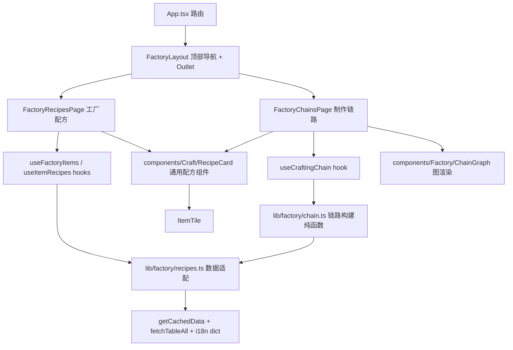
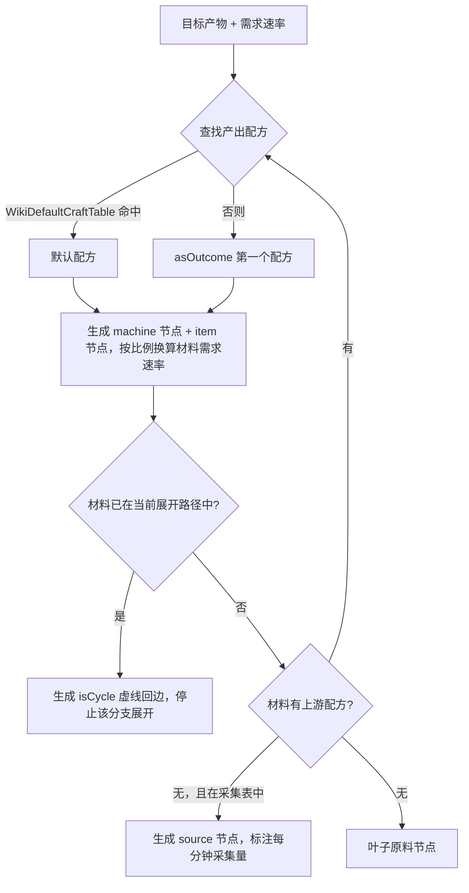

# 工厂系统（工厂配方与制作链路） - 技术提案

**功能名称**: 工厂系统 — 工厂配方 & 制作链路
**关联 PRD**: [[20260725-factory-system|工厂系统（工厂配方与制作链路）]]
**技术提案版本**: v1.0
**创建日期**: 2026-07-25
**作者**: 前端工程
**feat-branch**: `feat/factory-archive`

## 1. 概述

### 1.1 背景

工厂模块当前为占位页（`src/pages/factory/FactoryOverview.tsx` → `PlaceholderPage`，路由 `/archive/factory`、侧边栏入口 `nav.factory`、面包屑、`MODULE_CODES.factory` 均已就位）。数据侧已确认远端存在完整的工厂配方表族（`FactoryMachineCraftTable` 等约 90 张 `Factory*` 表），代码侧尚无任何工厂表的类型、adapter 或 hook。本提案依据 PRD 落地「工厂配方」与「制作链路」两个子页面。

### 1.2 目标

- 工厂系统改为「顶部导航 + 子路由」结构：`/archive/factory/recipes`（默认）与 `/archive/factory/chains`。
- 建立工厂数据适配层：机器配方、机器（建筑）、物品↔配方反向索引、采集源头的类型 + adapter + hooks。
- 落地通用配方组件 `RecipeCard`（物品展示统一使用 `ItemTile`）。
- 实现链路图构建算法（含多配方选择、循环依赖处理、每分钟速率换算）与图可视化渲染。

### 1.3 范围

**做**:
- 工厂系统框架（顶部导航 + 嵌套子路由）与两个子页面。
- 机器配方相关数据表（见 §3.1）的类型、adapter、hooks。
- 通用配方组件 `RecipeCard`，复用于两个子页面。
- 链路图构建纯函数模块与图渲染（含循环依赖标记）。

**不做**:
- 手工配方（`FactoryManualCraftTable`）、枢纽配方（`FactoryHubCraftTable`）、飞船/种植舱配方。
- 机器图鉴独立页、蓝图/黑盒体系（`WikiCraftJumpTable` 等，仅预留数据通道）。
- 产线保存/导出等编辑能力。
- 装备配方（`EquipFormulaTable`）向 `RecipeCard` 的迁移（后续单独评估）。

## 2. 技术架构

### 2.1 模块划分



| 模块 | 职责 | 关键技术点 |
|------|------|-----------|
| `pages/factory/FactoryLayout.tsx` | 顶部导航页签 + `<Outlet />` | `NavLink` 高亮；嵌套路由 |
| `pages/factory/FactoryRecipes.tsx` | 左右结构：物品列表 + 配方区 | `useSearchParams` 同步选中物品；窄屏转上下布局 |
| `pages/factory/FactoryChains.tsx` | 产物选择器 + 链路图 | `useSearchParams` 同步已选产物 |
| `components/Craft/RecipeCard.tsx` | 通用配方卡片（产物/材料/机器/时长/每分钟产能） | 物品一律 `ItemTile`；与现有 `RecipePanel`（装备配方）并存 |
| `components/Factory/ChainGraph.tsx` | 链路图渲染 | `@xyflow/react` 自定义节点 + `@dagrejs/dagre` 分层布局 |
| `lib/factory/types.ts` + `lib/factory/recipes.ts` | 工厂类型定义与数据适配 | 沿用 `adaptXxx` 纯函数模式 |
| `lib/factory/chain.ts` | 链路图构建纯函数（DFS、环检测、速率换算） | 无 React 依赖，可单测 |
| `hooks/useData.ts`（追加） | `useFactoryItems`、`useItemRecipes`、`useFactoryMachines`、`useCraftingChain` | `Promise.all` 多表并发 + i18n dict |

### 2.2 技术栈

| 层级 | 技术选型 | 说明 |
|------|---------|------|
| 路由 | react-router-dom v7 嵌套路由 | 工厂子页面独立地址，见 §4.1 |
| 图布局 | `@dagrejs/dagre`（新增依赖） | 分层布局（rankdir=LR），天然支持含环图 |
| 图渲染 | `@xyflow/react`（新增依赖） | 自定义 React 节点（复用 `ItemTile`）、内置平移/缩放 |
| 数据 | 现有 `api.ts` / `cache.ts` / i18n dict | 无新增接口契约，纯新增表的消费 |

## 3. API 与数据

### 3.1 数据表清单

无新增后端接口（复用 `GET /table/{name}/all` 与 `GET /i18n/dict/{locale}/table/{name}/all`）。本期消费的表：

| 用途 | 表 | 说明 |
|------|-----|------|
| 机器配方 | `FactoryMachineCraftTable`（305 条） | `machineId`、`ingredients[].group[{id,count}]`、`outcomes[].group[{id,count}]`、`totalProgress`、`sortId` |
| 机器/建筑 | `FactoryBuildingTable`（105 条） | key=buildingId，`name`/`desc`（i18n）、`iconOnPanel`、`type` |
| 物品→配方反查 | `FactoryItemAsMachineCrafterIncomeTable` / `FactoryItemAsMachineCrafterOutcomeTable` | 值为 `{ list: [formulaId] }`，分别对应「作为材料」「作为产物」 |
| 资源源头 | `FactoryMinerTable`、`FactoryGasMinerTable` | `mineable[{miningItemId, produceRate}]`、`msPerRound` |
| 液体源头 | `FactoryFluidPumpInTable` | 结构不同：`enableLiquidIds: string[]`（无 `mineable`/`produceRate`），如 `pump_2` 耐酸水泵独占 `item_liquid_acid` |
| 默认配方 | `WikiDefaultCraftTable` | 物品 → 推荐配方 ID，用于链路图默认展开路径 |
| 物品显示 | `ItemTable`（+i18n dict） | 名称/稀有度/图标，经 `ItemTile` 内部机制解析 |
| 机器 i18n | `FactoryBuildingTable` 的 i18n dict | 机器名称 |

### 3.2 类型设计（`src/lib/factory/types.ts`）

```ts
/** 机器配方 */
export interface FactoryRecipe {
  id: string                    // 配方 ID，如 furnance_carbon_powder_2
  machineId: string             // → FactoryBuildingTable key
  ingredients: RecipeItemQty[]  // 材料（AND 语义）
  outcomes: RecipeItemQty[]     // 产物（AND 语义）
  totalProgress: number         // 制作总进度
  sortId: number
}

export interface RecipeItemQty { itemId: string; count: number }

/** 机器（建筑） */
export interface FactoryMachine {
  id: string
  name: string                  // resolveI18n(FactoryBuildingTable.name)
  iconId: string                // iconOnPanel
}

/** 采集源头 */
export interface FactorySource {
  machineId: string
  itemId: string
  produceRate: number
  msPerRound: number            // 每分钟产量 = produceRate × 60000 / msPerRound
}

/** 工厂物品索引（左侧列表 + 反查） */
export interface FactoryItemIndex {
  asIngredient: Record<string, string[]>  // itemId → 配方 ID 列表
  asOutcome: Record<string, string[]>
}
```

`src/lib/factory/recipes.ts` 提供 `adaptFactoryRecipe(raw)`、`adaptFactoryMachine(raw, i18nMap)` 等纯函数，raw 字段沿用 `??` 别名回退与 `resolveI18n`（注意 64 位 ID 需 `String(id)` 查字典，见数据陷阱文档）。

### 3.3 Hooks（追加至 `src/hooks/useData.ts`）

```ts
useFactoryRecipes(): UseDataResult<FactoryRecipe[]>          // 全量机器配方 + 机器信息
useFactoryItemIds(): UseDataResult<string[]>                 // 参与机器制造的物品 ID 集合（Income ∪ Outcome）
useItemRecipes(itemId): { asProduct: FactoryRecipe[]; asMaterial: FactoryRecipe[] }
useCraftingChain(targets: string[]): UseDataResult<ChainGraph>
```

缓存直接复用 `getCachedData(table, fetcher)`，版本失效策略不变。多表并发 `Promise.all`，非关键表 `.catch(() => ({}))` 容错（与 `useEquipDetail` 一致）。

## 4. 技术实现方案

### 4.1 路由与框架

```tsx
<Route path="factory" element={<FactoryLayout />}>
  <Route index element={<Navigate to="recipes" replace />} />
  <Route path="recipes" element={<FactoryRecipes />} />
  <Route path="chains" element={<FactoryChains />} />
</Route>
```

- `FactoryLayout`：顶部页签用 `NavLink`（`end` 控制高亮），内容区 `<Outlet />`；侧边栏 active 判定为 `pathname.startsWith('/archive/factory')`，天然保持高亮。
- 面包屑 `useListLabel()` 追加 `recipes` / `chains` 的映射。
- 选中状态进 URL：工厂配方页 `?item=<itemId>`；制作链路页 `?targets=<id1,id2>`，均用 `useSearchParams`（先例：`ArchiveSearch`）。

### 4.2 工厂配方页

- 左侧：`useFactoryItemIds()` 取物品集合 → `ItemTable` 批量解析名称/稀有度（模块级 Map 记忆化，参考 `getWeaponTypeNameMap`）→ 本地 `useState` 搜索过滤 → `ItemTile` 网格列表（`itemId/name/rarity` 直传，跳过内部二次解析）。
- 右侧：`useItemRecipes(itemId)` 返回「作为产物 / 作为材料」两组，渲染 `RecipeCard` 列表；空分组展示空态；未选中展示引导文案。
- 窄屏（`<md`）左右结构转为上下堆叠。

### 4.3 通用配方组件 `RecipeCard`

```tsx
interface RecipeCardProps {
  recipe: FactoryRecipe
  machine?: FactoryMachine      // 机器图标 + 名称
  highlightItemId?: string      // 当前选中的物品（高亮其在产物/材料中的位置）
}
```

布局：`[产物 ItemTile 组] ← [材料 ItemTile 组]`，下方信息行：机器（图标+名称）、耗时 `totalProgress/1000` 秒、每分钟产能（产出 `count × 60000/totalProgress`，消耗同理）。物品统一 `<ItemTile itemId amount size="lg" />`（保留默认 tooltip 行为）。

### 4.4 制作链路页与链路构建算法（核心）

#### 速率换算

`每分钟数量 = count × 60000 / totalProgress`（依据 `FactoryConst.tickBasedTotalProgress = 60000`、各配方组 `msPerRound = 1000` 推断；实现时收敛为 `lib/factory/chain.ts` 中的常量函数 `perMinute(count, totalProgress)`，若后续实测修正仅需改一处）。

#### 图构建（`lib/factory/chain.ts`，纯函数）

```ts
interface ChainNode {
  key: string
  kind: 'item' | 'machine' | 'source'
  itemId?: string
  machineId?: string
  perMinute: number             // 该节点的每分钟流速率
}
interface ChainEdge { from: string; to: string; perMinute: number; isCycle?: boolean }
interface ChainGraph { nodes: ChainNode[]; edges: ChainEdge[] }
```

构建流程（对每个目标产物执行，最终合并）：



- **环检测**：DFS 携带当前路径 `Set<itemId>`（非全局 visited），命中即生成 `isCycle` 回边并剪枝——保证全局共享的中间产物仍能合并展示，同时绝不无限递归（已确认数据中存在 188 个环，如 `item_glass_bottle ↔ item_fbottle_glass_water`）。
- **速率传递**：目标产物默认速率取其默认配方的单机每分钟产出；逐级按配方比例反推材料需求速率与机器台数参考值（保留 1 位小数）。
- **配方切换**：节点上提供「切换配方」（该物品有多个上游配方时），变更后以其子树重新构建。
- **多目标**：逐个构建后按 `itemId+machineId` 合并节点，速率累加；每个目标产物节点标记为「目标」。

#### 图渲染（`components/Factory/ChainGraph.tsx`）

- `@dagrejs/dagre` 计算分层布局（`rankdir: 'LR'`，原料在左、目标产物汇聚于右）；`@xyflow/react` 渲染。
- 自定义节点：item 节点 = `ItemTile` + 每分钟数量角标；machine 节点 = 机器图标 + 名称；source 节点加采集标识；环回边渲染为虚线。
- 内置平移/缩放；窄屏下默认缩放到适应视图。

### 4.5 i18n

新增 `factory.*` 命名空间（`factory.recipes`、`factory.chains`、`factory.asProduct`、`factory.asMaterial`、`factory.perMinute`、`factory.cycleMark`、`factory.selectItems` 等约 15 个 key），全部在 `scripts/i18n-custom.json` 提供 14 语言翻译后运行 `node scripts/generate-i18n-dicts.ts`。

## 5. 技术决策

| 决策 | 选项 A | 选项 B | 最终选择 | 原因 |
|------|--------|--------|---------|------|
| 子页面切换 | 嵌套路由 + Outlet | 单页 state/searchParams 切换 | 嵌套路由 | PRD 要求子页面独立地址可分享；与 ArchiveLayout 模式一致 |
| 图可视化 | `@xyflow/react` + `@dagrejs/dagre` | 自绘 SVG + 手写布局 | A | dagre 分层布局成熟且支持含环图；xyflow 自定义节点可直接复用 `ItemTile`，内置平移缩放；合计约 +130KB gzip，仅工厂页懒加载 |
| 链路构建 | 纯函数模块 `lib/factory/chain.ts` | 组件内递归渲染 | 纯函数 | 环检测/速率换算可单测；与 adapter 纯函数风格一致 |
| 物品→配方查询 | 官方反向索引表 | 全表扫描配方 | 反向索引表 | 官方已建好 `Income/Outcome` 索引，避免 305 条全扫 |
| 通用配方组件 | 新建 `RecipeCard` | 改造现有 `RecipePanel` | 新建 | `RecipePanel` 耦合装备配方 `RecipeEntry`（含金币/解锁条件），结构差异大；并存不冲突 |

## 6. 项目结构

```
src/
  pages/factory/
    FactoryLayout.tsx       # 顶部导航 + Outlet（替换 FactoryOverview.tsx）
    FactoryRecipes.tsx      # 工厂配方（默认子页面）
    FactoryChains.tsx       # 制作链路
  components/
    Craft/RecipeCard.tsx    # 通用配方组件（ItemTile）
    Factory/ChainGraph.tsx  # 链路图渲染
  lib/factory/
    types.ts                # 工厂类型
    recipes.ts              # 配方/机器/索引适配
    chain.ts                # 链路构建纯函数
  hooks/useData.ts          # 追加工厂相关 hooks
scripts/i18n-custom.json    # 新增 factory.* keys
tests/ 或就近 __tests__     # chain.ts 与 recipes.ts 单元测试
```

## 7. 测试策略

### 7.1 单元测试（vitest）

- `chain.ts`：速率换算；环检测（构造 A→B→A 配方验证剪枝与 `isCycle` 边）；多配方默认选择；多目标合并速率累加。
- `recipes.ts`：`adaptFactoryRecipe` 的 group 结构拍平与字段回退；64 位 i18n ID 的 `String()` 解析。
- `useItemRecipes`：材料/产物双向分组正确性。

### 7.2 E2E 测试（Playwright）

- `/archive/factory` 重定向到 `recipes`；页签切换与地址同步。
- 工厂配方页选择物品后展示两组配方；刷新后选中态还原。
- 制作链路页添加产物后渲染链路图；含环产物（如瓶装水）页面不卡死。

## 8. 验收标准

- [ ] 技术方案评审通过
- [ ] 两个子页面独立路由可直达、可分享，默认落在工厂配方
- [ ] 左侧物品列表完整覆盖参与机器制造的物品，右侧双向分组展示配方
- [ ] `RecipeCard` 展示产物/材料/机器/时长/每分钟产能，物品均为 `ItemTile`
- [ ] 链路图以所选产物为最终点，标注机器与每分钟数量，循环依赖有标记且不卡死
- [ ] `factory.*` i18n 14 语言齐全
- [ ] `npm run lint && npm run test && npm run build` 通过

## 9. 风险与回滚

| 风险 | 影响 | 缓解措施 |
|------|------|----------|
| 每分钟换算公式未经游戏内实测 | 速率数值偏差 | 换算收敛至单一函数，实测后一处修正；PRD 已声明为理论值 |
| `ingredients[].group` 多 group（备选材料）语义未验证 | 当前数据无实例，适配层按「首 group」拍平 | adapter 保留 group 原始结构注释，出现实例后扩展 |
| 新增图库依赖增大包体 | 首屏体积 | 工厂子路由懒加载（`React.lazy`），不影响其他页面 |
| 超长链路节点过多 | 图渲染性能 | dagre 布局 + xyflow 视窗渲染；必要时限制默认展开深度并提供节点展开交互 |

回滚策略：全部为新增文件与路由追加，直接回滚 commit 即可，占位页可瞬时恢复。

## 10. 相关文档

- [[20260725-factory-system|工厂系统 PRD]]
- [工程架构规范](../engineering-spec.md)
- [前端开发规范](../frontend-spec.md)
- [数据表映射参考](../references/data-mapping-tables.md)
- [数据层常见陷阱](../references/data-pitfalls.md)
