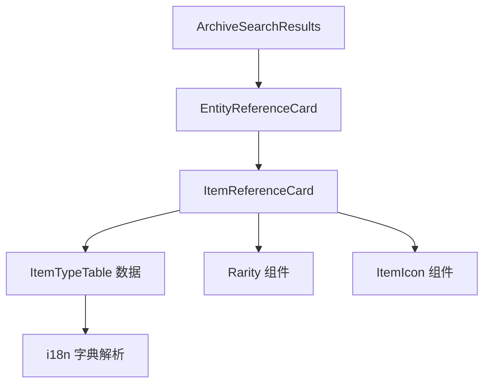
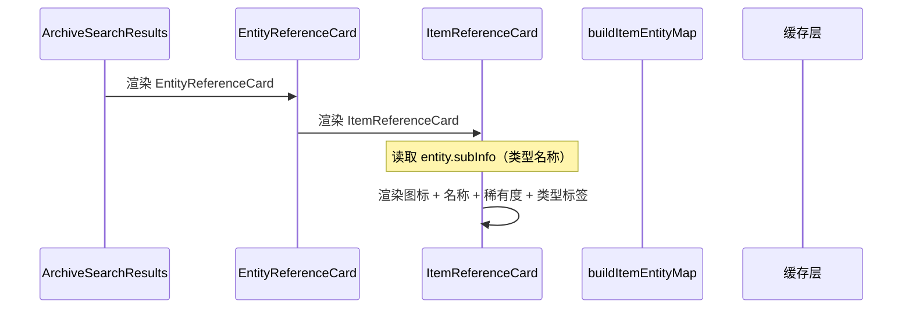

# 搜索结果物品参考卡片 - 技术提案

**功能名称**: 搜索结果 Item Reference Card
**关联 PRD**: [[20260725-item-reference-card|搜索结果物品参考卡片]]
**技术提案版本**: v1.0
**创建日期**: 2026-07-25
**作者**: 前端工程
**feat-branch**: `feat/item-reference-card`

## 1. 概述

### 1.1 背景

当前搜索结果中的 `ItemReferenceCard` 与 `WeaponReferenceCard` 完全一致，仅展示图标、名称、稀有度。用户无法从搜索结果中快速识别物品类型（材料、消耗品、收集品等）。

### 1.2 目标

- 增强 `ItemReferenceCard`，在基础信息区展示物品类型标签。
- 复用现有 `ItemTypeTable` 数据与 i18n 字典，不新增接口。
- 保持与 `SkillReferenceCard`、`TalentReferenceCard` 一致的视觉风格。

### 1.3 范围

**做**:
- 更新 `buildItemEntityMap` 函数，为物品实体添加类型信息。
- 增强 `ItemReferenceCard` 组件，展示物品类型标签。
- 补充必要的 i18n key。

**不做**:
- 不新增后端接口或数据服务。
- 不修改 `SearchEntity` 类型定义（复用 `subInfo` 字段）。
- 不改动搜索结果的整体布局与交互逻辑。

## 2. 技术架构

### 2.1 模块划分



| 模块 | 职责 | 关键技术点 |
|------|------|-----------|
| `lib/search.ts` → `buildItemEntityMap` | 构建物品实体映射 | 额外获取 `ItemTypeTable` 及其 i18n 字典，设置 `subInfo` |
| `components/Search/EntityCards.tsx` → `ItemReferenceCard` | 展示物品基础信息 | 读取 `entity.subInfo` 作为类型标签 |

## 3. API 与数据

### 3.1 接口契约

复用现有接口，无新增契约。

| 用途 | 接口 | 说明 |
|------|------|------|
| 获取物品类型表 | `GET /table/ItemTypeTable/all` | 用于解析类型 ID → 类型名称 |
| 获取类型表字典 | `GET /i18n/dict/{locale}/table/ItemTypeTable/all` | i18n 类型名称 |

### 3.2 数据来源

`buildItemEntityMap` 当前已获取 `ItemTable` 数据。需额外获取：

1. `ItemTypeTable` — 包含 `{ type: { name: { id, text } } }` 结构
2. `ItemTypeTable` 的 i18n 字典 — 解析类型名称

类型解析逻辑：

```ts
// 伪代码
const typeRaw = await getCachedData('ItemTypeTable', () => fetchTableAll('ItemTypeTable'))
const typeI18n = await getTableI18nDict('ItemTypeTable', locale)
const typeName = resolveI18n(typeRaw[itemType]?.name, typeI18n) || String(itemType)
```

## 4. 技术实现方案

### 4.1 核心流程



### 4.2 关键实现点

#### 4.2.1 更新 `buildItemEntityMap`

在 `src/lib/search.ts` 的 `buildItemEntityMap` 函数中，额外获取 `ItemTypeTable` 数据，将物品类型名称设置到 `subInfo` 字段：

```ts
async function buildItemEntityMap(locale: string): Promise<Record<string, SearchEntity>> {
  const [raw, i18nMap, typeRaw, typeI18n] = await Promise.all([
    getCachedData<Record<string, any>>('ItemTable', () => fetchTableAll('ItemTable')),
    getTableI18nDict('ItemTable', locale),
    getCachedData<Record<string, any>>('ItemTypeTable', () => fetchTableAll('ItemTypeTable')),
    getTableI18nDict('ItemTypeTable', locale),
  ])
  const map: Record<string, SearchEntity> = {}
  for (const [, v] of Object.entries<any>(raw)) {
    const id = v.itemId ?? v.$key ?? ''
    const typeName = resolveI18n(typeRaw[String(v.type)]?.name, typeI18n) || ''
    map[id] = {
      type: 'item',
      id,
      name: resolveI18n(v.name, i18nMap) || id,
      route: '/archive/items',
      icon: v.iconId ?? id,
      rarity: v.rarity ?? 0,
      subInfo: typeName || undefined,
    }
  }
  return map
}
```

#### 4.2.2 增强 `ItemReferenceCard`

在 `src/components/Search/EntityCards.tsx` 中，将 `ItemReferenceCard` 从简单的 `IconBar` 升级为包含类型标签的组件：

```tsx
function ItemReferenceCard({ entity }: ReferenceCardProps) {
  return (
    <ReferenceBar
      href={entity.route}
      left={
        <div className="w-10 h-10 overflow-hidden rounded">
          <RarityFrame rarity={entity.rarity ?? 0} size="sm" className="w-full h-full">
            <ItemIcon itemId={entity.id} className="w-full h-full" />
          </RarityFrame>
        </div>
      }
    >
      <div className="flex flex-col gap-0.5">
        <span className="truncate text-xs text-archive-ivory">{entity.name}</span>
        <Rarity level={entity.rarity ?? 0} />
        {entity.subInfo && (
          <span className="text-[9px] text-archive-dust">{entity.subInfo}</span>
        )}
      </div>
    </ReferenceBar>
  )
}
```

### 4.3 数据模型

复用现有 `SearchEntity` 类型，不新增字段：

```ts
export interface SearchEntity {
  type: 'weapon' | 'operator' | 'item' | 'enemy'
  id: string
  name: string
  route: string
  icon?: string
  portrait?: string
  rarity?: number
  displayType?: number
  subInfo?: string    // 物品类型名称
  tags?: string[]
}
```

`subInfo` 字段当前未被物品实体使用，正好用于存储类型名称。

### 4.4 项目结构

```
src/
  lib/
    search.ts              # 更新 buildItemEntityMap
  components/
    Search/
      EntityCards.tsx       # 更新 ItemReferenceCard
```

## 5. 测试策略

### 5.1 单元测试

- `buildItemEntityMap` 返回的实体包含 `subInfo` 字段。
- `subInfo` 值为正确的类型名称（从 `ItemTypeTable` 解析）。

### 5.2 组件测试

- `ItemReferenceCard` 渲染时展示类型标签。
- `subInfo` 为空时类型标签不显示。

### 5.3 E2E 测试

- 搜索结果中来自 `ItemTable` 的命中项展示物品类型标签。

## 6. 验收标准

- [ ] 技术方案评审通过
- [ ] 搜索结果中物品卡片展示类型标签
- [ ] 物品类型名称正确 i18n
- [ ] `npm run lint` 通过
- [ ] `npm run test` 通过
- [ ] `npm run build` 通过

## 7. 风险与回滚

| 风险 | 影响 | 缓解措施 |
|------|------|----------|
| `ItemTypeTable` 数据量较大增加首次加载时间 | 搜索实体映射构建变慢 | 数据走缓存，后续复用；仅在搜索时按需加载 |
| `subInfo` 字段被其他实体类型意外使用 | 类型标签显示错误 | 仅在 `entity.type === 'item'` 时读取 `subInfo` |

回滚策略：本次改动仅涉及搜索实体映射与卡片展示，可直接回滚到上一 commit。

## 8. 相关文档

- [[20260725-item-reference-card|搜索结果物品参考卡片]]
- [[20260719-archive-search|档案搜索完善]]
- [工程架构规范](../engineering-spec.md)
- [前端开发规范](../frontend-spec.md)
- [数据表映射参考](../references/data-mapping-tables.md)
