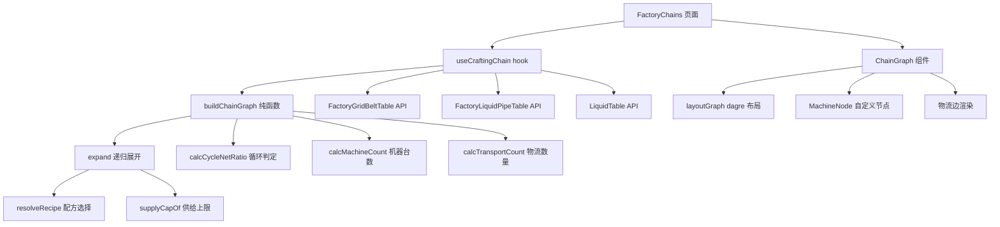
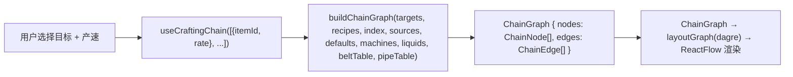

# 制作链路图 v2 - 技术提案

**功能名称**: 制作链路图 v2 重构
**关联 PRD**: [[20260726-factory-chain-v2|制作链路图 v2]]
**关联一期技术方案**: [[20260725-factory-system|工厂系统技术提案]]
**技术提案版本**: v1.1
**创建日期**: 2026-07-26
**作者**: 前端工程
**开发分支**: `feat/factory-chain-v2-impl`

## 修订记录

- v1.1 (2026-07-26): 按 PR #38 code review 修订：
  - 修正供应瓶颈算法维度错误（区分单台产速/需求速率/供给上限三个量）；
  - 多目标共享中间品合并由 max 改为 **sum（需求累加）**；
  - 液体判断由 ID 前缀硬编码改为 **`LiquidTable` 动态成员查询**（已验证：液体 ID 均为 `item_liquid_` 前缀，LiquidTable 含 11 个条目，305 个配方中 171 个涉及液体）；
  - `ChainEdge` 改为单物品边（`itemId: string`），解决多物品与单一 `perMinute`/`isPipe` 的矛盾；
  - 循环净产出改为**净产出比**（无量纲、与速率无关），R5 自消费统一并入 R1；
  - `ChainNode.kind` 新增 `'target'`，补齐节点 key 设计；
  - `calcTransportCount` 改为显式选择最大吞吐量条目，不再依赖 `Object.values()[0]` 键序；
  - 开发分支改为 `feat/factory-chain-v2-impl`（`feat/factory-archive-impl` 已随 PR #39 merge）。

## 1. 概述

### 1.1 背景

一期 `buildChainGraph` 以物品节点为中心展开链路，存在循环处理简单、缺少机器数量与物流设施、无法多目标合并等问题。本提案重构图构建算法与 UI，以机器节点为中心重新设计链路图的数据结构与渲染。

### 1.2 目标

- 重构 `ChainNode` / `ChainEdge` 类型，以机器节点为核心（移除物品节点）；
- 实现多目标 + 产速输入的 `buildChainGraph`，共享中间品需求**累加**合并；
- 实现供给封顶瓶颈（R7）、机器数量（R8）、传送带/管道数量（R9/R10）；
- 完善循环规则（R0-R6），以净产出比区分有效循环与封闭回路；
- 物流设施数据从 `FactoryGridBeltTable` / `FactoryLiquidPipeTable` 动态读取；液体集合从 `LiquidTable` 动态读取。

### 1.3 范围

**做**:
- `src/lib/factory/chain.ts` 核心算法重构（expand 递归、循环检测、速率计算、物流计算）。
- `src/lib/factory/types.ts` 类型重构（ChainTarget / ChainEdge / ChainNode）。
- `src/pages/factory/FactoryChains.tsx` 页面 UI 重构（多目标选择器 + 产速输入）。
- `src/components/Factory/ChainGraph.tsx` 图渲染重构（机器节点 + 物流边 + 循环样式）。
- `src/hooks/useData.ts` `useCraftingChain` 签名变更 + 新增物流表/液体表加载。
- 单元测试（`chain.test.ts`）覆盖全部规则。

**不做**:
- 配方切换交互（保留在后续迭代）。
- 蓝图保存/导出功能。

## 2. 技术架构

### 2.1 模块关系



### 2.2 数据流



## 3. 类型设计

### 3.1 `src/lib/factory/types.ts` 变更

```typescript
// === 新增 ===
interface ChainTarget {
  itemId: string
  rate: number           // 需求产速（个/min），允许非负非整数；0 表示不展开
}

// === 重构 ===
interface ChainNode {
  key: string
  kind: 'machine' | 'source' | 'target'   // 移除 'item'，新增 'target'
  itemId: string             // 节点主产出物品（target 节点为目标物品）
  machineId?: string         // target 节点无
  machineName?: string
  machineIcon?: string
  machineCount?: number      // ceil(actualPm / theoryPm)，target 节点无
  recipe?: {                 // source/target 节点无
    id: string
    inputs: { itemId: string; count: number; rate: number }[]   // rate = 该材料的实际需求速率
    outputs: { itemId: string; count: number; rate: number }[]
    totalProgress: number
  }
  demandPm: number           // 下游需求合计（多目标、多父节点累加）
  actualPm: number           // min(demandPm, supplyCap)
  theoryPm?: number          // 单台机器理论产出速率
  supplyLimited?: boolean    // demandPm > supplyCap 时标记
  isClosedLoop?: boolean     // 涉及封闭回路
}

// === 重构：单物品边 ===
interface ChainEdge {
  from: string           // 源节点 key
  to: string             // 目标节点 key
  itemId: string         // 传输物品（每边仅一种）
  perMinute: number      // 该物品的传输速率
  beltCount: number      // 传送带数量（固体）或管道数量（液体）
  isPipe: boolean        // 液体管道
  isCycle?: boolean
  cycleType?: 'productive' | 'closed'
  cycleRatio?: number    // 净产出比（>1 有效，≤1 封闭）
}

interface ChainGraph {
  nodes: ChainNode[]
  edges: ChainEdge[]
}
```

设计说明：

- **单物品边**：同一对节点间传输多种物品时生成多条边。避免 `itemIds[]` 与单一 `perMinute`/`isPipe` 的矛盾（不同物品速率不同、固液可能混合）。
- **`demandPm` 与 `actualPm` 分离**：需求自顶向下累加，实际产出受供给上限封顶，两者都展示在节点上（供给受限时可显示「需求 X / 实际 Y」）。

### 3.2 节点 key 设计

- 机器节点 key: `machine:{machineId}@{recipeId}`（同一机器不同配方产生不同节点）
- 源节点 key: `source:{machineId}:{itemId}`
- 目标节点 key: `target:{itemId}`（最终产物的终点标记节点，kind='target'，无机器信息）

## 4. 核心算法

### 4.1 三个速率概念（务必区分）

| 概念 | 含义 | 维度 |
|------|------|------|
| `theoryPm` | **单台**机器的理论产出速率 = `perMinute(outcomeCount, totalProgress)` | 每台/min |
| `demandPm` | 某物品被下游需求的合计速率（多目标、多父节点**累加**） | 总量/min |
| `supplyCap` | 某物品的供给上限：所有外部采集源产能之和；无外部供给时为 +∞ | 总量/min |

**关键原则：机器可自由增加台数，不构成瓶颈；链路中唯一的供给约束来自采集源**（矿机/泵/气矿机等，`FactorySource.produceRate + msPerRound`）。

### 4.2 速率换算

```typescript
// ⚠️ 单位勘误（验收 2.27）：totalProgress 不是毫秒，6000 进度 = 1 秒，系数为 360000
const perMinute = (count: number, totalProgress: number) =>
  totalProgress > 0 ? (count * 360000) / totalProgress : 0

// 注意：矿机/泵机的 msPerRound 是真毫秒，系数仍为 60000
const sourcePerMinute = (produceRate: number, msPerRound: number) =>
  msPerRound > 0 ? (produceRate * 60000) / msPerRound : 0
```

### 4.3 `buildChainGraph` 签名

```typescript
function buildChainGraph(
  targets: ChainTarget[],
  recipes: FactoryRecipe[],
  index: FactoryItemIndex,
  sources: FactorySource[],
  defaultCrafts: Record<string, string>,
  recipeOverride?: Record<string, string>,
  machines?: Record<string, { name: string; iconId: string }>,
  liquids?: Set<string>,              // LiquidTable 的物品 ID 集合
  beltTable?: Record<string, any>,    // FactoryGridBeltTable
  pipeTable?: Record<string, any>,    // FactoryLiquidPipeTable
): ChainGraph
```

流程：
1. 构建 `recipeById` Map、`asOutcome` 反查、`supplyCapByItem`（汇总 `sources`：`supplyCap[itemId] += sourcePerMinute(...)`，无源物品为 +∞）
2. 对每个 `rate > 0` 的 target：生成 `target:{itemId}` 节点，调用 `expand(itemId, target.rate, new Set(), targetKey)`
3. 多目标/多父节点产生的同 key 节点合并：`demandPm` **累加**后重算 `actualPm = min(demandPm, supplyCap)` 与 `machineCount = ceil(actualPm / theoryPm)`
4. 边按 `(from, to, itemId)` 合并，`perMinute` 累加后重算 `beltCount`

### 4.4 `expand` 递归函数

```typescript
function expand(
  itemId: string,
  demandPm: number,          // 下游对该物品的需求速率（总量维度）
  path: Set<string>,         // DFS 路径（环检测）
  parentKey: string,
  nodes: Map<string, ChainNode>,
  edges: Map<string, ChainEdge>,
): number                    // 返回实际供应速率 actualPm，供父节点结算
```

**流程**:
1. **外部供给优先（R4）**：若 `supplyCapByItem[itemId]` 有限（有采集源），生成/合并源节点，`actualPm = min(demandPm, supplyCap)`，`supplyLimited = demandPm > supplyCap`，返回 `actualPm`，不再展开机器配方
2. 查找产出配方（优先级：`recipeOverride[itemId]` → `defaultCrafts[itemId]` → `asOutcome[itemId][0]`）；无配方则按叶子（无供给，actualPm = 0）处理
3. **循环检测**：若 `path.has(itemId)`，走 §4.5 循环规则，返回循环净产出折算后的供给速率
4. 计算单台理论产出 `theoryPm = perMinute(outcomeCount, totalProgress)`
5. 计算实际产出 `actualPm = min(demandPm, supplyCap[itemId] ?? +∞)`（R7）
6. 计算机器台数 `machineCount = ceil(actualPm / theoryPm)`（R8）；`actualPm = 0` 时台数为 0
7. 生成/合并机器节点（含配方摘要、各材料实际需求速率）
8. 遍历材料：`matDemand = actualPm × (mat.count / outcomeCount)`（按配方比例折算，瓶颈自动向下游传导），递归 `expand(mat.itemId, matDemand, path+itemId, nodeKey)`，生成材料→本节点的物流边（R9/R10）

注意（v1.0 已修正的维度错误）：`actualPm` 是**总量**维度，与 `demandPm` 取 min；`theoryPm` 是**单台**维度，只用于求台数。禁止出现 `min(theoryPm, demandPm)` 这类跨维度运算。

### 4.5 循环规则（R0-R6）

**R0 循环定义**: 从物品 A 出发，经过若干配方和中间物品，最终回到 A 的路径。

**R1 净产出比判定**（无量纲，与速率无关，无需速率入参）:

```
沿循环路径每一级配方，取「循环物品」的产出数/投入数之比：
  netRatio = Π (outputQty_i / inputQty_i)
netRatio > 1  → 有效循环（productive）：循环有盈余，继续展开上游补足差额
netRatio ≤ 1  → 封闭回路（closed）：停止展开，边标记 cycleType='closed'
```

```typescript
function calcCycleNetRatio(
  stages: { inputQty: number; outputQty: number }[],  // 循环路径上各级配方中循环物品的投入/产出数
): number {
  return stages.reduce((acc, s) => acc * (s.inputQty > 0 ? s.outputQty / s.inputQty : 0), 1)
}
```

Worked examples：

| 循环 | 路径 | netRatio | 判定 |
|------|------|----------|------|
| 采种/种植 | 作物 →(采种 1→2)→ 种子 →(种植 1→1)→ 作物 | 2 × 1 = 2 | 有效循环 |
| 瓶装/倒空 | 液体 →(装瓶 1→1)→ 瓶装 →(倒空 1→1)→ 液体 | 1 × 1 = 1 | 封闭回路 |

**R2 配方比例分析**: 沿 DFS path 记录各级配方中循环物品的 inputQty/outputQty，供 R1 使用。

**R3 副产物隔离**: 多产出配方中，只有参与循环的那个产出计入 netRatio；其余产出作为副产物在节点内独立列出，不影响判定。

**R4 外部供应优先**: 循环中某物品有外部采集源时，在该点打断循环（§4.4 第 1 步优先于循环检测），由外部供给补足需求。

**R5 自消费防护**: 配方直接消费自身产出 = 长度为 1 的循环，**统一按 R1 净产出比处理**（如采种机 1→2，netRatio=2 为有效循环），不单独设异常分支。净产出比 ≤ 1 且无外部供应入口的回路，节点标记 `isClosedLoop`、边标记「↻ 封闭」。

**R6 循环深度限制**: DFS path 长度超过 10 层停止展开，节点标记为截断。

### 4.6 机器数量计算（R8）

```typescript
function calcMachineCount(actualPm: number, theoryPm: number): number {
  return theoryPm > 0 ? Math.ceil(actualPm / theoryPm) : 0
}
```

节点利用率 = `actualPm / (machineCount × theoryPm)`（< 1 时表示末台机器未满载，可在 UI tooltip 展示）。

### 4.7 物流设施计算（R9/R10）

```typescript
function calcThroughput(msPerRound: number, volume: number = 1): number {
  return msPerRound > 0 ? (volume * 60000) / msPerRound : 0
}

// 从物流表中显式选择吞吐量最高的条目（当前各表仅 1 个条目；
// 未来出多级传送带/管道时取最高档位，避免依赖对象键序）
function maxThroughput(
  transportTable: Record<string, any>,
  dataKey: 'beltData' | 'pipeData',
): number {
  let best = 0
  for (const entry of Object.values(transportTable)) {
    const data = (entry as any)?.[dataKey]
    if (!data) continue
    best = Math.max(best, calcThroughput(data.msPerRound, data.volume ?? 1))
  }
  return best
}

function calcTransportCount(rate: number, throughput: number): number {
  return throughput > 0 ? Math.ceil(rate / throughput) : 0
}
```

已验证的 API 数据（2026-07-26）：

| 表 | 条目 | 字段 | 计算结果 |
|----|------|------|----------|
| `FactoryGridBeltTable` | `grid_belt_01` | `beltData.msPerRound = 2000`（**无** `volume` 字段，需 `?? 1`） | 30 个/min |
| `FactoryLiquidPipeTable` | `log_pipe_01` | `pipeData.msPerRound = 500, volume = 1` | 120 单位/min |

**液体判断（R10）**：从 `LiquidTable` 动态加载液体物品 ID 集合（`Object.keys`）传入 `buildChainGraph` 的 `liquids` 参数，`isPipe = liquids.has(itemId)`。禁止 ID 前缀硬编码。已验证：当前 11 个液体物品 ID 均为 `item_liquid_` 前缀，305 个配方中 171 个涉及液体。

## 5. 页面 UI 重构

### 5.1 FactoryChains 布局

```
┌─────────────────────────────────────────────────────────┐
│  目标 1: [▼ 中容武陵电池     ] 产速: [6.0] 个/min  [×]  │
│  目标 2: [▼ 高纯硅晶片       ] 产速: [3.5] 个/min  [×]  │
│  [+ 添加目标产物]                                        │
│                                                         │
│                 [ReactFlow 链路图]                        │
│                                                         │
└─────────────────────────────────────────────────────────┘
```

- 移除左侧列表 + 分页逻辑
- 顶部多目标选择器 + 产速输入框
- URL 参数: `?targets={itemId}:{rate},{itemId}:{rate}`
  - rate 缺省或非法（NaN、负数、非数值）→ 回退为该物品默认配方的理论产出速率
  - rate = 0 → 保留目标行但不展开节点（PRD §3.5）
  - 重复的 itemId → 后者覆盖前者
- 数据流: `useCraftingChain(targets)` → `buildChainGraph`

### 5.2 MachineNode 渲染

每个机器节点显示：
- 机器图标 + 名称 + ×N（台数）
- 配方摘要: `输入物品 → 输出物品 ×数量`
- 实际产出速率（供给受限时显示 `需求 X / 实际 Y` 并高亮标记）
- 副产物（如有）独立列出

### 5.3 边渲染

| 边类型 | 样式 | 标签 |
|--------|------|------|
| 固体传送带 | 金色实线 `#C9A96E` + 方向箭头 | `传送带×N (XX/min)` |
| 液体管道 | 蓝色虚线 `#3b82f6` + `strokeDasharray: '8 4'` + 方向箭头 | `管道×N (XX/min)` |
| 有效循环 | 金色实线 + 净产出比标注 | `↻ ×N.N 净产出` |
| 封闭回路 | 橙色虚线 `#f59e0b` + `strokeDasharray: '5 5'` | `↻ 封闭` |

## 6. Hook 变更

### 6.1 `useCraftingChain`

```typescript
// 变更前
useCraftingChain(targets: string[]): UseDataResult<ChainGraph>

// 变更后
useCraftingChain(targets: ChainTarget[]): UseDataResult<ChainGraph>
```

- 新增加载 `FactoryGridBeltTable`、`FactoryLiquidPipeTable`、`LiquidTable`（`fetchTableAll`，`.catch(() => ({}))` 容错）
- `LiquidTable` 的 key 集合转为 `Set<string>` 作为 `liquids` 参数
- 传递 `machines`、`liquids`、`beltTable`、`pipeTable` 到 `buildChainGraph`

## 7. 测试策略

### 7.1 单元测试（`src/lib/factory/chain.test.ts`）

按功能模块分组：

| 测试组 | 覆盖规则 | 关键用例 |
|--------|----------|----------|
| 循环规则 | R0-R6 | 采种/种植 netRatio=2 有效、瓶装/倒空 netRatio=1 封闭、副产物隔离、外部供应打断、自消费并入 R1、深度限制 10 层 |
| 供给封顶瓶颈 | R7 | 源供给充足满产、需求超源产能封顶并标记 supplyLimited、瓶颈向下游逐级传导、无源物品不封顶 |
| 机器数量 | R8 | 单台、多台（需求 100/min ÷ 单台 30/min = 4 台）、小数取整、actualPm=0 台数为 0 |
| 传送带/管道数量 | R9 | 固体、液体、小数取整、多级条目取最大吞吐量 |
| 液体区分 | R10 | LiquidTable 成员为管道、非成员为传送带、空集合降级全固体 |
| 多目标 | - | 共享中间品需求**累加**（30+20=50 → 台数按 50 算）、独立子图、目标产速影响 |
| 非整数产速 | - | 小数、零值不展开、极小值 |
| 吞吐量计算 | - | 传送带、管道、零值、缺 volume 字段默认 1 |

### 7.2 E2E 测试（`tests/e2e/src/factory.spec.ts`）

- 多目标添加/删除/产速修改后链路图更新
- URL 参数同步与刷新还原（含非法 rate 回退）
- 封闭回路视觉标记验证

## 8. 验收标准

- [ ] 多目标产物支持，每个可独立设置产速
- [ ] 链路图以机器节点为中心，显示机器名称/台数/配方摘要/实际产出
- [ ] 机器台数 = ceil(实际产出 / 单台理论产出)，需求 100/min、单台 30/min 时显示 4 台
- [ ] 共享中间品按需求累加结算
- [ ] 供给受限节点正确标记并向下游传导
- [ ] 传送带/管道数量与吞吐量在边上标注，固体金色实线/液体蓝色虚线自动区分
- [ ] 封闭回路橙色虚线 + "↻ 封闭" 标记，有效循环标注净产出比
- [ ] 物流与液体数据从 API 动态读取，零硬编码
- [ ] `npm run lint && npm run test && npm run build` 通过
- [ ] 单元测试覆盖全部规则（R0-R10）

## 9. 涉及文件

| 文件 | 变更 |
|------|------|
| `src/lib/factory/types.ts` | `ChainTarget` 新增；`ChainEdge` 重构（单物品）；`ChainNode` 重构（kind 增 'target'、demandPm/actualPm/supplyLimited） |
| `src/lib/factory/chain.ts` | 重构 `buildChainGraph`（多目标+产速+供给封顶）、`expand`（返回 actualPm）；新增 `calcCycleNetRatio`/`calcMachineCount`/`calcTransportCount`/`calcThroughput`/`maxThroughput` |
| `src/hooks/useData.ts` | `useCraftingChain` 签名变更；新增加载 `FactoryGridBeltTable`/`FactoryLiquidPipeTable`/`LiquidTable` |
| `src/pages/factory/FactoryChains.tsx` | 移除左侧列表，新增多目标下拉选择器+产速输入框+URL 同步 |
| `src/components/Factory/ChainGraph.tsx` | 重构为机器节点为中心；MachineNode 显示配方/台数/实际产出；边渲染区分固液与循环类型 |
| `scripts/i18n-custom.json` → `src/i18n/dicts/*.json` | 新增 i18n key（14 语言，走生成流程） |
| `src/lib/factory/chain.test.ts` | 新增单元测试 |
| `tests/e2e/src/factory.spec.ts` | 更新 E2E 测试适配新 UI |

## 10. 风险与缓解

| 风险 | 影响 | 缓解措施 |
|------|------|----------|
| 多目标合并后节点重算顺序 | 台数/边速率不准 | 先按 key 聚合 demandPm/perMinute，再统一重算 actualPm/machineCount/beltCount；单测覆盖 |
| 源供给封顶与循环同时出现 | 结算复杂 | R4 外部供应优先于循环检测，源点直接打断；单测覆盖组合场景 |
| 超大链路图性能 | 渲染卡顿 | xyflow 视窗渲染 + fitView；必要时限制默认展开深度 |
| 新类型导致编译错误扩散 | 开发阻塞 | 类型先行（阶段一），随后阶段统一修复编译错误 |
| 物流表未来出现多级条目 | 选错吞吐量 | `maxThroughput` 显式取最高档位，不依赖键序 |

## 11. 相关文档

- [[20260726-factory-chain-v2|制作链路图 v2 PRD]]
- [[20260726-factory-chain-v2-plan|制作链路图 v2 实现方案]]
- [[20260725-factory-system|工厂系统技术提案（一期）]]
- [工程架构规范](../engineering-spec.md)
- [数据层常见陷阱](../references/data-pitfalls.md)
