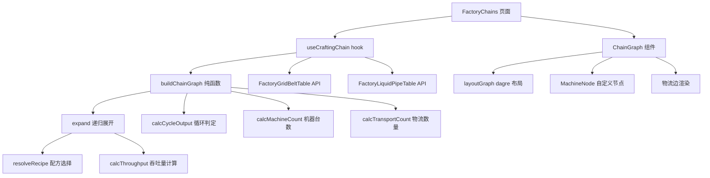
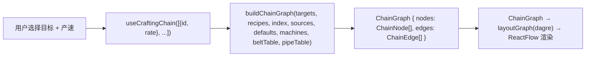

# 制作链路图 v2 - 技术提案

**功能名称**: 制作链路图 v2 重构
**关联 PRD**: [[20260726-factory-chain-v2|制作链路图 v2]]
**关联一期技术方案**: [[20260725-factory-system|工厂系统技术提案]]
**技术提案版本**: v1.0
**创建日期**: 2026-07-26
**作者**: 前端工程
**开发分支**: `feat/factory-archive-impl`

## 1. 概述

### 1.1 背景

一期 `buildChainGraph` 以物品节点为中心展开链路，存在循环处理简单、缺少机器数量与物流设施、无法多目标合并等问题。本提案重构图构建算法与 UI，以机器节点为中心重新设计链路图的数据结构与渲染。

### 1.2 目标

- 重构 `ChainNode` / `ChainEdge` 类型，以机器节点为核心（移除物品节点）；
- 实现多目标 + 产速输入的 `buildChainGraph`；
- 实现供应瓶颈计算（R7）、机器数量（R8）、传送带/管道数量（R9/R10）；
- 完善循环规则（R0-R6），区分有效循环与封闭回路；
- 物流设施数据从 `FactoryGridBeltTable` / `FactoryLiquidPipeTable` 动态读取。

### 1.3 范围

**做**:
- `src/lib/factory/chain.ts` 核心算法重构（expand 递归、循环检测、速率计算、物流计算）。
- `src/lib/factory/types.ts` 类型重构（ChainTarget / ChainEdge / ChainNode）。
- `src/pages/factory/FactoryChains.tsx` 页面 UI 重构（多目标选择器 + 产速输入）。
- `src/components/Factory/ChainGraph.tsx` 图渲染重构（机器节点 + 物流边 + 循环样式）。
- `src/hooks/useData.ts` `useCraftingChain` 签名变更 + 新增物流表加载。
- 单元测试（`chain.test.ts`）覆盖全部规则。

**不做**:
- 配方切换交互（保留在后续迭代）。
- 蓝图保存/导出功能。

## 2. 技术架构

### 2.1 模块关系



### 2.2 数据流



## 3. 类型设计

### 3.1 `src/lib/factory/types.ts` 变更

```typescript
// === 新增 ===
interface ChainTarget {
  itemId: string
  rate: number           // 需求产速（个/min），允许非负数
}

// === 重构 ===
interface ChainEdge {
  from: string           // 源机器节点 key
  to: string             // 目标机器节点 key
  itemIds: string[]      // 传输的物品 ID 列表
  perMinute: number      // 传输速率（个/min 或 单位/min）
  beltCount: number      // 需要的传送带数量（固体）或管道数量（液体）
  isPipe: boolean        // 是否为液体管道
  isCycle?: boolean
  cycleType?: 'productive' | 'closed'
  cycleOutput?: number
  cycleInput?: number
}

// === 重构 ===
interface ChainNode {
  key: string
  kind: 'machine' | 'source'   // 移除 'item'
  machineId: string
  machineName: string
  machineIcon: string
  machineCount: number          // 需要的机器数量（向上取整）
  recipe: {
    id: string
    inputs: { itemId: string; count: number; rate: number }[]
    outputs: { itemId: string; count: number; rate: number }[]
    totalProgress: number
  }
  actualPm: number              // 实际产出速率
  theoryPm: number              // 单台理论产出速率
  isClosedLoop?: boolean        // 是否涉及封闭回路
}

interface ChainGraph {
  nodes: ChainNode[]
  edges: ChainEdge[]
}
```

### 3.2 节点 key 设计

- 机器节点 key: `{machineId}@{recipeId}`（同一机器不同配方产生不同节点）
- 源节点 key: `source@{machineId}:{itemId}`
- 目标节点 key: `target@{itemId}`（最终产物的标记节点）

## 4. 核心算法

### 4.1 `buildChainGraph` 签名

```typescript
function buildChainGraph(
  targets: ChainTarget[],
  recipes: FactoryRecipe[],
  index: FactoryItemIndex,
  sources: FactorySource[],
  defaultCrafts: Record<string, string>,
  recipeOverride?: Record<string, string>,
  machines?: Record<string, { name: string; iconId: string }>,
  beltTable?: Record<string, any>,
  pipeTable?: Record<string, any>,
): ChainGraph
```

### 4.2 `expand` 递归函数

```typescript
function expand(
  itemId: string,
  availableRate: number,     // 上游实际可用速率（供应瓶颈）
  path: Set<string>,         // DFS 路径（环检测）
  targetKey: string,
  nodes: Map<string, ChainNode>,
  edges: Map<string, ChainEdge>,
): void
```

**流程**:
1. 查找产出配方（优先 `recipeOverride[itemId]` → `defaultCrafts[itemId]` → `asOutcome[itemId][0]`）
2. 计算理论产出 `theoryPm = perMinute(outcomeCount, totalProgress)`
3. 计算实际产出 `actualPm = min(theoryPm, availableRate)`（R7 供应瓶颈）
4. 计算机器台数 `machineCount = ceil(actualPm / theoryPm)`（R8）
5. 生成/合并机器节点
6. 遍历材料，计算需求速率，递归 `expand`
7. 对回传物品做循环检测（R0-R6）

### 4.3 循环规则（R0-R6）

**R0 循环定义**: 从物品 A 出发，经过若干配方和中间物品，最终回到 A 的路径。

**R1 净产出判定**:
```
净产出 = 循环产出量 - 循环消耗量
净产出 > 0 → 有效循环（productive）：继续向上游展开
净产出 ≤ 0 → 封闭回路（closed）：停止展开
```

**R2 配方比例分析**: 循环路径上每个配方的输入/输出比例分析，辅助 R1 判定。

**R3 副产物隔离**: 多产出配方中，只有参与循环的产出参与判定，其他为副产物。

**R4 外部供应优先**: 循环中某物品有外部来源（`sources` 中），在该点打断循环。

**R5 自消费防护**: 配方消费自己产出且无外部供应，标记异常。

**R6 循环深度限制**: 最大 10 层。

### 4.4 物流设施计算

```typescript
function calcThroughput(msPerRound: number, volume: number = 1): number {
  return msPerRound > 0 ? (volume * 60000) / msPerRound : 0
}

function calcTransportCount(
  rate: number,
  transportTable: Record<string, any>,
  isPipe: boolean,
): number {
  const entry = Object.values(transportTable)[0]
  const data = isPipe ? entry.pipeData : entry.beltData
  const throughput = calcThroughput(data.msPerRound, data.volume ?? 1)
  return throughput > 0 ? Math.ceil(rate / throughput) : 0
}
```

**液体判断**: 根据物品 ID 前缀（`liquid_`、`acid`、`water`、`oil` 等）判断是否为液体物品。

### 4.5 机器数量计算

```typescript
function calcMachineCount(actualPm: number, theoryPm: number): number {
  return theoryPm > 0 ? Math.ceil(actualPm / theoryPm) : 0
}
```

### 4.6 速率换算

```typescript
const perMinute = (count: number, totalProgress: number) =>
  totalProgress > 0 ? (count * 60000) / totalProgress : 0
```

## 5. 页面 UI 重构

### 5.1 FactoryChains 布局

```
┌─────────────────────────────────────────────────────────┐
│  目标 1: [▼ 中容武陵电池     ] 产速: [6.0] 个/min  [×]  │
│  目标 2: [▼ 高纯硅晶片       ] 产速: [3.5] 个/min  [×]  │
│  [+ 添加目标产物]                                        │
│                                                         │
│                 [ReactFlow 链路图]                        │
│                                                         │
└─────────────────────────────────────────────────────────┘
```

- 移除左侧列表 + 分页逻辑
- 顶部多目标选择器 + 产速输入框
- URL 参数: `?targets=xxx:rate,yyy:rate`
- 数据流: `useCraftingChain(targets)` → `buildChainGraph`

### 5.2 MachineNode 渲染

每个机器节点显示：
- 机器图标 + 名称 + ×N（台数）
- 配方摘要: `输入物品 → 输出物品 ×数量`
- 总产出速率
- 副产物（如有）独立列出

### 5.3 边渲染

| 边类型 | 样式 | 标签 |
|--------|------|------|
| 固体传送带 | 金色实线 `#C9A96E` + 方向箭头 | `传送带×N (XX/min)` |
| 液体管道 | 蓝色虚线 `#3b82f6` + `strokeDasharray: '8 4'` + 方向箭头 | `管道×N (XX/min)` |
| 有效循环 | 金色实线 + 产出数量 | `×N 产出 / ×M 消耗` |
| 封闭回路 | 橙色虚线 `#f59e0b` + `strokeDasharray: '5 5'` | `↻ 封闭` + 产出数量 |

## 6. Hook 变更

### 6.1 `useCraftingChain`

```typescript
// 变更前
useCraftingChain(targets: string[]): UseDataResult<ChainGraph>

// 变更后
useCraftingChain(targets: ChainTarget[]): UseDataResult<ChainGraph>
```

- 新增加载 `FactoryGridBeltTable` 和 `FactoryLiquidPipeTable`
- 传递 `machines`、`beltTable`、`pipeTable` 到 `buildChainGraph`

## 7. 测试策略

### 7.1 单元测试（`src/lib/factory/chain.test.ts`）

按功能模块分组：

| 测试组 | 覆盖规则 | 关键用例 |
|--------|----------|----------|
| 循环规则 | R0-R6 | 封闭回路判定、有效循环判定、副产物隔离、外部供应打断、深度限制 |
| 供应瓶颈 | R7 | 满产、减产、过剩供应、级联瓶颈 |
| 机器数量 | R8 | 单台、多台、小数取整 |
| 传送带/管道数量 | R9 | 固体 30/min、液体 120/min、小数取整 |
| 液体管道区分 | R10 | 液体 ID 前缀检测、固体检测 |
| 多目标 | - | 共享中间品、独立子图、目标产速影响 |
| 非整数产速 | - | 小数、零值、极小值 |
| 吞吐量计算 | - | 传送带、管道、零值 |

### 7.2 E2E 测试（`tests/e2e/src/factory.spec.ts`）

- 多目标添加/删除/产速修改后链路图更新
- URL 参数同步与刷新还原
- 封闭回路视觉标记验证

## 8. 验收标准

- [ ] 多目标产物支持，每个可独立设置产速
- [ ] 链路图以机器节点为中心，显示机器名称/台数/配方摘要/总产出
- [ ] 传送带/管道数量与吞吐量在边上标注
- [ ] 固体金色实线/液体蓝色虚线自动区分
- [ ] 封闭回路橙色虚线 + "↻ 封闭" 标记
- [ ] 供应瓶颈计算正确（满产/减产/级联）
- [ ] 物流数据从 API 动态读取，禁止硬编码
- [ ] `npm run lint && npm run test && npm run build` 通过
- [ ] 单元测试覆盖全部规则（R0-R10）

## 9. 涉及文件

| 文件 | 变更 |
|------|------|
| `src/lib/factory/types.ts` | `ChainTarget` 新增；`ChainEdge` 重构；`ChainNode` 重构 |
| `src/lib/factory/chain.ts` | 重构 `buildChainGraph`（多目标+产速）、`expand`（供应瓶颈）；新增 `calcCycleOutput`/`calcMachineCount`/`calcTransportCount` |
| `src/hooks/useData.ts` | `useCraftingChain` 签名变更；新增加载物流表 |
| `src/pages/factory/FactoryChains.tsx` | 移除左侧列表，新增多目标下拉选择器+产速输入框 |
| `src/components/Factory/ChainGraph.tsx` | 重构为机器节点为中心；MachineNode 显示配方/数量/传送带；边渲染区分循环类型 |
| `src/i18n/dicts/*.json` | 新增 i18n key |
| `src/lib/factory/chain.test.ts` | 新增循环规则、供应瓶颈、机器数量、传送带数量的单元测试 |
| `tests/e2e/src/factory.spec.ts` | 更新 E2E 测试适配新 UI |

## 10. 风险与缓解

| 风险 | 影响 | 缓解措施 |
|------|------|----------|
| 液体 ID 前缀判断不准 | 固体/液体边样式错误 | 先验证 `LiquidTable` 确认液体物品列表，必要时使用白名单 |
| 多目标共享中间品的机器数量合并逻辑 | 机器数量不准确 | 取所有目标需求的最大值（非 sum），需单元测试覆盖 |
| 超大链路图性能 | 渲染卡顿 | xyflow 视窗渲染 + fitView；必要时限制默认展开深度 |

## 11. 相关文档

- [[20260726-factory-chain-v2|制作链路图 v2 PRD]]
- [[20260726-factory-chain-v2-plan|制作链路图 v2 实现方案]]
- [[20260725-factory-system|工厂系统技术提案（一期）]]
- [工程架构规范](../engineering-spec.md)
- [数据层常见陷阱](../references/data-pitfalls.md)
