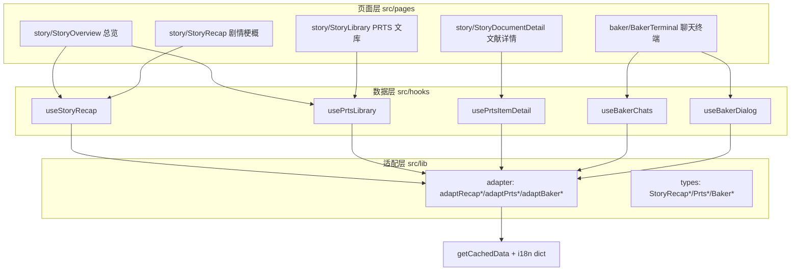

# 剧情纪事 - 技术提案

**功能名称**: 剧情纪事（Story Chronicle）—— archive/story 模块重构 + Baker 新模块
**关联 PRD**: [[20260730-story-chronicle|剧情纪事]]
**技术提案版本**: v1.3
**创建日期**: 2026-07-30
**作者**: 前端工程
**feat-branch**: `feat/story-chronicle`

**v1.3 变更**: 清理 v1.2 更名后的旧称遗留（纪事长卷→剧情梗概、馆藏文库→PRTS 文库）；补充 dlg key 四种变体格式；数据复核修正（分支点 931→999、测试类型 ~31→7）；明确分支点节点本身无消息文本；说明 DialogSummaryTable 1143 条中 1078 条被映射。

**v1.2 变更**: 根据 review 意见调整命名（纪事长卷→剧情梗概、馆藏文库→PRTS 文库）、明确篇章类型前缀为数据规律归纳、Baker「我」默认角色 chr_0003_endminf、Baker topic 排序策略。

## 1. 概述

### 1.1 背景

现有 story 模块（`src/pages/story/StoryOverview.tsx`，29 行）仅拉取 `PrtsDocument` 单表渲染标题网格，`StoryDocument` 类型无正文字段，无详情路由。数据侧已确认游戏内存在完整叙事数据体系（剧情梗概 1143 段、PRTS 文献 462 条、富文本正文 676 篇），可支撑 PRD 的「剧情梗概」与「PRTS 文库」两大板块。

### 1.2 目标

- 接入剧情梗概（DialogSummary）与 PRTS 文库（Prts\* 系列表）数据，完成 adapter / hooks / 页面三层重构。
- 新增 4 个 story 页面：总览、剧情梗概、PRTS 文库、文献详情；新增 Baker 模块页面（联系人列表 + 聊天界面）。
- 模块更名「剧情纪事」，新增「Baker」入口，全站导航与 i18n 同步。

### 1.3 范围

**做**:
- 剧情梗概数据接入与「剧情梗概」页（篇章导航 + 梗概流 + 类型筛选）。
- PRTS 六类文献浏览（分类页签 + 卷网格）与文献详情页（富文本正文 / 音像剧本）。
- Baker 模块：联系人列表（四 Tab 筛选）+ 聊天界面（消息流、分支选项切换、图片/表情包/表情回应/系统提示/分享卡片）。
- 模块总览页、路由、导航更名与 Baker 入口、i18n 扩充。
- `docs/engineering/references/data-mapping-tables.md` 补充新表映射。

**不做**:
- 剧情全文对话回放（`DialogTextTable`，数据量极大，后续版本评估）。
- 剧情梗概与文献的全文搜索（依赖搜索模块扩展，单独立项）。
- 音像条目的音频播放与 Baker 语音/视频消息播放（素材服务仅支持 png/tga 下载，无音视频文件）。
- 文献关联网络（文献 → 干员/地区/敌人跳转，后续版本）。
- Baker 测试用消息类型（视频/语音/物品卡/投票/转发卡，线上数据基本不出现）的专门渲染，统一按未知类型跳过。

## 2. 数据探查结论

### 2.1 剧情梗概

| 表 | 规模 | 结构 | 说明 |
|----|------|------|------|
| `DialogSummaryMapTable` | 1078 keys | `dlg_*` → `summary_*`（字符串） | 对话组 → 梗概条目映射 |
| `DialogSummaryTable` | 1143 keys | `{ id, text }` | 梗概文本（i18n id），i18n dict 按表可取 |

- `dlg_*` key 编码了篇章/任务/场次：如 `dlg_e1m3_4` = 篇章 e1 · 任务 m3 · 第 4 场，天然有序。已对全量 1078 个 key 验证存在四种格式变体：`dlg_e1m3_4`（常规）、`dlg_sm2l4m5_9`（l 段，293 条 sm 支线全部为此型）、`dlg_a1m8d1_1`（m 后 d 段，117 条）、`dlg_e1m1_4d2`（场次 d 后缀，65 条）。完整正则：`^dlg_([a-z]+)(\d+)(?:l(\d+))?m(\d+)(?:d(\d+))?_(\d+)(?:d(\d+))?$`。排序须按解析出的数值元组（chapter 数达 33、mission 数达 29、sceneNo 最大 13034，字符串排序必错乱）。
- `DialogSummaryTable` 共 1143 条，其中 1078 条被 map 表引用（一一对应）；其余 65 条无对话组映射，初版以 map 表为准展示 1078 段，未映射条目不展示。
- 前缀分布（**数据规律归纳，命名规则暂不明确**，实现时用 i18n search 校准命名）：`e`(346) 主线、`sm`(293) 支线、`c`(197) 干员故事、`f`(122) 地区事务、`gm`(87) 委托、`a`(19) 谷地支线、`db`(13) 协议空间、`m`(1) 其他。实现阶段需用游戏内文本校准各类型的实际含义。
- 梗概文本样例质量良好（如 `summary_e1m1_1_001`：「你与佩丽卡准备徒步前往枢纽区基地。」）。

### 2.2 PRTS 文库

```mermaid
entityRelationshipDiagram
    PrtsCategory ||--o{ PrtsFirstLv : categoryId
    PrtsFirstLv ||--o{ PrtsAllItem : itemIds
    PrtsAllItem ||--o| RichContentTable : contentId
    PrtsAllItem ||--o| RadioTable : "contentId (multi_media)"
    PrtsReading ||--o{ RichContentTable : "list.contentId"
```

| 表 | 规模 | 关键字段 | 说明 |
|----|------|---------|------|
| `PrtsPage` | 3 | `pageType`, `icon` | 游戏内三大页签（中枢档案/音像存档/见闻辑录），仅作背景参考 |
| `PrtsCategory` | 6 | `categoryId`, `name`, `order`, `tabIcon` | 六类：document 中枢档案 / paper 纸质记录 / digital 电子档案 / collection 藏品 / report 调查报告 / media 多媒体 |
| `PrtsFirstLv` | 418 | `categoryId`, `icon`, `itemIds[]`, `name`, `subName`, `order` | 「卷」分组（如《定居地全貌》），含图标与条目 id 列表 |
| `PrtsAllItem` | 462 | `contentId`, `desc`, `firstLvId`, `name`, `order`, `type` | 全部条目汇总（text 366 / document 71 / multi_media 25），可替代 PrtsRecord/PrtsDocument/PrtsMultimedia 三表 |
| `RichContentTable` | 676 | `title{id}`, `contentList[{content{id}}]` | 正文容器，多段连续文本，含 `<image>Reading/xxx</image>` 富文本 |
| `RadioTable` | 2909 | `radioSingleDataList[{actorName, radioText, audioOverride}]` | 音像剧本，按 `contentId`（`radio_*`）取单条 |
| `PrtsReading` | 21 | `list{N}.contentId/name/order` | 阅读物组（term_*），归入文库条目展示 |
| `PrtsInvestigate` | 15 | `categoryDataList`, `collectionIdList`, `domainId` | 调查报告关联，初版仅通过 FirstLv 体系间接展示 |

### 2.3 Baker 聊天（SNS 系列表）

游戏内聊天软件官方名称为 **Baker**（`TextTable: LUA_UI_SNS_ENTER_NAME`，各语言均为 "Baker"）。

```mermaid
entityRelationshipDiagram
    SNSChatTable ||--o{ SNSDialogTable : chatId
    SNSDialogTopicTable ||--o{ SNSDialogTable : "includeDialogIds / topicId"
    SNSDialogTable ||--o{ SNSDialogOptionTable : dialogOptionIds
    SNSChatTable ||--o{ SNSChatTable : "speaker → 发送者(群聊)"
```

| 表 | 规模 | 关键字段 | 说明 |
|----|------|---------|------|
| `SNSChatTable` | 137 | `chatId`, `chatType`, `name`, `icon`, `charGender`, `isSettlementChannel` | 会话。`chatType`：1=联系人（NPC 单聊，81）、2=群聊（28）、3=干员（干员单聊，28），与 PRD 四 Tab 对应 |
| `SNSDialogTable` | 334 | `chatId`, `dialogId`, `dialogType`, `noticeType`, `relatedMissionId`, `topicId`, `dialogContentData` | 一场聊天（会话内按剧情顺序多场），`dialogContentData` 为消息节点图 |
| `SNSDialogOptionTable` | 1425 | `optionDesc`, `optionNextContentId`, `optionResPath`, `optionNPCIds` | 分支选项；`optionResPath` 非空（143 条，`sns_emoji_*`）表示以表情包回复 |
| `SNSDialogTopicTable` | 117 | `topicId`, `topicName`, `sortId`, `includeDialogIds[]` | 话题分组（干员日常聊天），`sortId` 提供顺序 |
| `SNSConst` | 4 | `myselfSpeaker=endmin`, `snsDialogStartId=1` | 「我」的 speaker id（对应角色 `chr_0003_endminf`）与消息图入口节点 id |

**消息节点**（`dialogContentData[contentId]`）：`content{i18n}`, `contentType`, `speaker`, `nextContentId`, `preContentId`, `dialogOptionIds[]`, `optionType`, `isEnd`（`nextContentId=-1` 为会话结束）。

`contentType` 分布与渲染策略：

| contentType | 数量 | 含义 | 渲染 |
|---|---|---|---|
| 1 | 6173 | 文本 | 气泡（含富文本） |
| 2 | 28 | 图片（`contentParam=[sns_image_*]`） | 图片消息 |
| 7 | 95 | 系统提示（如「[铁锚子]已离线」） | 居中提示条 |
| 9 | 1+ | 表情回应（`contentParams` JSON：`emojiResPath`+`npcIds`+`npcCount`） | pin reaction 角标，附着在前序消息 |
| 10 | 20 | PRTS 收藏分享（`contentParams` 含 `nar_*` 条目 id） | 分享卡片（可跳转文献详情） |
| 12 | 44 | 任务链接（`linkMissionId`） | 任务卡片 |
| 4/5/6/8/11 | 7 | 视频/语音/物品卡/转发卡/投票（均为 `sns_test_*` 测试会话） | 未知类型跳过不渲染 |

**分支模型**：`dialogOptionIds` 非空的节点为分支点（999 处，选项数 1/2/3 个分别 621/330/48）。**分支点节点本身无消息文本**（999/999 `content.id` 为空，是纯选项容器），不得渲染为消息气泡；选中选项成为「我」发出的消息。各选项 `optionNextContentId` 指向不同后续节点，分支最终汇合（固定路径）。切换选项即从分支点沿新 `optionNextContentId` 重新遍历。

**素材**：头像 `sprites/charroundicon/{icon}.png`（`icon_sns_npc_*` / `icon_round_chr_*`，61+30 个）；表情包 `sprites/sns/emoji/sns_emoji_*.png`（43）；图片消息 `sprites/sns/picture/sns_image_*.png`（37）。

**会话内多场聊天排序**：topic 会话按 `SNSDialogTopicTable.sortId` 排序；每个 topic 有标题字段 `topicName`，有标题时显示标题，无标题时显示该 topic 最后一条消息的预览文本。同一 topic 内的多场聊天按 `dialogId` 自然序；任务关联会话按 `relatedMissionId` 自然序兜底（实现阶段抽样校准）。

**发送者解析**：`speaker=endmin` →「我」（对应角色 `chr_0003_endminf`，管理员在游戏中的角色）；其余 speaker 即 `SNSChatTable` 的 `chatId`（如 `sns_chr_0013_aglina`），名称与头像经会话表解析。

### 2.4 素材资源

- Baker 头像 / 表情包 / 图片消息路径见 §2.3。
- 卷图标：`sprites/prts/icon/{icon}.png`（189 个 prts 图标），部分图标在 `sprites/prts/{icon}.png`（如 `icon_entrance_pivot`），需双路径回退。
- 正文插图：`<image>Reading/xxx</image>` 已由 `src/lib/richText.tsx` 解析为 `sprites/{path}.png`（现有能力，直接复用）。
- 已验证 `PrtsCategory` / `PrtsFirstLv` / `PrtsAllItem` / `RichContentTable` / `DialogSummaryTable` 的 i18n dict 接口均可用。

## 3. 技术架构

### 3.1 模块划分



| 模块 | 职责 | 关键技术点 |
|------|------|-----------|
| `lib/types.ts` | 新增剧情/文库/Baker 类型 | 见 §4.1 / §4.3 |
| `lib/adapter.ts` | 原始表 → 类型化结构 | 64 位 id 一律 `String(id)`（见 data-pitfalls） |
| `lib/baker.ts` | 消息图遍历与分支求值 | 见 §4.4 |
| `hooks/useData.ts` | 数据获取 hooks | 复用 `getCachedData` + `getTableI18nDict` |
| `pages/story/*`、`pages/baker/*` | 页面 | 遵循列表页/卷宗页/总览页模板与三态模式 |

### 3.2 路由设计

```
/archive/story                     StoryOverview（重构）
/archive/story/recap               StoryRecap（新增，剧情梗概）
/archive/story/recap?type=e        类型筛选经 query param（可分享）
/archive/story/library             StoryLibrary（新增，PRTS 文库）
/archive/story/library?cat=paper   分类页签经 query param
/archive/story/library/:itemId     StoryDocumentDetail（新增）
/archive/baker                     BakerTerminal（新增）
/archive/baker?chat={chatId}       当前会话经 query param（可分享）
```

Sidebar 与 ArchiveHome：更新 story 文案，并在 chronicle（编年）分组新增 `baker` 条目；Breadcrumb 映射补充 `recap` / `library` / `baker`；`archiveMeta.ts` 的 `MODULE_CODES` 新增 `baker: 'HSA-BKR'`。

## 4. 数据模型与接口

### 4.1 类型设计（`src/lib/types.ts` 新增）

```ts
// 剧情梗概
export interface StoryRecapScene {        // 一场戏的梗概
  id: string                              // summary id
  dlgId: string                           // dlg_e1m3_4
  chapterId: string                       // e1（篇章）
  missionId: string                       // e1m3（任务）
  sceneNo: number                         // 4（场次）
  chapterType: string                     // e | sm | c | f | gm | a | db | m（数据规律归纳，命名规则暂不明确）
  code: string                            // 展示编号，如 E1·M3·场04
  text: string                            // 梗概正文
}
export interface StoryRecapChapter {      // 篇章 → 任务两级导航
  chapterId: string
  chapterType: string
  missions: { missionId: string; scenes: StoryRecapScene[] }[]
}

// PRTS 文库
export interface PrtsCategory { id: string; name: string; order: number; itemCount: number }
export interface PrtsVolume {             // 卷（PrtsFirstLv）
  id: string; categoryId: string; name: string; subName: string
  iconUrl: string; order: number; itemIds: string[]
}
export interface PrtsItem {               // 文库条目（PrtsAllItem）
  id: string; volumeId: string; type: 'text' | 'document' | 'multi_media'
  name: string; desc: string; order: number; contentId: string
}
export interface PrtsItemDetail extends PrtsItem {
  volumeName: string; categoryId: string
  contents: { title: string; segments: string[] }[]   // RichContentTable 展开
  script?: { speaker: string; line: string }[]        // multi_media 剧本
}
```

### 4.2 数据获取

复用现有接口，无新增契约。所有 i18n 查找使用 `String(field.id)`。

| 用途 | 接口 | 加载策略 |
|------|------|---------|
| 梗概映射 | `GET /table/DialogSummaryMapTable/all` | 一次性（1078 条，小） |
| 梗概文本 | `GET /table/DialogSummaryTable/all` + i18n dict | 一次性，走版本缓存 |
| 文库分类/卷/条目 | `GET /table/PrtsCategory|PrtsFirstLv|PrtsAllItem/all` + 各自 i18n dict | 一次性并行 |
| 正文 | `GET /table/RichContentTable/all` + i18n dict | 列表页不加载；详情 hook 加载（676 条，可接受且走缓存） |
| 音像剧本 | `GET /table/RadioTable/{contentId}` + entry i18n dict | 按需单条加载，不拉全表（2909 条） |

i18n dict 缓存键沿用 `I18nDict_{locale}_{table}`；`RadioTable` 按需新增 entry 级缓存。

### 4.3 Baker 类型与分支求值（`src/lib/baker.ts`）

```ts
// types.ts
export interface BakerChat {
  id: string                              // chatId
  kind: 'operator' | 'contact' | 'group'  // chatType 3 / 1 / 2
  name: string
  iconUrl: string
  isSettlementChannel: boolean
}
export interface BakerMessage {
  id: string                              // `${dialogId}:${contentId}`
  speakerId: string                       // endmin | chatId | ''
  isSelf: boolean
  speakerName: string; speakerIconUrl: string
  kind: 'text' | 'image' | 'sticker' | 'system' | 'share' | 'mission'
  text: string                            // i18n 解析后
  imageUrl?: string                       // contentType 2 → sprites/sns/picture/
  reactions?: { emojiUrl: string; fromNames: string[]; count: number }[]  // contentType 9 归并
}
export interface BakerOption { id: string; text: string; emojiUrl?: string }
export interface BakerBeat {              // 消息流节点：消息 | 分支点
  messages: BakerMessage[]                // 分支点前的连续消息段（分支点 beat 为空数组）
  options?: BakerOption[]                 // 非空即分支点
  selectedOptionId?: string               // 分支点当前选中项（choices 或默认第一项）
  branchId?: number                       // 分支点 contentId，切换回调用
}
```

**遍历算法**（纯函数，可单测）：

```ts
function resolveDialog(
  nodes: Record<string, RawNode>,           // dialogContentData
  options: Record<string, RawOption>,       // SNSDialogOptionTable
  choices: Record<number, string>,          // 分支点 contentId → 选中 optionId（默认第一项）
): BakerBeat[]
```

- 从 `SNSConst.snsDialogStartId`（"1"）开始沿 `nextContentId` 遍历；遇 `dialogOptionIds` 非空节点记为分支点（节点本身无消息文本，不产生气泡），取 `choices[contentId]` 或第一项的 `optionNextContentId` 继续；`nextContentId <= 0` 结束。
- 环保护：visited set 上限防御，异常即截断。
- 切换分支：更新 `choices`（同时丢弃该分支点之后的旧选择）→ 重新执行 `resolveDialog` → 重渲染后续消息。计算量极小（单场 ≤ 百级节点），无需缓存。
- contentType 9（表情回应）在遍历时归并到其前序消息（按 `preContentId` 归属），不作为独立气泡。
- 分支点选项本身渲染为「我」的气泡：选中项文本/表情作为我的消息插入流中，与游戏内表现一致。

### 4.4 数据获取（Baker）

| 用途 | 接口 | 加载策略 |
|------|------|---------|
| 会话列表 | `GET /table/SNSChatTable/all` + i18n dict | 一次性（137 条） |
| 聊天内容 | `GET /table/SNSDialogTable/all` + i18n dict | 一次性（334 场，进入模块即加载） |
| 选项 | `GET /table/SNSDialogOptionTable/all` + i18n dict | 一次性（1425 条） |
| 话题分组/顺序 | `GET /table/SNSDialogTopicTable/all` + i18n dict | 一次性（117 条） |
| 常量 | `GET /table/SNSConst/all` | 一次性 |

均为小表，全部走版本缓存；无按需加载点。

### 4.5 适配要点

- **梗概排序**：解析 `dlg_{prefix}{a}(l{x})?m{b}(d{y})?_{c}(d{z})?` 四种变体（见 §2.1），按解析出的数值元组 `(chapterType, chapterNum, lvNum, missionNum, missionSub, sceneNo, sceneSub)` 排序，禁止字符串排序；无法解析的 key 归入「其他」分组并记录 console 警告，不丢弃数据。**章节类型前缀为数据规律归纳，命名规则暂不明确，实现阶段需用游戏内文本校准**。
- **编号生成**：`code = ${chapterId.toUpperCase()}·M${m}·${sceneLabel}${String(c).padStart(2,'0')}`，`sceneLabel` 取 `t('story.scene')`（「场」跟随语言，禁止硬编码）。
- **卷图标回退**：依次尝试 `sprites/prts/icon/{icon}.png` → `sprites/prts/{icon}.png` → 占位图形（`onError` 链式回退）。
- **多媒体剧本**：`PrtsAllItem.contentId`（`radio_*`）→ `RadioTable[contentId].radioSingleDataList`，speaker/line 均经 i18n dict 解析。
- **正文展开**：`RichContentTable[contentId]` → `title` + `contentList[].content`，每段文本直接交由现有 `<RichText>` 渲染（已支持 `<image>`、color、b、hyperlink）。
- **PrtsReading**：作为 text 类条目纳入（其 `list.*.contentId` 展平为多篇正文），与 FirstLv 体系去重以 `PrtsAllItem` 为准——初版以 `PrtsAllItem` 为唯一条目源，Reading 仅用于补充正文关联。

## 5. 页面实现要点

### 5.1 StoryOverview（重构）

保留 `useDocuments` 之外的全新实现：题名区（`font-display` + `Badge` HSA-STY）+ 双入口卡。计数来自 `useStoryRecap` / `usePrtsLibrary` 的元信息（只读计数，不渲染列表）。

### 5.2 StoryRecap（剧情梗概，新增）

- 布局：桌面端 `grid-cols-[240px_1fr]`，左侧篇章导航（sticky，篇章 → 任务两级，点击 `scrollIntoView` 锚点定位）；右侧梗概流。
- 筛选：顶部篇章类型 select（原生 select，沿用全站样式），同步 `?type=` query param。**篇章类型选项名称基于数据规律归纳，实现阶段需用游戏内文本校准**。
- 梗概卡片：左侧 `border-l` 金色细线串联（长卷装订线意象），卡片含 `font-mono` 编号 + 梗概正文；任务分界处展示任务号小标题。
- 性能：1000+ 卡片按篇章分节渲染 + `content-visibility: auto`；不做虚拟滚动（KISS）。
- 剧透提示：筛选行旁一行小字提示。

### 5.3 StoryLibrary（PRTS 文库，新增）

- 顶部六类页签（名称来自 `PrtsCategory` i18n，带计数），同步 `?cat=` query param。
- 卷网格：`grid-cols-2 sm:3 md:4 lg:5`，卡片 = 图标 + 卷名 + 副题 + 条目数，按 `PrtsFirstLv.order` 排序。
- 点击卷卡片 → 展开卷内条目列表（页内 accordion，条目按 `order` 排序）→ 点击条目跳详情页。

### 5.4 StoryDocumentDetail（新增）

- 卷宗页模板：标题 + 所属卷/分类 Badge + 档案编号（`formatArchiveCode('story', index)`）+ desc + 正文。
- 正文：`contents` 每篇渲染标题 + 各段 `<RichText>`；插图经 RichText 内置 image 解析，`loading="lazy"`。
- multi_media：剧本列表（speaker 加粗金色 + line），标注「音像转写」。
- 三态模式 + 返回所属卷链接（`?cat=` 回跳）。

### 5.5 BakerTerminal（新增）

- 布局：桌面端 `grid-cols-[300px_1fr]`——左侧联系人列表（顶部四 Tab：全部/干员/联系人/群聊，按 `kind` 过滤；条目 = 头像 + 名称，选中态金色描边），右侧聊天面板；移动端单栏，列表 ↔ 聊天经返回键切换。
- 当前会话同步 `?chat=` query param；未选会话时右侧展示引导占位。
- 聊天面板：按会话（dialog）顺序渲染，会话间以分隔条（场次序号）区隔；消息气泡：他人靠左（群聊附头像 + 昵称），`endmin`（对应角色 `chr_0003_endminf`）靠右暗金描边；系统提示（contentType 7）居中灰字。
- 分支点渲染为选项组卡片（金线框）：每个选项一行（文本或表情图），选中项带印章式勾选；点击其他选项即切换分支——该选项更新为「我」的气泡，其后的旧选择被丢弃，后续消息按新分支重算（`resolveDialog`）。
- 表情回应（contentType 9）：归并到目标消息气泡底部，角标形式（表情小图 + 回应人昵称 tooltip）。
- 图片消息点击可放大预览（复用简单 lightbox 或新标签页打开，KISS）；表情包 inline 展示。
- PRTS 分享卡（contentType 10）：解析 `nar_*` 条目名，点击跳 `/archive/story/library/:itemId`；任务卡（contentType 12）展示 `linkMissionId` 编号。
- 三态模式；未知 contentType（测试类型）跳过不渲染。

### 5.6 i18n 计划

`scripts/i18n-custom.json` 新增/修改（全部 14 语言，禁占位）：

- 修改：`nav.story`（剧情记录→剧情纪事）、`nav.storyDesc`
- 新增 story：`story.recap`（剧情梗概）/ `story.recapDesc` / `story.library`（PRTS 文库）/ `story.libraryDesc` / `story.spoilerHint` / `story.scene`（场）/ `story.typeAll` / `story.chapterType.{e,sm,c,f,gm,a,db,m,other}`（**数据规律归纳，命名规则暂不明确，实现阶段需用游戏内文本校准**）/ `story.emptyContent` / `story.audioTranscript` / `story.backToVolume` / `breadcrumb.recap` / `breadcrumb.library`
- 新增 baker：`nav.baker`（Baker）/ `nav.bakerDesc` / `baker.title` / `baker.tab.{all,operator,contact,group}` / `baker.selectChat`（引导占位）/ `baker.emptyChat` / `baker.sessionSeparator`（场次）/ `baker.selfName`（「我」的显示名，取游戏内管理员称谓 chr_0003_endminf）/ `baker.reactedBy` / `baker.sharedArchive` / `baker.missionLink` / `breadcrumb.baker`

生成：`node scripts/generate-i18n-dicts.ts`，校验 `npm run lint && npm run test && npm run build`。

## 6. 技术决策

| 决策 | 选项 A | 选项 B | 最终选择 | 原因 |
|------|--------|--------|---------|------|
| 文库条目源 | PrtsRecord+PrtsDocument+PrtsMultimedia 三表 | PrtsAllItem 单表 | B | 字段一致且已汇总，减少 3 次请求与合并逻辑 |
| 正文加载 | 按需 entry | all + 缓存 | all + 缓存 | 676 条可接受，避免详情页逐条 waterfall |
| RadioTable | all | 按需 entry | 按需 entry | 2909 条过大，仅详情页需要单条 |
| 长列表性能 | 虚拟滚动 | content-visibility | content-visibility | KISS，原生 CSS 即满足 |
| 卷内条目展示 | 独立卷页面 | 页内 accordion | accordion | 减少路由层级，浏览动线更短 |
| Baker 分支求值 | 构建期预展开所有分支 | 运行时按 choices 重算 | B | 分支组合爆炸，重算成本极低且状态简单 |
| Baker 会话排序 | 仅靠 dialogId 排序 | topic sortId / relatedMissionId / dialogId 多级 | B | 贴近游戏内呈现顺序，有兜底；topic 有标题显示标题，无标题显示最后一条消息预览 |

## 7. 项目结构

```
src/
  pages/
    story/
      StoryOverview.tsx        # 重构：总览页
      StoryRecap.tsx           # 新增：剧情梗概
      StoryLibrary.tsx         # 新增：PRTS 文库
      StoryDocumentDetail.tsx  # 新增：文献详情
    baker/
      BakerTerminal.tsx        # 新增：聊天终端（联系人列表 + 聊天面板）
  hooks/useData.ts             # 新增 useStoryRecap / usePrtsLibrary / usePrtsItemDetail / useBakerChats / useBakerDialog
  lib/
    types.ts                   # StoryRecap*/Prts*/Baker* 类型
    adapter.ts                 # adaptRecap*/adaptPrts*/adaptBaker*
    baker.ts                   # 消息图遍历与分支求值 resolveDialog
  App.tsx                      # 新增 4 条路由
  data/archiveMeta.ts          # MODULE_CODES 新增 baker: HSA-BKR
  components/Layout/Sidebar.tsx、Breadcrumb.tsx、routes/ArchiveHome.tsx  # baker 入口与映射
scripts/i18n-custom.json       # story.*/baker.* 扩充 + nav.story 更名
docs/engineering/references/data-mapping-tables.md  # 新表映射
```

## 8. 实现计划

1. **数据层**：types + adapter + hooks（含 64 位 id、图标回退、dlg key 解析）；`lib/baker.ts` 分支求值纯函数。
2. **页面层**：story 四个页面 + Baker 页面 + 路由 + Breadcrumb + 导航文案与 Baker 入口。
3. **i18n**：14 语言 key 补全与字典生成。
4. **文档**：`data-mapping-tables.md` 补充 DialogSummary/Prts\*/RichContent/Radio/SNS\* 映射；根 AGENTS.md 无需变更。
5. **测试**：adapter 与 resolveDialog 单测 + e2e。

## 9. 测试策略

### 9.1 单元测试（vitest）

#### 9.1.1 数据层适配器测试

| 测试模块 | 测试用例 | 覆盖目标 |
|---------|---------|---------|
| `adaptRecapScene` | 正常 dlg key 解析（e1m3_4 → chapterType=e, chapterId=e1, missionId=e1m3, sceneNo=4） | 核心解析逻辑 |
| `adaptRecapScene` | 异常 key 解析（无法匹配正则） | 兜底到「其他」分组 |
| `adaptRecapScene` | 编号生成（E1·M3·场04） | 格式正确性 |
| `adaptRecapChapter` | 多场景聚合与排序 | 篇章→任务→场次层级 |
| `adaptPrtsCategory` | 六类分类映射与计数 | 分类完整性 |
| `adaptPrtsVolume` | 卷图标双路径回退 | 图标容错 |
| `adaptPrtsVolume` | 空 itemIds 处理 | 边界条件 |
| `adaptPrtsItem` | 三种 type 分布（text/document/multi_media） | 类型映射 |
| `adaptPrtsItemDetail` | RichContentTable 展开（多 contentId） | 正文聚合 |
| `adaptPrtsItemDetail` | 空 contentList 处理 | 边界条件 |
| `adaptPrtsItemDetail` | RadioTable 音像剧本解析 | 多媒体条目 |

#### 9.1.2 Baker 分支求值测试

| 测试用例 | 输入 | 预期输出 | 覆盖目标 |
|---------|------|---------|---------|
| 线性遍历 | 简单线性消息图 | 按顺序的消息列表 | 基础遍历 |
| 分支切换 | 2 个分支点，切换第二项 | 后续消息按新分支更新 | 核心交互 |
| 丢弃旧选择 | 切换分支后验证旧选项被移除 | 状态清理正确 | 状态管理 |
| 环保护 | 构造循环引用消息图 | 遍历截断，不报错 | 安全性 |
| 表情回应归并 | contentType=9 的消息 | 归并到前序消息 reactions | 消息归并 |
| 未知 contentType | contentType=4/5/6/8/11 | 跳过不渲染 | 容错处理 |
| 会话结束判定 | nextContentId=-1 | 遍历终止 | 终止条件 |
| 悬空引用 | optionNextContentId 指向不存在节点 | 视为会话结束 | 容错处理 |

#### 9.1.3 Baker 适配器测试

| 测试用例 | 覆盖目标 |
|---------|---------|
| chatType 1/2/3 → contact/group/operator 映射 | 类型分类 |
| speaker=endmin → isSelf=true | 发送者识别 |
| speaker 名称/头像解析 | 群聊消息展示 |
| topic 排序（sortId 优先） | 会话内排序 |
| topic 无标题时取最后消息预览 | 兜底展示 |

### 9.2 E2E 测试（playwright）

#### 9.2.1 剧情纪事总览页

| 测试场景 | 操作步骤 | 预期结果 | PRD 验收点 |
|---------|---------|---------|-----------|
| 页面加载 | 访问 `/archive/story` | 展示模块名「剧情纪事」、档案编号 HSA-STY | 功能点 1 |
| 计数展示 | 查看两个入口卡片 | 显示剧情梗概段数、文库条目数真实计数 | 功能点 1 |
| 入口跳转 | 点击「剧情梗概」卡片 | 跳转到 `/archive/story/recap` | 功能点 1 |
| 入口跳转 | 点击「PRTS 文库」卡片 | 跳转到 `/archive/story/library` | 功能点 1 |

#### 9.2.2 剧情梗概页

| 测试场景 | 操作步骤 | 预期结果 | PRD 验收点 |
|---------|---------|---------|-----------|
| 篇章导航 | 查看左侧导航 | 展示篇章→任务两级结构 | 功能点 2 |
| 锚点定位 | 点击某任务 | 右侧滚动到对应任务第一场 | 功能点 2 |
| 类型筛选 | 选择「主线」筛选 | 仅展示 e 前缀梗概 | 功能点 2 |
| 梗概卡片 | 查看单张卡片 | 展示编号（E1·M3·场04）与梗概全文 | 功能点 2 |
| 空篇章处理 | 筛选无数据的类型 | 不报错，展示空态 | 异常处理 |

#### 9.2.3 PRTS 文库页

| 测试场景 | 操作步骤 | 预期结果 | PRD 验收点 |
|---------|---------|---------|-----------|
| 分类页签 | 查看顶部页签 | 六类页签与计数正确 | 功能点 3 |
| 页签切换 | 点击「纸质记录」 | 展示 paper 类卷卡片 | 功能点 3 |
| 卷卡片 | 查看卷卡片 | 图标、卷名、副题、条目数正确 | 功能点 3 |
| 卷展开 | 点击卷卡片 | 展开卷内条目列表 | 功能点 3 |
| 条目跳转 | 点击条目 | 跳转到 `/archive/story/library/:itemId` | 功能点 4 |
| 无图标卷 | 查看无图标卷 | 使用占位图形，不破版 | 异常处理 |

#### 9.2.4 文献详情页

| 测试场景 | 操作步骤 | 预期结果 | PRD 验收点 |
|---------|---------|---------|-----------|
| 正文渲染 | 查看 text 类条目 | 富文本（颜色、加粗、换行）正确渲染 | 功能点 4 |
| 插图加载 | 查看含插图正文 | 图片正常加载 | 功能点 4 |
| 多媒体剧本 | 查看 multi_media 条目 | 以「说话人+台词」剧本形式呈现 | 功能点 4 |
| 返回导航 | 点击返回链接 | 回到所属卷/分类页 | 功能点 4 |
| 正文缺失 | 查看空正文条目 | 展示「正文暂缺」占位 | 异常处理 |

#### 9.2.5 Baker 聊天终端

| 测试场景 | 操作步骤 | 预期结果 | PRD 验收点 |
|---------|---------|---------|-----------|
| Tab 筛选 | 切换「干员/联系人/群聊」Tab | 列表按 kind 正确筛选 | 功能点 5 |
| 会话加载 | 点击联系人 | 右侧加载对应聊天界面 | 功能点 5 |
| 消息流 | 查看聊天消息 | 按顺序展示，会话间有分隔 | 功能点 5 |
| 分支切换 | 点击不同选项 | 「我」的消息更新，后续消息按新分支重算 | 功能点 5 |
| 我的消息 | 查看 endmin 消息 | 靠右展示，暗金描边气泡 | 功能点 5 |
| 图片消息 | 查看图片消息 | 图片正确加载 | 功能点 5 |
| 表情包 | 查看表情包消息 | inline 展示 | 功能点 5 |
| 表情回应 | 查看 pin reaction | 角标形式附着在目标消息 | 功能点 5 |
| 群聊头像 | 查看群聊他人消息 | 展示头像与昵称 | 功能点 5 |
| 系统提示 | 查看 contentType=7 | 居中灰字展示 | 功能点 5 |
| PRTS 分享卡 | 查看 contentType=10 | 卡片展示，点击跳文献详情 | 功能点 5 |
| 任务链接 | 查看 contentType=12 | 卡片展示任务编号 | 功能点 5 |
| Topic 排序 | 查看联系人下 topic 列表 | 有标题显示标题，无标题显示预览 | 功能点 5 |
| 未选会话 | 进入 Baker 未选择联系人 | 右侧展示引导占位 | 异常处理 |

### 9.3 测试覆盖验收标准

| 指标 | 目标 | 说明 |
|------|------|------|
| UT 覆盖率 | adapter + baker.ts ≥ 90% | 核心数据转换逻辑 |
| E2E 覆盖率 | PRD 功能点 1-5 全覆盖 | 每个功能点至少 1 个 E2E 用例 |
| 关键路径 | 分支切换、类型筛选、topic 排序 | 用户核心交互 |
| 异常路径 | 空数据、加载失败、未知类型 | 容错处理 |

## 10. 风险与回滚

| 风险 | 影响 | 缓解措施 |
|------|------|---------|
| 篇章类型前缀命名为数据规律归纳，命名规则暂不明确 | 类型名与官方设定不符 | 实现阶段用 i18n search 校准；命名走 UI i18n key，可随时改文案 |
| 卷图标路径不一致 | 部分图标 404 | 双路径回退 + 占位图形 |
| RichContentTable i18n dict 体积 | 详情页首次加载变慢 | 版本缓存 + IndexedDB 持久化；加载态骨架屏 |
| dlg key 格式未来变动 | 排序/编号错乱 | 解析失败兜底「其他」分组，不阻断渲染 |
| Baker 分支图存在环或悬空引用 | 遍历死循环/中断 | visited set 环保护 + 悬空即结束会话 |
| Baker 会话内多场排序依据不足 | 场次顺序与游戏内不一致 | 多级排序（topic sortId → relatedMissionId → dialogId），实现阶段抽样校准 |
| contentType 9 归属判定（前序消息）不准 | 表情回应挂错消息 | 按 `preContentId` 归属，失败时渲染为独立系统条 |
| Baker topic 标题字段缺失 | 无标题时无法展示 topic 名称 | 无标题时显示最后一条消息的预览文本 |

回滚策略：纯新增页面与数据流，StoryOverview 之外无既有逻辑改动，可直接回滚分支。

## 11. 验收标准

- [ ] 技术方案评审通过
- [ ] story 四个页面与 Baker 页面按 PRD 验收标准实现
- [ ] 14 语言 i18n 无占位、无缺失
- [ ] `data-mapping-tables.md` 更新完成
- [ ] `npm run lint` / `npm run test` / `npm run build` 通过
- [ ] E2E 测试通过

## 12. 相关文档

- [[20260730-story-chronicle|剧情纪事 PRD]]
- [[20260719-story|剧情记录（旧版）]]
- [工程架构规范](../engineering-spec.md)
- [前端开发规范](../frontend-spec.md)
- [数据表映射参考](../references/data-mapping-tables.md)
- [数据层常见陷阱](../references/data-pitfalls.md)
- [富文本规范参考](../references/rich-text-spec.md)
