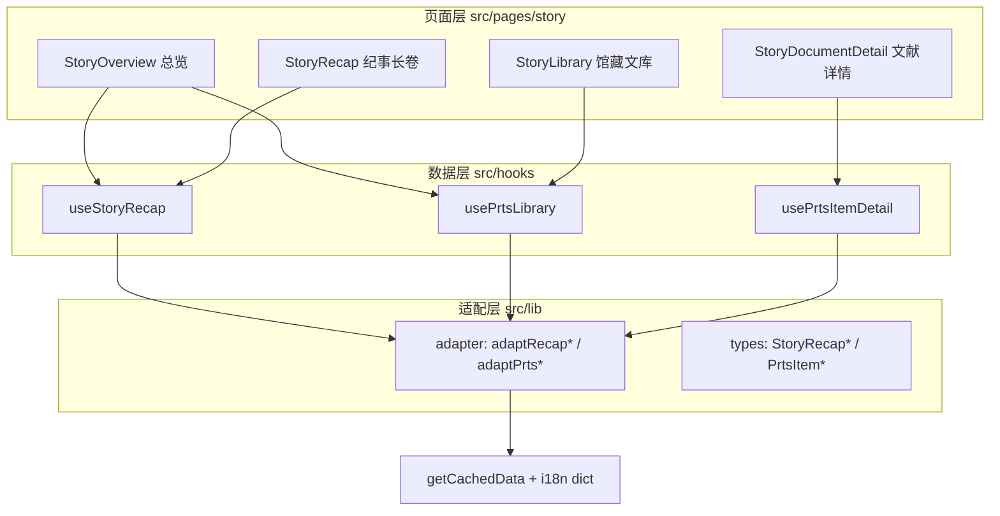

# 剧情纪事 - 技术提案

**功能名称**: 剧情纪事（Story Chronicle）—— archive/story 模块重构
**关联 PRD**: [[20260730-story-chronicle|剧情纪事]]
**技术提案版本**: v1.0
**创建日期**: 2026-07-30
**作者**: 前端工程
**feat-branch**: `feat/story-chronicle`

## 1. 概述

### 1.1 背景

现有 story 模块（`src/pages/story/StoryOverview.tsx`，29 行）仅拉取 `PrtsDocument` 单表渲染标题网格，`StoryDocument` 类型无正文字段，无详情路由。数据侧已确认游戏内存在完整叙事数据体系（剧情梗概 1143 段、PRTS 文献 462 条、富文本正文 676 篇），可支撑 PRD 的「纪事长卷」与「馆藏文库」两大板块。

### 1.2 目标

- 接入剧情梗概（DialogSummary）与 PRTS 文库（Prts\* 系列表）数据，完成 adapter / hooks / 页面三层重构。
- 新增 4 个页面：总览、纪事长卷、馆藏文库、文献详情。
- 模块更名「剧情纪事」，全站导航与 i18n 同步。

### 1.3 范围

**做**:
- 剧情梗概数据接入与「纪事长卷」页（篇章导航 + 梗概流 + 类型筛选）。
- PRTS 六类文献浏览（分类页签 + 卷网格）与文献详情页（富文本正文 / 音像剧本）。
- 模块总览页、路由、导航更名、i18n 扩充。
- `docs/engineering/references/data-mapping-tables.md` 补充新表映射。

**不做**:
- 剧情全文对话回放（`DialogTextTable`，数据量极大，后续版本评估）。
- 剧情梗概与文献的全文搜索（依赖搜索模块扩展，单独立项）。
- 音像条目的音频播放（素材服务仅支持 png/tga 下载，无音频文件）。
- 文献关联网络（文献 → 干员/地区/敌人跳转，后续版本）。

## 2. 数据探查结论

### 2.1 剧情梗概（纪事长卷）

| 表 | 规模 | 结构 | 说明 |
|----|------|------|------|
| `DialogSummaryMapTable` | 1078 keys | `dlg_*` → `summary_*`（字符串） | 对话组 → 梗概条目映射 |
| `DialogSummaryTable` | 1143 keys | `{ id, text }` | 梗概文本（i18n id），i18n dict 按表可取 |

- `dlg_*` key 编码了篇章/任务/场次：如 `dlg_e1m3_4` = 篇章 e1 · 任务 m3 · 第 4 场，天然有序，直接按 key 排序即得游戏内顺序。
- 前缀分布（初版篇章类型归纳，实现时用 i18n search 校准命名）：`e`(346) 主线、`sm`(293) 支线、`c`(197) 干员故事、`f`(122) 地区事务、`gm`(87) 委托、`a`(19) 谷地支线、`db`(13) 协议空间、`m`(1) 其他。
- 梗概文本样例质量良好（如 `summary_e1m1_1_001`：「你与佩丽卡准备徒步前往枢纽区基地。」）。

### 2.2 PRTS 文库（馆藏文库）

```mermaid
entityRelationshipDiagram
    PrtsCategory ||--o{ PrtsFirstLv : categoryId
    PrtsFirstLv ||--o{ PrtsAllItem : itemIds
    PrtsAllItem ||--o| RichContentTable : contentId
    PrtsAllItem ||--o| RadioTable : "contentId (multi_media)"
    PrtsReading ||--o{ RichContentTable : "list.contentId"
```

| 表 | 规模 | 关键字段 | 说明 |
|----|------|---------|------|
| `PrtsPage` | 3 | `pageType`, `icon` | 游戏内三大页签（中枢档案/音像存档/见闻辑录），仅作背景参考 |
| `PrtsCategory` | 6 | `categoryId`, `name`, `order`, `tabIcon` | 六类：document 中枢档案 / paper 纸质记录 / digital 电子档案 / collection 藏品 / report 调查报告 / media 多媒体 |
| `PrtsFirstLv` | 418 | `categoryId`, `icon`, `itemIds[]`, `name`, `subName`, `order` | 「卷」分组（如《定居地全貌》），含图标与条目 id 列表 |
| `PrtsAllItem` | 462 | `contentId`, `desc`, `firstLvId`, `name`, `order`, `type` | 全部条目汇总（text 366 / document 71 / multi_media 25），可替代 PrtsRecord/PrtsDocument/PrtsMultimedia 三表 |
| `RichContentTable` | 676 | `title{id}`, `contentList[{content{id}}]` | 正文容器，多段连续文本，含 `<image>Reading/xxx</image>` 富文本 |
| `RadioTable` | 2909 | `radioSingleDataList[{actorName, radioText, audioOverride}]` | 音像剧本，按 `contentId`（`radio_*`）取单条 |
| `PrtsReading` | 21 | `list{N}.contentId/name/order` | 阅读物组（term_*），归入文库条目展示 |
| `PrtsInvestigate` | 15 | `categoryDataList`, `collectionIdList`, `domainId` | 调查报告关联，初版仅通过 FirstLv 体系间接展示 |

### 2.3 素材资源

- 卷图标：`sprites/prts/icon/{icon}.png`（189 个 prts 图标），部分图标在 `sprites/prts/{icon}.png`（如 `icon_entrance_pivot`），需双路径回退。
- 正文插图：`<image>Reading/xxx</image>` 已由 `src/lib/richText.tsx` 解析为 `sprites/{path}.png`（现有能力，直接复用）。
- 已验证 `PrtsCategory` / `PrtsFirstLv` / `PrtsAllItem` / `RichContentTable` / `DialogSummaryTable` 的 i18n dict 接口均可用。

## 3. 技术架构

### 3.1 模块划分



| 模块 | 职责 | 关键技术点 |
|------|------|-----------|
| `lib/types.ts` | 新增剧情/文库类型 | 见 §4.1 |
| `lib/adapter.ts` | 原始表 → 类型化结构 | 64 位 id 一律 `String(id)`（见 data-pitfalls） |
| `hooks/useData.ts` | 数据获取 hooks | 复用 `getCachedData` + `getTableI18nDict` |
| `pages/story/*` | 四个页面 | 遵循列表页/卷宗页/总览页模板与三态模式 |

### 3.2 路由设计

```
/archive/story                     StoryOverview（重构）
/archive/story/recap               StoryRecap（新增）
/archive/story/recap?type=e        类型筛选经 query param（可分享）
/archive/story/library             StoryLibrary（新增）
/archive/story/library?cat=paper   分类页签经 query param
/archive/story/library/:itemId     StoryDocumentDetail（新增）
```

Sidebar 与 ArchiveHome 仅更新文案（nav.story / nav.storyDesc），结构不变；Breadcrumb 映射补充 `recap` / `library`。

## 4. 数据模型与接口

### 4.1 类型设计（`src/lib/types.ts` 新增）

```ts
// 纪事长卷
export interface StoryRecapScene {        // 一场戏的梗概
  id: string                              // summary id
  dlgId: string                           // dlg_e1m3_4
  chapterId: string                       // e1（篇章）
  missionId: string                       // e1m3（任务）
  sceneNo: number                         // 4（场次）
  chapterType: string                     // e | sm | c | f | gm | a | db | m
  code: string                            // 展示编号，如 E1·M3·场04
  text: string                            // 梗概正文
}
export interface StoryRecapChapter {      // 篇章 → 任务两级导航
  chapterId: string
  chapterType: string
  missions: { missionId: string; scenes: StoryRecapScene[] }[]
}

// 馆藏文库
export interface PrtsCategory { id: string; name: string; order: number; itemCount: number }
export interface PrtsVolume {             // 卷（PrtsFirstLv）
  id: string; categoryId: string; name: string; subName: string
  iconUrl: string; order: number; itemIds: string[]
}
export interface PrtsItem {               // 文库条目（PrtsAllItem）
  id: string; volumeId: string; type: 'text' | 'document' | 'multi_media'
  name: string; desc: string; order: number; contentId: string
}
export interface PrtsItemDetail extends PrtsItem {
  volumeName: string; categoryId: string
  contents: { title: string; segments: string[] }[]   // RichContentTable 展开
  script?: { speaker: string; line: string }[]        // multi_media 剧本
}
```

### 4.2 数据获取

复用现有接口，无新增契约。所有 i18n 查找使用 `String(field.id)`。

| 用途 | 接口 | 加载策略 |
|------|------|---------|
| 梗概映射 | `GET /table/DialogSummaryMapTable/all` | 一次性（1078 条，小） |
| 梗概文本 | `GET /table/DialogSummaryTable/all` + i18n dict | 一次性，走版本缓存 |
| 文库分类/卷/条目 | `GET /table/PrtsCategory|PrtsFirstLv|PrtsAllItem/all` + 各自 i18n dict | 一次性并行 |
| 正文 | `GET /table/RichContentTable/all` + i18n dict | 列表页不加载；详情 hook 加载（676 条，可接受且走缓存） |
| 音像剧本 | `GET /table/RadioTable/{contentId}` + entry i18n dict | 按需单条加载，不拉全表（2909 条） |

i18n dict 缓存键沿用 `I18nDict_{locale}_{table}`；`RadioTable` 按需新增 entry 级缓存。

### 4.3 适配要点

- **梗概排序**：解析 `dlg_{prefix}{a}m{b}_{c}`，按 `(chapterType, chapterId 数值, missionId 数值, sceneNo)` 排序；无法解析的 key 归入「其他」分组并记录 console 警告，不丢弃数据。
- **编号生成**：`code = ${chapterId.toUpperCase()}·M${m}·场${String(c).padStart(2,'0')}`。
- **卷图标回退**：依次尝试 `sprites/prts/icon/{icon}.png` → `sprites/prts/{icon}.png` → 占位图形（`onError` 链式回退）。
- **多媒体剧本**：`PrtsAllItem.contentId`（`radio_*`）→ `RadioTable[contentId].radioSingleDataList`，speaker/line 均经 i18n dict 解析。
- **正文展开**：`RichContentTable[contentId]` → `title` + `contentList[].content`，每段文本直接交由现有 `<RichText>` 渲染（已支持 `<image>`、color、b、hyperlink）。
- **PrtsReading**：作为 text 类条目纳入（其 `list.*.contentId` 展平为多篇正文），与 FirstLv 体系去重以 `PrtsAllItem` 为准——初版以 `PrtsAllItem` 为唯一条目源，Reading 仅用于补充正文关联。

## 5. 页面实现要点

### 5.1 StoryOverview（重构）

保留 `useDocuments` 之外的全新实现：题名区（`font-display` + `Badge` HSA-STY）+ 双入口卡。计数来自 `useStoryRecap` / `usePrtsLibrary` 的元信息（只读计数，不渲染列表）。

### 5.2 StoryRecap（新增）

- 布局：桌面端 `grid-cols-[240px_1fr]`，左侧篇章导航（sticky，篇章 → 任务两级，点击 `scrollIntoView` 锚点定位）；右侧梗概流。
- 筛选：顶部篇章类型 select（原生 select，沿用全站样式），同步 `?type=` query param。
- 梗概卡片：左侧 `border-l` 金色细线串联（长卷装订线意象），卡片含 `font-mono` 编号 + 梗概正文；任务分界处展示任务号小标题。
- 性能：1000+ 卡片按篇章分节渲染 + `content-visibility: auto`；不做虚拟滚动（KISS）。
- 剧透提示：筛选行旁一行小字提示。

### 5.3 StoryLibrary（新增）

- 顶部六类页签（名称来自 `PrtsCategory` i18n，带计数），同步 `?cat=` query param。
- 卷网格：`grid-cols-2 sm:3 md:4 lg:5`，卡片 = 图标 + 卷名 + 副题 + 条目数，按 `PrtsFirstLv.order` 排序。
- 点击卷卡片 → 展开卷内条目列表（页内 accordion，条目按 `order` 排序）→ 点击条目跳详情页。

### 5.4 StoryDocumentDetail（新增）

- 卷宗页模板：标题 + 所属卷/分类 Badge + 档案编号（`formatArchiveCode('story', index)`）+ desc + 正文。
- 正文：`contents` 每篇渲染标题 + 各段 `<RichText>`；插图经 RichText 内置 image 解析，`loading="lazy"`。
- multi_media：剧本列表（speaker 加粗金色 + line），标注「音像转写」。
- 三态模式 + 返回所属卷链接（`?cat=` 回跳）。

### 5.5 i18n 计划

`scripts/i18n-custom.json` 新增/修改（全部 14 语言，禁占位）：

- 修改：`nav.story`（剧情记录→剧情纪事）、`nav.storyDesc`
- 新增：`story.recap` / `story.recapDesc` / `story.library` / `story.libraryDesc` / `story.spoilerHint` / `story.scene`（场）/ `story.typeAll` / `story.chapterType.{e,sm,c,f,gm,a,db,m,other}` / `story.emptyContent` / `story.audioTranscript` / `story.backToVolume` / `breadcrumb.recap` / `breadcrumb.library`

生成：`node scripts/generate-i18n-dicts.ts`，校验 `npm run lint && npm run test && npm run build`。

## 6. 技术决策

| 决策 | 选项 A | 选项 B | 最终选择 | 原因 |
|------|--------|--------|---------|------|
| 文库条目源 | PrtsRecord+PrtsDocument+PrtsMultimedia 三表 | PrtsAllItem 单表 | B | 字段一致且已汇总，减少 3 次请求与合并逻辑 |
| 正文加载 | 按需 entry | all + 缓存 | all + 缓存 | 676 条可接受，避免详情页逐条 waterfall |
| RadioTable | all | 按需 entry | 按需 entry | 2909 条过大，仅详情页需要单条 |
| 长列表性能 | 虚拟滚动 | content-visibility | content-visibility | KISS，原生 CSS 即满足 |
| 卷内条目展示 | 独立卷页面 | 页内 accordion | accordion | 减少路由层级，浏览动线更短 |

## 7. 项目结构

```
src/
  pages/story/
    StoryOverview.tsx        # 重构：总览页
    StoryRecap.tsx           # 新增：纪事长卷
    StoryLibrary.tsx         # 新增：馆藏文库
    StoryDocumentDetail.tsx  # 新增：文献详情
  hooks/useData.ts           # 新增 useStoryRecap / usePrtsLibrary / usePrtsItemDetail
  lib/
    types.ts                 # StoryRecap*/Prts* 类型
    adapter.ts               # adaptRecap*/adaptPrts*
  App.tsx                    # 新增 3 条路由
  components/Layout/Breadcrumb.tsx  # recap/library 映射
scripts/i18n-custom.json     # story.* 扩充 + nav.story 更名
docs/engineering/references/data-mapping-tables.md  # 新表映射
```

## 8. 实现计划

1. **数据层**：types + adapter + 三个 hooks（含 64 位 id、图标回退、dlg key 解析）。
2. **页面层**：四个页面 + 路由 + Breadcrumb + 导航文案。
3. **i18n**：14 语言 key 补全与字典生成。
4. **文档**：`data-mapping-tables.md` 补充 DialogSummary/Prts\*/RichContent/Radio 映射；根 AGENTS.md 无需变更。
5. **测试**：adapter 单测 + e2e。

## 9. 测试策略

### 9.1 单元测试（vitest）

- dlg key 解析与排序（含异常 key 归入「其他」）。
- `adaptPrtsItem` / 卷分组聚合（空 itemIds、缺 icon、类型分布）。
- 正文展开（多 contentId、空 contentList）。

### 9.2 E2E 测试（playwright）

- 总览页双入口计数与跳转。
- 长卷页筛选切换与锚点导航。
- 文库页页签切换、卷展开、条目跳详情。
- 详情页正文与剧本渲染、图片加载。

## 10. 风险与回滚

| 风险 | 影响 | 缓解措施 |
|------|------|---------|
| 篇章类型前缀命名为归纳假设 | 类型名与官方设定不符 | 实现阶段用 i18n search 校准；命名走 UI i18n key，可随时改文案 |
| 卷图标路径不一致 | 部分图标 404 | 双路径回退 + 占位图形 |
| RichContentTable i18n dict 体积 | 详情页首次加载变慢 | 版本缓存 + IndexedDB 持久化；加载态骨架屏 |
| dlg key 格式未来变动 | 排序/编号错乱 | 解析失败兜底「其他」分组，不阻断渲染 |

回滚策略：纯新增页面与数据流，StoryOverview 之外无既有逻辑改动，可直接回滚分支。

## 11. 验收标准

- [ ] 技术方案评审通过
- [ ] 四个页面按 PRD 验收标准实现
- [ ] 14 语言 i18n 无占位、无缺失
- [ ] `data-mapping-tables.md` 更新完成
- [ ] `npm run lint` / `npm run test` / `npm run build` 通过
- [ ] E2E 测试通过

## 12. 相关文档

- [[20260730-story-chronicle|剧情纪事 PRD]]
- [[20260719-story|剧情记录（旧版）]]
- [工程架构规范](../engineering-spec.md)
- [前端开发规范](../frontend-spec.md)
- [数据表映射参考](../references/data-mapping-tables.md)
- [数据层常见陷阱](../references/data-pitfalls.md)
- [富文本规范参考](../references/rich-text-spec.md)
