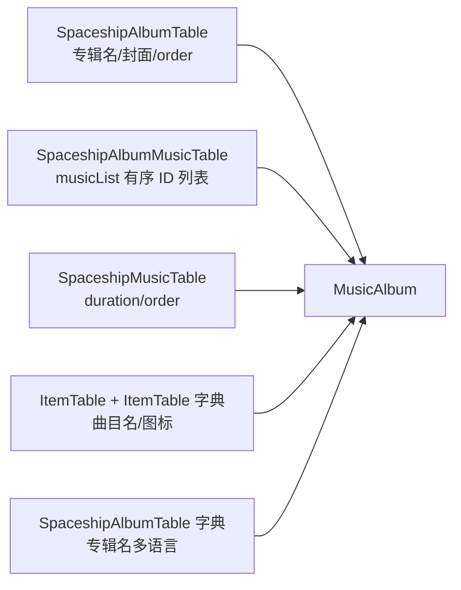
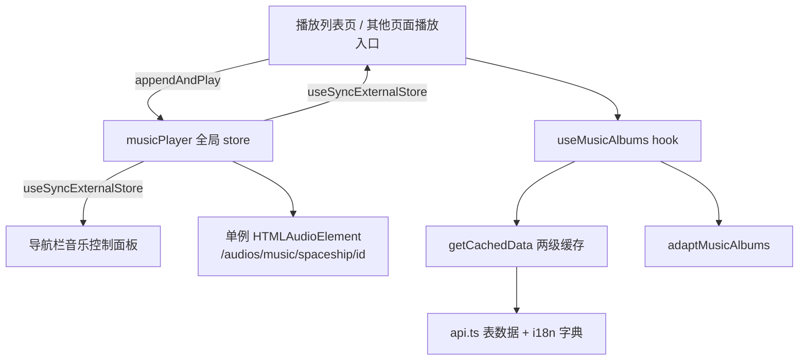
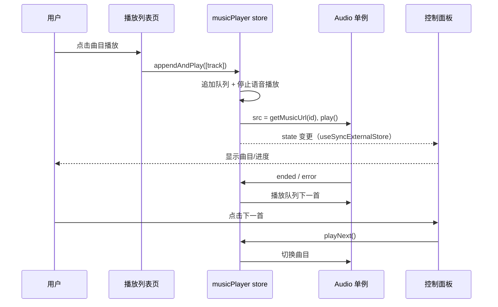

# 音乐播放与全局控制中心技术方案

**功能名称**: 音乐播放与全局控制中心
**关联 PRD**: [20260804-music-player](../../product/draft/20260804-music-player.md)
**技术提案版本**: v1.0
**创建日期**: 2026-08-04
**作者**: MiMoCode
**feat-branch**: `feat/music-player`

## 概述

新增全站音乐播放能力：导航栏底部（语言切换上方）常驻音乐控制面板，新增 `/archive/music` 播放列表页展示游戏内专辑与曲目。任意界面的播放操作统一汇入全局「正在播放」队列，跨页面连续播放。

## 背景

站点已有语音播放基础设施（`src/lib/audio.ts`、`src/lib/dialogAudio.ts` 播放列表式 store、`src/components/VoicePlayer.tsx`、剧情 `DialogPlayerBar`），但均面向 `audios/dialogs/vo` 语音。音乐为全新领域：

1. 三张新数据表：`SpaceshipAlbumTable`、`SpaceshipAlbumMusicTable`、`SpaceshipMusicTable`
2. 新音频端点：`/audios/music/spaceship/{itemId}`
3. 需要全局常驻的播放控制 UI 与跨页面播放队列

---

## 数据调研

### 数据表结构（curl 实测）

**SpaceshipAlbumTable**（专辑，实测 2 条）：

| 字段 | 类型 | 说明 |
|------|------|------|
| `albumId` | string | 专辑 ID，如 `explore_album_1` |
| `albumName` | `{ id, text }` | 专辑名（i18n，id 为 19 位整数，需 `String(id)` 查字典） |
| `icon` | string | 封面 sprite 名，如 `icon_spaceship_musicplayer_explore` |
| `order` | number | 专辑排序 |
| `effect` | string | 特效名（本功能不使用） |

**SpaceshipAlbumMusicTable**（专辑 → 曲目关联，key 同专辑 ID）：

| 字段 | 类型 | 说明 |
|------|------|------|
| `musicList` | string[] | 有序曲目 ID 列表 |

**SpaceshipMusicTable**（曲目，实测 13 条）：

| 字段 | 类型 | 说明 |
|------|------|------|
| `id` | string | 曲目 ID，如 `item_music_exp_tundra_1` |
| `albumId` | string | 反向指向所属专辑 |
| `duration` | number | 时长（秒） |
| `order` | number | 专辑内序号（与 musicList 顺序一致） |
| `musicEvent` / `musicEventSample` | string | Wwise 事件名（与音频 URL 无关，不使用） |
| `showTips` / `musicShowMissionId` | - | 游戏内提示用（不使用） |

**曲目名称/描述/图标不在 SpaceshipMusicTable**（其 i18n 字典实测为空 `{}`），需按 key 查 **ItemTable**：

- `ItemTable[item_music_*].name` → ItemTable i18n 字典（CN「生之泥壤」/ EN "Soils of Life" 等）
- `iconId` 恒为 `item_spaceship_music`（rarity 5），图标 `getSpriteUrl('itemicon/item_spaceship_music')` 实测 200

### 音频接口

```
GET https://endfield-assets.fffdan.com/audios/music/spaceship/{itemId}
```

实测 `item_music_exp_tundra_1`：HTTP 200，`content-type: audio/mp3`，支持 Range，CORS `*`。
**注意：`item_music_fac_dijiang`（工业专辑唯一曲目）实测 404**，前端必须兜底。

### 封面 URL

专辑封面经 `getSpriteUrl` 拼接（`adapter.ts` 的 `ASSET_BASE` + `/ui/sprites/{path}.png`）：

```
getSpriteUrl(`musicplayer/${album.icon}`)
```

实测 `musicplayer/icon_spaceship_musicplayer_explore.png` 200（子目录为 `musicplayer/`）。

### 数据关联



### 数据陷阱（对照 data-pitfalls.md）

- `albumName.id` 为 19 位整数，超过 `Number.MAX_SAFE_INTEGER`，依赖 `api.ts` 的 `safeParse` 转字符串后用 `String(field.id)` 查字典
- `{id, text}` 原始对象的 `text` 恒为空，必须 `resolveI18n(field, i18nMap)`
- i18n 字典按表独立：曲目名用 **ItemTable** 字典，专辑名用 **SpaceshipAlbumTable** 字典，禁止混用

---

## 实现方案

### 系统架构



### 1. 类型定义

**文件**: `src/lib/types.ts`（新增接口）

```typescript
export interface MusicTrack {
  id: string
  name: string
  duration: number
  order: number
  albumId: string
  iconUrl: string
}

export interface MusicAlbum {
  id: string
  name: string
  coverUrl: string
  order: number
  tracks: MusicTrack[]
}
```

### 2. 数据适配层

**文件**: `src/lib/adapter.ts` — 新增 `adaptMusicAlbums()`

输入：`SpaceshipAlbumTable/all`、`SpaceshipAlbumMusicTable/all`、`SpaceshipMusicTable/all`、专辑字典、各曲目 ItemTable 条目 + ItemTable 字典。

- 专辑按 `order` 升序；曲目按 `SpaceshipAlbumMusicTable.musicList` 顺序（与 `MusicTable.order` 一致，以 musicList 为准，缺失条目跳过）
- 专辑名 `resolveI18n(album.albumName, albumI18nMap)`
- 曲目名 `resolveI18n(item.name, itemI18nMap)`，回退为曲目 ID
- `coverUrl = getSpriteUrl(`musicplayer/${album.icon}`)`，`iconUrl = getSpriteUrl(`itemicon/${item.iconId ?? 'item_spaceship_music'}`)`

### 3. 音频 URL

**文件**: `src/lib/audio.ts` — 新增

```typescript
const MUSIC_BASE_URL = 'https://endfield-assets.fffdan.com/audios/music/spaceship'

export function getMusicUrl(itemId: string): string {
  return `${MUSIC_BASE_URL}/${itemId}`
}
```

音乐无语言版本之分，不映射 locale。

### 4. 全局播放队列 store

**文件**: `src/lib/musicPlayer.ts`（新建，模式参照 `dialogAudio.ts`）

模块级 state + `useSyncExternalStore`，单例 `HTMLAudioElement`：

```typescript
export interface MusicQueueItem {
  id: string
  name: string
  albumName: string
  duration: number
  iconUrl: string
}

interface MusicPlayerState {
  queue: MusicQueueItem[]
  currentIndex: number    // -1 表示空队列
  playing: boolean
  currentTime: number
  duration: number
}
```

对外 API：

| 函数 | 行为 |
|------|------|
| `appendAndPlay(items: MusicQueueItem[])` | 追加到队列末尾并立即播放追加的第一首（其他界面/播放列表页的统一播放入口） |
| `togglePlay()` | 播放/暂停 |
| `playNext()` / `playPrev()` | 队列内切换（空队列/边界无响应） |
| `useMusicPlayer()` | 订阅 state 的 hook |

关键实现点：

- **自动连播**：`ended` 事件 → `playNext()`；`error` 事件 → 跳过当前曲目尝试下一首（404 兜底）
- **与语音互斥**：`appendAndPlay` 开头调用 `dialogAudio` 的 `stop()`；同时给 `dialogAudio.ts` 的 `playFrom` 补充一行调用 `musicPlayer` 暂停（最小侵入，各一行）
- **跨页面不断播**：store 为模块级，不随路由卸载
- **不持久化**：刷新页面队列清空（PRD 约束）

### 5. 数据 hook

**文件**: `src/hooks/useData.ts` — 新增 `useMusicAlbums()`

```typescript
export function useMusicAlbums(): { data: MusicAlbum[] | null; loading: boolean; error: string | null }
```

- 并行拉取：`SpaceshipAlbumTable/all` + 专辑字典、`SpaceshipAlbumMusicTable/all`、`SpaceshipMusicTable/all`（均走 `getCachedData` 两级缓存）
- 曲目 ItemTable 条目按 key 逐条拉取：`getCachedData('ItemTable', () => fetchTableEntry('ItemTable', id), id)` + 对应 locale 字典 `/i18n/dict/{locale}/table/ItemTable/{key}`（仅 ~13 条，避免拉 ItemTable 整表）
- 汇总传入 `adaptMusicAlbums`，依赖 `locale` 重新计算

### 6. 导航栏音乐控制面板

**文件**: `src/components/Music/MusicControlPanel.tsx`（新建），挂载于 `src/components/Layout/Sidebar.tsx` 底部语言切换 `div` 上方。

- `useMusicPlayer()` 订阅状态
- 空队列：入口形态（音符图标 + `t('musicPlayer.title')`），整区点击 `navigate('/archive/music')`
- 播放中：显示曲目名、专辑名、进度条（`currentTime / duration`），上一首/播放暂停/下一首按钮；按钮 `onClick` 内 `e.stopPropagation()`，面板其余区域点击跳转播放列表页
- 移动端抽屉内同样渲染（Sidebar 同一份代码天然覆盖）
- 进入播放列表页后，移动端需同时收起抽屉（与现有导航项一致的 `setOpen(false)`）

### 7. 播放列表页

**文件**: `src/pages/music/MusicPlaylistPage.tsx`（新建），路由 `/archive/music`。

- `useMusicAlbums()` 获取专辑列表
- 每个专辑分区：封面（`coverUrl`）+ 专辑名 + 「播放整张专辑」按钮（`appendAndPlay(album.tracks)`）
- 曲目行：曲序、曲名、时长（`mm:ss`）、播放按钮（`appendAndPlay([track])`）
- 正在播放的曲目行高亮（当前 `queue[currentIndex].id === track.id`，沿用 `text-archive-gold bg-archive-gold/10` 激活约定）
- **可用性探测**：页面加载后对曲目 URL 做 HEAD 探测（复用 `audio.ts` 的 `checkAudioUrl` Promise 缓存模式），404 曲目按钮置灰 + `title` 提示，不阻塞渲染

### 8. 路由与导航注册

| 位置 | 改动 |
|------|------|
| `src/App.tsx` | 新增 `<Route path="music" element={<MusicPlaylistPage />} />` |
| `src/components/Layout/Breadcrumb.tsx` | `useListLabel()` 增加 `music` → `t('musicPlayer.title')` 映射 |
| `src/components/Layout/Sidebar.tsx` | 底部语言切换上方挂载 `<MusicControlPanel />` |

不新增侧边导航分组项与首页模块卡片（入口为控制面板，保持最小改动）。

### 9. i18n

新增 namespace `musicPlayer`，全部 14 语言翻译维护于 `scripts/i18n-custom.json`，运行 `node scripts/generate-i18n-dicts.ts` 生成：

| key | CN 示例 | 用途 |
|-----|---------|------|
| `musicPlayer.title` | 音乐播放 | 面板入口/页面标题/面包屑 |
| `musicPlayer.play` / `pause` / `previous` / `next` | 播放 / 暂停 / 上一首 / 下一首 | 按钮 aria-label |
| `musicPlayer.playAlbum` | 播放整张专辑 | 专辑按钮 |
| `musicPlayer.unavailable` | 音频暂不可用 | 404 曲目提示 |
| `musicPlayer.empty` | 暂无播放内容 | 空队列面板副文案 |

---

## 文件清单

| 操作 | 文件 | 说明 |
|------|------|------|
| **修改** | `src/lib/types.ts` | 新增 `MusicTrack` / `MusicAlbum` |
| **修改** | `src/lib/adapter.ts` | 新增 `adaptMusicAlbums()` |
| **修改** | `src/lib/audio.ts` | 新增 `getMusicUrl()` |
| **新建** | `src/lib/musicPlayer.ts` | 全局播放队列 store |
| **修改** | `src/lib/dialogAudio.ts` | `playFrom` 时暂停音乐（一行互斥调用） |
| **修改** | `src/hooks/useData.ts` | 新增 `useMusicAlbums()` |
| **新建** | `src/components/Music/MusicControlPanel.tsx` | 导航栏控制面板 |
| **新建** | `src/pages/music/MusicPlaylistPage.tsx` | 播放列表页 |
| **修改** | `src/components/Layout/Sidebar.tsx` | 挂载控制面板 |
| **修改** | `src/App.tsx` | 注册 `/archive/music` 路由 |
| **修改** | `src/components/Layout/Breadcrumb.tsx` | `music` 面包屑映射 |
| **修改** | `scripts/i18n-custom.json` | 新增 `musicPlayer.*` keys（14 语言） |
| **生成** | `src/i18n/dicts/*.json` | 由脚本生成，禁止手改 |
| **新建** | `src/lib/__tests__/musicPlayer.test.ts` | 队列 store 单元测试 |
| **修改** | `src/lib/__tests__/adapter.test.ts` | `adaptMusicAlbums` 测试 |
| **新建** | `tests/e2e/src/music-player.spec.ts` | E2E 测试 |

---

## 核心流程



---

## 测试策略

### 单元测试

| 测试文件 | 覆盖目标 | 关键用例 |
|----------|----------|----------|
| `src/lib/__tests__/musicPlayer.test.ts` | 队列 store | appendAndPlay 追加并开始播放、播完自动下一首、出错跳过、playNext/playPrev 边界（空队列/队首/队尾）、togglePlay |
| `src/lib/__tests__/adapter.test.ts` | `adaptMusicAlbums` | 专辑排序、musicList 顺序、曲目名来自 ItemTable 字典、专辑名 19 位 id 用 String 查字典、缺失曲目跳过 |

### E2E 测试

| 测试文件 | 覆盖目标 | 关键用例 |
|----------|----------|----------|
| `tests/e2e/src/music-player.spec.ts` | 音乐播放完整流程 | 控制面板可见且位于语言切换上方、点击面板进入播放列表页、专辑与曲目展示、点击播放后面板出现曲目名、切歌按钮可用、404 曲目按钮置灰 |

### 验证方案

1. `npm run lint` — 无 lint 错误
2. `npm run test` — 现有测试 + 新增单元测试通过
3. `npm run build` — TypeScript 编译通过
4. `cd tests/e2e && npx playwright test music-player` — E2E 测试通过
5. 人工验证：
   - 播放中切换多个页面，音乐不中断、面板状态同步
   - 播放音乐时播放干员语音，音乐停止；反之亦然
   - 工业专辑（含 404 曲目）表现符合兜底预期
   - 切换语言后专辑/曲目名跟随变化
   - 移动端抽屉内面板可用

---

## 边界情况处理

| 情况 | 处理方式 |
|------|---------|
| 曲目音频 404（如 `item_music_fac_dijiang`） | 播放列表页 HEAD 探测后置灰按钮；若仍触发播放则 error 事件自动跳过 |
| 浏览器禁止自动播放 | 仅由用户手势触发 `play()`，不做自动播放 |
| 空队列点击上一首/下一首 | 无响应 |
| `musicList` 中存在 SpaceshipMusicTable 缺失的 id | 适配层跳过该条目 |
| `albumName.id` 19 位整数 | `safeParse` 已转字符串，`String(field.id)` 查字典 |
| ItemTable 单曲拉取失败 | 曲目名回退为曲目 ID，不阻塞整页 |
| 队列与语音播放冲突 | 双向互斥：一方开始播放时另一方停止 |
| 刷新页面 | 队列清空（会话级，不持久化） |

---

## 相关文档

- [音乐播放与全局控制中心 PRD](../../product/draft/20260804-music-player.md)
- [语音记录音频播放技术方案](20260730-voice-audio-playback.md)
- [数据表映射参考](../references/data-mapping-tables.md)
- [数据层常见陷阱](../references/data-pitfalls.md)
- [通用开发规范](../common-rules.md)
