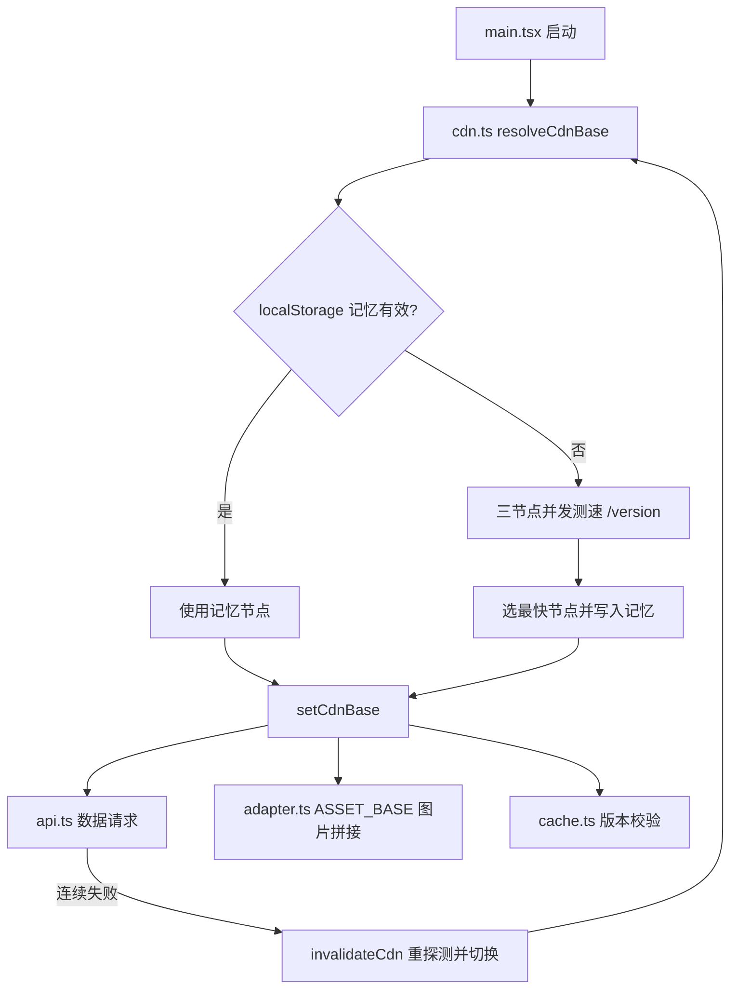

# 数据 CDN 自动优选 - 技术提案

**功能名称**: 数据 CDN 自动优选
**关联 PRD**: [[20260908-cdn-auto-selection|数据 CDN 自动优选产品方案]]
**技术提案版本**: v1.0
**创建日期**: 2026-09-08
**作者**: 前端工程
**feat-branch**: `feat/cdn-auto-selection`

## 1. 概述

### 1.1 背景

当前站点数据与图片素材的基地址硬编码在三处：

- `src/lib/api.ts:4` — `const API_BASE = 'https://endfield-assets.fffdan.com'`，所有数据表 / i18n / 任务资源请求的基地址。
- `src/lib/adapter.ts:5` — `export const ASSET_BASE = 'https://endfield-assets.fffdan.com/vfs/Bundle/file'`，被约 40 处调用点用于拼接图片 URL。
- `src/lib/cache.ts:105` — 缓存初始化时硬编码请求 `/version` 做版本校验。

单一节点导致链路质量差的用户加载缓慢，节点故障时整站不可用。产品要求在三节点间自动测速选路：

- `https://endfield-assets.fffdan.com/`
- `https://cn.endfield.fffdan.com/`
- `https://cn2.endfield.fffdan.com/`

### 1.2 目标

- 启动时对三节点并发测速，选择最快节点，全站数据与图片请求统一走该节点。
- 选路结果持久化到 localStorage，有效期内（24h）直接使用，过期重新探测。
- 当前节点持续失败时自动重探测并切换；全部不可用时保持现有加载失败 / 重试能力。
- 不改变任何页面功能、数据内容与缓存语义。

### 1.3 范围

**做**:
- 新增 `src/lib/cdn.ts`：节点列表、测速、选路记忆、故障重探测。
- 改造 `src/lib/api.ts`：基地址改为动态获取，请求失败计数驱动故障切换。
- 改造 `src/lib/adapter.ts`：`ASSET_BASE` 改为可更新的 live binding。
- 改造 `src/lib/cache.ts`：版本校验使用当前选中节点，且保证在选路完成后执行。
- `src/main.tsx`：启动时触发选路（不阻塞渲染）。
- 单元测试覆盖测速选路、记忆过期、故障切换。

**不做**:
- 不提供用户手动切换节点的 UI。
- 不修改缓存策略、适配器逻辑与任何页面组件。
- 不做图片请求的失败重试换节点（图片由浏览器直接加载，走当前选中节点即可）。
- 不引入第三方依赖。

## 2. 技术架构

### 2.1 模块划分



| 模块 | 职责 | 关键技术点 |
|------|------|-----------|
| `src/lib/cdn.ts` | 节点列表、测速、选路记忆、故障重探测 | `Promise.allSettled` 并发测速，`AbortController` 超时，localStorage TTL |
| `src/lib/api.ts` | 所有数据请求入口 | `getApiBase()` 动态基地址；失败计数触发重探测 |
| `src/lib/adapter.ts` | 图片基地址 | `export let ASSET_BASE` + `setAssetBase()`，ES module live binding |
| `src/lib/cache.ts` | 版本校验与缓存初始化 | 版本请求走当前选中节点；`initCache` 前确保选路完成 |
| `src/main.tsx` | 启动入口 | `resolveCdnBase()` 提前触发，不 await 阻塞渲染 |

### 2.2 核心设计决策

**基地址动态化方式**：`ASSET_BASE` 在约 40 处调用点以模板字符串在**调用时**求值，因此将其从 `const` 改为 `let` 并配合 `setAssetBase()` 更新即可让所有后续调用自动使用新节点（ES module live binding 语义），无需改动任何调用点。已知的唯一模块级求值点 `Sidebar.tsx` 的 `LANGUAGE_ICON_URL` 在选路完成前即固定为默认节点，仅影响一张设置图标，接受此行为，不做改动。

**测速探针**：各节点的 `GET /version` 返回极小的版本文本，是现成的轻量探针，且同时验证了节点的数据服务能力（而非仅 ICMP/TCP 连通）。测速请求加 `cache: 'no-store'` 与查询时间戳，避免缓存干扰。

## 3. API 与数据

### 3.1 接口契约

复用现有接口，无新增契约。测速使用各节点已有的 `GET /version`。

### 3.2 选路记忆存储

localStorage，key 为 `cdn:selected`：

```ts
interface CdnSelection {
  base: string      // 选中的节点基地址，必须属于 CDN_LIST
  expiresAt: number // 过期时间戳（ms），TTL 24h
}
```

读取时校验 `base` 必须在预定义列表内、未过期，否则视为无效并重新探测。localStorage 不可用（隐私模式等）时降级为仅本次会话内存记忆，不影响功能。

## 4. 技术实现方案

### 4.1 cdn.ts

```ts
export const CDN_LIST: readonly string[] = [
  'https://endfield-assets.fffdan.com',
  'https://cn.endfield.fffdan.com',
  'https://cn2.endfield.fffdan.com',
]

const DEFAULT_BASE = CDN_LIST[0]
const SELECTION_KEY = 'cdn:selected'
const SELECTION_TTL = 24 * 60 * 60 * 1000
const PROBE_TIMEOUT = 3000
```

**测速**：对三节点并发发起 `fetch(`${base}/version?t=${Date.now()}`, { cache: 'no-store', signal })`，`AbortController` 3s 超时；用 `Promise.allSettled` 收集结果，在成功响应中取耗时最短者；全部失败时回退 `DEFAULT_BASE`（后续请求失败由现有加载提示与故障切换兜底）。

**选路入口**：

```ts
let resolvePromise: Promise<string> | null = null

export function resolveCdnBase(): Promise<string> {
  if (!resolvePromise) {
    resolvePromise = (async () => {
      const remembered = readSelection()
      const base = remembered ?? (await probeFastest())
      applyCdnBase(base)
      if (!remembered) writeSelection(base)
      return base
    })()
  }
  return resolvePromise
}
```

`applyCdnBase(base)` 内部调用 `api.ts` 的 `setApiBase()` 与 `adapter.ts` 的 `setAssetBase()`，统一切换数据与图片基地址。

**故障重探测**：

```ts
export function invalidateCdn(excludeBase: string): void {
  clearSelection()
  resolvePromise = (async () => {
    const base = await probeFastest(excludeBase)
    applyCdnBase(base)
    writeSelection(base)
    return base
  })()
}
```

重探测时将当前故障节点排除在候选之外（仍纳入测速但仅在其余节点全部失败时才可回选）。

### 4.2 api.ts 改造

- `const API_BASE` 改为模块内 `let currentApiBase = DEFAULT_BASE`，提供 `setApiBase(base: string)` 与 `getApiBase(): string`；所有 URL 拼接改为 `` `${getApiBase()}/table/${table}` `` 形式，`MISSION_ASSET_BASE` 改为在调用时由 `getApiBase()` 派生。
- 新增失败计数：在 `trackFetch` 的 `catch` 分支中累计连续失败次数（成功即清零）；达到阈值（3 次）时调用 `invalidateCdn(getApiBase())` 触发切换。计数仅作为切换信号，不改变原有错误抛出与 `failLoading` 行为。
- 测速探针请求**不经过** `trackFetch`，避免探测本身出现在加载提示中。

### 4.3 adapter.ts 改造

```ts
export let ASSET_BASE = 'https://endfield-assets.fffdan.com/vfs/Bundle/file'

export function setAssetBase(base: string): void {
  ASSET_BASE = `${base}/vfs/Bundle/file`
}
```

调用点全部在调用时求值，live binding 自动生效，无需改动。

### 4.4 cache.ts 改造

- `initCache` 中的版本请求改为 `fetch(`${getApiBase()}/version`)`（或复用 `api.ts` 的 `fetchVersion`），去掉硬编码 URL。
- 在请求版本前先 `await resolveCdnBase()`，保证版本校验与后续缓存读写都基于最终选中节点，避免跨节点缓存污染（三节点数据内容一致，但版本号可能短暂不同步，以选中节点的版本为准）。

### 4.5 启动接入

`src/main.tsx` 渲染前调用 `resolveCdnBase()`（fire-and-forget，不阻塞 `createRoot`）；数据请求路径上 `cache.ts` 的 `initCache` 会 await 选路完成，保证首个业务请求落在最终节点上。有有效记忆时选路零网络耗时。

## 5. 数据模型

```ts
// src/lib/cdn.ts
interface CdnSelection {
  base: string
  expiresAt: number
}
```

无其他类型变更。

## 6. 项目结构

```
src/
  lib/
    cdn.ts       # 新增：节点列表、测速、记忆、故障切换
    api.ts       # 改造：动态基地址 + 失败计数触发切换
    adapter.ts   # 改造：ASSET_BASE 可更新
    cache.ts     # 改造：版本请求走选中节点，initCache 前置选路
  main.tsx       # 改造：启动时触发选路
```

## 7. 测试策略

### 7.1 单元测试（vitest，mock fetch 与 localStorage）

- 测速：三节点不同延迟 / 部分失败 / 全部失败三种情形下的选路结果与耗时排序正确性。
- 记忆：有效记忆直接使用、过期重新探测、非法 base 拒绝、localStorage 不可用时降级。
- 故障切换：连续失败达阈值后触发 `invalidateCdn`，后续请求切换到新节点；成功请求重置计数。
- 回归：现有 `api.ts` / `cache.ts` 相关测试在动态基地址下保持通过。

### 7.2 组件测试

无需新增。确认现有加载提示在"全部节点不可用"场景下仍呈现错误态与重试。

### 7.3 E2E / 手工验证

- 手工：DevTools Network 面板确认业务请求发往实测最快节点；阻断当前节点域名后确认自动切换。
- E2E：关键路径（入口页 → 列表 → 详情）在默认环境下不受影响，现有用例保持通过。

## 8. 验收标准

- [ ] 技术方案评审通过。
- [ ] 首次访问（无记忆）时，业务数据与图片请求均发往测速最快的节点。
- [ ] 记忆有效期内回访不触发测速请求。
- [ ] 阻断当前节点后，请求自动切换到其他可用节点。
- [ ] 三个节点全部不可用时，展示加载失败提示与重试入口。
- [ ] 节点列表不暴露任何外部配置入口。
- [ ] `npm run lint` 通过。
- [ ] `npm run test` 通过。
- [ ] `npm run build` 通过。

## 9. 风险与回滚

| 风险 | 影响 | 缓解措施 |
|------|------|---------|
| 三节点版本号短暂不同步 | 缓存以旧版本标记 | 版本校验固定走选中节点，切换节点后重新校验版本 |
| 测速探针被运营商劫持 / 代理干扰 | 选到非最优节点 | 探针验证响应成功且为 2xx；影响仅限速度，不影响正确性 |
| `ASSET_BASE` 模块级求值点使用旧节点 | 个别图标走默认节点 | 已知仅 `Sidebar` 语言图标，行为可接受 |
| 切换节点后在途请求失败 | 单次请求报错 | 现有加载提示提供重试，重试即走新节点 |
| localStorage 被清空 / 不可用 | 每次会话重新测速 | 探测为秒级并发请求，开销可接受 |

回滚策略：纯前端基础设施改动，不涉及数据与契约，回滚到上一 commit 即可恢复单一默认节点行为。

## 10. 相关文档

- [[20260908-cdn-auto-selection|数据 CDN 自动优选产品方案]]
- [工程架构规范](../engineering-spec.md)
- [前端开发规范](../frontend-spec.md)
- [数据层常见陷阱](../references/data-pitfalls.md)
