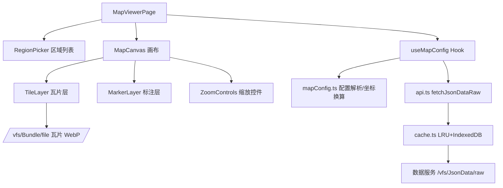
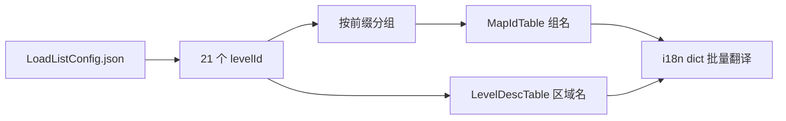

# 地图浏览器 - 技术提案

**功能名称**: 地图浏览器
**关联 PRD**: [[20260917-map-viewer|地图浏览器产品需求文档]]
**技术提案版本**: v1.0
**创建日期**: 2026-09-17
**作者**: 前端工程
**feat-branch**: `feat/map-viewer`

## 1. 概述

### 1.1 背景

产品需求要求在站内提供游戏地图浏览器：地图占满除侧边栏外的剩余区域，支持选择查看多个区域、缩放平移，并呈现地名、入口、定居点等标注。

已完成的数据调研结论（基于内网镜像 `http://endfield-data.internal.fffdan.com`，接口与线上 `https://endfield-assets.fffdan.com` 一致）：

- 地图底图为按关卡分目录的瓦片素材（Bundle），每张 600×600 WebP，分 `l/m/h` 三档清晰度。
- 每个关卡的地图配置（世界坐标矩形、瓦片清单、静态标注）在 JsonData `UILevelMapLoadConfig` 中，为可直接解析的 JSON。
- 标注点同时存在于 Table（`MapMarkInsTable`/`MapMarkTempTable` 等）与 JsonData（`staticElements`）中，JsonData 侧是带坐标标注的主要批量来源。
- 可用关卡共 21 个，权威清单为 `LoadListConfig.json`。

### 1.2 目标

- 新增 `/archive/map` 模块，画布占满侧边栏外剩余区域。
- 支持 21 个关卡地图的分组切换、连续缩放（三档清晰度自动切换）与拖拽平移。
- 在地图上按世界坐标叠加静态标注（地名、关卡入口、定居点、跨层切换）。
- 复用现有数据链路（`api.ts` → `cache.ts` → `useData.ts`）与 CDN 优选，不新增后端依赖。

### 1.3 范围

**做**:

- `src/pages/map/`：地图浏览页面（区域列表 + 画布 + 缩放控件 + 标注层）。
- `src/lib/map/`：地图配置加载、坐标换算、瓦片 URL 拼接、标注适配。
- `src/lib/api.ts`：新增 JsonData raw 文件获取方法。
- `src/hooks/useData.ts`：新增地图相关 Hook。
- 路由与侧边栏入口注册。
- i18n 文案（14 语言）。
- 单元测试（坐标换算、瓦片清单解析、缩放档位切换）。

**不做**:

- 迷雾遮罩、分层（tier）叠加、跨层连线渲染——配置数据已具备，留作后续迭代。
- `MapMarkInsTable` 动态 POI 实例（宝箱、资源点等运行时生成点位 API 拿不到，实例表仅 34 条手动摆放点）——本期仅作为可选补充层，后续视价值决定。
- 用户标注、路径规划等编辑能力。
- 移动端触控专项优化（基础手势可用即可）。

## 2. 技术架构

### 2.1 模块划分



| 模块 | 职责 | 关键技术点 |
|------|------|-----------|
| `src/pages/map/MapViewerPage.tsx` | 页面装配，当前区域与视图状态 | 占满侧边栏外剩余区域的布局 |
| `src/pages/map/RegionPicker.tsx` | 分组区域列表 | 按 map01/map02/base01/其他分组 |
| `src/pages/map/MapCanvas.tsx` | 缩放平移容器 | CSS transform 驱动的 pan/zoom，指针锚点缩放，边界钳制 |
| `src/pages/map/TileLayer.tsx` | 瓦片渲染 | 绝对定位 `` 瓦片，按缩放档位切换 l/m/h |
| `src/pages/map/MarkerLayer.tsx` | 标注渲染 | 世界坐标→像素换算，随缩放联动 |
| `src/lib/map/mapConfig.ts` | 配置解析、坐标换算、瓦片 URL | 世界矩形、needInverseXZ、LOD 档位 |
| `src/hooks/useData.ts` | `useMapRegionList`、`useMapConfig` | 复用 `getCachedData` |

### 2.2 渲染方案决策

不引入 Leaflet / OpenLayers 等地图库。底图瓦片是规则矩形网格、无需投影变换，用"容器 `transform: translate + scale` + 绝对定位瓦片 ``"即可实现连续缩放与平移，瓦片加载、合成与 GPU 加速均由浏览器完成。缩放跨越档位阈值时替换瓦片集（h→m→l），替换期间保留旧瓦片作为底衬，避免闪烁。

## 3. 数据链路

### 3.1 区域列表



- `GET /vfs/JsonData/raw/Data/Json/UILevelMapLoadConfig/LoadListConfig.json` → 全部可加载关卡 id（21 个）。
- 分组名：`MapIdTable` 的 `showName.id`（如 map01 → "四号谷地"）。
- 区域名：`LevelDescTable/{levelId}.showName.id`（如 map01_lv001 → "枢纽区"）。
- 文案统一走现有 `/i18n/dict/{locale}/table/{table}/all` 批量字典接口。

### 3.2 地图配置与瓦片

`GET /vfs/JsonData/raw/Data/Json/UILevelMapLoadConfig/{levelId}.json`（约 180KB JSON），关键字段：

| 字段 | 用途 |
|------|------|
| `basic.worldRectLeftBottom` / `worldRectRightTop` | 世界坐标矩形（如 1280×1024 世界单位） |
| `basic.needInverseXZ` | 为 `true` 时世界 (x, z) 需取反（如 base01_lv001） |
| `basic.minScale` | 游戏内最小缩放参考 |
| `lowChunks` / `mediumChunks` / `highChunks` | 三档瓦片清单，每块含 `x`/`y`（1 起始）与 `worldLeftBottom`/`worldRightTop` |
| `staticElements` | 静态标注（见 3.3） |

瓦片 URL 拼接规则（目录名为 levelId 去掉下划线）：

```
GET /vfs/Bundle/file/assets/beyond/dynamicassets/gameplay/ui/textures/levelmap/levelmapchunks/{levelId去下划线}/{chunkId}.png
```

- 档位关系：h 档每块 128 世界单位（4.6875 px/单位），m 档 256，l 档 512，逐级 2 倍；每块固定 600×600 px。
- 响应实际为 WebP（服务端自动转码），`` 直接可用；响应带 `Cache-Control: max-age=604800` 与 Etag，浏览器层缓存充足，瓦片不进 IndexedDB。
- 默认加载 m 档全景，放大过阈值切换 h 档可见区域瓦片，缩到最小用 l 档。只请求视口内瓦片。

### 3.3 标注点

主要来源：地图配置的 `staticElements`（世界坐标 `position.x/z`，`y` 为高度忽略）：

| type | 含义 | 关键字段 | 呈现 |
|------|------|---------|------|
| 1 | 关卡切换入口 | `targetLevelId`、`directionAngle` | 图标 + 方向箭头，可点击跳转目标区域 |
| 2 | 地名标签 | `textId` | 文字标签，密度随缩放显隐 |
| 3 / 6 | 常驻区域标记 | `isPermanent`、`loadDistance` | 弱提示标记 |
| 4 | 定居点 | `settlementId` | 图标 + 名称 |
| 7 | 跨层切换点 | `targetLevelSpriteName` | 图标 |

辅助来源（Table，走现有 `getCachedData`）：

- `MapMarkTempTable`：标注模板，提供 `activeIcon`（`icon_map_*`）、名称/描述文本 id、排序与可见性规则。
- `MapMarkCategoryTable` / `MapMarkTypeTable`：标注大类与类型，供标注图例与后续筛选使用。
- 图标 URL：`/vfs/Bundle/file/assets/beyond/dynamicassets/gameplay/ui/sprites/map/markiconsmall/{icon}.png`。

### 3.4 坐标换算

世界坐标 → 画布像素（以 h 档为基准，`PIXELS_PER_UNIT = 600 / 128 = 4.6875`）：

```ts
// needInverseXZ 时先对 wx、wz 取反
px = (wx - worldRect.left) * PIXELS_PER_UNIT
py = (worldRect.right - wz) * PIXELS_PER_UNIT  // 世界 y 向上，画布 y 向下，需翻转
```

画布基准尺寸 = 世界矩形宽高 × `PIXELS_PER_UNIT`；m/l 档瓦片按 1/2、1/4 尺寸缩放定位。瓦片与标注共用同一换算，保证缩放时相对位置不漂移。

### 3.5 缓存

- 地图配置 JSON 与 Table 数据：走现有 `getCachedData`（LRU 100 条 + IndexedDB），`/version` 变化自动失效，无需改动缓存机制。
- 瓦片与图标：浏览器 HTTP 缓存（7 天 max-age），不做应用层缓存。

## 4. 数据模型

```ts
// src/lib/map/mapConfig.ts
interface LevelMapConfig {
  levelId: string
  worldRect: { left: number; bottom: number; right: number; top: number }
  inverseXZ: boolean
  chunks: Record<MapLod, MapChunk[]>        // lod: 'l' | 'm' | 'h'
  staticElements: StaticMapElement[]
}

interface MapChunk {
  chunkId: string     // 如 h_map01_lv001_5_5，即瓦片文件名（去 .png）
  x: number; y: number
  worldLeftBottom: { x: number; y: number }
  worldRightTop: { x: number; y: number }
}

interface StaticMapElement {
  id: string
  type: 1 | 2 | 3 | 4 | 6 | 7
  position: { x: number; z: number }
  textId?: string
  targetLevelId?: string
  directionAngle?: number
  settlementId?: string
}
```

## 5. 技术实现方案

### 5.1 页面与路由

- 新增路由 `/archive/map`（页面懒加载），在 `src/App.tsx` 注册，侧边栏新增"地图"入口。
- `MapViewerPage` 使用 flex 布局占满 `ArchiveLayout` 内容区剩余空间；左侧 `RegionPicker`（固定宽度、可滚动），右侧 `MapCanvas` 占满其余区域（`flex-1 min-w-0 min-h-0`）。

### 5.2 MapCanvas 交互

- 状态：`{ scale, offsetX, offsetY }` 保存在组件 state；容器监听 `wheel`（缩放，以指针为锚点）、指针拖拽（平移）、双击（放大一档）。
- 缩放范围：下限 = 世界矩形适配视口的适配比例（保底 `basic.minScale` 语义），上限 = h 档原生分辨率的 1 倍（避免过度放大失真）。
- 平移钳制：offset 范围限制使地图边缘不越过视口边缘（小图时居中）。
- 档位切换：按当前 scale 决定使用 h/m/l 档；切换时先渲染新档可见瓦片，旧档瓦片淡出在底层。

### 5.3 标注显隐密度

- 地名标签（type 2）数量最多，按缩放档位分档显示：l 档仅显示定居点与关卡入口，m 档显示主要地名，h 档显示全部。
- 标注使用 CSS transform 反向缩放（`scale(1/s)`）保持字号/图标尺寸不随地图放大，仅位置联动。

### 5.4 已知难点：textId 文案解析

`staticElements[].textId` 与 `tierNames` 为字符串 id（如 `scene_map01_lv001_sub01_location_tips_10`），而 `/i18n/{locale}/{key}` 只接受数字 hash，现有接口无法直接翻译。处理策略：

1. 优先在实现期确认 hash 算法（疑似对字符串做 64 位 hash），若可复现则封装 `resolveTextId()`。
2. 若不可行，地名标签回退为不显示文本、仅保留点位图标与类型图标；区域级名称（LevelDescTable / MapIdTable）均为数字 id，不受影响。
3. 无论哪种路径，文案缺失时回退默认语言，不出现空白标注。

### 5.5 i18n

全部 UI 文案（模块名、分组名兜底、缩放控件 aria-label、加载/占位提示）按 `AGENTS.md` 流程维护在 `scripts/i18n-custom.json`，覆盖 14 语言，运行 `node scripts/generate-i18n-dicts.ts` 生成。

## 6. 技术决策

| 决策 | 选项 A | 选项 B | 最终选择 | 原因 |
|------|--------|--------|---------|------|
| 地图渲染 | 引入 Leaflet 等地图库 | 自研 transform 平铺 | 自研 | 瓦片为规则矩形网格无投影需求，避免引入大依赖 |
| 瓦片加载 | Canvas 手动贴图 | `` 绝对定位 | `` | 浏览器原生解码/缓存/合成，实现最简单 |
| 标注来源 | Table 为主 | JsonData staticElements 为主 | JsonData 为主 | Table 中带坐标实例仅 34 条，staticElements 覆盖全部关卡 |
| 配置缓存 | 应用层缓存瓦片 | 仅缓存 JSON/表 | 仅缓存 JSON/表 | 瓦片响应自带 7 天 HTTP 缓存，重复缓存浪费 IndexedDB 配额 |
| 区域清单 | 扫 Bundle 目录 | LoadListConfig.json | LoadListConfig | 权威清单，一次请求，含 21 个关卡 |

## 7. 项目结构

```
src/
  pages/map/
    MapViewerPage.tsx   # 页面装配：区域列表 + 画布
    RegionPicker.tsx    # 分组区域列表
    MapCanvas.tsx       # 缩放平移容器
    TileLayer.tsx       # 瓦片层（l/m/h 档位切换）
    MarkerLayer.tsx     # 标注层
    ZoomControls.tsx    # 缩放控件
  lib/map/
    mapConfig.ts        # 配置解析、坐标换算、瓦片 URL、LOD 档位
  hooks/useData.ts      # 新增 useMapRegionList / useMapConfig
  lib/api.ts            # 新增 fetchJsonDataRaw
  App.tsx               # 注册 /archive/map 路由（懒加载）
  components/Layout/    # 侧边栏入口
scripts/i18n-custom.json # 新增地图模块文案
```

无 contract 变更（全部为现有只读接口）。

## 8. 测试策略

### 8.1 单元测试（vitest）

- `mapConfig.ts`：世界坐标→像素换算（含 `needInverseXZ=true` 分支）、瓦片清单按档位解析、瓦片 URL 拼接规则、视口可见瓦片计算。
- 档位切换：不同 scale 下选择的 LOD 正确；边界钳制计算。
- 标注适配：staticElements 各 type 的解析与过滤。

### 8.2 组件测试

- `MapViewerPage`：区域切换触发对应配置加载；素材缺失时呈现占位提示。
- `MarkerLayer`：标注位置随 scale/offset 联动更新。

### 8.3 E2E（Playwright）

- 进入 `/archive/map`，画布可见且区域列表完整。
- 切换区域后地图内容更新。
- 滚轮缩放与拖拽平移不报错，画面更新。

## 9. 验收标准

- [ ] 技术方案评审通过。
- [ ] 地图画布占满除侧边栏外的剩余区域，窗口变化自适应。
- [ ] 21 个关卡地图按分组列出并可切换，名称多语言正确。
- [ ] 缩放跨 l/m/h 档位时底图清晰度自动切换，无长时间空白。
- [ ] 平移不越界，缩放以指针为锚点。
- [ ] 标注位置与游戏内一致，随缩放平移不漂移；文案缺失时回退默认语言。
- [ ] `npm run lint`、`npm run test`、`npm run build` 通过。
- [ ] E2E 关键路径通过。

## 10. 风险与回滚

| 风险 | 影响 | 缓解措施 |
|------|------|---------|
| textId 字符串无法翻译为数字 id | 地名标签无文本 | 实现期优先确认 hash 算法；不可行则降级为图标标注；区域名称不受影响 |
| h 档整图瓦片多（单关卡最多 80 张） | 慢网下加载碎片化 | 默认 m 档起步、仅请求视口内瓦片、切换档位保留旧底衬 |
| base01_lv001 `needInverseXZ` 特殊分支 | 该图标注/瓦片错位 | 换算函数内置分支，单元测试覆盖 |
| 数据服务版本更新改变目录结构 | 瓦片 404 | 以 LoadListConfig 与配置 JSON 为准动态拼接；缺失区域显示占位提示 |
| 大图 JSON（约 180KB/关卡）频繁拉取 | 切换区域延迟 | 复用 LRU+IndexedDB 缓存，版本不变不重复请求 |

回滚策略：纯新增模块，路由懒加载隔离；移除路由与侧边栏入口即可下线，不影响既有页面。

## 11. 相关文档

- [[20260917-map-viewer|地图浏览器产品需求文档]]
- [工程架构规范](../engineering-spec.md)
- [前端开发规范](../frontend-spec.md)
- [通用开发规范](../common-rules.md)
- [数据层常见陷阱](../references/data-pitfalls.md)
