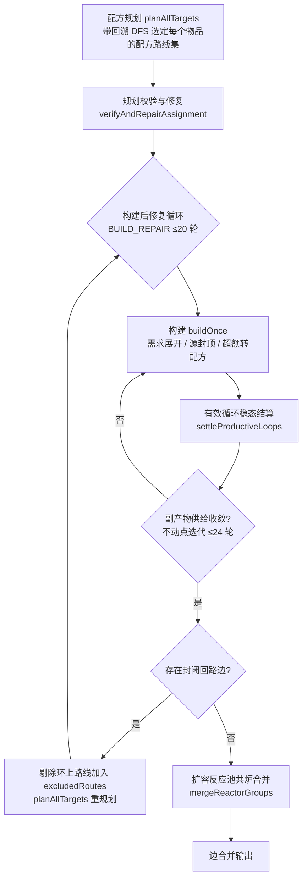

# 制作链路求解器参考

本文档记录制作链路图求解器 `src/lib/factory/chain.ts` 的架构与关键算法，是工厂系统二期验收（2.22–2.29）演进后的现行设计。修改求解器前必读；数据表结构与数值语义见 [[data-pitfalls|数据层常见陷阱]] 与 [[data-mapping-tables|数据表映射参考]]。

## 求解管线总览

`buildChainGraph(targets, recipes, index, sources, defaultCrafts, overrides, machines, regionCaps)` 的输出为机器节点 + 物流边的图。管线：

## 速率换算

| 函数 | 公式 | 说明 |
|---|---|---|
| `perMinute(count, totalProgress)` | `count × 360000 / totalProgress` | 配方产速。**6000 进度 = 1 秒**，`totalProgress` 不是毫秒（验收 2.27） |
| `sourcePerMinute(produceRate, msPerRound)` | `produceRate × 60000 / msPerRound` | 矿机/泵机产能，`msPerRound` 是真毫秒 |
| `calcMachineCount(actualPm, theoryPm)` | `ceil(actualPm / theoryPm)` | 机器台数 |
| `calcThroughput(msPerRound, volume)` | `volume × 60000 / msPerRound` | 传送带 30/min、管道 120/min |

## 配方规划阶段

`planItem(itemId, path): PlanResult { ok, verified }` 以带回溯的 DFS 为每个物品选定**全部可行配方路线**（不只是首选）：

- **候选顺序**：用户 override（强制，不参与回溯）> WikiDefaultCraftTable 官方默认 > 配方表键序。
- **循环检查先于深度限制**：path 中的物品必然已写入 assignment（planItem 先 `assignment.set` 再递归材料），`planCycleRatio > 1` 即有效循环可放行，≤ 1 封闭回路立即回溯——任何深度的环都能拦截（验收 2.29 教训）。
- **深度视界**（path.length > 12）：返回 `PLAN_UNVERIFIED`，路线供当前分支判断但**不写入全局路线集**——未验证路线若入库，会被浅层分支经「已规划且不在当前路径」的信任通道采纳，造成跨分支顺序污染（验收 2.29）。深层采集源物品直接判 verified（源可行性是事实，不构成环）。
- **环上采集源物品直接判可行**（验收 2.28 源豁免）：源可独立供给、超额才转配方，与 `findClosedPrimaryCycle` 跳过源物品的语义对齐，避免环上下文的候选剔除污染全局路线集。
- **`verifyAndRepairAssignment()`**：规划完成后沿首选路线全局 DFS 检测残留封闭回路，剔除污染路线重规划。guard 上限 20 轮——注意 guard 会被无关污染环耗尽，不能作为唯一防线。

## 构建阶段

`buildOnce()` 从全部 target 需求出发递归展开：

1. **副产物抵扣优先**：材料需求优先从副产物供给抵扣（边从生产节点直连消费方），余量才走采集源/配方路线。
2. **源封顶与超额转配方**：采集源按全局余量分配（多消费方先到先得，`remainingCap`），超额需求自动转该物品的配方路线；全部路线受限仍有缺口时压给末条路线并标记 `supplyLimited` 诚实呈现。
3. **路线天花板分配**（`expandRoutes` / `routeCeiling` / `orderRoutesByCeiling`）：直接材料有采集上限的路线优先用满（天花板 = 材料剩余上限 × 产出/投入比；含副产物材料的转化路线另按副产物余量 × `coProduces` 封顶，防止「为转化而生产副产物」的自喂放大），剩余需求落到不受限路线。不受限路线中扩容反应池优先于普通反应池（共炉省台数）。
4. **循环处理**（`handleCycle`）：净产出比 ≤ 1 打回边标记 `cycleType: 'closed'`；> 1 记为有效循环留待结算。
5. **悬空边清理**：每轮构建结束剔除两端节点已不存在的边。

## 构建后封闭回路修复（兜底）

**规划期无法穷举所有成环组合**——路线重排序、无路线集物品的回退解析、源达上限后的超额转配方都只在构建期可见（验收 2.29 修复过程中即新暴露 息壤气→粉末→液体→气 1:1 转化环）。因此每轮构建后：

1. 检测 `cycleType === 'closed'` 的边；
2. 剔除回边消费方物品的当前路线（无替代路线则剔除生产方路线），加入 `excludedRoutes`（永久排除）；
3. `planAllTargets()` 全量重规划并重建，副产物状态重置。

每轮永久排除 ≥ 1 条配方，必然收敛（上限 20 轮）；无可行替代时保留封闭回路标记呈现。

## 副产物复用（不动点迭代）

多产出配方的非主产出是供给不是废料（验收 2.28：电池 6/min 的污水净外部需求仅 18/min，不复用会顶满赤铜矿区域上限 420/min）。复用天然是不动点问题——复用改变需求、需求改变产出、产出改变副产物供给：

- 内层迭代每轮以**上一轮**各机器节点的非主产出作为虚拟供给（`collectByproducts` → `byproductCap`），重新构建；
- 收敛判定 `byproductCapsEqual`（精度 1e-6，上限 24 轮，几何收敛，实测约 14 轮）；
- 转化路线的副产物材料封顶依赖 `coProduces` 判定：仅当生产该副产物的路线会同产本物品时才允许抵扣放大。

## 有效循环结算与预填充

采种（1 作物 → 2 种子）/ 种植（1 种子 → 1 作物）构成净产出比 = 2 的增产循环，不能按封闭回路剪枝。构建期循环点只记录不回流，构建结束后 `settleProductiveLoops()` 按稳态结算：

- 循环机器总产 = 外部需求 × netRatio / (netRatio − 1)（如目标作物 10/min → 种植机 20/min：10 交付 + 10 回流采种）；
- 机器台数/配方速率/物流边按增量补齐，非循环材料（如种植用水）按增量补展开；
- 多目标合并基于「外部需求」一次性放大，不重复翻倍；
- 循环消费方（如采种机）标记 `priming = { itemId, count }`（验收 2.25）——稳态自给自足，但冷启动需预填一批循环物品。

## 扩容反应池共炉

`mergeReactorGroups()`（验收 2.26）：全图 `mix_pool_2` 机器节点按缓存区上限贪心装箱合并：

- **slot = 共炉配方涉及的不同物质种数**（投入 ∪ 产出，产物也占缓存区，共享物质算一次）；扩容反应池 8 slot、普通反应池 5 slot（`REACTOR_BUFFER_SLOTS`，数值出自教学文案，结构化表中没有，见数据陷阱）；
- 装箱后不同物质 ≤ 8 合并为一个反应池节点，超出拆分为多台；
- 炉内级联：共炉配方产物直接作为下一配方原料，内部物流边取消；跨池物品保留外部边；
- 台数 = 桶内各配方产线数最大值（每台可同时跑桶内整套配方）。

## 区域资源上限

`src/lib/factory/regions.ts` 人工维护（验收 2.24）：武陵（息壤气 100 / 惰气 460 / 源矿 540 / 蓝铁矿 120 / 赤铜矿 420）、四号谷地（源矿 560 / 紫晶矿 240 / 蓝铁矿 1080）。**区域内未列出的自然资源不可采集（上限 0）**，需求全部改走配方路线或标记供应受限；液体泵采（酸/水，白名单 uncapped 无限采集）不受区域限制。

## 设计原则（教训沉淀）

1. **未验证的路线不写入全局状态**——全局共享的规划状态会被求解顺序污染。
2. **规划与构建分离意味着规划无法保证无环**——必须有构建后检测-剔除-重规划的兜底，且每轮永久排除 ≥1 条配方保证收敛。
3. **guard 按有效修复次数设计**，不按轮数——无关环会耗尽轮次 guard。
4. **副产物问题用不动点迭代**，不用单次计算。
5. **合成 fixture 测不出真实数据的键序/表结构/数值语义**——算法逻辑用合成单测（`chain.test.ts`），验收场景用真实数据转储集成回归（`chain.integration.test.ts`，数据源 `endfield-data/`）。

## 相关文档

- [[data-pitfalls|数据层常见陷阱]] — totalProgress 单位、零净值环数据模式、WikiDefaultCraftTable 等
- [[data-mapping-tables|数据表映射参考]] — 工厂数据表结构
- [[ui-pitfalls|UI 常见陷阱参考]] — ReactFlow 节点尺寸与边渲染
- [工厂系统验收报告](../test/archived/20260726-factory-acceptance-report.md) — 2.22–2.29 问题与修复全记录
- [工程架构规范](../engineering-spec.md)
