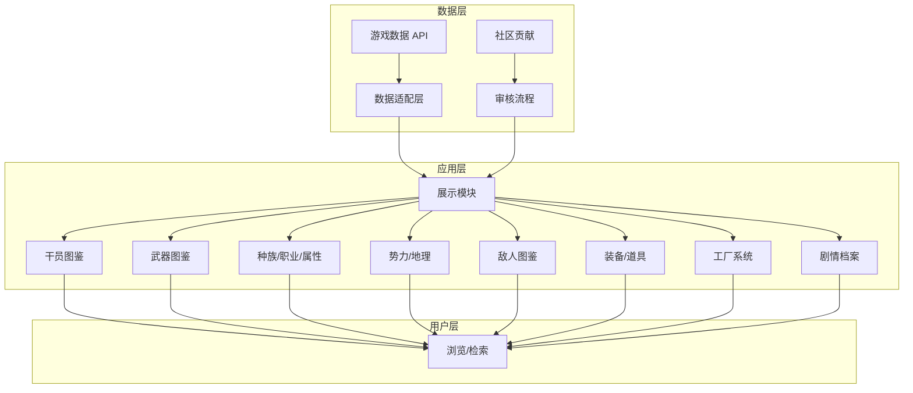

# 宏山档案馆概念设计

## 站点定位

宏山档案馆是《明日方舟：终末地》的粉丝向 Wiki，以游戏数据为基础，为玩家提供结构化的资料查阅体验。

**目标用户**：明日方舟终末地玩家
**内容来源**：游戏内数据文件、剧情文本、玩家社区贡献
**核心价值**：准确、结构化、可追溯

## 架构总览



## 数据源说明

| 数据表 | 用途 |
|--------|------|
| CharacterTable | 干员数据 |
| WeaponBasicTable | 武器数据 |
| EnemyTable | 敌人数据 |
| ItemTable | 物品数据 |
| PrtsDocument | PRTS 文献 |
| SceneAreaTable | 地区数据 |
| TagDataTable | 标签定义 |
| TextTable | 游戏文本 |

数据通过 `https://endfield-assets.fffdan.com/` 提供的 API 获取。

## 设计原则

1. **数据驱动** — 优先使用游戏内数据，减少人工录入，确保准确性
2. **模块独立** — 每个分类模块可独立开发、测试、部署
3. **关联打通** — 通过标签系统与跨模块链接实现内容互联
4. **渐进增强** — 基础功能优先，社区互动等增强功能后续迭代
5. **移动优先** — 响应式设计，兼顾桌面与移动端

## 信息架构

```
宏山档案馆
├── 干员图鉴          → 角色列表 → 角色详情
├── 武器图鉴          → 武器列表 → 武器详情
├── 职业与属性        → 职业/属性说明 → 关联干员
├── 种族一览          → 种族列表 → 种族详情
├── 势力阵营          → 势力列表 → 势力详情
├── 地区地理          → 地区列表 → 地区详情
├── 敌人图鉴          → 敌人列表 → 敌人详情
├── 装备系统          → 装备/套装/宝石
├── 道具材料          → 物品列表 → 物品详情
├── 工厂系统          → 建筑/配方/合成路线
└── 剧情档案          → 文献/对话/SNS/时间线
```

## 技术栈

| 层 | 技术 |
|----|------|
| 框架 | React 19 + TypeScript |
| 构建 | Vite |
| 样式 | Tailwind CSS v4 |
| 数据获取 | fetch + 本地缓存策略 |
| 路由 | （待定，推荐 react-router） |

## 相关文档

- [[01-operator-archive|干员图鉴]]
- [[02-weapon-archive|武器图鉴]]
- [[03-profession-element|职业与属性]]
- [[04-races|种族一览]]
- [[05-factions|势力阵营]]
- [[06-geography|地区地理]]
- [[07-bestiary|敌人图鉴]]
- [[08-equipment|装备系统]]
- [[09-items-materials|道具材料]]
- [[10-factory|工厂系统]]
- [[11-story-archive|剧情档案]]
