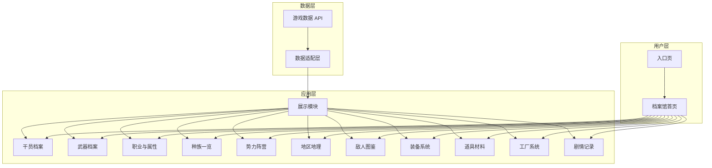
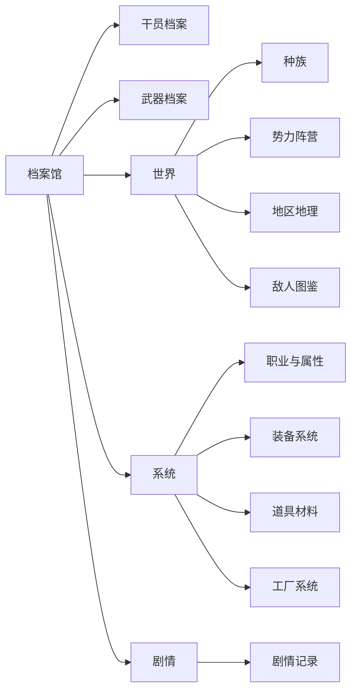

# 宏山档案馆概念设计

## 站点定位

宏山档案馆是《明日方舟：终末地》的资料集成所。以游戏数据为基础，将塔卫二的见闻整理为可翻阅的档案。

**阅览者**：终末地管理员
**内容来源**：游戏内数据文件、剧情文本
**核心价值**：准确、结构化、可追溯

## 架构总览



## 设计原则

1. **数据驱动** — 优先使用游戏内数据，减少人工录入
2. **模块独立** — 每个分类模块可独立开发、测试、部署
3. **关联打通** — 通过标签系统与跨卷宗链接实现内容互联
4. **渐进增强** — 基础功能优先
5. **移动优先** — 响应式设计

---

## 入口页设计（Entry / Landing Page）

进入档案馆前的过渡页面，营造世界观氛围。

### 页面构成

| 区域 | 内容 | 说明 |
|------|------|------|
| 背景 | 全屏动态场景（CSS 渐变/粒子） | 塔卫二星球意象，深色基调 |
| 标题区 | 档案馆名称 + 副标题 | 「宏山档案馆」/「塔卫二资料集」 |
| 装饰元素 | 环形山轮廓 / 星门剪影 | 呼应宏山与星门设定 |
| 进入按钮 | 「阅览资料」 | 进入档案馆 |
| 底部 | 版本号 + 署名 | 管理员记录 |

### 交互行为

- 鼠标移动：背景视差微动
- 点击进入：淡出过渡至档案馆首页
- 首次访问 localStorage 标记，后续直接跳过入口页

### 示意图

```
┌──────────────────────────────────────────────┐
│                                              │
│               ╭──────╮                       │
│               │ 星门  │                       │
│               ╰──────╯                       │
│                                              │
│          宏 山 档 案 馆                       │
│          塔卫二资料集                         │
│                                              │
│         ┌──────────────────┐                 │
│         │  阅览资料        │                 │
│         └──────────────────┘                 │
│                                              │
│     — 管理员记录 —                           │
│                                              │
└──────────────────────────────────────────────┘
```

---

## 全局布局（Global Layout）

进入档案馆后的通用页面架构。

### 页面骨架

```
┌──────────────────────────────────────────────────┐
│ ┌──────────┬───────────────────────────────────┐ │
│ │  Logo    │  导览 ··· ··· ···              │ │ ← 顶栏
│ ├──────────┴───────────────────────────────────┤ │
│ │  面包屑：档案馆 > 干员档案                   │ │ ← 面包屑
│ ├──────────────────────────────────────────────┤ │
│ │                                              │ │
│ │              主体内容区                       │ │ ← 内容
│ │                                              │ │
│ ├──────────────────────────────────────────────┤ │
│ │  页脚：数据来源 / 版权 / 链接                │ │ ← 页脚
│ └──────────────────────────────────────────────┘ │
└──────────────────────────────────────────────────┘
```

### 顶栏（Top Navigation）

| 元素 | 说明 |
|------|------|
| Logo | 「宏山档案馆」文字 + 图标 |
| 导览链接 | 各卷档案入口（下拉可展开子卷） |
| 主题切换 | 明/暗模式切换 |

### 导览结构



### 响应式断点

| 断点 | 布局变化 |
|------|---------|
| ≥1024px | 完整顶栏 + 左侧可选侧栏 |
| 768-1023px | 顶栏折叠为汉堡菜单 |
| <768px | 底部导航栏（移动端专用） |

---

## 页面类型模板

档案馆页面分为三种基本模板。

### A. 列表页（List Page）

适用于：干员列表、武器列表、敌人列表、地区列表、种族列表、势力列表、道具列表

```
┌──────────────────────────────────────────────┐
│  卷名                             视图切换    │
│  ┌─ 筛选栏 ───────────────────────────────┐  │
│  │ 职业 ▼  属性 ▼  种族 ▼  稀有度 ▼  重置  │  │
│  └──────────────────────────────────────────┘  │
│                                               │
│  ┌──────┐ ┌──────┐ ┌──────┐ ┌──────┐        │
│  │卡片 1│ │卡片 2│ │卡片 3│ │卡片 4│  ←网格  │
│  └──────┘ └──────┘ └──────┘ └──────┘        │
│  ┌──────┐ ┌──────┐ ┌──────┐ ┌──────┐        │
│  │卡片 5│ │卡片 6│ │卡片 7│ │卡片 8│        │
│  └──────┘ └──────┘ └──────┘ └──────┘        │
│                                               │
│              < 1  2  3 ... 10 >               │ ← 分页
└──────────────────────────────────────────────┘
```

| 区域 | 说明 |
|------|------|
| 标题区 | 卷名 + 条目数 + 视图切换（网格/列表） |
| 筛选栏 | 下拉筛选器 + 标签选择 + 重置按钮 |
| 卡片网格 | 4 列（桌面）→ 2 列（平板）→ 1 列（手机） |
| 分页 | 页码 + 每页条数选择 |

### B. 卷宗页（Detail Page）

适用于：干员卷宗、武器卷宗、敌人卷宗、道具卷宗、地区卷宗

```
┌──────────────────────────────────────────────┐
│  面包屑：干员档案 > 陈千语                    │
│                                               │
│  ┌─────┬────────────────────────────────┐    │
│  │     │  名称 / 称号                   │    │
│  │ 立  │  种族 · 职业 · 属性 · 阵营    │    │
│  │ 绘  │  稀有度 ★★★★★                 │    │
│  │     │  [标签] [标签] [标签]          │    │
│  ├─────┤────────────────────────────────┤    │
│  │ 侧  │  基础属性  |  战斗属性         │    │
│  │ 栏  │  HP   ATK   DEF  ...           │    │
│  │     ├────────────────────────────────┤    │
│  │ 相  │  档案  |  语音  |  关联        │    │
│  │ 关  │  ┌────────────────────────┐    │    │
│  │ 推  │  │ 档案文本内容...        │    │    │
│  │ 荐  │  └────────────────────────┘    │    │
│  └─────┴────────────────────────────────┘    │
└──────────────────────────────────────────────┘
```

| 区域 | 说明 |
|------|------|
| 面包屑 | 翻阅路径 |
| 顶区 | 立绘/图标 + 名称 + 元信息 + 标签 |
| 属性区 | 数值面板，可横向滚动 |
| 标签页 | 切换不同维度的详细内容 |
| 侧栏 | 关联推荐（同类/同阵营/相关剧情） |
| 空状态 | 数据缺失时显示「待归档」占位 |

### C. 总览页（Overview Page）

适用于：档案馆首页、职业与属性、种族一览、势力阵营

```
┌──────────────────────────────────────────────┐
│  ┌─── Mermaid 关系图 / 可视化 ──────────┐   │
│  │  势力关系图 / 属性相克图 / 种族分布    │   │
│  └────────────────────────────────────────┘   │
│                                               │
│  ┌──────┐ ┌──────┐ ┌──────┐ ┌──────┐       │
│  │条目 A│ │条目 B│ │条目 C│ │条目 D│  ←卡片  │
│  └──────┘ └──────┘ └──────┘ └──────┘       │
│  ┌──────┐ ┌──────┐                          │
│  │条目 E│ │条目 F│                          │
│  └──────┘ └──────┘                          │
│                                               │
│  点击卡片 → 翻阅该条目卷宗                   │
└──────────────────────────────────────────────┘
```

---

## 各模块页面设计

### 01 干员档案

- **列表页**：网格卡片（立绘缩略图 + 名称 + 职业图标 + 属性色 + 稀有度星级）
- **卷宗页**：大立绘（可点击放大）+ 基础信息区 + 属性面板 + 档案/语音标签页 + 关联武器/剧情/同阵营
- **特色**：职业图标 + 属性色作为卡片视觉标识；筛选器放在页面顶部固定位置

### 02 武器档案

- **列表页**：按武器类型分组折叠，或全部平铺（模型渲染图 + 名称 + 星级）
- **卷宗页**：武器模型图 + 属性面板 + 技能/天赋 + 来由故事（独立区域，如「嵌合正义」全文展示）+ 适用干员
- **特色**：来由故事使用类似 PRTS 的富文本样式，区别于普通属性区域

### 03 职业与属性

- **总览页**：职业卡片（图标 + 名称 + 定位描述）+ 属性形态卡片（色块 + 名称 + 标签）
- 点击职业 → 跳转至该职业干员列表（带职业筛选参数）
- 点击属性 → 跳转至该属性干员列表（带属性筛选参数）

### 04 种族一览

- **总览页**：种族卡片网格（种族名 + 代表干员立绘缩略图）
- **卷宗页**：种族简介 + 干员列表 + 所属势力关联 + 同族干员对比
- **特色**：有泰拉时期延续背景的种族增加「泰拉渊源」栏目

### 05 势力阵营

- **总览页**：Mermaid 关系图 + 势力卡片（名称 + 简介 + 标志性颜色）
- **卷宗页**：势力简介 + 所属干员列表 + 关联地区 + 相关剧情文献列表

### 06 地区地理

- **总览页**：地图示意图（可用 HTML/CSS 模拟）+ 地区卡片
- **卷宗页**：地区简介 + 关联事件 + 区域关卡列表 + 该区域势力 + 该区域敌人

### 07 敌人图鉴

- **列表页**：按类别分组（天使/裂地者/近战/远程/精英等）+ 模型缩略图 + 名称
- **卷宗页**：模型展示 + 描述文本 + 属性数据 + 掉落物 + 出现区域 + 应对记录

### 08 装备系统

- **总览页**：三栏入口（装备 / 套装 / 宝石）
- **装备列表**：按部位（躯干/手部/饰品）+ 稀有度筛选
- **装备卷宗**：属性 + 套装归属 + 获取途径
- **套装图鉴**：套装名称 + 2件套效果 + 4件套效果 + 适用干员推荐
- **宝石图鉴**：词条池 + 可镶嵌部位 + 强化/重铸消耗

### 09 道具材料

- **列表页**：按类型分组（材料/消耗品/收集品/礼物）+ 网格卡片
- **卷宗页**：图标 + 描述 + 获取途径（关卡/商店/工厂）+ 用途（用于哪些合成）
- **特色**：用途倒查（点击材料查看所有使用到此材料的配方）

### 10 工厂系统

- **总览页**：子系统入口卡片（建筑/机器/传送带/管道/电力/种植）
- **建筑图鉴**：按类型分组 + 属性详情
- **合成路线**：可视化流程图展示原材料→加工→成品全链路
- **配方查询**：输入/输出/耗时/耗电检索

### 11 剧情记录

- **总览页**：时间线 + 分类入口（PRTS 文献 / 剧情对话 / SNS / 广播）+ 检索
- **记录详情**：富文本全文展示 + 关联角色/地区/敌人 + 前后文导航

---

## 数据源说明

| 数据表 | 用途 |
|--------|------|
| CharacterTable | 干员数据 |
| WeaponBasicTable | 武器数据 |
| EnemyTable | 敌人数据 |
| ItemTable | 物品数据 |
| PrtsDocument | PRTS 文献 |
| SceneAreaTable | 地区数据 |
| TagDataTable | 标签定义 |
| TextTable | 游戏文本 |

数据通过 `https://endfield-assets.fffdan.com/` 提供的 API 获取。

## 技术栈

| 层 | 技术 |
|----|------|
| 框架 | React 19 + TypeScript |
| 构建 | Vite |
| 样式 | Tailwind CSS v4 |
| 数据获取 | fetch + 本地缓存策略 |
| 路由 | react-router |

## 相关卷宗

- [[01-operator-archive|干员档案]]
- [[02-weapon-archive|武器档案]]
- [[03-profession-element|职业与属性]]
- [[04-races|种族一览]]
- [[05-factions|势力阵营]]
- [[06-geography|地区地理]]
- [[07-bestiary|敌人图鉴]]
- [[08-equipment|装备系统]]
- [[09-items-materials|道具材料]]
- [[10-factory|工厂系统]]
- [[11-story-archive|剧情记录]]
