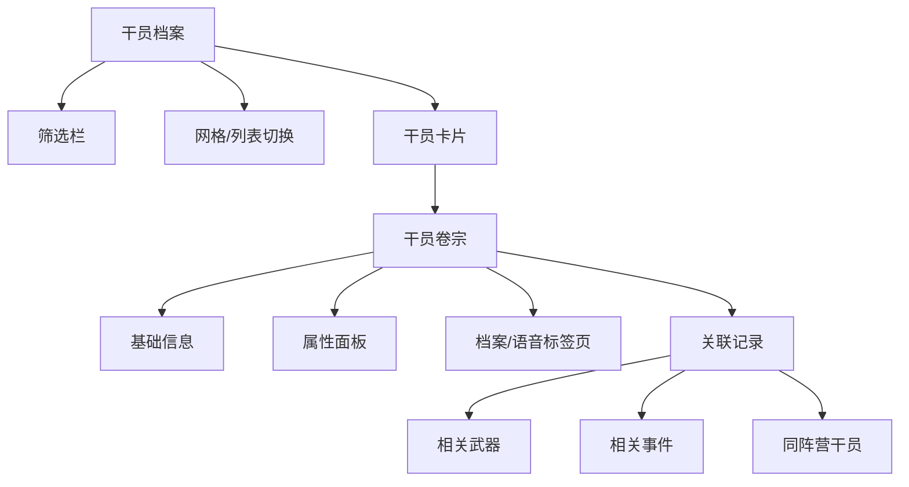

# 干员档案

干员的各项记录：档案、属性与故事。

## 翻阅范围

- 干员列表（网格/列表两种视图）
- 干员卷宗（档案、属性、语音、关联记录）
- 筛选（职业、属性形态、种族、阵营、稀有度）
- 检索（名称、代号）

## 数据字段

| 字段 | 类型 | 来源 |
|------|------|------|
| 名称/代号 | string | CharacterTable.name |
| 种族 | tag_race_* | CharacterTable / TagDataTable |
| 职业 | profession_id | CharProfessionTable |
| 属性形态 | CharType | CharTypeTable |
| 阵营归属 | tag_power_* | TagDataTable |
| 稀有度 | rarity | CharacterTable |
| 档案记录 | text[] | CharacterTable.profileRecord |
| 语音文本 | text[] | CharacterTable.profileVoice |
| 角色标签 | tag[] | CharacterTagDesTable |

## 翻阅结构

## 已知干员

参见 [[00-site-concept#数据源说明|站点概念设计]] 中关联的数据源说明。

数据通过 `CharacterTable` 接口增量获取。

## 相关卷宗

- [[03-profession-element|职业与属性]]
- [[04-races|种族一览]]
- [[05-factions|势力阵营]]
