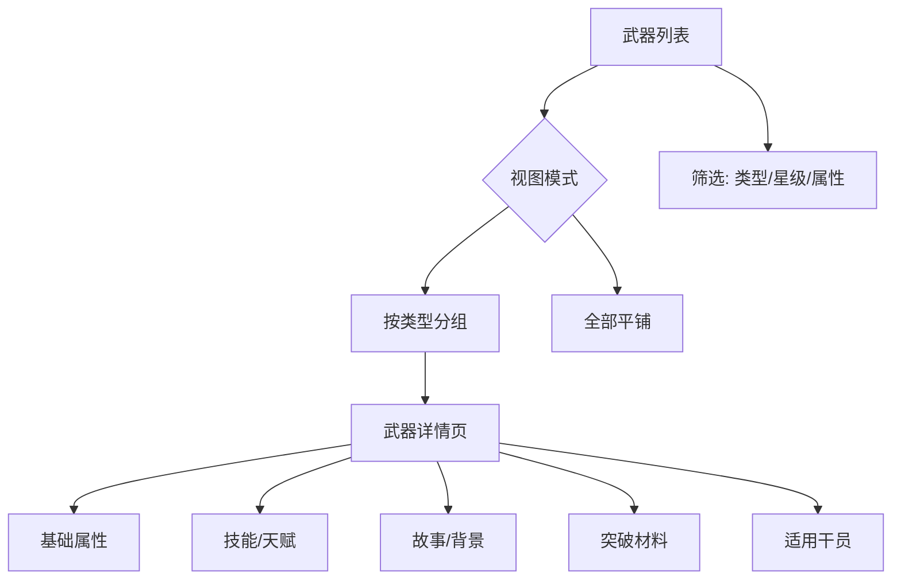

# 武器图鉴

收录终末地工业可装配的各类模块化武器。

## 功能范围

- 武器列表页（按类型分组）
- 武器详情页（属性、技能、故事文本）
- 按类型/星级/属性筛选

## 武器类型

| 类型 | weaponType | 武器 ID 前缀 |
|------|-----------|-------------|
| 剑 | 1 | wpn_sword_ |
| 大剑/重剑 | — | wpn_claym_ |
| 长枪 | — | wpn_lance_ |
| 手枪 | 6 | wpn_pistol_ |
| 浮游单元 | — | wpn_funnel_ |

## 数据字段

| 字段 | 说明 |
|------|------|
| weaponId | 唯一标识 |
| rarity | 稀有度（3-5星） |
| weaponType | 类型 ID |
| weaponDesc | 武器描述文本 |
| decoDesc | 装饰/背景故事 |
| weaponSkillList | 技能列表 |
| maxLv | 最大等级（90） |
| breakthroughTemplateId | 突破模板 |
| potentialUpItemList | 潜能材料 |
| talentTemplateId | 天赋模板 |

## 页面结构

武器背景故事（如 "嵌合正义" 长枪叙事）是 Wiki 的特色内容，建议在详情页独立区域展示。

## 相关文档

- [[01-operator-archive|干员图鉴]] — 武器与干员关联
- [[08-equipment|装备系统]]
