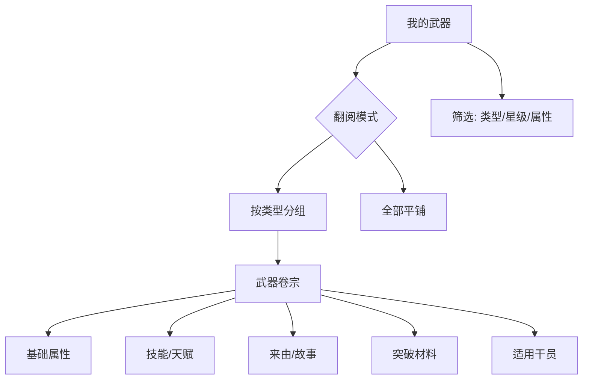

# 我的武器

我见过的终末地工业模块化武器，从制式装备到传世名器。

## 翻阅范围

- 武器列表（按类型分组）
- 武器卷宗（属性、技能、来由）
- 按类型/星级/属性筛选

## 武器类型

| 类型 | weaponType | 武器 ID 前缀 |
|------|-----------|-------------|
| 剑 | 1 | wpn_sword_ |
| 大剑/重剑 | — | wpn_claym_ |
| 长枪 | — | wpn_lance_ |
| 手枪 | 6 | wpn_pistol_ |
| 浮游单元 | — | wpn_funnel_ |

## 数据字段

| 字段 | 说明 |
|------|------|
| weaponId | 唯一标识 |
| rarity | 稀有度（3-5星） |
| weaponType | 类型 ID |
| weaponDesc | 武器描述文本 |
| decoDesc | 装饰/背景故事 |
| weaponSkillList | 技能列表 |
| maxLv | 最大等级（90） |
| breakthroughTemplateId | 突破模板 |
| potentialUpItemList | 潜能材料 |
| talentTemplateId | 天赋模板 |

## 翻阅结构

武器的来由故事（如「嵌合正义」长枪叙事）是档案的特色内容，在卷宗中以独立卷页展示。

## 相关文档

- [[01-operator-archive|我的干员]] — 武器与干员关联
- [[08-equipment|装备系统]]
