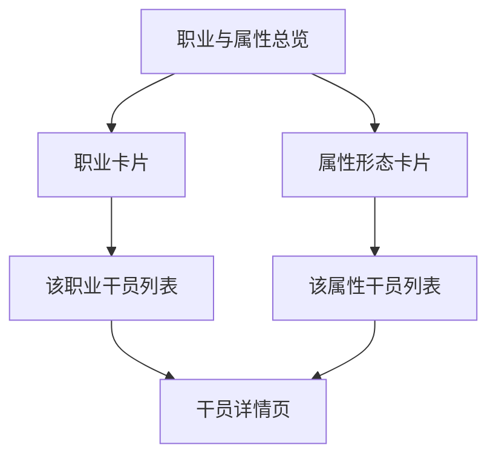

# 职业与属性

解释干员的职业定位和属性形态系统，帮助玩家理解战斗搭配。

## 职业一览

数据来源：`CharProfessionTable`

| 职业 | 定位说明 |
|------|---------|
| 近卫 | 破防 + 物理异常，兼备伤害输出 |
| 重装 | 高防御，前线承伤 |
| 辅助 | 增益/减益/治疗支援 |
| 术师 | 法术伤害输出 |
| 先锋 | 开局部署/费用回复 |
| 突击 | 高机动爆发突袭 |

## 属性形态

数据来源：`CharTypeTable`

| 形态 | 色号 | 标签 |
|------|------|------|
| 寒冷 | #21C6D0 | 冰/低温 |
| 灼热 | #FF623D | 火/高温 |
| 电磁 | #FFC000 | 电/脉冲 |
| 自然 | #9EDC23 | 自然/生态 |
| 物理 | #888888 | 纯物理 |

## 页面设计

## 关联关系

- 每个干员有 1 个职业、1 个属性形态
- 职业决定基础定位，属性形态决定伤害类型与元素反应
- 筛选时职业 × 属性可组合查询

## 相关文档

- [[01-operator-archive|干员图鉴]]
- [[08-equipment|装备系统]]
