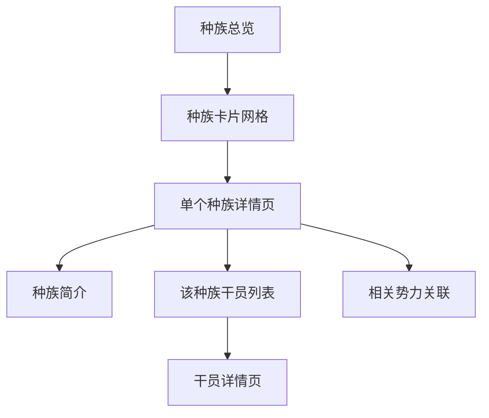

# 种族一览

整理塔卫二上所有可确认的智慧种族信息。种族系统沿用自泰拉（原《明日方舟》世界观）。

## 数据来源

`TagDataTable` 中 `tag_group_race` 分类下的 `tagId`。

## 已知种族

| tagId | 种族名 | 英文对照 |
|-------|-------|---------|
| tag_race_wolf | 鲁珀 | Lupo |
| tag_race_dragon | 瓦伊凡 | Vouivre |
| tag_race_angel | 萨科塔 | Sankta |
| tag_race_fox | 狐 | — |
| tag_race_cat | 菲林 | Feline |
| tag_race_bear | 乌萨斯 | Ursus |
| tag_race_horse | 库兰塔 | Kuranta |
| tag_race_rabbit | 卡特斯 | Cautus |
| tag_race_bird | 黎博利 | Liberi |
| tag_race_sheep | — | — |
| tag_race_snake | — | — |
| tag_race_lizard | — | — |
| tag_race_stoat | 鼬 | — |
| tag_race_deavil | 萨卡兹 | Sarkaz |
| tag_race_rootless | 无根 | — |
| tag_race_secret | 保密 | — |
| tag_race_unknown | 未知 | — |
| tag_race_kilin | 麒麟 | — |
| tag_race_dog | 佩洛 | Perro |
| tag_race_long | 龙 | Lung |

## 页面结构

每个种族详情页应包含：
- 种族简介（来自档案文本或剧情）
- 所属干员列表（可点击跳转）
- 已知亚种/分支（如有）
- 泰拉时期延续的种族文化背景

## 相关文档

- [[01-operator-archive|干员图鉴]]
- [[05-factions|势力阵营]]
