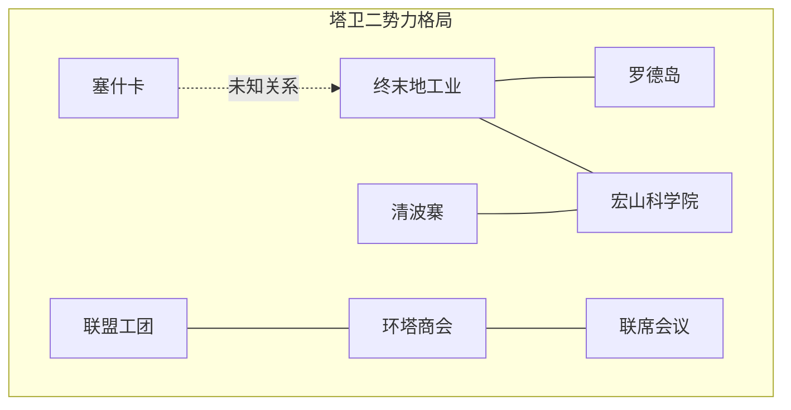

# 势力阵营

我在塔卫二上听闻的各方势力、组织与阵营。

## 数据来源

`TagDataTable` 中 `tag_group_power` 分类下的 `tagId`，辅以剧情文本。

## 已知势力

| tagId | 名称 | 说明 |
|-------|------|------|
| tag_power_endfield | 终末地工业 | 玩家所属开拓组织 |
| tag_power_rhodes | 罗德岛 | 自泰拉延续的制药公司，现隐匿 |
| tag_power_hongshan | 宏山 | 环形山聚居地，大炎天师势力 |
| tag_power_hongacademy | 宏山科学院 | 满足文明环带食品需求的核心科研机构 |
| tag_power_qingbo | 清波寨 | 聚落势力 |
| tag_power_sesqa | 塞什卡 | 地区/势力 |
| tag_power_monastery | 修道院 | — |
| tag_power_tribe | 部落 | — |
| tag_power_army | 军队 | — |
| tag_power_commerce | 环塔商会 | 商团组织 |
| tag_power_syndicates | 联盟工团 | 工人联合组织 |
| — | 联席会议 | 跨势力协调机构（剧情提及） |

## 势力间关系

> 注：部分势力关系为推测（基于现有数据），随剧情更新可调整。

## 翻阅结构

- 总览页：势力关系图 + 卡片列表
- 卷宗：势力简介、所属干员、关联地点、相关剧情记录

## 相关文档

- [[06-geography|地区地理]]
- [[01-operator-archive|我的干员]]
- [[11-story-archive|剧情记录]]
