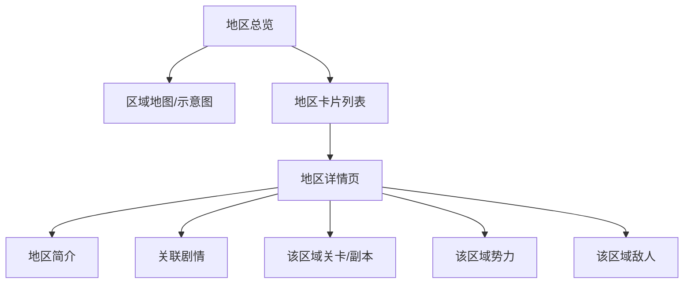

# 地区地理

记录塔卫二上的已知地区、定居点与特殊地貌。

## 已知地点

| 名称 | 类型 | 说明 |
|------|------|------|
| 宏山 | 环形山/聚居地 | 大炎天师势力核心区 |
| 四号谷地 | 山谷/区域 | 天使活跃区域，前线地带 |
| 武陵 | 辖区 | 有非法武装活动 |
| 清波寨 | 寨子/聚落 | 清波势力范围 |
| 塞什卡 | 地区 | 塞什卡势力范围 |
| 藏剑谷 | 山谷 | — |
| 耶尔什 | 城镇 | 剧情提及的贸易节点 |
| 菈梵朵玛 | 城镇 | 剧情提及的工艺品集散地 |
| 枢纽区 | 基地 | 玩家初始基地 |
| 百灶 | 城市（泰拉） | 剧情中提及的泰拉城市（大炎） |

数据来源：`SceneAreaTable`、剧情文本。`MapIdTable` 中包含完整的场景/关卡 ID 列表。

## 页面结构

## 补充说明

- 地理数据以剧情文本为主，随游戏更新逐步补充
- 可通过 `SceneAreaTable` 获取地区 ID 与解锁条件
- 地图标记信息存于 `MapMarkTypeTable` / `MapMarkInsTable`

## 相关文档

- [[05-factions|势力阵营]]
- [[07-bestiary|敌人图鉴]]
- [[11-story-archive|剧情档案]]
