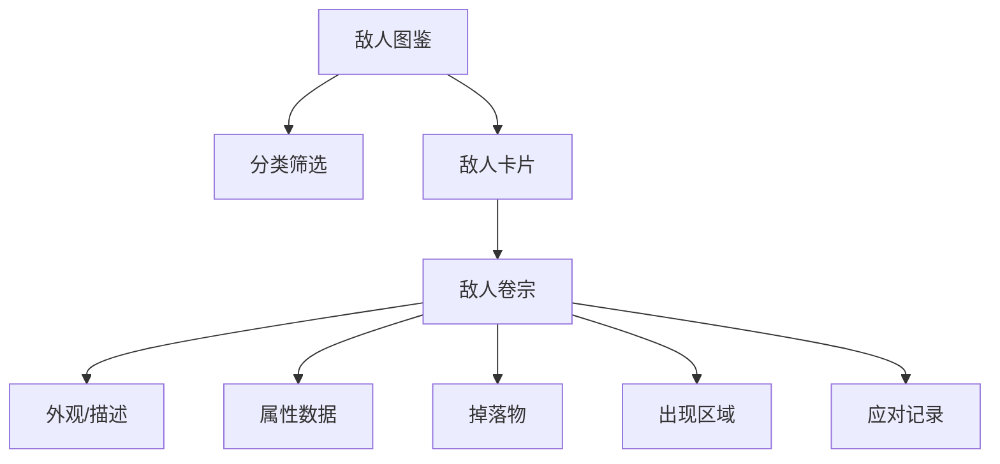

# 敌人图鉴

我在塔卫二上遭遇过的敌对生物与武装分子。

## 数据来源

`EnemyTable`、`EnemyTemplateTable`、`EnemyDisplayInfoTable`

## 主要敌人分类

| 分类 | 示例 ID | 说明 |
|------|---------|------|
| 天使 | — | 塔卫二原生怪物，非萨科塔种族，多种体型 |
| 裂地者 | — | 非法武装人员，私设关卡走私 |
| 近战系 | eny_0021_agmelee | 常规近战敌人 |
| 远程系 | eny_0025_agrange | 远程攻击敌人 |
| 蝎型 | eny_0027_agscorp | 特殊攻击模式 |
| 法术系 | eny_0046_lbshamman | 法术伤害 |
| 飞行系 | eny_0076_agfly | 空中单位 |
| 重型 | eny_0082_hsbear | 高血量高伤害 |
| 精英/Boss | eny_0078_nefarp1 | 首领级敌人 |

> 敌人数百种，详情见 `EnemyTable` 完整数据。

## 翻阅结构

## 补充说明

- 每个敌人可通过 `EnemyTemplateDisplayInfoTable` 获取描述文本
- 掉落数据存于 `WikiEnemyDropTable` / `DropGemTable`
- 敌人标签信息存于 `EnemyTagTable`

## 相关文档

- [[06-geography|地区地理]] — 敌人出现区域
- [[09-items-materials|道具材料]] — 掉落物
