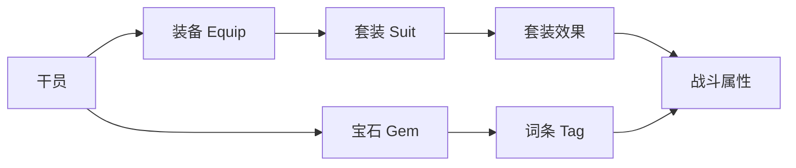

# 装备系统

终末地工业的装备技术归档：装备、宝石、套装效果。

## 子系统

### 装备（Equip）

- 数据表：`EquipTable`、`EquipItemTable`、`EquipSuitTable`
- 部位：body（躯干）、hand（手部）、edc（饰品）
- 稀有度：t3 / t4
- 可强化（`EquipEnhanceCostTable`）、可分解

### 套装（Suit）

套装效果数据存于 `EquipSuitTable`，如 `suit_phy01`（物理套）、`suit_atk02`（攻击套）、`suit_heal01`（治疗套）等。

### 宝石（Gem）

- 数据表：`GemTable`、`GemEnhanceTable`、`GemRecastTable`、`GemDismantleTable`
- 宝石词条：`GemTagIdTable`、`TagDataTable`
- 可按 `GemPresetTable` 预设方案保存

## 数据关联

## 翻阅结构

- 装备列表（按部位/套装分组）
- 装备卷宗（属性、套装归属、获取途径）
- 套装图鉴（套装名称、2件套/4件套效果）
- 宝石图鉴（词条池、可镶嵌部位）
- 配装备忘（我的搭配记录）

## 相关文档

- [[02-weapon-archive|我的武器]]
- [[03-profession-element|职业与属性]]
- [[09-items-materials|道具材料]]
