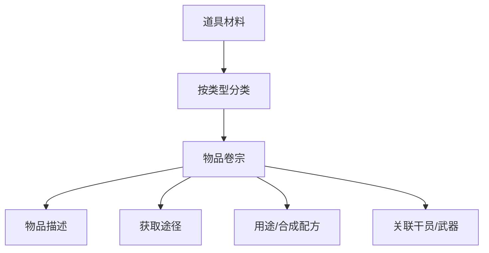

# 道具材料

塔卫二上的各类物资、材料与杂物。

## 数据来源

- `ItemTable` — 所有物品主表
- `ItemTypeTable` — 物品类型分类
- `RewardTable` — 奖励/掉落配置
- `UsableItemChestTable` — 可开箱物品
- `CollectionTable` — 收集品

## 物品种类

| 类型 | 说明 |
|------|------|
| 材料 | 角色突破、武器突破、技能升级材料 |
| 消耗品 | 药剂、食物等 |
| 收集品 | 地图拾取的档案/收集物 |
| 礼物 | 好感度赠送物品 |
| 装备 | 已归入 [[08-equipment|装备系统]] |
| 武器 | 已归入 [[02-weapon-archive|武器档案]] |
| 种子/种植 | 工厂种植系统材料 |
| 配方 | 制造配方 |

## 翻阅结构

建议提供：
- 用途倒查（某材料用于哪些合成）
- 获取途径汇总（关卡掉落、商店购买、工厂生产）
- 快速跳转至 [[10-factory|工厂系统]] 的合成配方

## 相关卷宗

- [[08-equipment|装备系统]]
- [[10-factory|工厂系统]]
- [[02-weapon-archive|武器档案]]
