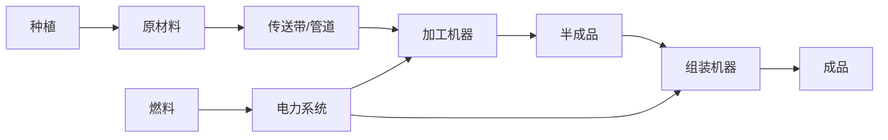

# 工厂系统

终末地工业的自动化生产线与建筑群记录。

## 子系统概览

| 子系统 | 数据表 | 说明 |
|--------|--------|------|
| 建筑 | FactoryBuildingTable | 工厂建筑定义 |
| 机器 | FactoryMachineCrafterTable | 加工机/制造机 |
| 传送带 | FactoryGridBeltTable | 物流运输 |
| 管道 | FactoryLiquidPipeTable | 液体/气体管道 |
| 液体 | LiquidTable | 液体类型与属性 |
| 电力 | FactoryPowerStationTable | 供电系统 |
| 种植 | PlantingDataTable | 作物种植 |
| 燃料 | FactoryFuelItemTable | 燃料系统 |
| 蓝图 | FactoryBlueprintTagTable | 蓝图标签/分享 |
| 手动合成 | FactoryManualCraftTable | 手搓配方 |

## 数据关联

## 翻阅结构

- 建筑图鉴（可建造建筑的属性与用途）
- 合成路线图（从原料到成品的完整流程）
- 配方查询（输入/输出/耗时/耗电）
- 蓝图收藏

## 相关卷宗

- [[09-items-materials|道具材料]]
- [[06-geography|地区地理]] — 资源分布
