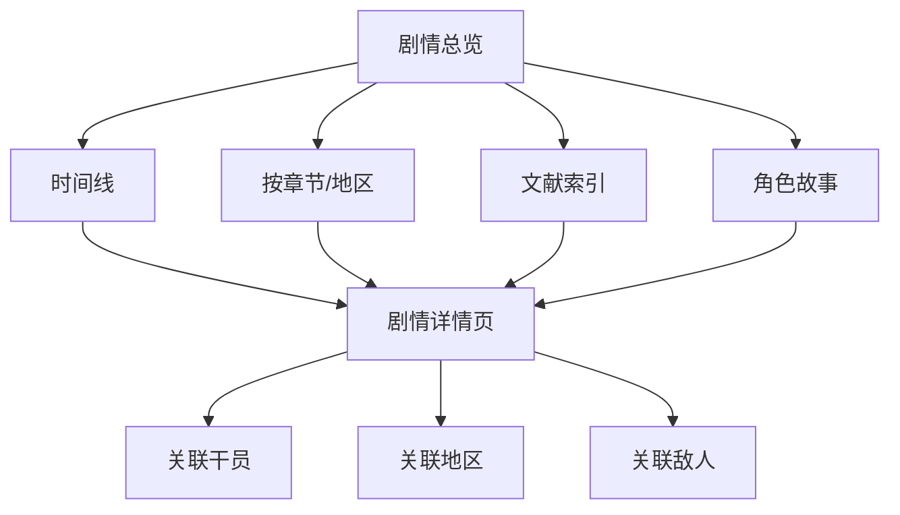

# 剧情档案

档案馆的深度内容模块，收纳游戏中的叙事资料。

## 内容分类

| 分类 | 数据来源 | 说明 |
|------|---------|------|
| PRTS 文献 | PrtsDocument | 游戏内百科文档，约 60+ 篇 |
| 剧情文本 | DialogTextTable | 主线/支线剧情对话 |
| 剧情梗概 | DialogSummaryTable | 剧情段落摘要 |
| SNS 聊天 | SNSDialogTable / SNSChatTable | 角色间社交消息 |
| 环境对话 | EnvTalkTable | 场景中的环境对话 |
| 广播 | RadioTable | 故事中的广播内容 |
| 收集品文本 | CollectionTable | 地图拾取的收集品叙事 |
| 远程通讯 | RemoteCommonTable | 远程通话记录 |

## 重要文献示例

| 文档 | 内容概要 |
|------|---------|
| 《星门》 | 星门的起源与关闭 |
| 《源石技艺和源石技术》 | 源石体系解读 |
| 《四号谷地的天使活动》 | 前线战况报告 |
| 《扶摇》信件系列 | 母亲写给孩子的信件，贯穿战争前后 |
| 《嵌合正义》 | 武器叙事，器官捐献与传承 |

## 页面设计

建议提供：
- 可筛选的完整时间线
- 文献全文展示（富文本解析，含 `RichContentTable` 的格式化内容）
- 角色间的 SNS 对话可按角色聚合

## 相关文档

- [[12-encyclopedia-index|百科索引]]
- [[05-factions|势力阵营]]
- [[06-geography|地区地理]]
