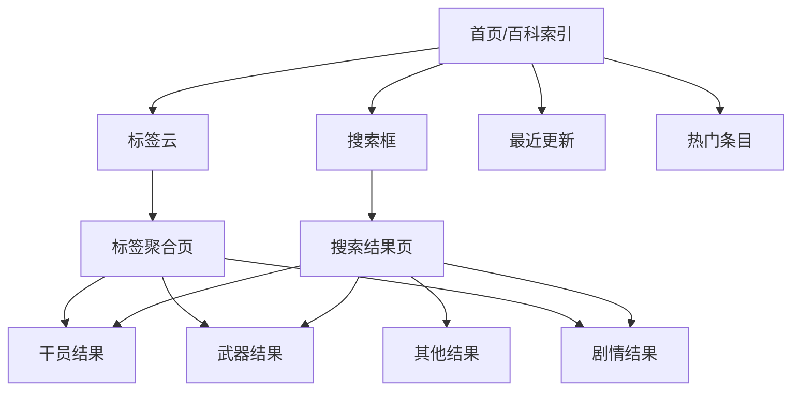

# 百科索引

档案馆的门户模块，提供全局搜索与导航。

## 功能范围

- 全局搜索（跨所有模块）
- 标签聚合页（按种族/势力/职业/属性等标签汇总）
- 最近更新/热门内容
- 数据状态说明

## 搜索范围

| 模块 | 可搜索字段 |
|------|-----------|
| 干员 | 名称、代号、种族、职业、阵营 |
| 武器 | 名称、类型、描述 |
| 敌人 | 名称、类型、出现地区 |
| 道具 | 名称、描述、类型 |
| 剧情 | 标题、正文 |
| 地区 | 名称 |

## 标签聚合体系

```
TagGroup
├── tag_group_race        → 种族（鲁珀/萨科塔/瓦伊凡……）
├── tag_group_power       → 势力（宏山/罗德岛/终末地工业……）
├── tag_group_disposition → 性格（外向/内向/勤奋……）
├── tag_expert_*          → 专精（战斗/战术/医疗……）
├── tag_hobby_*           → 爱好（艺术/科技/自然……）
└── tag_giftperfer_*      → 偏好礼物
```

标签系统打通所有模块：点击"宏山"标签 → 展示宏山阵营的干员、地区、相关剧情。

## 数据源说明

| 数据表 | 用途 |
|--------|------|
| CharacterTable | 干员数据 |
| WeaponBasicTable | 武器数据 |
| EnemyTable | 敌人数据 |
| ItemTable | 物品数据 |
| PrtsDocument | PRTS 文档 |
| SceneAreaTable | 地区数据 |
| TagDataTable | 标签定义 |
| TextTable | 游戏文本（供搜索索引） |

## 页面结构



## 相关文档

- [[01-operator-archive|干员图鉴]]
- [[02-weapon-archive|武器图鉴]]
- [[11-story-archive|剧情档案]]
