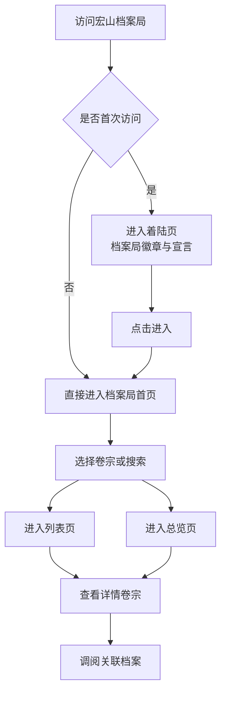
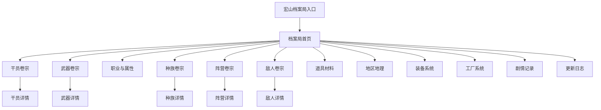

# 宏山档案局整体品牌升级与视觉重构方案

**功能名称**: 宏山档案局品牌与界面重设计
**PRD 版本**: v1.0
**创建日期**: 2026-07-19
**作者**: 产品设计

## 背景与目标

### 1.1 背景

当前站点以「宏山档案馆」命名，整体视觉呈现为深色资料陈列风格，强调可读性与信息层级。随着站点承载的档案门类日益完整（干员、武器、阵营、敌人、道具、剧情、版本变更等），「馆」的定位已不足以匹配其作为塔卫二权威资料整合平台的气质。用户对资料的诉求从「浏览」升级为「调阅」——需要更强的信任感、秩序感与官方背书。

### 1.2 目标

将「宏山档案馆」升级为「宏山档案局」，在不改变现有功能与信息架构的前提下，对页面布局、视觉风格、色彩体系、字体排版、品牌表达进行整体重构，使站点呈现：

- **严肃性**：如官方档案管理机构般的制度感与可信度
- **气魄**：大气、稳重、具有仪式感的首屏与核心页面
- **秩序性**：清晰的层级、编号、卷宗关系，便于快速定位
- **一致性**：所有页面共用同一套视觉语言，消除当前模块间的视觉落差

### 1.3 成功标准

- 站点所有可见文案中「馆」全部替换为「局」，无遗漏
- 着陆页、首页、侧边导航、列表页、详情页、更新日志均应用新视觉体系
- 用户在不看旧版的情况下，能明确感知到「官方档案管理机构」的定位
- 功能入口与现有操作路径保持一致，老用户无需重新学习
- 移动端与桌面端均呈现一致的气质，无布局崩坏

## 用户分析

### 2.1 目标用户

- **核心用户**：终末地管理员，需要高频查阅干员、武器、敌人、道具等资料
- **次要用户**：内容创作者、攻略作者、数据研究者，关注版本差异与精确数值
- **潜在用户**：刚接触游戏的新管理员，通过档案局建立对塔卫二世界观的认知

### 2.2 用户场景

| 场景 | 用户角色 | 目标 | 痛点 |
|------|----------|------|------|
| 每日配队前查阅干员技能 | 核心玩家 | 快速定位技能数值与材料 | 当前页面视觉偏轻，缺少「官方权威」的心理暗示 |
| 写攻略时核对版本变更 | 内容创作者 | 对比不同版本数据差异 | 变更面板信息密集，但缺乏档案编号的秩序感 |
| 浏览世界观设定 | 新管理员 | 了解阵营、种族、地区背景 | 入口卡片同质化，难以建立档案分类的仪式感 |
| 移动端通勤时调阅资料 | 全量用户 | 在小屏上顺畅查阅 | 当前移动端入口过于紧凑，缺少呼吸感 |

## 功能需求

### 3.1 功能概述

本次为视觉与体验层面的全面升级：保留现有信息架构、数据内容与交互路径，通过新的品牌定位、色彩体系、排版网格、组件语言与动效策略，重塑站点气质，使其从「资料陈列馆」进化为「官方档案管理局」。

### 3.2 功能列表

#### 功能点 1: 品牌定位升级

- **描述**: 将站点名称由「宏山档案馆」统一更改为「宏山档案局」。着陆页、侧边导航、首页标题、页脚、面包屑、所有模块标题及元信息中的相关文案全部同步更新。
- **用户价值**: 强化官方感与制度感，让用户一进入站点即感知到权威资料平台的定位。
- **验收标准**:
  - [ ] 全站文案无「馆」字残留
  - [ ] 着陆页主标题为「宏山档案局」
  - [ ] 侧边导航顶部标识为「宏山档案局」
  - [ ] 页脚与面包屑文案同步

#### 功能点 2: 色彩体系重构

- **描述**: 建立一套更具权威感的档案局专属色板。以深墨黑为底、沉金为主色、印章红为强调、象牙白为正文，替代当前偏「游戏终端」的深空黑与古铜金。
- **用户价值**: 深色底色保持长时间阅读舒适度，新的金色更沉稳、红色更庄重，提升整体气魄。
- **验收标准**:
  - [ ] 主背景色为深沉墨黑，减少屏幕反光感
  - [ ] 强调色使用低饱和沉金，用于核心标识、hover 与激活态
  - [ ] 引入印章红作为高亮、警告、版本差异标识的辅助色
  - [ ] 文字层级至少包含正文、次级、禁用三个明度，保证可读性

#### 功能点 3: 字体与排版升级

- **描述**: 标题层引入具有「官方文件」气质的衬线风格字体（用于中文大标题与卷宗名），正文保持现代无衬线以保证可读性。建立严格的字号、字重、行高、字间距层级，所有页面标题、卡片标题、数据标签、正文遵循同一套规则。
- **用户价值**: 衬线标题增强正式感与仪式感，统一排版减少视觉噪音，提升扫描效率。
- **验收标准**:
  - [ ] 着陆页、首页大标题使用衬线风格字体
  - [ ] 卷宗编号、档案标签使用等宽或窄体字形
  - [ ] 同一层级的标题与正文在字重、字号、颜色上保持一致
  - [ ] 中文行高不小于 1.6，长文本使用宽松行距

#### 功能点 4: 布局与网格系统重构

- **描述**: 采用更宽阔的留白与更严谨的网格。侧边导航加宽并增加档案局徽章/印章区域；首页从密集卡片网格改为「卷宗索引」式大卡片，每个卷宗附带编号、分类、状态标识；列表页引入档案编号列与筛选面板；详情页采用类似档案卷宗的版式，顶部为卷宗头，中部为数据正文，底部为关联调阅。
- **用户价值**: 宽阔的留白降低压迫感，编号与分类帮助用户建立心智模型，提升查找效率。
- **验收标准**:
  - [ ] 桌面端内容区最大宽度限制在合理范围，避免过宽导致阅读疲劳
  - [ ] 首页每个卷宗入口包含：卷宗编号、名称、描述、状态/子入口
  - [ ] 列表页包含档案编号列或编号徽章
  - [ ] 详情页顶部包含卷宗头（名称、编号、密级/分类、立绘/头像）

#### 功能点 5: 品牌符号与档案元素

- **描述**: 引入档案局专属符号系统：卷宗编号前缀（如 HSA-OPR-001）、密级/分类徽章、装订线装饰、印章风格徽章、文件头装饰线。这些符号仅用于增强氛围，不改变数据本身。
- **用户价值**: 通过细节符号强化「档案局」的沉浸感，让每个页面都像一份可调阅的正式卷宗。
- **验收标准**:
  - [ ] 侧边栏顶部展示档案局徽章或印章式标识
  - [ ] 卷宗卡片与详情页展示编号前缀
  - [ ] 徽章系统包含：公开、受限、核心等档案级别（如适用）
  - [ ] 装饰元素不过度，保持克制

#### 功能点 6: 动效与交互策略

- **描述**: 动效以克制、稳重为原则。着陆页保留淡入淡出但节奏更庄重；卡片 hover 使用细微的抬升与边框点亮；页面切换使用柔和的淡入；折叠面板使用平滑展开。避免弹跳、快速闪烁或过度动效。
- **用户价值**: 庄重的动效与档案局气质一致，同时保留交互反馈，不造成视觉疲劳。
- **验收标准**:
  - [ ] 着陆页过渡时长控制在 500–800ms，缓动自然
  - [ ] 卡片 hover 仅有边框/背景/微抬升一种变化
  - [ ] 页面内容加载使用统一的骨架屏，风格与新版一致
  - [ ] 尊重系统「减少动效」偏好

#### 功能点 7: 移动端适配优化

- **描述**: 移动端沿用桌面端的新视觉体系，侧边导航改为抽屉式，首页卷宗索引改为单列或双列，详情页关键信息优先展示，避免横向滚动。
- **用户价值**: 保证移动用户同样获得档案局的正式体验，不因屏幕尺寸而降级。
- **验收标准**:
  - [ ] 移动端侧边导航可正常打开/关闭
  - [ ] 首页在小屏下单列显示，每个卷宗仍有编号与描述
  - [ ] 列表页在小屏下筛选器可折叠
  - [ ] 详情页核心属性首屏可见

### 3.3 用户操作流程

### 3.4 页面/界面描述

| 页面 | 描述 | 关键元素 |
|------|------|----------|
| 着陆页 | 档案局入口，庄重仪式感 | 档案局徽章、主标题「宏山档案局」、副标题「塔卫二官方档案管理与调阅系统」、进入按钮、底部铭牌 |
| 档案局首页 | 卷宗索引总览 | 欢迎语、卷宗网格（编号+名称+描述+子入口）、最新版本公告 |
| 侧边导航 | 常驻全局导航 | 档案局徽章/名称、卷宗菜单、语言切换、当前位置高亮 |
| 列表页 | 某类档案的目录 | 页面标题、卷宗编号前缀、搜索、筛选、排序、档案卡片网格 |
| 详情页 | 单份档案卷宗 | 卷宗头（头像/立绘、名称、编号、分类/标签）、属性面板、技能/数据区、关联调阅 |
| 更新日志 | 版本变更记录 | 版本编号、统计面板、差异卷宗列表、变更类型徽章 |
| 占位模块 | 尚未开放的卷宗 | 统一的「卷宗整理中」状态页，保持风格一致 |

### 3.5 异常与边界情况

| 情况 | 预期行为 |
|------|----------|
| 图片加载失败 | 显示档案局默认占位徽章，不破坏卷宗排版 |
| 数据缺失 | 对应区块显示「该档案项待补充」提示，风格与新版一致 |
| 移动端网络较慢 | 骨架屏使用新版色板，优先渲染文字结构 |
| 老用户通过旧书签访问 | 路由与功能不变，正常跳转 |

## 设计语言

### 4.1 色彩系统

| Token | 色值 | 用途 |
|-------|------|------|
| 档案墨 | `#0A0A0D` | 页面主背景，比现行背景更深沉 |
| 卷宗灰 | `#13141A` | 卡片、面板、抽屉背景 |
| 边框铁 | `#2A2B35` | 分割线、卡片边框、表单边框 |
| 象牙白 | `#E8E6E3` | 主标题、正文 |
| 烟尘灰 | `#8B8982` | 次级说明、元信息 |
| 褪色铅 | `#5A5A62` | 禁用、占位、编号前缀 |
| 档案金 | `#B89A6A` | 核心强调、hover、激活态、徽章 |
| 印章红 | `#9E3A3A` | 重要标识、移除/警告、高亮印章 |
| 朱砂红 | `#C45C5C` | hover 态印章红 |
| 青铜绿 | `#5A7A6A` | 新增/通过状态（与印章红形成档案局双色体系） |

### 4.2 字体系统

- **卷宗题名（Display）**: 思源宋体 / Noto Serif SC，用于着陆页大标题、首页欢迎语、详情页卷宗名
- **正文与界面（Body）**: Noto Sans SC / PingFang SC，用于正文、按钮、标签、导航
- **档案编号（Mono）**: JetBrains Mono / SF Mono，用于版本号、卷宗编号、模板 ID
- **英文标题（Accent）**: 思源宋体 Latin 部分或 Inter，用于英文界面标题

字号层级：

| 层级 | 字号 | 字重 | 用途 |
|------|------|------|------|
| 卷宗名 | 32–48px | 700 | 着陆页、详情页主标题 |
| 章节标题 | 20–24px | 600 | 页面标题、面板标题 |
| 小标题 | 16–18px | 500 | 卡片标题、折叠面板标题 |
| 正文 | 14px | 400 | 描述、技能说明 |
| 档案注 | 12px | 400 | 元信息、标签、时间 |
| 编号 | 11–12px | 500 | 卷宗编号、ID |

### 4.3 布局与间距

- 桌面端主内容区最大宽度 `1280px`，居中，两侧留白随屏幕增大
- 侧边导航宽度 `240px`，顶部为档案局徽章区，底部为语言切换
- 卡片内边距统一为 `24px`，卡片间距 `16–24px`
- 列表页筛选区与内容区分离，筛选器在桌面端左侧或顶部，移动端可折叠
- 详情页采用单栏或双栏：卷宗头全宽，属性区双栏，长文本区单栏居中

### 4.4 品牌符号

- **档案局徽章**：以印章/盾形为灵感，中心为「宏」字或塔卫二抽象符号，配色为档案金 + 印章红
- **卷宗编号**：格式 `HSA-{门类缩写}-{序号}`，如干员 `HSA-OPR-001`、武器 `HSA-WPN-001`
- **密级徽章**：公开 / 内部 / 核心（仅用于氛围，不影响实际访问）
- **装订线装饰**：详情页左侧或顶部添加细线装饰，模拟档案册页
- **印章点缀**：更新日志中重大版本可盖「归档」印章样式标识

### 4.5 动效策略

- 缓动函数以 `cubic-bezier(0.4, 0, 0.2, 1)` 为主，避免弹性
- 页面内容区初次加载采用 `opacity 0→1` + `translateY(8px→0)`，时长 300ms
- 卡片 hover 时长 200ms，仅改变边框色与背景色，不放大
- 折叠面板展开时长 250ms，箭头旋转同步
- 着陆页淡出时长 600ms，给用户「进入档案局」的仪式感

## 信息架构

信息架构与现有保持一致，仅在文案与视觉表现上升级为「卷宗」体系。

## 非功能需求

### 5.1 性能要求

- 新视觉体系不得引入额外的性能负担，首屏加载时间与现有相当
- 字体优先使用系统字体回退，避免大体积字体阻塞渲染
- 装饰性元素使用 CSS 实现，减少额外图片请求

### 5.2 可访问性要求

- 所有交互元素保持可见焦点态，焦点色使用档案金
- 正文与背景对比度不低于 WCAG AA 标准
- 支持键盘导航与屏幕阅读器基本识别
- 尊重 `prefers-reduced-motion`，必要时禁用非必要动效

### 5.3 兼容性要求

- 桌面端兼容主流 Chromium、Firefox、Safari 最新两个大版本
- 移动端兼容 iOS Safari、Chrome Android 最新两个大版本
- 保持现有响应式断点行为

## 依赖与约束

### 6.1 依赖

- 现有数据接口与缓存机制不变
- 现有路由结构不变
- 现有富文本渲染规则不变

### 6.2 约束

- 不新增页面或模块，仅重构视觉与布局
- 不修改数据模型与业务逻辑
- 文案变更需同步多语言场景（简中、繁中、英、日、韩、俄）
- 占位模块（装备、工厂、地理）需同步应用新视觉，避免风格割裂

## 相关文档

- [[20260719-site-concept|宏山档案馆概念设计]]
- [[20260719-operator-archive|干员档案]]
- [[20260719-weapon-archive|武器档案]]
- [[20260719-profession-element|职业与属性]]
- [[20260719-races|干员种族]]
- [[20260719-factions|干员阵营]]
- [[20260719-enemies|敌人图鉴]]
- [[20260719-items-materials|道具材料]]
- [[20260719-updates|更新日志]]
