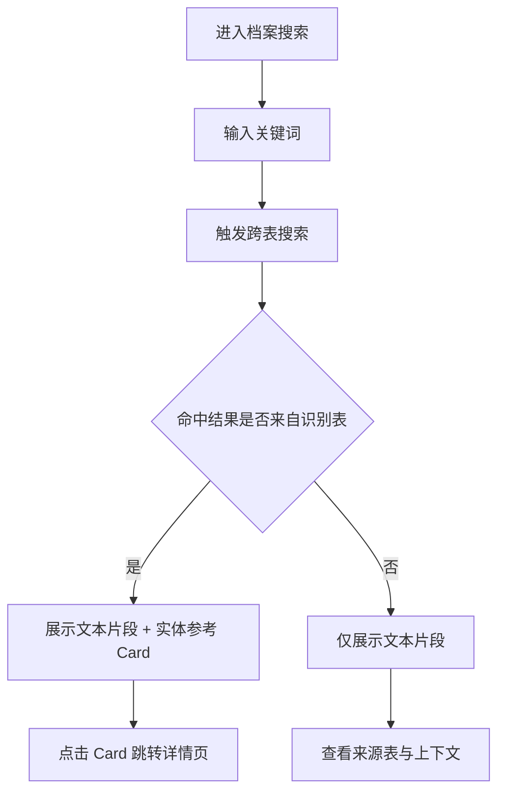

# 档案搜索完善

**功能名称**: 档案搜索
**PRD 版本**: v1.0
**创建日期**: 2026-07-19
**作者**: 产品

## 背景与目标

### 1.1 背景

当前「干员种族」与「干员阵营」卷宗中的「相关记载」仅展示命中的文本片段，管理员无法直接判断这段文本来自哪个具体实体，也无法从结果跳转到对应的干员、武器、物品或敌人卷宗。随着档案局数据不断丰富，跨模块的关键词检索能力成为调阅档案的核心诉求。

### 1.2 目标

- 新增独立的「档案搜索」模块，放置在「大事记」分组下。
- 支持输入关键词后跨表检索游戏文本，结果按照「相关记载」的格式展示。
- 对命中结果中的特定表（WeaponBasicTable、CharacterTable、ItemTable、EnemyTemplateDisplayInfoTable）识别出对应实体，并在结果旁展示可点击的参考 Card。
- 将搜索组件/结果展示组件抽离复用，替换种族、阵营详情页现有的「相关记载」实现，保持视觉与交互一致。

### 1.3 成功标准

- 用户可通过侧边导航或首页进入「档案搜索」并输入关键词。
- 识别到的实体 Card 可直接跳转至对应模块详情页。
- 种族、阵营详情页的「相关记载」区域与档案搜索结果在样式、高亮、Card 展示上保持一致。
- 搜索过程有加载、空态、错误态反馈。

## 用户分析

### 2.1 目标用户

- 查阅世界观、剧情、档案资料的玩家与编辑者。
- 需要快速定位某个关键词在哪些实体描述中出现的研究者。

### 2.2 用户场景

| 场景 | 用户角色 | 目标 | 痛点 |
|--|--|--|--|
| 搜索某个地名或组织名 | 剧情研究者 | 查看该词在哪些档案、武器说明、敌人描述中出现 | 现有模块分散，无法跨表检索 |
| 浏览种族卷宗 | 干员研究者 | 查看该种族除干员外还在哪些文本中被提及 | 只能看到纯文本片段，无法识别具体实体 |
| 验证某个道具相关剧情 | 数据校对者 | 从道具名反查相关剧情与敌人掉落 | 没有统一入口 |

## 功能需求

### 3.1 功能概述

在档案局内新增一个跨模块关键词搜索入口。用户输入关键词后，系统在游戏多语言文本中检索，返回命中的文本片段；若命中内容属于武器、干员、物品或敌人主表，则在该结果旁展示对应实体的迷你参考 Card，点击可跳转详情。

### 3.2 功能列表

#### 功能点 1: 档案搜索入口

- **描述**: 在侧边导航与档案局首页的「大事记」分组下新增「档案搜索」入口，与「剧情记录」「更新日志」并列。
- **用户价值**: 提供全局、显式的关键词检索入口。
- **验收标准**:
  - [ ] 侧边导航「大事记」下出现「档案搜索」链接。
  - [ ] 首页「大事记」卡片下出现「档案搜索」子入口。
  - [ ] 点击后进入档案搜索页面。

#### 功能点 2: 关键词搜索与结果展示

- **描述**: 页面提供搜索输入框，用户输入关键词后按回车触发跨表 i18n 搜索。结果以「相关记载」列表形式展示：每条结果包含来源表、命中文本（关键词高亮）。每页固定 30 条，支持翻页。
- **用户价值**: 快速了解关键词在全站文本中的分布。
- **验收标准**:
  - [ ] 输入框仅通过回车触发搜索，输入过程中不自动搜索。
  - [ ] 关键词在结果文本中以档案金高亮。
  - [ ] 展示结果数量、空态提示与翻页控件。
  - [ ] 每页 30 条，支持上一页/下一页。

#### 功能点 3: 实体识别与参考 Card

- **描述**: 若命中结果来自 WeaponBasicTable、CharacterTable、ItemTable、EnemyTemplateDisplayInfoTable，则解析出实体 ID，展示对应实体的迷你 Card。Card 包含实体名称、图标/头像、关键属性（稀有度、类型等），点击后跳转至对应详情页或弹出提示。
- **用户价值**: 从文本命中直接定位到实体，减少跨模块切换成本。
- **验收标准**:
  - [ ] 武器 Card 展示图标、名称、武器类型、稀有度，跳转 `/archive/weapons/{id}`。
  - [ ] 干员 Card 展示头像、名称、职业、元素、稀有度，跳转 `/archive/operators/{id}`。
  - [ ] 物品 Card 展示图标、名称、稀有度，点击后弹出 `ItemPanel` 物品提示浮层。
  - [ ] 敌人 Card 展示图标、名称、类型/星级、标签；命中 `EnemyTemplateDisplayInfoTable` 时跳转 `/archive/enemies/{templateId}`。
  - [ ] 未识别表的结果仅展示文本片段，不展示 Card。

#### 功能点 4: 种族/阵营详情页复用

- **描述**: 将档案搜索的结果展示组件（含高亮、Card、翻页）抽离为复用组件，替换「干员种族」「干员阵营」详情页现有的「相关记载」实现。种族/阵营名称作为默认搜索词，结果中同样支持实体 Card 与每页 30 条翻页。
- **用户价值**: 统一交互体验，让种族/阵营卷宗的关联信息更丰富。
- **验收标准**:
  - [ ] 种族、阵营详情页的「相关记载」样式与档案搜索一致。
  - [ ] 相关记载中的命中内容若来自识别表，也展示可点击 Card。
  - [ ] 种族、阵营详情页的相关记载支持每页 30 条翻页。
  - [ ] 保留原有种族/阵营成员列表，不受搜索组件替换影响。

### 3.3 用户操作流程

### 3.4 页面/界面描述

| 页面 | 描述 | 关键元素 |
|------|------|---------|
| 档案搜索页 | 全局关键词搜索入口 | 搜索框、结果列表、实体 Card、空态/加载态 |
| 种族详情页 | 复用搜索组件展示相关记载 | 种族名称高亮、结果列表、实体 Card、所属干员 |
| 阵营详情页 | 复用搜索组件展示相关记载 | 阵营名称高亮、结果列表、实体 Card、所属干员 |

### 3.5 异常与边界情况

| 情况 | 预期行为 |
|------|---------|
| 关键词为空 | 不发起搜索，展示占位提示 |
| 无命中结果 | 展示「无相关记载」空态 |
| 搜索接口报错 | 展示错误提示，可重试 |
| 命中表不在识别列表 | 仅展示文本片段，无 Card |
| 翻页到无结果页 | 展示空态或自动回到有效页 |
| 实体数据缺失 | Card 展示兜底占位，仍保留文本结果 |
| 用户输入含正则特殊字符 | 默认按字面量搜索，不触发正则异常 |

## 非功能需求

### 4.1 性能要求

- 每页固定 30 条结果，按接口返回总数本地分页，不设额外上限。
- 输入搜索词后按回车触发，不做实时自动搜索，减少无效请求。
- 实体数据优先走现有缓存，避免重复拉取全表。
- 搜索由回车明确触发，不依赖输入防抖。

### 4.2 兼容性要求

- 桌面端与移动端布局一致：结果列表单列，Card 与文本片段上下排列。
- 多语言跟随全局语言切换，搜索结果随语言变化。

## 依赖与约束

### 5.1 依赖

- 现有 i18n 搜索接口 `/i18n/search/all/{regex}`。
- 现有表数据接口 `/table/{table}/all` 及各表 i18n 字典接口。
- 现有干员、武器、物品、敌人详情页路由。

### 5.2 约束

- 不新增后端服务，全部为前端实现。
- 不修改现有数据模型与适配器返回值结构。
- 保持现有路由约定：`/archive/<module>/:id`。

## 相关文档

- [[20260719-races|干员种族]]
- [[20260719-factions|干员阵营]]
- [[20260719-site-concept|站点概念设计]]
- [[20260719-story|剧情记录]]
