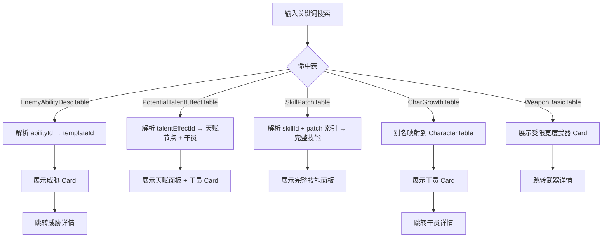

# 搜索结果优化三期

**功能名称**: 搜索结果优化三期  
**PRD 版本**: v1.0  
**创建日期**: 2026-07-19  
**作者**: 产品

## 背景与目标

### 1.1 背景

搜索优化二期完成后，档案搜索已支持跨表关键词检索、实体参考 Card、URL query 联动与种族/阵营穿透。但在实际调阅中仍存在以下体验与数据映射问题：

- 技能/天赋描述中常见的「+12% 攻击力」等增益数值仍使用默认文字色，无法一眼区分正向收益。
- `EnemyAbilityDescTable` 命中后仅能展示能力文本，管理员无法判断该能力属于哪个威胁，也无法跳转到威胁图鉴。
- 武器命中结果复用 `ItemPanel` 后，Card 在搜索结果容器中被拉伸到与容器等宽，视觉比例失衡。
- `PotentialTalentEffectTable` 命中后只能展示归属干员 Card，无法像技能一样直接预览天赋面板。
- 二期默认搜索场景技能等级为 Lv.9，但随着干员技能等级上限提升到 13，武器技能上限为 9，需要区分默认等级。
- `CharGrowthTable` 命中结果理论上应关联到对应干员，但二期实现存在映射缺陷，导致干员 Card 未正确展示。
- `SkillPatchTable` 中部分命中文本是技能的子效果（如燃烧时长、额外伤害），仅展示子效果文本不足以让管理员理解完整技能。

### 1.2 目标

在不改变现有搜索架构与数据接口的前提下，继续补齐搜索结果的可读性、关联性与导航效率：

- 富文本中 `+{expr:format}` 形式的增益数值渲染为蓝色系。
- `EnemyAbilityDescTable` 命中结果关联到 `EnemyTemplateDisplayInfoTable` 并展示威胁跳转 Card。
- 限制搜索结果中武器 Card 的宽度，保持与全局物品组件一致的自然比例。
- `PotentialTalentEffectTable` 命中结果展示天赋面板及归属干员 Card。
- 搜索结果与详情页中，武器技能默认展示 Lv.9，干员技能默认展示 Lv.13。
- 修复 `CharGrowthTable` 的实体映射，使其正确展示归属干员 Card。
- `SkillPatchTable` 命中子效果时，仍展示完整技能面板，并尽量定位到命中的技能等级。

### 1.3 成功标准

- 包含 `+{expr:format}` 的富文本在渲染后，`+数值` 部分呈现蓝色系。
- 敌人能力命中结果旁出现可点击的威胁参考 Card，跳转 `/archive/enemies/{templateId}`。
- 武器命中 Card 不再被拉伸到容器全宽。
- 天赋效果命中结果旁出现天赋面板（图标、名称、等级、描述）及干员 Card。
- 武器技能在搜索与详情场景默认选中 Lv.9，干员技能默认选中 Lv.13。
- `CharGrowthTable` 命中结果正确展示归属干员 Card。
- 技能子效果命中结果展示完整技能面板，且默认等级与命中的 `SkillPatchDataBundle` 索引对应。

## 用户分析

### 2.1 目标用户

- 需要快速判断数值倾向（增益/减益）的数据校对者。
- 从敌人能力文本反查威胁实体的攻略作者。
- 通过天赋/技能描述定位干员与武器的研究者。

### 2.2 用户场景

| 场景 | 用户角色 | 目标 | 痛点 |
|--|--|--|--|
| 搜索「攻击力 +X%」 | 数据校对者 | 快速识别增益数值 | 正负数值颜色无区分 |
| 搜索敌人特殊能力 | 攻略作者 | 知道能力属于哪个敌人 | 只有文本，无实体归属 |
| 搜索天赋效果 | 干员研究者 | 预览天赋并跳转干员 | 仅展示干员 Card，看不到天赋 |
| 搜索技能子效果 | 攻略作者 | 查看完整技能 | 子效果脱离上下文难以理解 |

## 功能需求

### 3.1 功能概述

在现有档案搜索与详情页基础上，针对富文本、敌人能力、武器 Card、天赋面板、技能等级默认值与表映射进行六项优化与一项缺陷修复。

### 3.2 功能列表

#### 功能点 1：富文本增益数值蓝色渲染

- **描述**: 在 `formatBlackboard` 处理文本时，识别原始文本中前面带 `+` 的 `{expr:format}` 占位符（如 `+{atk_up:0.0%}`），将渲染后的 `+数值` 统一包裹为蓝色（`#26bbfd`）。未带 `+` 的占位符保持原色。
- **用户价值**: 一眼区分增益/减益，提升长段技能/天赋描述的可读性。
- **验收标准**:
  - [ ] `+{atk_up:0%}` 渲染为蓝色 `+12%`。
  - [ ] `{atk_up:0%}` 不额外加色。
  - [ ] 蓝色仅作用于被 `+` 引导的数值本身，不影响前后文本。

#### 功能点 2：敌人能力命中关联威胁图鉴

- **描述**: 对 `EnemyAbilityDescTable` 建立到 `EnemyTemplateDisplayInfoTable` 的倒排索引。当命中 `EnemyAbilityDescTable` 时，解析出 `abilityId`，通过索引找到对应 `templateId`，展示威胁参考 Card；点击跳转 `/archive/enemies/{templateId}`。
- **用户价值**: 从能力描述直接定位到威胁实体，减少跨模块切换。
- **验收标准**:
  - [ ] `EnemyAbilityDescTable` 命中结果旁展示敌人 Card（图标、名称、类型/星级、标签）。
  - [ ] 点击 Card 跳转对应威胁详情页。
  - [ ] 若能力未被任何威胁模板引用，仅展示文本，不展示 Card。

#### 功能点 3：武器搜索结果 Card 宽度限制

- **描述**: 搜索结果中的武器 Card（复用 `ItemPanel`）增加固定宽度上限（如 `w-24`），使其与全局物品组件的自然比例一致，不再随容器拉伸到等宽。
- **用户价值**: 统一视觉语言，避免 Card 在大屏下比例失衡。
- **验收标准**:
  - [ ] 武器 Card 宽度不超过 `6rem`（`w-24`）。
  - [ ] 名称折行、图标、稀有度条保持原有比例。
  - [ ] 不影响其他页面（如装备适配、武器详情）中 `ItemPanel` 的宽度行为。

#### 功能点 4：PotentialTalentEffectTable 全映射与天赋面板

- **描述**: 将 `PotentialTalentEffectTable` 从「仅解析归属干员」升级为「展示天赋面板」。通过 `CharGrowthTable.talentNodeMap` 中 `nodeType === 4` 的节点建立 `talentEffectId → 天赋节点信息` 索引；命中天赋效果时，提取节点名称、图标、等级、突破阶段，并结合 `PotentialTalentEffectTable` 的 `desc` 与 `dataList` 中的 blackboard 渲染天赋描述。同时保留归属干员 Card。
- **用户价值**: 与技能面板一样，在搜索结果内直接预览天赋。
- **验收标准**:
  - [ ] 天赋效果命中结果展示 `TalentReferenceCard`（图标、名称、等级、描述）。
  - [ ] 描述中的 blackboard 占位符正确替换。
  - [ ] 天赋面板下方仍展示归属干员 Card。
  - [ ] 若无法定位到天赋节点，降级为仅展示干员 Card。

#### 功能点 5：武器/干员技能默认等级区分

- **描述**: 搜索结果中的 `SkillPatchTable` 命中项，根据归属实体类型设置 `SkillReferenceCard` 默认等级：归属武器时为 Lv.9，归属干员时为 Lv.13；同时调整干员详情页技能滑动条上限与默认值均为 13，武器详情页技能默认等级保持 9（与数据上限一致）。
- **用户价值**: 搜索与详情页的技能等级符合游戏实际上限，避免默认展示不存在等级。
- **验收标准**:
  - [ ] 搜索中武器技能默认选中 Lv.9。
  - [ ] 搜索中干员技能默认选中 Lv.13。
  - [ ] 干员详情页技能滑动条 max=13、default=13。
  - [ ] 若某技能实际等级不足 9/13，回退到实际最高等级。

#### 功能点 6：修复 CharGrowthTable 实体映射

- **描述**: 技术调查发现，二期实现将 `CharGrowthTable` 通过 `SEARCH_ENTITY_ALIAS_TABLES` 映射到 `CharacterTable` 构建实体 map，但结果项渲染时仍使用原始表名 `CharGrowthTable` 查找 entity，导致实体 Card 缺失。修复方案：在 `enrichResults` 中为别名表与间接表统一附加 `ownerEntity`，并在组件层优先展示 `ownerEntity`。
- **用户价值**: `CharGrowthTable` 命中结果（技能组、突破、天赋等）能正确展示归属干员 Card。
- **验收标准**:
  - [ ] `CharGrowthTable` 命中结果旁展示对应干员 Card。
  - [ ] 点击 Card 跳转 `/archive/operators/{charId}`。
  - [ ] 不破坏 `CharacterTagDesTable` 等其它别名表的映射。

#### 功能点 7：SkillPatchTable 子效果命中展示完整技能

- **描述**: `SkillPatchTable` 的 i18n 路径形如 `$.skillId.SkillPatchDataBundle[N].description` 或 `$.skillId.SkillPatchDataBundle[N].subDescDataList[M].desc`。即使命中的是子效果文本，搜索结果仍应渲染完整 `SkillReferenceCard`（技能图标、名称、完整描述、子效果标签）。同时解析路径中的 `SkillPatchDataBundle[N]` 索引，将 `SkillReferenceCard` 默认等级设置为该 patch 的 `level`。
- **用户价值**: 子效果命中不再孤立，管理员可看到完整技能上下文。
- **验收标准**:
  - [ ] 命中 `description` 时展示完整技能面板，默认等级为命中的 patch 等级。
  - [ ] 命中 `subDescDataList[M].desc` 时同样展示完整技能面板，默认等级为所属 patch 等级。
  - [ ] 高亮关键词仍作用于命中的子效果文本。

### 3.3 用户操作流程

### 3.4 页面/界面描述

| 页面 | 描述 | 关键元素 |
|------|------|---------|
| 档案搜索页 | 全局搜索结果 | 高亮文本、蓝色增益数值、敌人/天赋/技能/干员 Card |
| 干员详情页 | 技能展示 | 等级滑动条 1-13，默认 13 |
| 武器详情页 | 技能展示 | 默认等级 9（由数据决定） |

### 3.5 异常与边界情况

| 情况 | 预期行为 |
|------|---------|
| 敌人能力无归属威胁 | 仅展示文本，不展示 Card |
| 天赋效果无对应节点 | 仅展示干员 Card |
| 技能 patch 索引不存在 | 回退到 SkillReferenceCard 默认逻辑（最高等级） |
| 干员技能数据仅到 Lv.12 | 默认选中 Lv.12，不报错 |
| 武器技能数据仅到 Lv.8 | 默认选中 Lv.8 |
| CharGrowthTable 命中但 CharacterTable 缺失 | 仅展示文本，不展示 Card |

## 非功能需求

### 4.1 性能要求

- 倒排索引（敌人能力、天赋节点）按需构建，仅当搜索结果包含对应表时触发。
- 索引构建复用现有 `getCachedData` 缓存，不重复拉取全表。
- 不新增后端接口或数据服务。

### 4.2 兼容性要求

- 蓝色增益数值在桌面端与移动端一致。
- 所有新增 Card 与面板沿用现有暗色主题与 `archive-*` 设计 token。

## 依赖与约束

### 5.1 依赖

- 现有 i18n 搜索接口 `/i18n/search/all/{regex}`。
- 现有表数据接口 `/table/{table}/all` 及各表 i18n 字典。
- 现有 `SkillReferenceCard`、`ItemPanel`、`EntityReferenceCard`、`ArchiveSearchResults` 组件。

### 5.2 约束

- 不新增后端服务。
- 不修改现有数据模型、适配器签名、缓存策略。
- 保持现有路由约定。

## 相关文档

- [[20260719-search-results-optimization|搜索结果优化二期]]
- [[20260719-archive-search|档案搜索完善]]
- [数据表映射参考](../../engineering/references/data-mapping-tables.md)
- [数据层常见陷阱](../../engineering/references/data-pitfalls.md)
- [富文本规范参考](../../engineering/references/rich-text-spec.md)
