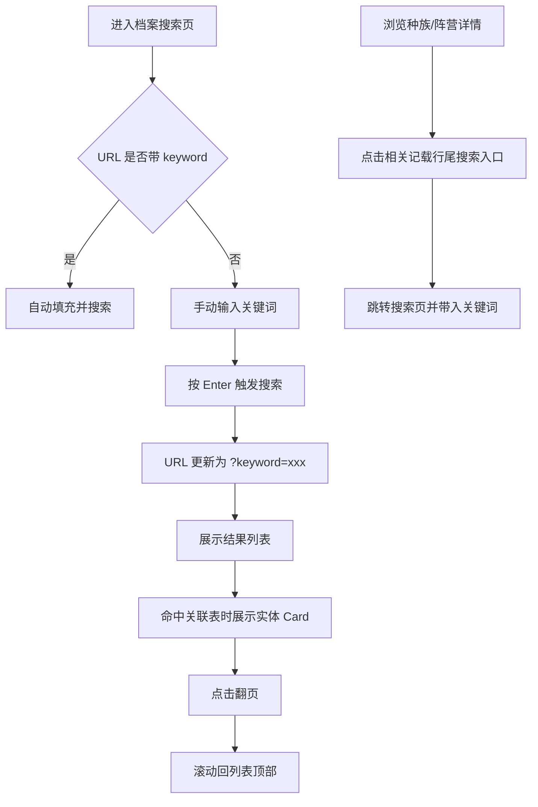

# 搜索结果优化

**功能名称**: 搜索结果优化  
**PRD 版本**: v1.0  
**创建日期**: 2026-07-19  
**作者**: 产品

## 背景与目标

### 1.1 背景

当前档案搜索已支持跨表关键词检索与实体参考 Card，但在实际调阅中仍存在以下体验缺口：

- 武器命中结果使用自定义 Card，与全局物品组件 `ItemPanel` 视觉不一致，且未充分利用已有的物品提示能力。
- 部分与干员强关联的表（天赋效果、标签描述、成长数据）命中后仅展示表名与文本，管理员无法识别它属于哪位干员。
- `SkillPatchTable` 命中后无法识别是哪位干员或哪件武器的技能，缺少技能专用展示组件。
- 关键词高亮使用档案金背景，若原文本身为黄色/金色，高亮后文字与背景对比度不足。
- 翻页后列表仍停留在底部，需要手动回到顶部继续浏览。
- 搜索页关键词仅存于组件本地状态，无法通过 URL 分享或从其他页面穿透带入。
- 种族、阵营详情页的「相关记载」区域缺少一键跳转到独立搜索页的入口。

### 1.2 目标

在不改变现有搜索架构与数据接口的前提下，优化搜索结果的可读性、关联性与导航效率：

- 统一武器命中结果的展示，复用 `ItemPanel`。
- 将干员关联表（PotentialTalentEffectTable、CharacterTagDesTable、CharGrowthTable）的命中结果关联到对应干员。
- 为 SkillPatchTable 命中结果提供公共技能展示组件，并关联对应干员或武器。
- 修复高亮文字颜色被原文颜色覆盖导致的可读性问题。
- 翻页后自动回到结果列表顶部。
- 搜索页支持 URL query `keyword={}`，进入页面时与 query 联动。
- 种族、阵营详情页在「相关记载」行尾增加穿透链接，点击跳转至搜索页并带入对应关键词。

### 1.3 成功标准

- 武器命中结果与物品展示视觉一致，点击后跳转武器详情卷宗。
- 干员关联表命中结果旁展示可点击的干员参考 Card。
- 技能命中结果展示技能信息及所属干员/武器 Card。
- 任何颜色原文被高亮后均保持清晰可读。
- 翻页后页面/列表滚动到顶部，无需手动拖拽。
- 通过 URL `/archive/search?keyword=xxx` 可直接看到对应搜索结果。
- 种族、阵营详情页的「相关记载」行尾存在可点击的搜索穿透入口。

## 用户分析

### 2.1 目标用户

- 需要快速定位关键词所属实体的前端管理员。
- 通过种族/阵营卷宗关联信息研究者。
- 希望分享或收藏特定关键词搜索结果的内容创作者。

### 2.2 用户场景

| 场景 | 用户角色 | 目标 | 痛点 |
|--|--|--|--|
| 搜索武器描述中的关键词 | 武器研究者 | 从文本命中直接跳转到武器卷宗 | 当前武器 Card 与物品组件不一致，且无法跳转 |
| 搜索天赋/标签描述 | 干员研究者 | 知道这段文本属于哪位干员 | 当前只展示表名，无法关联干员 |
| 搜索技能描述 | 攻略作者 | 知道是哪个干员/武器的技能 | 当前无技能组件，也无归属信息 |
| 浏览种族/阵营卷宗 | 世界观研究者 | 查看更多相关记载 | 当前只能在当前页翻页，无法进入全局搜索 |
| 分享搜索结果 | 内容创作者 | 通过链接直接打开某关键词结果 | 当前 URL 不携带关键词 |

## 功能需求

### 3.1 功能概述

在现有档案搜索基础上，对结果展示、实体关联、高亮样式、翻页交互与 URL 联动进行体验优化，并增强种族/阵营详情页与搜索页之间的穿透能力。

### 3.2 功能列表

#### 功能点 1：武器命中结果复用 ItemPanel

- **描述**: 将搜索结果中 `WeaponBasicTable` 命中的实体参考 Card 替换为复用 `ItemPanel`，保持与全局物品展示一致；点击后跳转至武器详情页 `/archive/weapons/{id}`。
- **用户价值**: 统一视觉语言，减少自定义卡片维护成本；利用 `ItemPanel` 已有的图标、稀有度、名称解析能力。
- **验收标准**:
  - [ ] 武器结果使用 `ItemPanel` 展示图标、名称、稀有度。
  - [ ] 点击武器 `ItemPanel` 跳转至武器详情页。
  - [ ] 保留原有稀有度颜色与图标加载失败占位。

#### 功能点 2：干员关联表命中关联 CharacterTable

- **描述**: 当命中表为 `PotentialTalentEffectTable`、`CharacterTagDesTable`、`CharGrowthTable` 时，通过 `charId` 关联到 `CharacterTable`，在结果旁展示对应干员参考 Card；点击跳转 `/archive/operators/{charId}`。
- **用户价值**: 让天赋、标签描述、成长数据等干员子表命中结果具备明确的归属实体。
- **验收标准**:
  - [ ] 上述三表命中时解析出 `charId`。
  - [ ] 结果旁展示干员头像、名称、稀有度的参考 Card。
  - [ ] 点击 Card 跳转对应干员详情页。

#### 功能点 3：SkillPatchTable 技能组件与归属关联

- **描述**: 新增公共技能展示组件 `SkillReferenceCard`。当命中表为 `SkillPatchTable` 时，通过反向索引查找该 `skillId` 属于哪位干员（`CharGrowthTable`）或哪件武器（`WeaponBasicTable`），并同时展示技能组件与所属干员/武器参考 Card。
- **用户价值**: 技能文本命中后可直接识别技能名称、所属实体，减少跨表跳转成本。
- **验收标准**:
  - [ ] 新增可复用的技能展示组件，包含技能图标、名称、等级/描述摘要。
  - [ ] 命中 `SkillPatchTable` 时找到并展示所属干员或武器 Card。
  - [ ] 若同时属于干员与武器（理论上不会），优先展示干员。
  - [ ] 若找不到归属，仅展示技能组件本身。

#### 功能点 4：关键词高亮颜色覆盖

- **描述**: 高亮标签 `<mark>` 在保留档案金背景的同时，强制设置文字颜色为深色（档案墨），覆盖原文可能存在的黄色、金色等浅色文字。
- **用户价值**: 避免原文颜色与高亮背景相近导致无法阅读。
- **验收标准**:
  - [ ] 命中文字被高亮后文字颜色统一为深色。
  - [ ] 未被高亮的富文本颜色保持原样。

#### 功能点 5：翻页后滚动到顶部

- **描述**: 在搜索结果页及种族/阵营详情页的「相关记载」中，翻页后自动将结果列表滚动回顶部，支持平滑滚动。
- **用户价值**: 翻页后可立即从第一条结果开始阅读，无需手动回滚。
- **验收标准**:
  - [ ] 点击任意页码、上一页/下一页后，列表区域回到顶部。
  - [ ] 平滑滚动，不触发突兀跳转。
  - [ ] 初始加载/搜索时不触发无意义的滚动。

#### 功能点 6：搜索页 URL keyword query 联动

- **描述**: 搜索页支持 URL query 参数 `keyword`。进入 `/archive/search?keyword=xxx` 时自动填充搜索框并加载结果；在搜索框按 Enter 时同步更新 URL query；浏览器前进/后退时与页面状态保持一致。
- **用户价值**: 搜索结果可被分享、收藏，并支持从其他页面穿透进入。
- **验收标准**:
  - [ ] URL 中 `keyword` 参数自动触发搜索。
  - [ ] 输入关键词并按 Enter 后 URL 更新为 `?keyword=xxx`。
  - [ ] 清空关键词后 URL 恢复为 `/archive/search`（无 keyword）。
  - [ ] 浏览器前进/后退时搜索框与结果同步更新。

#### 功能点 7：种族/阵营详情页搜索穿透

- **描述**: 在种族详情页与阵营详情页的「相关记载」标题同一行末尾，增加一个穿透链接，文案统一为「搜索更多」。点击后跳转至 `/archive/search?keyword={raceName|factionName}`，在全局搜索页查看该关键词的全部相关记载。
- **用户价值**: 从卷宗关联信息自然过渡到全局搜索，扩大信息覆盖面。
- **验收标准**:
  - [ ] 「相关记载」行尾出现可点击的「搜索更多」入口。
  - [ ] 点击后跳转搜索页并自动带入种族/阵营名称作为关键词。
  - [ ] 不破坏原「相关记载」组件的翻页与展示。

### 3.3 用户操作流程

### 3.4 页面/界面描述

| 页面 | 描述 | 关键元素 |
|------|------|---------|
| 档案搜索页 | 关键词全局搜索入口 | 搜索框、URL keyword 联动、结果列表、实体 Card、翻页、回到顶部 |
| 搜索结果项 | 单条命中展示 | 来源表、高亮文本、实体 Card（干员/武器/物品/敌人/技能） |
| 种族详情页 | 展示种族资料与相关记载 | 种族名、相关记载行尾「搜索更多」穿透链接、成员列表 |
| 阵营详情页 | 展示阵营资料与相关记载 | 阵营名、相关记载行尾「搜索更多」穿透链接、成员列表 |

### 3.5 异常与边界情况

| 情况 | 预期行为 |
|------|---------|
| 高亮文本包含浅色原文 | 高亮区域内文字强制深色，保证可读 |
| 干员关联表数据缺失 | 仅展示文本结果，不展示 Card |
| 技能无归属实体 | 仅展示技能组件，不展示归属 Card |
| URL keyword 为空 | 不触发搜索，展示搜索提示 |
| 浏览器回退到无 keyword | 清空搜索框与结果 |
| 种族/阵营名称为空 | 不渲染穿透链接 |

## 非功能需求

### 4.1 性能要求

- 反向索引构建复用现有缓存，不重复拉取全表。
- URL query 联动不引入额外请求，仅同步本地状态与路由。
- 滚动行为使用原生 API，避免引入新依赖。

### 4.2 兼容性要求

- 桌面端与移动端滚动行为一致。
- 多语言切换后高亮颜色与实体 Card 展示保持一致。

## 依赖与约束

### 5.1 依赖

- 现有 i18n 搜索接口 `/i18n/search/all/{regex}`。
- 现有表数据接口 `/table/{table}/all` 及各表 i18n 字典。
- 现有 `ItemPanel`、`RichText`、`ArchiveSearchResults` 组件。
- `react-router-dom` v7 query 参数能力。

### 5.2 约束

- 不新增后端服务。
- 不修改现有数据模型与适配器返回值结构。
- 不破坏现有路由约定。

## 相关文档

- [[20260719-archive-search|档案搜索]]
- [[20260719-races|干员种族]]
- [[20260719-factions|干员阵营]]
- [[20260719-operator-archive|干员档案]]
- [[20260719-weapon-archive|武器档案]]
