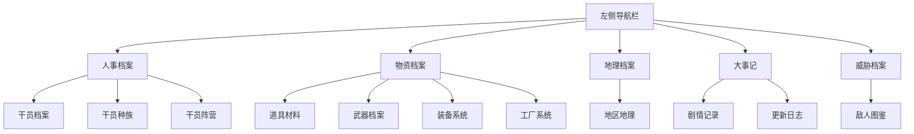

# 左侧导航栏分组优化

**功能名称**: 左侧导航栏分组优化
**PRD 版本**: v1.0
**创建日期**: 2026-07-19
**作者**: 产品设计

## 背景与目标

### 1.1 背景

当前宏山档案局侧边导航以扁平列表展示全部卷宗入口。随着干员、武器、敌人、道具、地理、装备、工厂、剧情、更新日志等门类陆续补齐，导航项数量已接近 10 个，且未来还将持续扩展。扁平结构导致：

- 新管理员难以快速建立「档案分类」心智，需在多个入口间反复扫视；
- 语义相近的入口（如干员档案、干员种族、干员阵营）缺乏归属关系，查阅路径松散；
- 部分占位模块（装备系统、工厂系统）与已开放模块混排，优先级表达不清晰。

### 1.2 目标

在不改变现有路由与功能入口的前提下，对左侧导航栏引入「分组标签」设计：

- 按业务领域将卷宗入口归组，强化档案局的秩序感与可预期性；
- 分组标签仅作视觉归类，不引入折叠/展开交互，保持操作路径的一键直达；
- 明确各分组的命名、排序与包含范围，为后续新增卷宗预留清晰的归属位置。

### 1.3 成功标准

- 侧边导航呈现 5 个明确分组，每个分组下入口归属无歧义；
- 用户首次进入站点即可通过分组标签快速判断目标入口所在区域；
- 分组标签不增加额外点击成本，所有入口仍从导航栏直接可达；
- 移动端抽屉导航同样遵循分组规则，信息层级与桌面端一致。

## 用户分析

### 2.1 目标用户

- **高频调阅者**：需要反复切换干员、武器、道具等模块的核心玩家；
- **世界观探索者**：关注剧情、地区、种族、阵营等叙事内容的用户；
- **版本追踪者**：定期查看更新日志与版本差异的内容创作者。

### 2.2 用户场景

| 场景 | 用户目标 | 当前痛点 | 优化后预期 |
|------|----------|----------|------------|
| 配队前查阅干员与武器 | 在人事与物资相关模块间快速切换 | 入口平铺，干员、武器、道具、装备交错排列 | 通过「人事档案」「物资档案」分组快速定位 |
| 了解世界观设定 | 查看种族、阵营、地区、剧情 | 叙事类入口分散在列表各处 | 集中在「人事档案」「地理档案」「大事记」区域 |
| 追踪版本变化 | 查看更新日志 | 更新日志位于列表末尾，缺乏归类 | 纳入「大事记」，与剧情记录并列 |
| 移动端查阅 | 在较小屏幕上找到入口 | 列表过长，扫描成本高 | 分组标签作为锚点，缩短视觉搜索路径 |

## 功能需求

### 3.1 功能概述

本次优化仅针对左侧导航栏的信息组织方式，不涉及页面内容、路由结构或交互路径的变更。通过新增「分组标签」将现有入口按业务领域重新聚类，使导航从「单级长列表」升级为「分组索引」。

### 3.2 分组设计原则

- **标签化**：每个分组以一段文字标签呈现，仅说明该区域的业务领域；
- **非折叠**：分组标签本身不可点击、不可展开/折叠，避免增加操作步骤；
- **领域驱动**：分组命名优先使用档案局业务术语（如「人事档案」「物资档案」），而非技术或功能术语；
- **可扩展**：每个分组预留扩展位，未来新增卷宗可自然归入已有分组，或新增分组；
- **顺序稳定**：分组顺序按管理员查阅频率与业务重要性排列，不随单模块热度频繁调整。

### 3.3 分组方案

#### 3.3.1 人事档案

收录与干员、人员身份相关的卷宗。

| 入口 | 说明 |
|------|------|
| 干员档案 | 可操作角色列表与单干员卷宗 |
| 干员种族 | 种族总览与种族详情 |
| 干员阵营 | 阵营总览与阵营详情 |

#### 3.3.2 物资档案

收录与装备、武器、道具、生产系统相关的卷宗。

| 入口 | 说明 |
|------|------|
| 道具材料 | 物品列表、提示与分类浏览 |
| 武器档案 | 武器列表与武器卷宗 |
| 装备系统 | 装备相关档案（待建设） |
| 工厂系统 | 工厂与生产相关档案（待建设） |

#### 3.3.3 地理档案

收录与塔卫二地理、区域相关的卷宗。

| 入口 | 说明 |
|------|------|
| 地区地理 | 区域列表与区域详情 |

#### 3.3.4 威胁档案

收录与敌对目标、作战情报相关的卷宗。

| 入口 | 说明 |
|------|------|
| 敌人图鉴 | 敌人列表与敌人卷宗 |

#### 3.3.5 大事记

收录与剧情叙事、版本变更相关的记录类卷宗。

| 入口 | 说明 |
|------|------|
| 剧情记录 | 剧情章节与事件记录 |
| 更新日志 | 版本差异与变更聚合 |

## 信息架构

## 交互规则

### 5.1 分组标签

- 分组标签以文字形式展示在分组顶部；
- 标签文字颜色使用次级文字色，字号略小于导航入口，形成层级区分；
- 标签不响应 hover、click、focus 等交互，仅作为信息归类标识。

### 5.2 分组内入口

- 分组内入口保持现有导航样式：默认态、hover 态、激活态；
- 激活态高亮规则不变：当前页面所属入口以强调色高亮；
- 分组之间保留适当间距，避免视觉粘连。

### 5.3 分组顺序

推荐从上至下顺序为：

1. 人事档案
2. 物资档案
3. 地理档案
4. 威胁档案
5. 大事记

该顺序基于管理员日常查阅频率排列：干员与物资为最高频，地理与威胁为场景补充，大事记为低频但重要的记录入口。

### 5.4 移动端适配

- 移动端抽屉导航沿用桌面端分组规则；
- 分组标签在抽屉内同样以非交互形式展示；
- 分组间距可适当压缩，以适配较小屏幕。

## 视觉建议

> 本节为设计建议，最终样式以视觉设计稿为准。

- 分组标签使用正文无衬线字体，字号 11–12px；
- 分组标签文字使用全大写并加宽字间距，营造档案索引感；
- 分组之间使用 16–24px 垂直间距，分组内入口保持 4–8px 间距；
- 分组标签不使用装饰线或图标，保持克制与简洁。

## 异常与边界情况

| 情况 | 预期行为 |
|------|----------|
| 分组下仅有一个入口 | 仍展示分组标签，保持结构一致性（如「地理档案」下仅「地区地理」） |
| 新增卷宗 | 根据语义归入已有分组；无法归属时，由产品侧评估是否新增分组 |
| 某分组下所有入口均未开放 | 仍展示分组标签与占位入口，入口状态沿用现有「卷宗整理中」提示 |
| 多语言场景 | 分组标签需随界面语言切换，保持与入口文案一致的翻译规范 |

## 验收标准

- [ ] 侧边导航展示「人事档案」「物资档案」「地理档案」「威胁档案」「大事记」五个分组；
- [ ] 「人事档案」下包含：干员档案、干员种族、干员阵营；
- [ ] 「物资档案」下包含：道具材料、武器档案、装备系统、工厂系统；
- [ ] 「地理档案」下包含：地区地理；
- [ ] 「威胁档案」下包含：敌人图鉴；
- [ ] 「大事记」下包含：剧情记录、更新日志；
- [ ] 分组标签为纯展示元素，不可点击、不可折叠/展开；
- [ ] 分组内入口的激活态、hover 态与现有行为保持一致；
- [ ] 移动端抽屉导航应用相同的分组规则；
- [ ] 多语言场景下分组标签文案正常切换，无截断或错位。

## 待确认问题

1. **分组命名**：「大事记」是否保留，或改为「记录档案」「纪事档案」等更档案局风格的名称？
2. **分组顺序**：当前顺序是否满足查阅习惯，是否需要 A/B 验证？

## 相关文档

- [[20260719-site-concept|宏山档案局概念设计]]
- [[20260719-operator-archive|干员档案]]
- [[20260719-races|干员种族]]
- [[20260719-factions|干员阵营]]
- [[20260719-weapon-archive|武器档案]]
- [[20260719-items-materials|道具材料]]
- [[20260719-enemies|敌人图鉴]]
- [[20260719-story|剧情记录]]
- [[20260719-updates|更新日志]]
