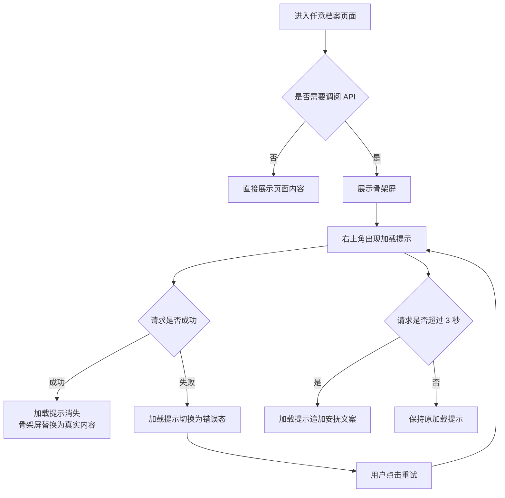
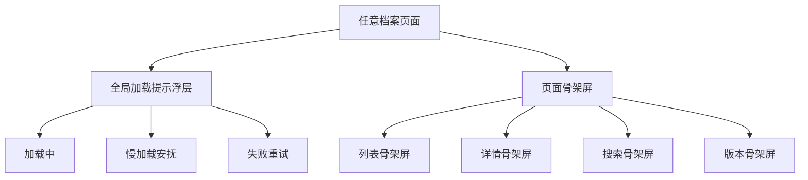

# 加载提示框产品方案

**功能名称**: 加载提示框与骨架屏
**PRD 版本**: v1.0
**创建日期**: 2026-07-20
**作者**: 产品

## 背景与目标

### 1.1 背景

宏山档案局的数据均来自远端 API，调阅过程中可能因网络波动、数据包较大或接口响应慢而出现长时间等待。当前站点仅在部分页面出现加载失败时给出错误提示，缺乏统一、显式的加载状态反馈，用户无法判断当前是“正在调阅”还是“页面卡死”。

### 1.2 目标

- 建立全局一致的加载提示机制，让用户在任意页面都能感知到数据正在调阅。
- 通过骨架屏在页面内容区保留结构预期，减少等待过程中的焦虑感。
- 对加载超时或请求失败给出强提示，并提供可重试路径。

### 1.3 成功标准

- 任意 API 请求触发后，用户在 200ms 内能看到右上角加载提示。
- 所有列表页、详情页、搜索页、更新页在数据加载时展示骨架屏。
- 加载失败时，用户能在提示框中感知失败原因并完成重试。
- 提示框与骨架屏视觉风格与档案局现有设计语言一致。

## 用户分析

### 2.1 目标用户

- **核心用户**：高频调阅干员、武器、敌人资料的管理员。
- **次要用户**：查看版本更新、剧情记录、阵营种族资料的浏览型用户。
- **潜在用户**：网络环境不稳定的移动端用户。

### 2.2 用户场景

| 场景 | 用户角色 | 目标 | 痛点 |
|------|----------|------|------|
| 首次进入干员列表 | 核心玩家 | 快速看到干员卡片 | 页面空白，不确定是否在加载 |
| 切换语言后刷新 | 多语言用户 | 等待字典与表数据重新拉取 | 多请求并发，没有任何进度感知 |
| 地铁等弱网环境浏览 | 移动端用户 | 了解当前网络状态 | 失败后才提示，无法判断是网慢还是异常 |
| 查看干员详情 | 攻略作者 | 快速进入技能/材料区 | 只有一小块骨架，结构预期不完整 |

## 功能需求

### 3.1 功能概述

在全局增加固定的加载提示浮层，并在所有依赖远端数据的页面补充骨架屏。加载提示负责告诉用户“系统正在工作”，骨架屏负责保留页面结构，让用户知道即将出现什么内容。

### 3.2 功能列表

#### 功能点 1: 全局加载提示浮层

- **描述**: 在页面右上角固定展示一个加载提示框。任意 API 请求开始时出现，请求全部结束后消失。多请求并发时展示当前活跃请求数与最近一条请求的描述。
- **用户价值**: 无论用户身处哪个模块，都能第一时间知道系统正在调阅档案。
- **验收标准**:
  - [ ] 请求开始后 200ms 内浮层出现。
  - [ ] 浮层展示档案局风格的加载动画。
  - [ ] 并发请求时显示“正在调阅 N 份档案”。
  - [ ] 单请求时显示当前调阅的档案描述，如“正在调阅干员档案”。
  - [ ] 所有请求结束后浮层平滑消失。

#### 功能点 2: 慢加载安抚提示

- **描述**: 当某个请求持续超过 3 秒仍未完成时，在加载提示浮层中追加安抚文案“档案数据较大，请稍候…”。
- **用户价值**: 减少用户因长时间等待而产生的“卡死”焦虑。
- **验收标准**:
  - [ ] 仅对持续超过 3 秒的请求显示安抚文案。
  - [ ] 文案出现后不会遮挡或改变页面主要操作。
  - [ ] 请求完成后安抚文案随浮层一起消失。

#### 功能点 3: 请求失败强提示与重试

- **描述**: 当任意 API 请求失败时，加载提示浮层切换为错误态，展示“调阅失败”与失败原因，并提供“重试”按钮。失败期间页面原有骨架屏保留。
- **用户价值**: 明确告知用户网络/服务端异常，并提供一键恢复路径。
- **验收标准**:
  - [ ] 请求失败后浮层立即切换为错误态。
  - [ ] 错误态显示失败原因摘要。
  - [ ] 提供“重试”按钮，点击后重新发起失败的请求。
  - [ ] 重试期间浮层恢复为加载态。

#### 功能点 4: 全页面骨架屏

- **描述**: 为所有依赖 API 数据的页面补充骨架屏。列表页保留标题、筛选区占位与卡片网格；详情页保留头像/立绘区、标题区、分栏信息区；搜索页保留搜索框与结果列表占位。
- **用户价值**: 在加载期间给用户清晰的页面结构预期，避免白屏。
- **验收标准**:
  - [ ] 干员列表、武器列表、敌人列表、道具列表展示列表骨架屏。
  - [ ] 干员详情、武器详情、敌人详情、种族详情、阵营详情展示详情骨架屏。
  - [ ] 档案搜索页展示搜索骨架屏。
  - [ ] 更新日志、版本概要、表差异页展示对应骨架屏。
  - [ ] 骨架屏使用档案局色板，动效为柔和的脉冲，不闪烁。

### 3.3 用户操作流程

### 3.4 页面/界面描述

| 页面 | 加载态元素 | 关键结构保留 |
|------|-----------|-------------|
| 列表页 | 列表骨架屏 + 全局加载提示 | 标题区、筛选区占位、卡片网格 |
| 详情页 | 详情骨架屏 + 全局加载提示 | 头像/立绘区、标题区、属性面板占位、分栏区 |
| 搜索页 | 搜索骨架屏 + 全局加载提示 | 搜索输入框、结果条数占位、结果列表占位 |
| 更新日志页 | 版本列表骨架屏 + 全局加载提示 | 版本卡片网格、版本号/时间占位 |
| 全局浮层 | 右上角固定 | 加载动画、请求数、当前描述、错误态、重试按钮 |

### 3.5 异常与边界情况

| 情况 | 预期行为 |
|------|---------|
| 多请求同时发起 | 浮层显示总请求数；任一请求失败即切换为错误态，重试仅针对失败请求 |
| 请求快速完成 | 浮层出现时间极短，使用最小 400ms 展示时间，避免一闪而过 |
| 用户切换页面 | 已完成的请求不影响新页面；未完成的请求继续显示在浮层中 |
| 缓存命中无需请求 | 不触发加载提示，页面直接展示内容 |
| 连续失败 | 每次失败都展示错误态，重试按钮可重复点击 |
| 弱网环境 | 3 秒后显示安抚文案，失败后可重试 |

## 设计语言

### 4.1 加载提示浮层

- **位置**: 页面右上角，距离顶部 16px，距离右侧 16px，在侧边栏与主内容区之上。
- **尺寸**: 最小宽度 240px，最大宽度 320px，高度根据内容自适应。
- **背景**: 档案墨 `#0A0A0D` 95% 不透明度，边框铁 `#2A2B35` 1px。
- **文字**: 象牙白 `#E8E6E3` 用于主文案，烟尘灰 `#8B8982` 用于次要信息。
- **加载动画**: 沉金 `#B89A6A` 旋转圆环，直径 16px，线宽 2px，周期 1s。
- **错误态**: 印章红 `#9E3A3A` 图标与边框，重试按钮使用档案金 hover。

### 4.2 骨架屏

- **基础色**: 边框铁 `#2A2B35` 作为骨架块背景。
- **高光色**: 卷宗灰 `#13141A` 作为脉冲高光。
- **圆角**: 与页面真实卡片保持一致，默认 4–8px。
- **动效**: `animate-pulse`，周期 2s，避免过快闪烁。
- **结构**: 列表页保留 4–8 个卡片占位；详情页保留头像、标题、3–4 个信息区块占位；搜索页保留 6 条结果占位。

## 信息架构

全局加载提示与骨架屏为横跨所有模块的基础设施，不改变现有页面结构与路由关系。

## 非功能需求

### 5.1 性能要求

- 加载提示浮层不得阻塞用户交互。
- 骨架屏使用 CSS 动画，避免额外图片或脚本开销。
- 缓存命中时不应触发任何加载提示或骨架屏。

### 5.2 可访问性要求

- 加载动画应支持 `prefers-reduced-motion`，减少动效模式下可禁用脉冲动画。
- 错误态提示需具备足够的颜色对比度。
- 重试按钮需可通过键盘聚焦。

### 5.3 兼容性要求

- 与现有响应式布局兼容，移动端浮层宽度适配屏幕，避免遮挡核心内容。
- 兼容现有深色主题，不引入新的亮色模式逻辑。

## 依赖与约束

### 6.1 依赖

- 依赖现有 API 与缓存机制。
- 依赖现有 i18n 字典体系。

### 6.2 约束

- 不新增后端接口。
- 不修改现有数据模型与业务逻辑。
- 不改变现有页面路由与信息架构。
- 加载提示框与骨架屏仅作为体验增强层。

## 验收标准

- [ ] 任意 API 请求开始后 200ms 内右上角出现加载提示。
- [ ] 多请求并发时提示显示请求数与当前调阅描述。
- [ ] 请求持续超过 3 秒显示安抚文案。
- [ ] 请求失败时提示框切换为错误态并提供重试按钮。
- [ ] 所有依赖 API 的页面在加载时展示骨架屏。
- [ ] 骨架屏视觉风格与档案局现有设计一致。
- [ ] 缓存命中时无加载提示与骨架屏。
- [ ] 移动端浮层不遮挡核心内容。

## 相关文档

- [[20260719-archive-bureau-redesign|宏山档案局整体品牌升级与视觉重构方案]]
- [[20260719-site-concept|宏山档案局概念设计]]
- [[20260719-archive-search|档案搜索完善]]
- [[20260719-operator-archive|干员档案]]
- [[20260719-weapon-archive|武器档案]]
- [[20260719-enemies|敌人图鉴]]
- [[20260719-items-materials|道具材料]]
- [[20260719-updates|更新日志]]
