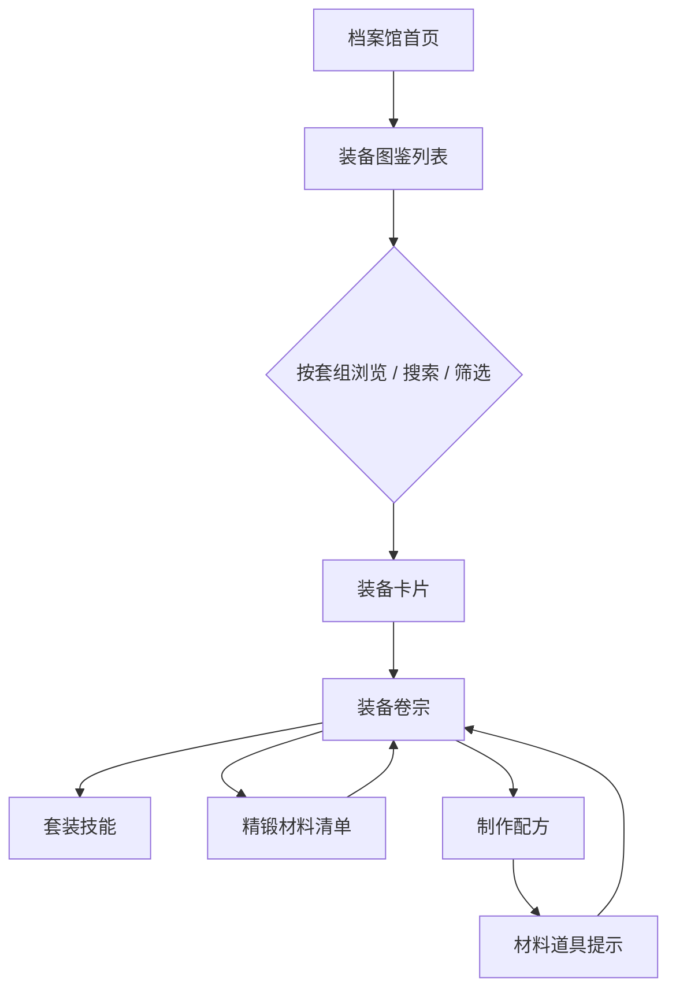

# 装备图鉴

**功能名称**: 装备图鉴（/archive/equipment）
**PRD 版本**: v1.1
**创建日期**: 2026-07-21
**作者**: 宏山档案馆产品组

## 修订记录

| 版本 | 日期 | 说明 |
|------|------|------|
| v1.0 | 2026-07-21 | 初版 |
| v1.1 | 2026-07-21 | 首轮验收问题修订：属性名称展示、套装效果名称显隐、卷宗内装备点击行为、精锻材料按词条分组与数值排序、配方卡片宽度、套组徽记设计 |

## 背景与目标

### 1.1 背景

档案馆已上线干员、武器、道具、敌人等图鉴模块，但「装备」模块目前仅有占位页。装备是终末地工业体系中干员养成的核心一环：装备分为护甲、护手、配件三个部位，高阶装备隶属于不同「套组」，集齐套组可激活套装技能；装备可通过配方制作，也可通过消耗同部位金色品质装备进行「精锻」强化。馆员目前无法在任何页面查阅装备的属性、套装效果、精锻材料与制作配方。

### 1.2 目标

- 上线装备列表页与装备卷宗页，覆盖游戏内全部装备。
- 列表默认以「套组」为分组，与干员、武器、物品列表保持一致的浏览体验。
- 卷宗页完整呈现装备属性、套装技能、精锻材料与制作配方。
- 道具提示（Tooltip）同步支持装备类物品，保证全站物品引用体验一致。

### 1.3 成功标准

- 全部装备（含散件与套装件）均可在列表页检索到，且每个套组分组正确。
- 任意装备卷宗页可查看：基础属性、所属套组及套装技能、可用于精锻的同部位装备、制作配方。
- 站内所有出现装备类物品的位置（如配方材料、获取途径）均可通过道具提示查看装备摘要。

## 用户分析

### 2.1 目标用户

- 终末地玩家：查询装备属性、套装效果，规划制作与强化路线。
- 攻略作者：引用装备数据进行配装推荐。

### 2.2 用户场景

| 场景 | 用户角色 | 目标 | 痛点 |
|--|--|--|--|
| 浏览套组 | 玩家 | 按套组浏览装备，了解每个套组包含哪些部位、套装技能是什么 | 游戏内无法一览全部套组及其技能数值 |
| 规划制作 | 玩家 | 查看某件装备的制作配方与材料数量 | 配方分散，材料需求不透明 |
| 精锻强化 | 玩家 | 知道哪些装备可以当作目标装备的精锻材料 | 游戏内只能在强化界面逐个翻找 |
| 查询属性 | 玩家/攻略作者 | 查看装备基础属性、附加属性及精锻后的强化数值 | 站外资料零散且多语言不全 |

## 功能需求

### 3.1 功能概述

新增装备图鉴模块：列表页以套组为分组展示全部装备；卷宗页展示单件装备的完整档案（属性、套装技能、精锻材料、制作配方）；全站道具提示同步支持装备。

### 3.2 功能列表

#### 功能点 1: 装备列表（套组分组）

- **描述**: 列表页以卡片形式展示全部装备，默认按所属套组分组，无套组的散件归入「散件」分组。分组标题展示套组名称、徽记与组内数量。每张卡片包含装备图标、名称、稀有度色条、部位。
- **用户价值**: 套组是装备的核心组织方式，按套组浏览可以快速定位目标套装及其全部部位。
- **验收标准**:
  - [ ] 默认按套组分组，散件归入独立分组且排在最后。
  - [ ] 支持按名称或 ID 模糊搜索。
  - [ ] 支持部位（护甲/护手/配件）与稀有度筛选。
  - [ ] 支持按稀有度、穿戴等级排序（升/降序）。
  - [ ] 分页：每页 12 / 24 / 48 / 全部，各分组独立分页。
  - [ ] 点击卡片进入对应装备卷宗页。
  - [ ] 分组标题的套组徽记清晰可辨：使用适配深色背景的徽记版本，按原始宽高比展示，不压缩为方形小图标。

#### 功能点 2: 装备卷宗（基础信息与属性）

- **描述**: 卷宗页展示装备名称、图标、稀有度、部位、最低穿戴等级、物品描述与背景文本；属性区展示基础属性与全部附加属性，并展示每条附加属性精锻强化后的数值。
- **用户价值**: 一页看清单件装备的全部数值，包括强化上限。
- **验收标准**:
  - [ ] 头部展示图标、名称、稀有度色条、部位与穿戴等级。
  - [ ] 属性区展示基础属性与附加属性名称及数值；有强化值的附加属性展示各强化阶段数值。
  - [ ] 所有属性名称与游戏内展示名称完全一致（含「所有技能伤害加成」等组合类属性），不允许出现「属性0」之类的占位文本；百分比类属性按游戏内格式展示（如 27.6%）。
  - [ ] 描述与背景文本富文本正常解析。

#### 功能点 3: 套装信息与套装技能

- **描述**: 若装备属于套组，卷宗页展示所属套组名称、徽记、套组内全部装备（可跳转），以及套装技能（集齐指定件数激活）的完整技能信息，展示形式与武器技能面板一致，支持技能数值的富文本解析。
- **用户价值**: 套装技能是配装决策的关键，需要与武器技能同等的展示质量。
- **验收标准**:
  - [ ] 套装技能卡片与武器技能卡片视觉一致，技能描述中的数值占位符正确替换。
  - [ ] 套装效果在游戏内没有名称（经核实全部套装效果均未命名），不展示名称，也不允许回退展示效果 ID（如 `passive_equipsuit_atk_02`）。
  - [ ] 套组内装备列表点击后弹出装备摘要提示（与全站道具提示一致），提示内提供「查看卷宗」跳转入口，而非直接跳转。
  - [ ] 散件（无套组）不展示此区域。

#### 功能点 4: 精锻材料（按属性词条分组）

- **描述**: 卷宗页展示可用于精锻当前装备的其他装备清单。依据游戏机制：精锻需消耗与待精锻装备**同部位**的**金色品质**装备，且每次精锻针对一条附加属性词条。清单按当前装备可精锻的属性词条分组展示：每个词条一组，组内仅列出拥有相同词条的适配装备，并展示每件材料对应该词条的数值，数值高的排在前面。例如某装备可精锻「智识」「力量」「所有技能伤害加成」三条词条，则精锻材料分为三组，「智识」组内只展示同样带有「智识」词条的装备及其数值。
- **用户价值**: 强化某条词条前即可直观对比哪些材料数值更高，规划材料来源，无需在游戏内逐个翻找。
- **验收标准**:
  - [ ] 精锻材料按当前装备可精锻的属性词条分组，组标题为词条名称（与游戏内展示名称一致）。
  - [ ] 每组内仅列出同部位、金色品质、排除自身且拥有相同词条的装备。
  - [ ] 每件材料卡片展示其对应该词条的数值，组内按数值从高到低排序。
  - [ ] 材料卡片点击后弹出装备摘要提示，提示内提供「查看卷宗」跳转入口。
  - [ ] 某词条无适配材料时该分组展示空态提示；全部词条均无适配材料时展示整体空态提示。

#### 功能点 5: 制作配方

- **描述**: 卷宗页展示制作该装备的配方：消耗材料（图标 + 数量）、消耗货币（图标 + 数量）与配方解锁条件。同一装备存在多条制作链路时（不同材料组合），全部列出。配方展示区抽取为通用展示能力，后续工厂等模块可复用。
- **用户价值**: 材料需求一目了然，可直接跳转查看材料详情。
- **验收标准**:
  - [ ] 展示配方全部消耗项（材料 + 货币）的图标、名称、数量。
  - [ ] 配方卡片宽度适配内容（fit-content），不横向撑满整行。
  - [ ] 存在多条制作链路时逐条展示。
  - [ ] 有解锁条件的配方展示解锁条件说明。
  - [ ] 材料图标可打开对应道具提示。
  - [ ] 无配方的装备（如仅掉落获取）不展示此区域。

#### 功能点 6: 道具提示支持装备

- **描述**: 全站道具提示（物品图标的悬浮/点击弹层）新增对装备类物品的支持：展示装备名称、图标、稀有度、部位、属性摘要、套装信息摘要，并提供跳转装备卷宗的入口。
- **用户价值**: 在配方材料、获取途径等任意场景看到装备图标时，都能直接预览装备信息。
- **验收标准**:
  - [ ] 装备类物品点击后弹出装备摘要弹层，而非空白或通用物品文案。
  - [ ] 弹层提供「查看卷宗」跳转入口。

### 3.3 用户操作流程

### 3.4 页面/界面描述

| 页面 | 描述 | 关键元素 |
|------|------|---------|
| 装备列表 `/archive/equipment` | 套组分组的装备卡片墙 | 分组标题（套组名+徽记+计数）、搜索框、部位/稀有度筛选、排序、分页 |
| 装备卷宗 `/archive/equipment/:id` | 单件装备完整档案 | 头部（图标/名称/稀有度/部位/穿戴等级）、属性区、套装技能区、精锻材料区、配方区、描述区 |

### 3.5 异常与边界情况

| 情况 | 预期行为 |
|------|---------|
| 散件（无套组） | 列表归入「散件」分组；卷宗不展示套装区域 |
| 装备无制作配方 | 卷宗不展示配方区域 |
| 套装效果无游戏内名称 | 隐藏名称，不回退展示效果 ID |
| 组合类属性（如所有技能伤害加成） | 正确展示游戏内属性名与百分比格式，不出现「属性0」占位 |
| 某精锻词条无适配材料 | 该词条分组展示空态提示 |
| 同部位无金色品质装备可作精锻材料 | 精锻材料区展示整体空态提示 |
| 技能描述缺失或数值占位符无法解析 | 回退展示原始文本，不出现未替换的 `{placeholder}` |
| 装备图标加载失败 | 展示占位图标 |
| 数据加载失败 | 展示错误提示与重试入口 |
| 多语言环境 | 装备名称、描述、套组名、技能描述均按当前语言展示，缺失时按语言回退链处理 |

## 四、非功能需求

### 4.1 性能要求

- 列表页筛选、排序、分组均在本地完成，切换不触发额外请求。
- 图片按需加载，列表滚动流畅。

### 4.2 安全性要求

- 纯只读档案数据，无用户输入提交。

### 4.3 兼容性要求

- 支持全站 14 种语言。
- 响应式布局，适配移动端与桌面端。

## 五、依赖与约束

### 5.1 依赖

- 游戏数据服务提供的装备、套组、配方、技能等数据表。
- 站内已有的技能展示与道具提示能力（装备复用其展示形式）。

### 5.2 约束

- 与干员、武器、物品模块保持一致的浏览与视觉体验。
- 全站文案须覆盖 14 种语言，不允许出现占位语言。

## 六、相关文档

- [[20260719-site-concept|站点概念设计]]
- [[20260719-weapon-archive|武器档案]]
- [[20260719-items-materials|道具材料]]
- 技术方案：`docs/engineering/proposal/20260721-equipment-archive.md`
- 验收修订技术方案：`docs/engineering/proposal/20260721-equipment-archive-acceptance.md`
