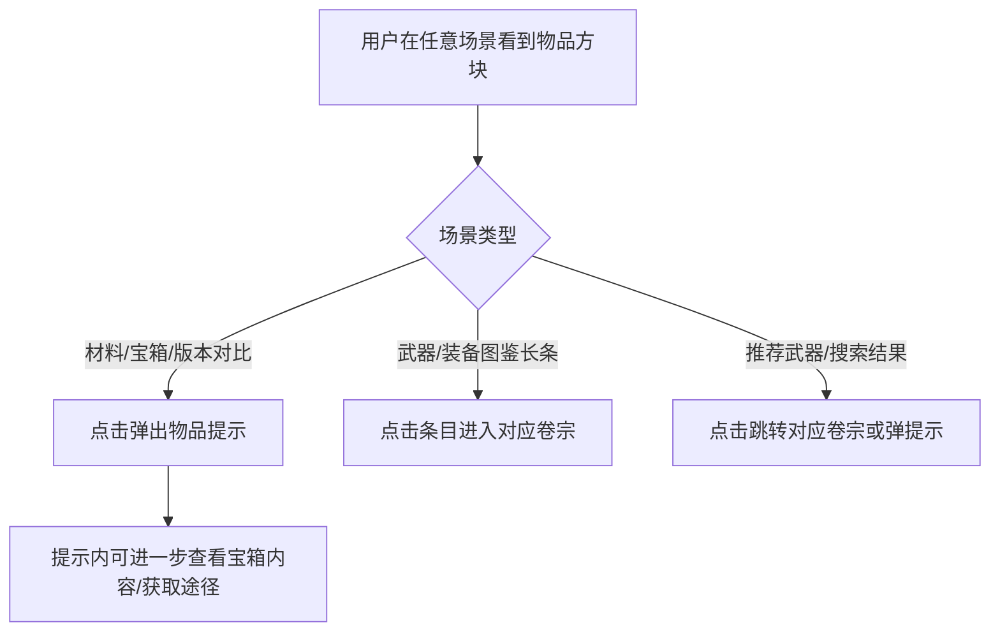

# 物品组件规范化（ItemPanel）

**功能名称**: 物品组件规范化
**PRD 版本**: v1.0
**创建日期**: 2026-07-22
**作者**: 产品

## 背景与目标

### 1.1 背景

「物资档案」下的道具材料、武器图鉴、装备图鉴，以及干员卷宗、搜索结果、宝箱内容、版本对比等场景中，都大量出现物品展示。当前各场景的物品展示是各自为政的：

- 同一物品在不同场景长相不同：图标尺寸各异、圆角与底色不统一。
- 稀有度表达不统一：存在多套稀有度色值，星级符号混用（★ 与 ✦）。
- 附加信息展示随意：数量、类型标签等信息的有无与位置因场景而异，没有规则。
- 武器图鉴与装备图鉴的列表条目以纵向堆叠为主，属性信息被挤压，浏览对比效率低。

物品是档案局中出现频次最高的实体之一，需要一套规范化的设计语言来约束所有场景。

### 1.2 目标

- 建立统一的物品视觉语言，覆盖物品方块形态、稀有度表达、信息挂载规则。
- 全站所有出现物品的场景统一遵循该语言。
- 物品组件对外呈现为正方形，可适配不同密度的布局。
- 物品组件支持外挂信息：不同场景可在标准位置上挂载不同内容（数量、名称、类型标签等）。
- 武器图鉴与装备图鉴的列表条目采用「左侧物品组件 + 右侧属性展示」的长条设计。

### 1.3 成功标准

- 同一物品在任意场景中视觉表现一致（图标、稀有度颜色、名称样式）。
- 全站稀有度颜色收敛为唯一一套色值，星级符号统一。
- 物品交互一致：可查看提示的场景点击弹出物品提示，可跳转的场景点击进入对应卷宗。
- 武器图鉴、装备图鉴列表条目以长条形式呈现，关键属性在条目内一屏可读。

## 用户分析

### 2.1 目标用户

- **核心用户**：规划干员养成、对比武器与装备属性的管理员。
- **次要用户**：查阅道具材料、浏览搜索结果的资料型用户。
- **次要用户**：查看版本更新物品变更的资讯型用户。

### 2.2 用户场景

| 场景 | 用户角色 | 目标 | 痛点 |
|------|----------|------|------|
| 规划干员养成 | 核心玩家 | 快速核对材料种类与数量 | 材料图标各处样式不一，数量位置随意 |
| 浏览武器图鉴 | 攻略作者 | 横向对比武器稀有度、类型、技能 | 条目纵向堆叠信息，属性不直观 |
| 浏览装备图鉴 | 核心玩家 | 对比装备部位、属性、套装归属 | 同上 |
| 查看版本更新 | 资讯用户 | 识别新增与变更的物品 | 变更面板物品样式与档案其他模块不一致 |
| 搜索结果浏览 | 资料用户 | 快速识别结果中的物品条目 | 搜索结果物品卡片与列表页样式不统一 |

## 功能需求

### 3.1 功能概述

建立一套物品设计语言：所有物品以「正方形物品方块」作为基础单元呈现，方块提供标准化的信息挂载位置，各场景按需挂载数量、稀有度、名称、类型标签等内容；武器图鉴与装备图鉴的列表条目使用「左侧物品方块 + 右侧属性区」的长条卡片。

### 3.2 功能列表

#### 功能点 1: 物品方块视觉语言

- **描述**: 物品的基础展示单元为正方形方块，核心由物品图标与稀有度表达构成。规则如下：
  - 方块严格为正方形，提供若干标准尺寸档位，供列表网格、详情页头部、嵌入小图等不同密度场景选用。
  - 稀有度颜色全站唯一一套：低稀有度（1–2 星）为灰色系，3 星蓝、4 星紫、5 星金、6 星橙；星级符号统一为 ★，色条与星级同源同色。
  - 稀有度色条位于方块最底部，占满整个方块宽度，为方块的标准组成部分。
  - 展示名称时：名称位于方块内部、底部居中；从底部色条向上做「稀有度颜色 → 透明」的渐变托底，保证名称在图标上可读。
  - 不展示名称时：仅保留底部色条，不显示渐变。
  - 图标加载失败时显示占位底色，不出现破图。
- **用户价值**: 用户在任何页面看到物品时，能凭借一致的视觉迅速识别物品与稀有度；名称直接叠在方块上，布局更紧凑。
- **验收标准**:
  - [ ] 物品方块在所有场景均为正方形。
  - [ ] 稀有度色条位于方块最底部且占满宽度。
  - [ ] 展示名称时，名称底部居中，且有底部色条向上的渐变托底。
  - [ ] 不展示名称时不显示渐变。
  - [ ] 全站稀有度颜色为同一套色值，星级符号统一为 ★。
  - [ ] 图标加载失败时有占位，无破图。

#### 功能点 2: 外挂信息槽位

- **描述**: 物品方块提供标准化的信息挂载位置，各场景按需启用，未启用的槽位不占位：

  | 槽位 | 内容 | 典型场景 |
  |------|------|----------|
  | 数量角标 | 叠加在方块角落，如 ×10；大数量缩写（如 1.2k） | 养成材料、宝箱内容物、强化费用 |
  | 标签角标 | 叠加在方块另一角落的短标签 | 装备部位 |
  | 名称 | 方块内部底部居中，渐变托底，最多两行截断 | 列表网格默认展示；密集场景可隐藏 |
  | 类型标签 | 方块外的场景组合区域（如长条右侧属性区） | 武器类型、物品分类 |
  | 稀有度星级 | 以 ★ 表达的稀有度 | 详情页头部、稀有度筛选等强调场景 |

- **用户价值**: 同一组件在不同场景能承载不同信息量，既不牺牲一致性，也不牺牲信息密度。
- **验收标准**:
  - [ ] 数量角标、名称、类型标签、星级均可按场景独立开关。
  - [ ] 未挂载信息的槽位不留下空白占位。
  - [ ] 数量超过一万时以 k 缩写展示。

#### 功能点 3: 全场景物品展示统一

- **描述**: 以下场景的物品展示统一收敛到物品方块语言，并统一交互（默认点击弹出物品提示；配置了卷宗跳转的场景点击进入对应卷宗）：

  | 场景 | 挂载信息 |
  |------|----------|
  | 道具材料列表 | 名称 + 稀有度，点击弹提示 |
  | 干员卷宗 · 天赋/精英化/能力值材料 | 数量角标，点击弹提示 |
  | 干员卷宗 · 装备适配推荐武器 | 稀有度，点击跳转武器卷宗 |
  | 武器图鉴列表与卷宗头部 | 见功能点 4 |
  | 装备图鉴列表与卷宗头部 | 见功能点 4 |
  | 搜索结果 · 物品/武器条目 | 名称 + 稀有度，点击跳转或弹提示 |
  | 宝箱内容物 | 数量角标，点击弹提示 |
  | 装备卷宗 · 强化材料费用 | 数量角标 + 名称 |
  | 版本对比 · 物品/武器变更面板 | 名称 + 稀有度 + 变更标识 |

- **用户价值**: 全站物品展示与交互一致，降低认知成本。
- **验收标准**:
  - [ ] 上述场景均使用统一的物品方块语言，无场景私有的物品图标样式。
  - [ ] 各场景点击行为符合上表约定。

#### 功能点 4: 武器/装备图鉴长条条目

- **描述**: 武器图鉴与装备图鉴的列表条目改为横向长条卡片：左侧为正方形物品方块（方块内底部居中展示名称，带底部稀有度色条与渐变托底），右侧为属性展示区（不重复展示名称），条目整体可点击进入对应卷宗。
  - 武器长条右侧：稀有度星级与武器类型（首行）、满级基础攻击力、3 个技能名称（一行一个）。
  - 装备长条：部位以角标形式叠加在左侧物品方块上；右侧第一行为基础属性（字号稍大），其后每行展示一个附加属性（2–3 个，按实际数量）。
  - 长条在窄屏下保持可读：左侧方块收缩为小尺寸档位，右侧属性允许换行。
- **用户价值**: 在列表中即可完成武器/装备的横向对比，减少进出卷宗的次数。
- **验收标准**:
  - [ ] 武器图鉴列表条目为「左方块 + 右属性」长条。
  - [ ] 装备图鉴列表条目为「左方块 + 右属性」长条。
  - [ ] 点击条目进入对应卷宗。
  - [ ] 移动端窄屏下长条布局不破版。

#### 功能点 5: 稀有度筛选星级化

- **描述**: 道具材料、武器图鉴、装备图鉴等列表页的稀有度筛选，选项由数字改为 ★ 星级展示；下拉选项中的星级同时使用对应稀有度颜色着色。
- **用户价值**: 筛选控件与物品方块的稀有度表达一致，用户凭颜色即可对应到列表中的物品稀有度。
- **验收标准**:
  - [ ] 稀有度筛选项以 ★ 星级展示。
  - [ ] 下拉选项的星级按对应稀有度颜色着色。
  - [ ] 筛选行为与结果不变。

### 3.3 用户操作流程

### 3.4 页面/界面描述

| 页面 | 描述 | 关键元素 |
|------|------|----------|
| 道具材料列表 | 物品方块网格 | 方块 + 名称 + 稀有度色条 |
| 干员卷宗 | 养成材料与推荐武器区 | 小尺寸方块 + 数量角标 |
| 武器图鉴列表 | 长条条目列表 | 左方块 + 右属性（名称/稀有度/类型/技能） |
| 装备图鉴列表 | 长条条目列表（按套装分组） | 左方块 + 右属性（名称/稀有度/部位/套装/属性） |
| 版本对比 | 物品/武器变更面板 | 方块 + 名称 + 变更标识 |

### 3.5 异常与边界情况

| 情况 | 预期行为 |
|------|----------|
| 物品图标加载失败 | 显示占位底色，不出现破图 |
| 场景无数量信息 | 数量角标不渲染，不留空位 |
| 物品名称过长 | 名称最多两行，超出截断 |
| 名称与图标底色对比度低 | 底部渐变托底保证名称可读 |
| 数量超过一万 | 以 k 缩写展示（如 1.2k） |
| 低稀有度（1–2 星）物品 | 使用灰色系稀有度颜色 |
| 窄屏浏览长条条目 | 方块收缩、属性换行，布局不破版 |

## 四、非功能需求

### 4.1 性能要求

- 列表页大量物品方块渲染不卡顿，物品图片按需加载。

### 4.2 安全性要求

- 无。

### 4.3 兼容性要求

- 桌面与移动端浏览器均可用，响应式断点与全站一致。

## 五、依赖与约束

### 5.1 依赖

- 既有物品提示浮层能力（物品描述、获取途径、宝箱内容、装备属性提示）。
- 武器卷宗与装备卷宗页面已上线，长条条目跳转目标已存在。

### 5.2 约束

- 不改动数据来源与接口，仅统一展示层。
- 工厂系统仍为占位模块，不在本期范围。
- 物品暂无独立卷宗页，物品提示浮层继续作为物品的详情承载。

## 六、相关文档

- [[20260719-site-concept|站点概念设计]]
- [[20260719-items-materials|道具材料]]
- [[20260719-weapon-archive|武器档案]]
